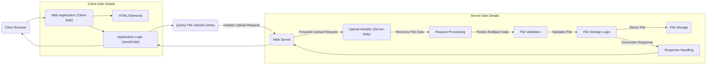
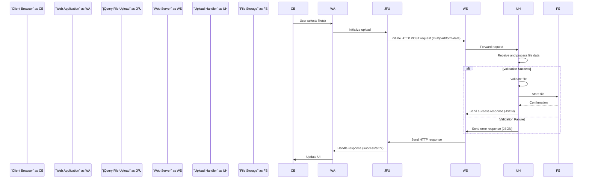

# Project Design Document: jQuery File Upload Library Integration

**Version:** 1.1
**Date:** October 26, 2023
**Author:** AI Software Architect

## 1. Introduction

This document provides a detailed design overview of a system integrating the jQuery File Upload library (https://github.com/blueimp/jQuery-File-Upload) into a web application. This document will serve as the foundation for subsequent threat modeling activities. It outlines the architecture, components, data flow, and key considerations for secure and effective utilization of the library. This revision aims to provide more granular detail and clarity based on initial review.

## 2. Goals and Objectives

*   Clearly define the architecture and components involved in using the jQuery File Upload library.
*   Illustrate the data flow during the file upload process with enhanced clarity.
*   Identify key areas and interactions relevant for security analysis and threat modeling, providing more specific examples.
*   Provide a comprehensive understanding of the system for stakeholders involved in development, security, and operations.
*   Improve the level of detail to facilitate more effective threat identification.

## 3. Scope

This design document focuses on the client-side integration of the jQuery File Upload library and its interaction with a generic server-side component responsible for handling file uploads. It does not delve into the specifics of a particular server-side implementation (e.g., PHP, Node.js, Python), but rather focuses on the general principles and interactions. The scope includes the standard upload process and does not explicitly cover advanced features like resumable uploads unless directly relevant to the core data flow.

## 4. Architecture Overview

The system architecture involves the following key components:

*   **Client Browser:** The user's web browser where the web application is rendered and the file upload process is initiated. This includes the browser's JavaScript engine and rendering capabilities.
*   **Web Application (Client-Side):** The HTML structure, CSS styling, and JavaScript code that constitute the user interface for file uploading. This includes:
    *   **HTML Elements:**  Form elements, input fields, and display areas.
    *   **Application Logic (JavaScript):**  Custom JavaScript code interacting with the jQuery File Upload library.
*   **jQuery File Upload Library:** The JavaScript library responsible for handling the asynchronous file upload process. Key functionalities include:
    *   File selection handling.
    *   Progress monitoring and reporting.
    *   Chunking of large files (if configured).
    *   Initiating and managing AJAX requests.
    *   Event handling for upload lifecycle events.
*   **Web Server:** The server hosting the web application and responsible for:
    *   Serving static content (HTML, CSS, JavaScript).
    *   Routing HTTP requests to the appropriate handlers.
*   **Upload Handler (Server-Side):** A server-side component (e.g., an API endpoint) responsible for:
    *   Receiving multipart/form-data requests.
    *   Parsing and extracting file data.
    *   Performing file validation and sanitization.
    *   Storing the uploaded files.
    *   Generating responses to the client.
*   **File Storage:** The persistent storage mechanism for uploaded files. This could be:
    *   Local file system on the server.
    *   Network-attached storage (NAS).
    *   Cloud-based object storage (e.g., AWS S3, Azure Blob Storage).

## 5. Detailed Design

### 5.1. Client-Side Components

*   **HTML Form Structure:**
    *   A `<form>` element with `method="POST"` and `enctype="multipart/form-data"`.
    *   An `<input type="file">` element to allow users to select files. The `multiple` attribute may be used to allow multiple file uploads.
    *   Potentially other form fields to include metadata with the file upload.
    *   UI elements (e.g., buttons) to trigger the upload process.
*   **JavaScript Integration and Configuration:**
    *   Including the jQuery library and the jQuery File Upload plugin JavaScript files.
    *   JavaScript code to select the file input element and initialize the `fileupload()` plugin.
    *   Configuration options passed to the `fileupload()` method, including:
        *   `url`: The endpoint on the server to handle the upload.
        *   `dataType`: Expected data type of the server response (e.g., 'json').
        *   `accept`:  Client-side file type restrictions (for user guidance, not security).
        *   `maxFileSize`: Client-side maximum file size limit (for user guidance).
        *   Callback functions for events like `fileuploadadd`, `fileuploadprogressall`, `fileuploaddone`, `fileuploadfail`.
*   **User Interface (UI) Elements and Logic:**
    *   Display of selected file names and sizes.
    *   Progress bars or indicators to show the upload progress.
    *   Mechanisms to display success or error messages received from the server.
    *   Optional features like drag-and-drop zones for file selection.

### 5.2. Server-Side Components

*   **Upload Handler Endpoint Implementation:**
    *   A specific route or controller action in the server-side application to handle incoming upload requests.
    *   Code to process the `multipart/form-data` request, typically using libraries or frameworks that simplify this process.
*   **Request Processing and File Extraction:**
    *   Parsing the incoming request to extract the file data and any accompanying form fields.
    *   Handling potential errors during request parsing.
*   **File Validation and Sanitization:**
    *   **Mandatory Server-Side Checks:**
        *   **File Type Validation:** Verifying the file's MIME type against an allowlist. Relying solely on file extensions is insecure.
        *   **File Size Validation:** Enforcing maximum file size limits to prevent resource exhaustion.
        *   **Filename Sanitization:**  Removing or encoding potentially dangerous characters from the filename to prevent path traversal vulnerabilities.
    *   **Optional but Recommended Checks:**
        *   **Magic Number Verification:** Inspecting the file's header (magic number) to confirm its actual type, regardless of the provided MIME type or extension.
        *   **Content Scanning:** Integrating with antivirus or malware scanning services to detect malicious content.
*   **File Storage Logic:**
    *   Determining the storage location and filename for the uploaded file.
    *   Generating unique filenames to avoid collisions (e.g., using timestamps or UUIDs).
    *   Saving the file to the designated storage mechanism.
    *   Implementing appropriate file permissions and access controls on the stored files.
*   **Response Handling:**
    *   Constructing a JSON or other structured response to send back to the client.
    *   Including information about the upload status (success or failure).
    *   Providing details about the stored file (e.g., filename, URL, size) upon successful upload.
    *   Returning informative error messages in case of failure.
    *   Setting appropriate HTTP status codes (e.g., 200 OK for success, 400 Bad Request for validation errors, 500 Internal Server Error for server-side issues).

## 6. Data Flow

The typical data flow for a file upload using the jQuery File Upload library is as follows:

1. **User Selects File(s):** The user interacts with the web application in the **Client Browser** and selects one or more files using the `<input type="file">` element or a drag-and-drop interface provided by the **Web Application**.
2. **Client-Side Initialization:** The **Web Application**'s JavaScript, leveraging the **jQuery File Upload Library**, intercepts the file selection event.
3. **Optional Client-Side Processing:** The **jQuery File Upload Library** may perform client-side pre-processing based on its configuration, such as generating image previews or chunking large files into smaller parts.
4. **Initiate HTTP Request:** The **jQuery File Upload Library** initiates an asynchronous HTTP POST request (typically with `multipart/form-data` encoding) to the configured `url` on the **Web Server**. This request includes the file data and potentially other form data.
5. **Request Reception:** The **Web Server** receives the incoming HTTP request.
6. **Forward to Upload Handler:** The **Web Server** routes the request to the designated **Upload Handler (Server-Side)** endpoint.
7. **Request Processing and File Extraction:** The **Upload Handler** receives the `multipart/form-data` request and processes it to extract the file data and any other submitted form fields.
8. **File Validation:** The **Upload Handler** performs crucial validation checks on the uploaded file:
    *   Verifies the MIME type against an allowlist.
    *   Checks the file size against the configured maximum limit.
    *   Sanitizes the filename to prevent path traversal.
    *   Optionally performs magic number verification and content scanning.
9. **File Storage:** If the validation is successful, the **Upload Handler**'s file storage logic determines the storage location and filename, and then saves the file to the **File Storage**.
10. **Response Generation:** The **Upload Handler** constructs an HTTP response, typically in JSON format, indicating the success or failure of the upload. This response may include details about the stored file.
11. **Response Transmission:** The **Upload Handler** sends the HTTP response back to the **Web Server**.
12. **Response Forwarding:** The **Web Server** forwards the response back to the **Web Application**.
13. **Client-Side Handling:** The **jQuery File Upload Library** receives the server response. Based on the response status, it triggers the appropriate callback functions (e.g., `fileuploaddone` for success, `fileuploadfail` for errors).
14. **UI Update:** The **Web Application** updates the user interface in the **Client Browser** to reflect the upload status, displaying success messages, error messages, or updating progress indicators.

## 7. Security Considerations (For Threat Modeling)

The following areas are critical for security analysis and threat modeling when using the jQuery File Upload library:

*   **Client-Side Validation as a False Sense of Security:**  Client-side validation (e.g., using the `accept` or `maxFileSize` options) improves user experience but is easily bypassed by attackers. **Never rely on client-side validation for security.**
*   **Insufficient Server-Side File Validation:** This is the most critical area. Failure to properly validate files on the server can lead to various vulnerabilities:
    *   **Malware Upload:** Attackers can upload executable files or scripts that can compromise the server or other users. **Implement robust antivirus scanning.**
    *   **Web Shell Upload:** Attackers can upload scripts (e.g., PHP, JSP, ASPX) that allow them to execute arbitrary commands on the server. **Strictly validate file types and consider sandboxing uploaded files.**
    *   **Cross-Site Scripting (XSS):** Uploaded files (e.g., HTML, SVG) containing malicious scripts can be served to other users, leading to XSS attacks. **Sanitize file content or serve user-generated content from a separate domain with a strict Content Security Policy (CSP).**
    *   **Path Traversal:** Attackers can manipulate filenames to write files to arbitrary locations on the server, potentially overwriting critical system files. **Sanitize filenames and enforce a consistent storage structure.**
    *   **File Inclusion Vulnerabilities:** If the application later includes or processes uploaded files without proper sanitization, attackers might be able to include malicious files. **Treat uploaded files as untrusted input.**
*   **Cross-Site Request Forgery (CSRF):** If the upload handler endpoint does not implement CSRF protection, attackers can trick authenticated users into unknowingly uploading files. **Implement anti-CSRF tokens or other appropriate measures.**
*   **Insecure Direct Object References (IDOR):** If access to uploaded files is based on predictable or easily guessable identifiers, attackers might be able to access files they are not authorized to view. **Implement proper authorization checks and use non-predictable identifiers.**
*   **Denial of Service (DoS):**
    *   **Large File Uploads:** Attackers can upload extremely large files to consume server resources (disk space, bandwidth, processing power). **Enforce reasonable file size limits and implement rate limiting.**
    *   **Excessive Upload Requests:** Attackers can send a large number of upload requests to overwhelm the server. **Implement rate limiting and consider using CAPTCHA for anonymous uploads.**
*   **Insecure Storage:**
    *   **Publicly Accessible Storage:** If the file storage location is publicly accessible without proper authentication, uploaded files can be accessed by anyone. **Configure appropriate access controls and permissions on the storage.**
    *   **Lack of Encryption:** Sensitive uploaded data should be encrypted at rest. **Consider using encryption for stored files.**
*   **Information Disclosure:** Error messages returned to the client should not reveal sensitive information about the server or the upload process. **Provide generic error messages to the client and log detailed errors securely on the server.**
*   **Lack of HTTPS:** Transmitting files over HTTP exposes them to interception and tampering. **Always use HTTPS for secure communication.**

## 8. Future Considerations

*   **Resumable Uploads:** Implementing support for resumable uploads to handle interruptions and improve the upload experience for large files. This would involve changes to both client-side and server-side components to track upload progress and resume interrupted transfers.
*   **Direct-to-Cloud Uploads:**  Exploring options for direct uploads to cloud storage services (e.g., using pre-signed URLs with AWS S3 or Azure Blob Storage) to reduce server load and improve scalability. This would shift some of the upload handling logic to the client-side.
*   **Integration with Content Delivery Networks (CDNs):**  Serving uploaded files through a CDN to improve performance and reduce latency for users.
*   **Automated File Processing Pipelines:** Implementing automated workflows for processing uploaded files, such as image resizing, format conversion, or document indexing.
*   **Enhanced Monitoring and Logging:** Implementing more detailed logging and monitoring of upload activity for security auditing and troubleshooting.

This revised design document provides a more detailed and comprehensive overview of a system integrating the jQuery File Upload library. It offers enhanced clarity on the components, data flow, and critically, expands on the security considerations to better facilitate threat modeling activities. This document serves as a valuable resource for all stakeholders involved in the project.
