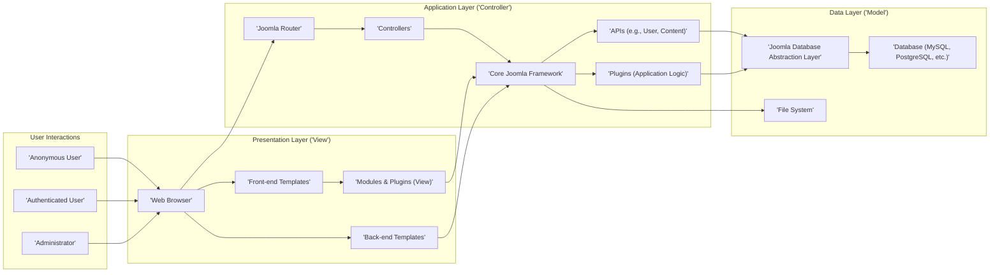
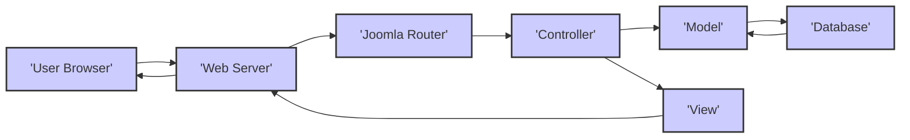

# Project Design Document: Joomla CMS for Threat Modeling

**Version:** 1.1
**Date:** October 26, 2023
**Author:** AI Software Architect

## 1. Introduction

This document provides a detailed architectural overview of the Joomla Content Management System (CMS), specifically designed to serve as the foundation for subsequent threat modeling activities. It meticulously outlines the core components, their interactions, and the typical data flow within the system. The primary objective is to establish a clear and comprehensive understanding of Joomla's structure, enabling the effective identification and analysis of potential security vulnerabilities.

## 2. Goals

*   To provide a precise and easily understandable architectural representation of the Joomla CMS.
*   To clearly identify the key components of Joomla and their interdependencies, with a focus on elements relevant to security.
*   To illustrate the typical pathways of data flow within the Joomla system, highlighting potential points of interaction and manipulation.
*   To serve as the definitive reference document for conducting thorough and effective threat modeling exercises on the Joomla CMS.
*   To proactively highlight potential areas of security concern inherent in the design of the Joomla CMS.

## 3. Scope

This document comprehensively covers the core functionalities of the Joomla CMS as represented in the provided GitHub repository. It focuses on the fundamental aspects of the system that are most relevant for security analysis. The scope includes:

*   Interaction with the front-end by unauthenticated and authenticated users.
*   Functionality provided by the back-end administration interface for managing the site.
*   The operation of core CMS components, such as content management, user management, and the extension system.
*   Mechanisms for interacting with the underlying database.
*   The architecture and integration points for plugins and extensions.

This document explicitly **excludes**:

*   Detailed analysis of specific third-party extensions or plugins (these can be considered in separate threat modeling exercises).
*   In-depth examination of the code-level implementation details within Joomla.
*   Specific configurations of the underlying server environment or infrastructure.
*   A historical analysis of past vulnerabilities or security incidents affecting Joomla.

## 4. High-Level Architecture

The Joomla CMS is built upon the Model-View-Controller (MVC) architectural pattern, which promotes separation of concerns by dividing the application into three interconnected parts.

*   **Presentation Layer (View):** This layer is responsible for rendering the user interface, both for the public-facing front-end and the administrative back-end. It encompasses templates that define the visual layout, and modules that display dynamic content.
*   **Application Layer (Controller):** This layer handles user requests, orchestrates the application logic, and selects the appropriate view to render. It includes the core Joomla framework responsible for routing requests, managing application flow, and providing core functionalities.
*   **Data Layer (Model):** This layer manages the interaction with data storage. It provides an abstraction layer for accessing and manipulating data within the database and the file system.

## 5. Key Components

*   **Front-end Components:** These are responsible for the user-facing aspects of the website.
    *   **Templates:** Control the overall visual design, layout, and structure of the front-end pages. Security vulnerabilities here can lead to XSS if user-generated content is not properly escaped.
    *   **Modules:** Self-contained units of functionality that display specific types of content or features within defined template positions. Insecure modules can introduce vulnerabilities.
    *   **Plugins (Front-end):** Extend the functionality of the front-end by executing code in response to specific events. Malicious plugins can compromise the front-end experience.
*   **Back-end (Administrator Interface) Components:** These provide the tools for managing the website.
    *   **Administrator Templates:** Control the visual design and layout of the administrative interface. While less directly user-facing, vulnerabilities here can impact administrators.
    *   **Components (Back-end):** Major functional areas within the back-end, such as article management, user management, and extension management. These are critical for system security and require careful protection.
    *   **Modules (Back-end):** Display information and provide quick access to features within the administrative interface.
    *   **Plugins (Back-end):** Extend the functionality of the back-end, often for automation or integration tasks. Vulnerabilities here can have significant impact.
*   **Core Joomla Framework:** This is the foundational code that provides the essential functionality of the CMS.
    *   **Router:** Responsible for interpreting incoming HTTP requests and directing them to the appropriate controller. Vulnerabilities in the router can lead to unauthorized access or manipulation of application flow.
    *   **Application:** Manages the overall lifecycle of a Joomla application request.
    *   **Input Filtering:** Processes user-supplied data to sanitize and validate it, aiming to prevent common injection attacks. The effectiveness of this filtering is crucial for security.
    *   **Session Management:** Handles user authentication and maintains user session data. Weaknesses here can lead to session hijacking or fixation.
    *   **User Management:** Manages user accounts, permissions, and access control. Flaws in user management can lead to privilege escalation.
    *   **Content Management:** Provides the tools for creating, editing, and managing website content. Improper access controls or input handling can lead to vulnerabilities.
    *   **Extension Management:** Allows administrators to install, manage, and update extensions. This is a critical area for security, as compromised extensions are a common attack vector.
    *   **Database Abstraction Layer:** Provides a consistent interface for interacting with different database systems, helping to prevent database-specific injection vulnerabilities.
*   **Extensions:** These are add-ons that extend the core functionality of Joomla. Their security is paramount as they run within the Joomla environment.
    *   **Components:** Larger functional units, often with their own MVC structure, adding significant features to Joomla.
    *   **Modules:** Smaller, self-contained units of functionality displayed within templates.
    *   **Plugins:** Code that executes in response to specific events within Joomla, allowing for deep customization.
    *   **Templates:** Control the visual presentation of the website.
    *   **Languages:** Provide translations for the Joomla interface and content.

## 6. Data Flow

A typical user request within Joomla follows this sequence:

1. **User Initiates Request:** A user (either anonymous or authenticated) interacts with the website, sending a request to the web server (e.g., by clicking a link, submitting a form).
2. **Web Server Receives Request:** The web server (e.g., Apache, Nginx) receives the incoming HTTP request.
3. **Joomla Router Processes Request:** The Joomla Router analyzes the request URI to determine the appropriate component, controller, and action to handle the request. This is a critical point for security checks and routing logic.
4. **Controller Executes Logic:** The designated controller processes the request. This may involve interacting with models to retrieve or manipulate data, validating user input, and performing business logic.
5. **Model Interacts with Data Layer:** Models interact with the database through the Joomla Database Abstraction Layer to fetch, create, update, or delete data. This interaction should be secured against SQL injection and other database vulnerabilities.
6. **View Rendering:** The controller selects the appropriate view (template) and passes the necessary data to it for rendering. This is where dynamic content is incorporated into the HTML structure.
7. **Response Generation:** The view renders the HTML output, incorporating data from the model and potentially including output from modules and plugins.
8. **Web Server Sends Response:** The web server sends the generated HTML response back to the user's browser.

## 7. Security Considerations (Pre-Threat Modeling)

Based on the architecture and data flow, several potential areas of security concern warrant careful consideration during threat modeling:

*   **Insufficient Input Validation:** Lack of proper validation and sanitization of user-supplied data across all entry points (forms, URLs, APIs) can lead to vulnerabilities like Cross-Site Scripting (XSS), SQL Injection, and other injection attacks.
*   **Weak Authentication and Authorization Mechanisms:** Vulnerabilities in how users are authenticated and how their access to resources is controlled can lead to unauthorized access, privilege escalation, and data breaches.
*   **Insecure Session Management:** Flaws in the handling of user sessions, such as predictable session IDs or lack of proper session invalidation, can lead to session hijacking or fixation attacks.
*   **Security of Extensions:** Third-party extensions, if not developed securely, can introduce vulnerabilities that compromise the entire Joomla installation. This includes components, modules, and plugins.
*   **Improper Handling of File Uploads:** Allowing users to upload files without proper validation and sanitization can lead to malicious file execution and other security risks.
*   **Database Security Weaknesses:** Weak database credentials, insecure database configurations, or insufficient protection against SQL injection can expose sensitive data.
*   **Cross-Site Request Forgery (CSRF) Vulnerabilities:** Lack of CSRF protection allows attackers to trick authenticated users into performing unintended actions on the website.
*   **Information Disclosure:** Improper handling of errors, verbose logging, or exposing sensitive data in URLs or HTML source code can lead to information leaks.
*   **Code Injection Vulnerabilities:** Flaws that allow attackers to inject and execute arbitrary code (e.g., PHP code) can lead to complete system compromise. This can occur through various means, including insecure file handling or vulnerable extensions.
*   **Insecure API Endpoints:** If Joomla exposes APIs, these endpoints need to be secured with proper authentication, authorization, and input validation to prevent unauthorized access and data manipulation.

## 8. Assumptions

*   The threat modeling exercise will be based on the latest stable version of the Joomla CMS available on the official GitHub repository.
*   The web server and database server are considered as distinct logical entities for the purpose of this document, although they may be deployed on the same physical machine.
*   The core Joomla framework is assumed to adhere to general web security best practices, although this should be verified during threat modeling.
*   The primary focus is on the logical architecture and data flow of Joomla, rather than the specifics of the underlying physical infrastructure.

## 9. Out of Scope for Initial Threat Modeling

*   Specific configurations of the web server software (e.g., Apache, Nginx) or database server software (e.g., MySQL, PostgreSQL).
*   Security considerations at the operating system level where Joomla is deployed.
*   Network security measures such as firewalls, intrusion detection systems, and load balancers.
*   Detailed analysis of specific third-party extensions unless explicitly selected for a focused threat modeling effort.
*   In-depth code-level reviews of the Joomla core or its extensions.

This document provides a comprehensive design overview of the Joomla CMS, specifically tailored for threat modeling. The identified components, data flow, and security considerations serve as a solid foundation for conducting a thorough analysis to identify and mitigate potential security vulnerabilities.