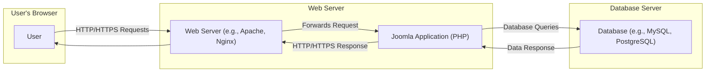
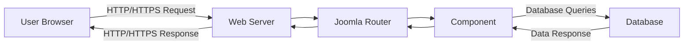
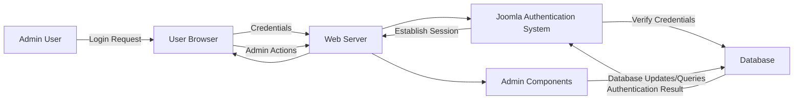

# Project Design Document: Joomla CMS for Threat Modeling

**Version:** 1.1
**Date:** October 26, 2023
**Author:** AI Software Architect

## 1. Introduction

This document provides an enhanced and detailed design overview of the Joomla Content Management System (CMS) project, specifically tailored for subsequent threat modeling activities. It outlines the system's architecture, key components, data flow, and security considerations with greater depth. This document aims to provide a clear and comprehensive understanding of the Joomla CMS to facilitate the identification and analysis of potential security vulnerabilities.

## 2. Goals and Objectives

*   Provide a comprehensive and refined architectural overview of the Joomla CMS.
*   Identify key components and their interactions with more specific detail.
*   Describe the typical data flow within the system, including administrative actions.
*   Highlight critical security considerations relevant for threat modeling, providing more specific examples and context.
*   Serve as a robust foundational document for conducting a thorough and effective threat model of the Joomla CMS.

## 3. Scope

This document focuses on the core architectural aspects of the Joomla CMS relevant to security, providing more granular detail than the previous version. It covers:

*   High-level system architecture with a clearer representation of interactions.
*   Key software components and their functionalities with expanded descriptions.
*   Typical user and administrative interaction workflows.
*   Data storage and retrieval mechanisms, including sensitive data handling.
*   Security features and considerations, elaborated with potential threats and mitigations.

This document still does not cover:

*   Specific details of individual extensions or plugins beyond their general interaction with the core.
*   Detailed code-level implementation specifics.
*   Highly specific deployment configurations (e.g., detailed web server or firewall rules).
*   Historical evolution of the Joomla CMS.

## 4. High-Level Architecture

The Joomla CMS follows a traditional three-tier architecture, with clearer labeling and emphasis on communication pathways:

*   **Presentation Tier:**  Handles user interaction and displays information. This is the front-end website rendered in the user's web browser.
*   **Application Tier:** Contains the core Joomla CMS logic, managing content, users, extensions, and routing. This resides on the web server and executes PHP code.
*   **Data Tier:**  Stores the persistent data for the Joomla CMS, typically a relational database system.

## 5. Key Components

The Joomla CMS comprises several key components, with expanded descriptions for clarity:

*   **Front-end:**
    *   Responsible for rendering the website content to users, providing the user interface.
    *   Utilizes templates (HTML, CSS, JavaScript) to define the visual presentation and user experience.
    *   Interacts with the Joomla application via HTTP/HTTPS requests to retrieve and display dynamic data.
    *   Security considerations: Vulnerable to XSS if output is not properly encoded.
*   **Back-end (Administrator Interface):**
    *   Provides a privileged interface for managing the Joomla CMS, accessible through a dedicated URL.
    *   Used for critical administrative tasks such as content creation, user management, extension installation, configuration, and system updates.
    *   Requires strong authentication and authorization mechanisms to prevent unauthorized access.
    *   Security considerations: Primary target for brute-force attacks and privilege escalation.
*   **Core CMS:**
    *   Manages the fundamental functionalities of Joomla, orchestrating interactions between other components.
    *   Includes:
        *   **Content Management System (CMS):** Handles the creation, editing, workflow, and publishing of articles, categories, and menus. Security considerations: Vulnerable to content injection if input validation is weak.
        *   **User Management:** Manages user accounts, groups, access levels, and permissions. Security considerations: Weak password policies or insecure password storage can lead to breaches.
        *   **Extension Management:** Allows for the installation, management, and updating of extensions (components, modules, plugins, templates). Security considerations: Untrusted extensions can introduce vulnerabilities.
        *   **Routing:** Maps incoming URLs to specific Joomla components and actions, determining how requests are processed. Security considerations: Improper routing can lead to unauthorized access to functionalities.
        *   **API:** Provides programmatic access to Joomla functionalities, enabling integration with other systems. Security considerations: API endpoints need robust authentication and authorization.
*   **Extensions:**
    *   Extend the core functionality of Joomla, adding custom features and integrations.
    *   Types of extensions:
        *   **Components:** Major functional units that handle specific tasks (e.g., contact forms, e-commerce systems, forums). Security considerations: Can introduce vulnerabilities if not developed securely.
        *   **Modules:** Smaller, self-contained units that display content or provide functionality in specific areas of the website (e.g., login forms, navigation menus). Security considerations: Can be exploited for XSS or information disclosure.
        *   **Plugins:** Modify the behavior of Joomla at specific events or triggers, allowing for customization of core functionalities. Security considerations: Can introduce significant security risks if poorly coded.
        *   **Templates:** Control the visual design and layout of the website, defining the front-end presentation. Security considerations: Vulnerable to XSS if they don't properly handle user input.
*   **Database:**
    *   Stores all persistent data for the Joomla CMS, including sensitive information.
    *   Includes:
        *   Content (articles, categories, menus, media).
        *   User accounts, hashed passwords, and permissions.
        *   Extension configurations and data.
        *   Session data.
    *   Security considerations: Requires strong access controls, encryption of sensitive data, and protection against SQL injection.
*   **Web Server:**
    *   Serves the Joomla application and static assets to users over the internet or intranet.
    *   Handles incoming HTTP/HTTPS requests and routes them to the Joomla application (PHP interpreter).
    *   Examples: Apache, Nginx.
    *   Security considerations: Needs to be hardened against common web server vulnerabilities.
*   **File System:**
    *   Stores the Joomla application code, extensions, templates, uploaded media files, and configuration files.
    *   File permissions are crucial for security, controlling access to sensitive files.
    *   Security considerations: Incorrect permissions can lead to unauthorized access or modification of files.

## 6. Data Flow

Detailed data flow diagrams illustrating both user and administrative interactions:

**Typical User Request Flow:**

1. "User Browser" sends an "HTTP/HTTPS Request" to the "Web Server".
2. The "Web Server" receives the request.
3. The "Web Server" forwards the request to the "Joomla Router".
4. The "Joomla Router" determines which "Component" should handle the request.
5. The relevant "Component" processes the request.
6. The "Component" may interact with the "Database" to retrieve or store data.
7. The "Database" returns a "Data Response" to the "Component".
8. The "Component" generates a response.
9. The "Joomla Router" sends the response back to the "Web Server".
10. The "Web Server" sends the "HTTP/HTTPS Response" to the "User Browser".
11. The "User Browser" renders the response.

**Administrative User Interaction Flow:**

1. "Admin User" accesses the back-end login page via the "User Browser".
2. The "User Browser" sends login credentials to the "Web Server".
3. The "Web Server" forwards the request to the "Joomla Authentication System".
4. The "Joomla Authentication System" authenticates the user against the "Database".
5. Upon successful authentication, the "Joomla Authentication System" establishes an administrative session.
6. The "Admin User" navigates the back-end interface, interacting with various "Admin Components".
7. "Admin Components" perform actions, often involving interactions with the "Database" to modify data or configurations.

## 7. Security Considerations

Detailed security aspects crucial for threat modeling, including examples of threats and potential mitigations:

*   **Authentication and Authorization:**
    *   **Authentication:** How users are verified (e.g., username/password, multi-factor authentication). Weak authentication mechanisms are a primary entry point for attackers.
        *   **Threats:** Brute-force attacks, credential stuffing, dictionary attacks.
        *   **Mitigations:** Strong password policies, multi-factor authentication, account lockout policies, CAPTCHA.
    *   **Authorization:** How access to different parts of the system and functionalities is controlled (e.g., role-based access control, access control lists). Insufficient authorization can lead to privilege escalation.
        *   **Threats:** Privilege escalation, unauthorized access to sensitive data or functionalities.
        *   **Mitigations:** Principle of least privilege, robust role-based access control, regular review of user permissions.
*   **Input Validation and Output Encoding:**
    *   **Input Validation:** How user-provided data is sanitized and validated to prevent malicious input from being processed. Lack of input validation is a common source of vulnerabilities.
        *   **Threats:** SQL injection, cross-site scripting (XSS), command injection, path traversal.
        *   **Mitigations:** Whitelisting input validation, parameterized queries, input sanitization libraries.
    *   **Output Encoding:** How data is encoded before being displayed to users to prevent the execution of malicious scripts in the browser.
        *   **Threats:** Cross-site scripting (XSS).
        *   **Mitigations:** Context-aware output encoding, Content Security Policy (CSP).
*   **Session Management:**
    *   How user sessions are created, managed, and terminated. Insecure session management can allow attackers to impersonate legitimate users.
        *   **Threats:** Session hijacking, session fixation, session replay.
        *   **Mitigations:** Securely generated session IDs, HTTPS only session cookies, session timeouts, regeneration of session IDs on login.
*   **Database Security:**
    *   Security of the database credentials, access controls, and protection against injection attacks.
        *   **Threats:** SQL injection, data breaches, unauthorized data modification.
        *   **Mitigations:** Strong database passwords, principle of least privilege for database access, parameterized queries, regular security audits.
*   **File Handling:**
    *   Security of file uploads and downloads, including validation of file types and prevention of malicious file execution.
        *   **Threats:** Arbitrary file upload, local file inclusion (LFI), remote file inclusion (RFI), malware uploads.
        *   **Mitigations:** Validating file types and sizes, storing uploaded files outside the webroot, proper file permissions, antivirus scanning.
*   **Extension Security:**
    *   Security vulnerabilities in third-party extensions are a significant risk.
        *   **Threats:** All types of web application vulnerabilities can be introduced by insecure extensions.
        *   **Mitigations:** Regularly update extensions, only install extensions from trusted sources, conduct security reviews of extensions if possible.
*   **Transport Security:**
    *   Use of HTTPS to encrypt communication between the user and the server, protecting sensitive data in transit.
        *   **Threats:** Man-in-the-middle attacks, eavesdropping.
        *   **Mitigations:** Enforce HTTPS, use strong TLS/SSL configurations, HSTS (HTTP Strict Transport Security).
*   **Error Handling and Logging:**
    *   How errors are handled and displayed to users (avoiding information disclosure) and how security-related events are logged for auditing and incident response.
        *   **Threats:** Information disclosure through verbose error messages, lack of audit trails.
        *   **Mitigations:** Generic error messages for users, detailed logging of errors and security events, secure log storage.
*   **Access Control (File System and Network):**
    *   Proper configuration of file system permissions to limit access to sensitive files and directories. Network security measures (firewalls, intrusion detection systems) to protect the server infrastructure.
        *   **Threats:** Unauthorized access to files, server compromise.
        *   **Mitigations:** Principle of least privilege for file system permissions, firewalls, intrusion detection/prevention systems.
*   **Software Updates:**
    *   Importance of regularly updating the Joomla core and extensions to patch known security vulnerabilities. Outdated software is a major attack vector.
        *   **Threats:** Exploitation of known vulnerabilities.
        *   **Mitigations:** Establish a regular update schedule, subscribe to security advisories.

## 8. Technologies Used

*   **Programming Languages:** PHP
*   **Database:** Typically MySQL or MariaDB, with support for PostgreSQL and others.
*   **Web Server:** Commonly Apache or Nginx.
*   **Front-end Technologies:** HTML, CSS, JavaScript.

## 9. Deployment

Joomla CMS is typically deployed on a web server with a PHP interpreter and access to a database server. Common deployment scenarios include:

*   **Shared Hosting:** Multiple websites share the same server resources, potentially increasing the attack surface.
*   **Virtual Private Server (VPS):** Provides more control and isolation compared to shared hosting, enhancing security.
*   **Dedicated Server:** Offers dedicated hardware resources, providing the highest level of control and potential security.
*   **Cloud Platforms:** Deployment on cloud providers like AWS, Azure, or Google Cloud, leveraging their security features and infrastructure.

## 10. Assumptions and Constraints

*   This design document focuses on a standard and current installation of the Joomla CMS.
*   It assumes the use of commonly recommended web server and database configurations.
*   The security considerations are general best practices and may need to be further tailored based on specific deployment environments, installed extensions, and organizational security policies.
*   The threat modeling process will require consideration of the specific versions of Joomla and its extensions in use.

This enhanced document provides a more detailed and robust foundation for understanding the Joomla CMS architecture from a security perspective. The expanded information on key components, data flow, and security considerations should significantly aid in conducting a comprehensive and effective threat modeling exercise.
