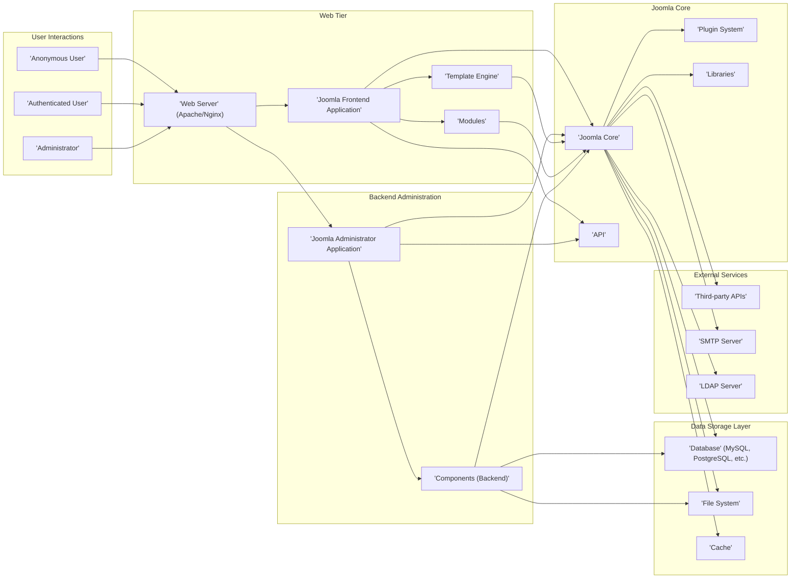
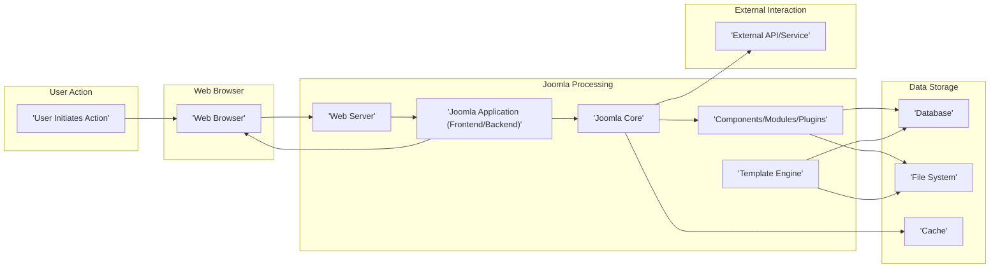

# Project Design Document: Joomla CMS for Threat Modeling (Improved)

**Version:** 1.1
**Date:** October 26, 2023
**Author:** AI Software Architecture Expert

## 1. Introduction

This document provides an enhanced architectural overview of the Joomla Content Management System (CMS), specifically designed to facilitate comprehensive threat modeling. It details the key components, interactions, and data flows within the system, with a strong emphasis on identifying potential security vulnerabilities and attack surfaces. This document is based on the publicly available source code of Joomla CMS found at [https://github.com/joomla/joomla-cms](https://github.com/joomla/joomla-cms). The primary purpose of this document is to serve as a foundation for security professionals to systematically analyze potential threats and design appropriate security controls.

## 2. Goals and Objectives

The overarching goal of this document is to provide a detailed and security-focused architectural representation of Joomla CMS, enabling effective threat modeling. The specific objectives are to:

*   Clearly identify and describe the major components of the Joomla CMS and their functionalities.
*   Illustrate the critical interactions and data flows between these components, highlighting potential pathways for malicious activity.
*   Pinpoint potential entry points for attackers and locations of sensitive data within the system.
*   Provide a solid foundation for security teams to identify, analyze, and prioritize potential threats and vulnerabilities.
*   Support the development of targeted security controls and mitigation strategies.

## 3. System Architecture

Joomla CMS employs a Model-View-Controller (MVC) architectural pattern, augmented by a robust plugin-based extension system. The core system provides essential functionalities, while extensions (components, modules, plugins, templates) offer specialized features and customization options. The web server acts as the initial entry point for all requests.

## 4. Data Flow (Detailed)

This section elaborates on key data flows within the Joomla CMS, highlighting the movement of data and potential security implications:

*   **Frontend Page Request (Example: Viewing an Article):**
    *   An 'Anonymous User' or 'Authenticated User' requests a page (e.g., an article) via their 'Web Browser'.
    *   The 'Web Server' receives the request and forwards it to the 'Joomla Frontend Application'.
    *   'Joomla Core' analyzes the request (URL routing) and determines the relevant 'Component' (e.g., `com_content`) and associated 'Modules'.
    *   The 'Component' interacts with the 'Database' to retrieve the article content and related data.
    *   'Modules' retrieve data from the 'Database' or 'Cache' (e.g., latest articles, navigation menu).
    *   The 'Template Engine' uses the retrieved data and the active template to generate the HTML response.
    *   The rendered HTML is sent back through the 'Web Server' to the 'Web Browser'. *Potential threats: SQL injection during data retrieval, cross-site scripting (XSS) in the article content or template.*
*   **User Login (Example: Administrator Login):**
    *   An 'Administrator' submits login credentials (username and password) via the 'Web Browser' to the 'Joomla Administrator Application'.
    *   The 'Joomla Administrator Application' passes the credentials to 'Joomla Core' for authentication.
    *   'Joomla Core' authenticates the user against the configured authentication method (e.g., database, 'LDAP Server').
    *   Upon successful authentication, 'Joomla Core' creates a session, storing session data in the 'Database' or a session handler. User roles and permissions are loaded.
    *   A session cookie is sent back to the 'Web Browser'. *Potential threats: Brute-force attacks on the login form, credential stuffing, session hijacking.*
*   **Content Creation/Update (Backend - Example: Creating a New Article):**
    *   An 'Administrator' interacts with the 'Joomla Administrator Application', using a backend 'Component' (e.g., `com_content`) to create a new article.
    *   The 'Administrator' enters content, which is submitted to the 'Joomla Administrator Application'.
    *   The 'Component (Backend)' validates and sanitizes the input data.
    *   The data is then stored in the 'Database'. Files (e.g., images) might be uploaded and stored in the 'File System'.
    *   The 'Cache' might be updated to reflect the new content. *Potential threats: Cross-site scripting (XSS) through stored content, insecure file uploads, insufficient input validation leading to SQL injection.*
*   **Extension Installation (Example: Installing a New Component):**
    *   An 'Administrator' uploads an extension package (ZIP file) via the 'Joomla Administrator Application'.
    *   'Joomla Core' handles the upload, unpacks the archive, and installs the extension files into the 'File System'.
    *   'Joomla Core' updates the 'Database' to register the new extension and its associated data.
    *   Plugins within the extension might register themselves with the 'Plugin System'. *Potential threats: Malicious extensions containing backdoors or vulnerabilities, insecure file handling during upload and extraction.*
*   **API Request (Example: External Application Accessing Data):**
    *   An external application sends a request to the 'API' endpoint exposed by 'Joomla Core' or a specific 'Component'.
    *   'Joomla Core' authenticates and authorizes the request, potentially using API keys or OAuth.
    *   The 'API' endpoint interacts with 'Joomla Components' and 'Libraries' to process the request and retrieve data from the 'Database'.
    *   Data is returned to the requesting application in a specified format (e.g., JSON, XML). *Potential threats: API key compromise, insufficient authorization checks, data breaches through API endpoints.*

## 5. Key Components (Security Focused)

This section details the major software components of the Joomla CMS, with a focus on their security implications:

*   **'Joomla Core'**: The central engine responsible for security functions like user authentication, authorization, session management, and input filtering. Vulnerabilities in the core can have widespread impact.
*   **'Frontend Application'**: Handles user-facing requests. A primary target for attacks like XSS and CSRF.
*   **'Backend Application (Administrator)'**: Provides privileged access for managing the site. Compromise of this area can lead to full site takeover. Requires strong authentication and authorization controls.
*   **'Components'**: Major functional units. Vulnerabilities within components are common attack vectors (e.g., SQL injection in content display components).
*   **'Modules'**: Smaller units displaying content. Can be vulnerable to XSS if not properly coded.
*   **'Plugins'**: Extend Joomla's functionality. Malicious or poorly coded plugins are a significant security risk.
*   **'Templates'**: Control the site's presentation. Vulnerabilities can lead to XSS or information disclosure.
*   **'Libraries'**: Collections of code. Vulnerabilities in shared libraries can affect multiple parts of the system.
*   **'Database'**: Stores sensitive data. Requires strong access controls, encryption (at rest), and protection against injection attacks.
*   **'File System'**: Stores code, uploaded files, and configuration. Requires proper permissions to prevent unauthorized access and modification. Insecure file uploads are a major risk.
*   **'Cache'**: Stores data for performance. While generally not a direct target, vulnerabilities in cache mechanisms could lead to information leakage.
*   **'Web Server' (Apache/Nginx)**: The entry point for all requests. Misconfiguration can introduce vulnerabilities. Requires hardening and regular updates.

## 6. Security Considerations (Detailed)

This section expands on the initial security considerations, providing more specific examples of potential threats:

*   **Authentication and Authorization:**
    *   **Threats:** Brute-force attacks, credential stuffing, weak password policies, insufficient protection of authentication cookies, privilege escalation.
    *   **Mitigation:** Strong password policies, multi-factor authentication, rate limiting, secure session management, principle of least privilege.
*   **Input Validation:**
    *   **Threats:** SQL injection, cross-site scripting (XSS), command injection, path traversal, header injection.
    *   **Mitigation:**  Strict input validation and sanitization on all user-supplied data, parameterized queries, output encoding, content security policy (CSP).
*   **Session Management:**
    *   **Threats:** Session hijacking, session fixation, insecure storage of session IDs.
    *   **Mitigation:**  Using secure session IDs, HTTPS only, HTTPOnly and Secure flags for cookies, session timeout, regeneration of session IDs after login.
*   **Access Control:**
    *   **Threats:** Unauthorized access to administrative interfaces, sensitive files, or database records.
    *   **Mitigation:**  Role-based access control (RBAC), principle of least privilege, proper file system permissions, network segmentation.
*   **Extension Security:**
    *   **Threats:** Vulnerabilities in third-party extensions, malicious extensions.
    *   **Mitigation:**  Regularly updating extensions, using extensions from trusted sources, code reviews, security audits of extensions.
*   **Data Protection:**
    *   **Threats:** Data breaches, information disclosure, man-in-the-middle attacks.
    *   **Mitigation:**  HTTPS encryption for data in transit, encryption at rest for sensitive data, secure storage of API keys and credentials.
*   **Error Handling and Logging:**
    *   **Threats:** Information leakage through verbose error messages, insufficient logging for security incidents.
    *   **Mitigation:**  Generic error messages for users, detailed logging of security-related events, secure storage and monitoring of logs.
*   **Database Security:**
    *   **Threats:** SQL injection, unauthorized access to the database server, data breaches.
    *   **Mitigation:**  Parameterized queries, strong database credentials, network isolation, regular security patching of the database server, encryption at rest.
*   **API Security:**
    *   **Threats:** Unauthorized access to API endpoints, data breaches through APIs, injection attacks.
    *   **Mitigation:**  Authentication and authorization mechanisms (e.g., API keys, OAuth), input validation, rate limiting, secure communication (HTTPS).
*   **File Upload Security:**
    *   **Threats:** Upload of malicious files (e.g., web shells), path traversal vulnerabilities.
    *   **Mitigation:**  Validating file types and sizes, sanitizing file names, storing uploaded files outside the web root, preventing direct execution of uploaded files.

## 7. Technologies Used

*   **Programming Language:** PHP (potential vulnerabilities related to outdated versions or insecure coding practices)
*   **Database:** MySQL, MariaDB, PostgreSQL (requires secure configuration and patching)
*   **Web Server:** Apache, Nginx (requires hardening and regular updates to prevent known vulnerabilities)
*   **Frontend Technologies:** HTML, CSS, JavaScript (potential for XSS vulnerabilities if not handled carefully)

## 8. Deployment Model (Security Implications)

This section outlines common deployment models and their associated security considerations:

*   **Single Server:**
    *   **Security Implications:** Single point of failure, increased attack surface on one machine. Requires careful hardening of all services.
*   **Two-Tier Architecture (Web Server & Database Server):**
    *   **Security Implications:** Improved isolation between web application and database. Requires secure communication channels between the tiers and proper firewall rules.
*   **Cloud-Based Deployment (AWS, Azure, Google Cloud):**
    *   **Security Implications:**  Leverages cloud provider's security infrastructure. Requires careful configuration of cloud services (e.g., firewalls, access controls, identity management). Shared responsibility model requires understanding which security aspects are managed by the provider and which are the responsibility of the application owner.

## 9. Future Considerations

This document provides a solid foundation for threat modeling Joomla CMS. Future enhancements could include:

*   More granular diagrams focusing on specific subsystems like the 'Plugin System' or the 'API'.
*   Detailed data flow diagrams for critical administrative functions.
*   A comprehensive list of potential attack vectors mapped to specific components and data flows.
*   Integration with vulnerability scanning tools and penetration testing results.
*   Analysis of the security implications of specific Joomla extensions.
*   Development of security best practices and secure coding guidelines for Joomla development.

This improved document provides a more detailed and security-focused architectural overview of Joomla CMS, better equipping security professionals to conduct thorough and effective threat modeling exercises.