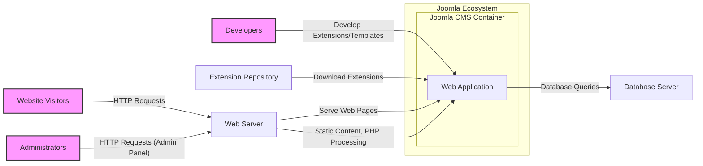
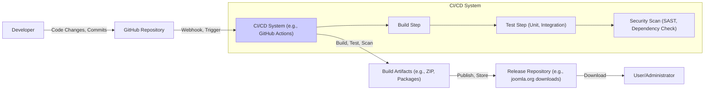

# BUSINESS POSTURE

- Business priorities and goals:
 - Provide a flexible and user-friendly open-source Content Management System (CMS).
 - Enable users to build and manage websites and online applications of various types and sizes.
 - Maintain a large and active community of users and developers.
 - Ensure the platform is extensible and adaptable to evolving web technologies and user needs.
 - Offer a stable, reliable, and secure platform for website operation.
- Most important business risks:
 - Security vulnerabilities in the CMS core or extensions leading to website compromise, data breaches, or reputational damage.
 - Availability issues due to software bugs, infrastructure problems, or security attacks, impacting website accessibility and business operations.
 - Data integrity concerns arising from software defects, unauthorized access, or malicious activities, potentially leading to data loss or corruption.
 - Community fragmentation or decline in contributions, hindering the project's long-term viability and innovation.
 - Compatibility issues with new technologies or changing web standards, making the CMS outdated or less competitive.

# SECURITY POSTURE

- Existing security controls:
 - security control: Regular security releases and patches for the CMS core. (Described in Joomla Security Center and release notes)
 - security control: Extension security checks and vulnerability reporting mechanisms. (Joomla Extensions Directory and community forums)
 - security control: Input validation and sanitization within the CMS core to prevent common web vulnerabilities. (Codebase and security guidelines)
 - security control: Access control mechanisms for user roles and permissions within the CMS administration panel. (Joomla documentation and codebase)
 - security control: Use of prepared statements and database abstraction layers to mitigate SQL injection risks. (Codebase and development best practices)
 - security control: Security-focused development practices within the core development team. (Implied by the project's maturity and security record)
 - accepted risk: Reliance on community-developed extensions, which may have varying levels of security. (Acknowledged in Joomla documentation and extension ecosystem)
 - accepted risk: Potential for misconfiguration by users leading to security vulnerabilities. (Addressed through documentation and best practices guides)
 - accepted risk: Vulnerabilities in third-party libraries and components used by Joomla. (Addressed through dependency management and updates)
- Recommended security controls:
 - security control: Automated security scanning (SAST/DAST) integrated into the development and release pipeline.
 - security control: Regular penetration testing by external security experts.
 - security control: Security awareness training for core developers and extension developers.
 - security control: Implement a Security Information and Event Management (SIEM) system for monitoring and alerting on security events in deployed Joomla instances (for joomla.org infrastructure).
 - security control: Enhance input validation and output encoding across the entire CMS, including extensions API.
- Security requirements:
 - Authentication:
  - Requirement: Secure authentication mechanism for administrative users to prevent unauthorized access to CMS backend.
  - Requirement: Option for multi-factor authentication for administrative users.
  - Requirement: Secure password storage using strong hashing algorithms.
 - Authorization:
  - Requirement: Role-based access control (RBAC) to manage user permissions and restrict access to CMS functionalities based on roles.
  - Requirement: Granular permission management for different areas of the CMS and extensions.
  - Requirement: Principle of least privilege applied to user roles and system processes.
 - Input validation:
  - Requirement: Comprehensive input validation for all user-supplied data to prevent injection attacks (SQL injection, XSS, etc.).
  - Requirement: Server-side validation as primary defense, with client-side validation for user experience.
  - Requirement: Validation applied at all layers of the application, including API endpoints and database interactions.
 - Cryptography:
  - Requirement: Use of strong encryption algorithms for sensitive data at rest and in transit (e.g., passwords, user data, session tokens).
  - Requirement: Secure key management practices for cryptographic keys.
  - Requirement: HTTPS enforced for all communication between users and the CMS.

# DESIGN

## C4 CONTEXT

```mermaid
flowchart LR
    subgraph "Joomla Ecosystem"
        center "Joomla CMS"
    end
    u["Website Visitors"]:::user -- "View Website Content" --> center
    a["Administrators"]:::user -- "Manage Website Content & Configuration" --> center
    d["Developers"]:::user -- "Extend & Customize Joomla" --> center
    e["Extension Repository"] -- "Download & Install Extensions" --> center
    db["Database Server"] -- "Store Website Data" --> center
    ws["Web Server"] -- "Serve Website Content" --> center

    classDef user fill:#f9f,stroke:#333,stroke-width:2px
```

- Context Diagram Elements:
 - - Name: Joomla CMS
   - Type: Software System
   - Description: The Joomla Content Management System, an open-source platform for building and managing websites and online applications.
   - Responsibilities:
    - Content management and publishing.
    - User management and access control.
    - Website presentation and templating.
    - Extension management and integration.
    - Core system functionality and security.
   - Security controls:
    - Input validation and sanitization.
    - Authentication and authorization mechanisms.
    - Security updates and patching process.
    - Secure coding practices in core development.
 - - Name: Website Visitors
   - Type: User
   - Description: End-users who access and interact with websites built using Joomla.
   - Responsibilities:
    - Consume website content.
    - Interact with website features (e.g., forms, comments).
   - Security controls:
    - Browser security features.
    - HTTPS connection to the website.
 - - Name: Administrators
   - Type: User
   - Description: Users who manage and configure Joomla websites through the administrative backend.
   - Responsibilities:
    - Content creation and management.
    - User and access control management.
    - System configuration and maintenance.
    - Extension installation and management.
   - Security controls:
    - Strong password policy.
    - Multi-factor authentication (optional).
    - Role-based access control within Joomla.
 - - Name: Developers
   - Type: User
   - Description: Software developers who create extensions, templates, and customize Joomla installations.
   - Responsibilities:
    - Develop and maintain Joomla extensions and templates.
    - Contribute to Joomla core development.
    - Customize Joomla websites for specific needs.
   - Security controls:
    - Secure coding practices.
    - Code review processes (for core contributions and extensions).
 - - Name: Extension Repository
   - Type: Software System
   - Description: A central repository for Joomla extensions, providing a platform for users to discover, download, and install extensions.
   - Responsibilities:
    - Hosting and distributing Joomla extensions.
    - Providing information and ratings for extensions.
   - Security controls:
    - Extension vetting process (to some extent).
    - User reviews and community feedback.
 - - Name: Database Server
   - Type: Infrastructure System
   - Description: A database server (e.g., MySQL, PostgreSQL) used by Joomla to store website data, including content, user information, and configuration settings.
   - Responsibilities:
    - Data storage and retrieval.
    - Data integrity and consistency.
    - Database security and access control.
   - Security controls:
    - Database access control lists (ACLs).
    - Database hardening and security configurations.
    - Data encryption at rest (optional, depending on infrastructure).
 - - Name: Web Server
   - Type: Infrastructure System
   - Description: A web server (e.g., Apache, Nginx) that hosts the Joomla application and serves website content to users.
   - Responsibilities:
    - Handling HTTP requests and responses.
    - Serving static and dynamic website content.
    - Web server security and performance.
   - Security controls:
    - Web server security configurations (e.g., disabling unnecessary modules, setting proper permissions).
    - HTTPS configuration and certificate management.
    - Web Application Firewall (WAF) (optional, depending on deployment).

## C4 CONTAINER



- Container Diagram Elements:
 - - Name: Web Application
   - Type: Software Container
   - Description: The Joomla PHP web application, containing the core CMS logic, extensions, templates, and business logic.
   - Responsibilities:
    - Handling user requests and application logic.
    - Content management and rendering.
    - User authentication and authorization.
    - Extension management and execution.
    - Database interaction.
   - Security controls:
    - Input validation and sanitization within the application code.
    - Secure session management.
    - Access control mechanisms within the application.
    - Vulnerability scanning of application code and dependencies.
 - - Name: Web Server
   - Type: Infrastructure Container
   - Description: The web server (e.g., Apache or Nginx) responsible for serving the Joomla web application and handling HTTP requests.
   - Responsibilities:
    - Accepting HTTP requests from users.
    - Serving static files (images, CSS, JavaScript).
    - Forwarding dynamic requests to the Joomla web application (PHP processing).
    - Handling HTTPS connections.
   - Security controls:
    - Web server configuration hardening.
    - HTTPS configuration and TLS/SSL certificate management.
    - Web Application Firewall (WAF) integration (optional).
    - Rate limiting and request filtering.
 - - Name: Database Server
   - Type: Infrastructure Container
   - Description: The database server (e.g., MySQL, PostgreSQL) used to store Joomla's data.
   - Responsibilities:
    - Storing and managing website data (content, users, configuration).
    - Providing data persistence and retrieval.
    - Ensuring data integrity and availability.
   - Security controls:
    - Database access control and user permissions.
    - Database server hardening and security configurations.
    - Data encryption at rest (optional).
    - Regular database backups.
 - - Name: Browser
   - Type: Client Container
   - Description: Web browsers used by website visitors and administrators to access Joomla websites.
   - Responsibilities:
    - Rendering web pages and executing client-side scripts (JavaScript).
    - Handling user interactions.
    - Communicating with the web server via HTTP/HTTPS.
   - Security controls:
    - Browser security features (e.g., Content Security Policy, XSS protection).
    - User awareness of browser security settings and safe browsing practices.
    - HTTPS connection indicators.
 - - Name: Extension Repository
   - Type: Software Container
   - Description: The online repository for Joomla extensions.
   - Responsibilities:
    - Hosting and distributing Joomla extensions.
    - Providing metadata and information about extensions.
    - Facilitating extension discovery and download.
   - Security controls:
    - Extension vetting processes (basic checks).
    - User ratings and reviews.
    - HTTPS for download and access.

## DEPLOYMENT

- Deployment Architecture Options:
 - Option 1: Traditional shared hosting environment.
 - Option 2: Virtual Private Server (VPS) or dedicated server.
 - Option 3: Cloud-based infrastructure (e.g., AWS, Azure, GCP) using virtual machines or containers.
 - Option 4: Containerized deployment using Docker and orchestration platforms like Kubernetes.

- Detailed Deployment Architecture (Option 3: Cloud-based VPS):

```mermaid
flowchart LR
    subgraph "Cloud Environment (e.g., AWS VPC)"
        subgraph "Availability Zone 1"
            vps1["Virtual Private Server 1"]
        end
        subgraph "Availability Zone 2"
            vps2["Virtual Private Server 2"]
        end
        lb["Load Balancer"]
        db_server["Database Server (RDS/Managed)"]
    end
    internet["Internet"] -- "HTTPS Requests" --> lb
    lb -- "HTTP Requests" --> vps1
    lb -- "HTTP Requests" --> vps2
    vps1 -- "Database Queries" --> db_server
    vps2 -- "Database Queries" --> db_server
    vps1 -- "Joomla Application, Web Server" -->|Runs on| vps1
    vps2 -- "Joomla Application, Web Server" -->|Runs on| vps2
```

- Deployment Diagram Elements:
 - - Name: Virtual Private Server 1 & 2 (VPS1, VPS2)
   - Type: Compute Instance
   - Description: Virtual machines in a cloud environment (e.g., AWS EC2 instances) hosting the Joomla application and web server. Deployed in multiple availability zones for redundancy.
   - Responsibilities:
    - Running the Joomla web application and web server.
    - Processing HTTP requests.
    - Interacting with the database server.
   - Security controls:
    - Operating system hardening and security patching.
    - Instance-level firewalls (security groups).
    - Access control to the VPS instances (SSH keys, IAM roles).
 - - Name: Load Balancer (LB)
   - Type: Network Service
   - Description: A load balancer distributing incoming HTTP/HTTPS traffic across multiple VPS instances for high availability and scalability.
   - Responsibilities:
    - Distributing traffic across backend servers.
    - Health checks for backend instances.
    - SSL termination (optional).
   - Security controls:
    - DDoS protection.
    - SSL/TLS configuration.
    - Access control policies.
 - - Name: Database Server (RDS/Managed)
   - Type: Managed Database Service
   - Description: A managed database service (e.g., AWS RDS, Azure Database for MySQL) providing a scalable and highly available database for Joomla.
   - Responsibilities:
    - Database hosting and management.
    - Automated backups and recovery.
    - Scalability and performance.
   - Security controls:
    - Database access control lists (ACLs).
    - Data encryption at rest and in transit.
    - Automated security patching and updates.
 - - Name: Internet
   - Type: Network
   - Description: The public internet through which users access the Joomla website.
   - Responsibilities:
    - Public network connectivity.
   - Security controls:
    - No direct security controls from the Joomla deployment perspective, rely on perimeter security and application-level security.

## BUILD



- Build Process Elements:
 - - Name: Developer
   - Type: Human Actor
   - Description: Joomla core developers and extension developers who write and contribute code.
   - Responsibilities:
    - Writing and committing code changes.
    - Performing local testing.
    - Participating in code reviews.
   - Security controls:
    - Secure development practices training.
    - Code review process.
    - Access control to development environments.
 - - Name: GitHub Repository
   - Type: Version Control System
   - Description: The central repository for Joomla source code, hosted on GitHub.
   - Responsibilities:
    - Source code management and versioning.
    - Collaboration platform for developers.
    - Tracking code changes and history.
   - Security controls:
    - Access control to the repository (branch permissions, user roles).
    - Audit logging of code changes.
    - Branch protection rules.
 - - Name: CI/CD System (e.g., GitHub Actions)
   - Type: Automation System
   - Description: An automated CI/CD pipeline that builds, tests, and packages Joomla releases.
   - Responsibilities:
    - Automated build process.
    - Running unit and integration tests.
    - Performing security scans (SAST, dependency checks).
    - Creating build artifacts (release packages).
   - Security controls:
    - Secure CI/CD pipeline configuration.
    - Secrets management for credentials and API keys.
    - Automated security scanning tools integration.
    - Access control to the CI/CD system.
 - - Name: Build Artifacts (e.g., ZIP, Packages)
   - Type: Software Artifacts
   - Description: The packaged releases of Joomla, ready for distribution and deployment.
   - Responsibilities:
    - Distribution of Joomla releases.
    - Providing stable and tested versions of Joomla.
   - Security controls:
    - Digital signatures for release packages (to verify integrity).
    - Secure storage of build artifacts.
 - - Name: Release Repository (e.g., joomla.org downloads)
   - Type: Distribution System
   - Description: The official Joomla website or download server where users can download Joomla releases.
   - Responsibilities:
    - Hosting and distributing Joomla releases.
    - Providing download links and release information.
   - Security controls:
    - Secure hosting infrastructure.
    - HTTPS for downloads.
    - Integrity checks for downloaded packages (e.g., checksums).
 - - Name: User/Administrator
   - Type: Human Actor
   - Description: Joomla users and administrators who download and install Joomla releases.
   - Responsibilities:
    - Downloading and installing Joomla.
    - Deploying and configuring Joomla websites.
   - Security controls:
    - Verifying download integrity (checksums).
    - Following secure installation and configuration guidelines.

# RISK ASSESSMENT

- Critical business processes we are trying to protect:
 - Website availability and accessibility for end-users.
 - Content management and publishing workflows for administrators.
 - Data integrity and confidentiality of website content and user data.
 - Reputation and trust in the Joomla platform.
 - Security of the Joomla infrastructure (joomla.org and related services).
- Data we are trying to protect and their sensitivity:
 - Website content (text, images, media): Moderate sensitivity, integrity and availability are key.
 - User accounts (usernames, emails, roles): Moderate to high sensitivity, confidentiality and integrity are important.
 - User passwords: High sensitivity, confidentiality and integrity are critical.
 - Session data: Moderate sensitivity, confidentiality and integrity are important during active sessions.
 - Configuration data (database credentials, API keys): High sensitivity, confidentiality and integrity are critical.
 - Logs (access logs, error logs): Low to moderate sensitivity, integrity and availability are useful for auditing and troubleshooting.

# QUESTIONS & ASSUMPTIONS

- Questions:
 - What is the process for vetting and approving Joomla extensions in the official directory?
 - Are there specific security guidelines or training provided to Joomla extension developers?
 - What is the typical update frequency for Joomla core and extensions security patches?
 - Is there a bug bounty program or vulnerability disclosure process for Joomla?
 - What are the key performance and scalability requirements for a typical Joomla deployment?
 - What is the expected lifespan and support cycle for different Joomla versions?
- Assumptions:
 - BUSINESS POSTURE: Joomla's primary business goal is to maintain a widely used and trusted open-source CMS. Security and stability are crucial for user adoption and community health.
 - SECURITY POSTURE: Joomla has established security practices, but relies heavily on community contributions and user responsibility for secure deployments. Security is a continuous effort with ongoing improvements.
 - DESIGN: The design is based on a traditional three-tier web application architecture (web server, application server, database). Deployment is flexible and can range from shared hosting to cloud-based infrastructure. The build process is automated using CI/CD principles and includes basic security checks.