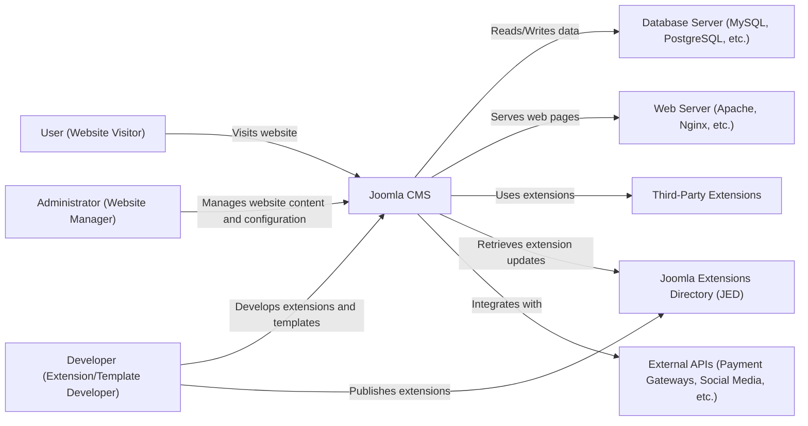
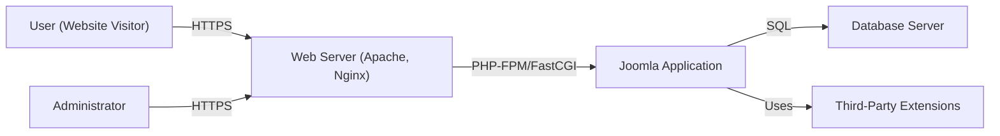
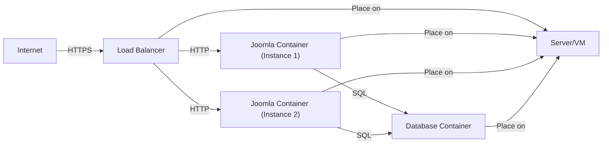

Okay, let's create a design document for the Joomla CMS project, focusing on aspects relevant for threat modeling.

# BUSINESS POSTURE

Joomla is a widely-used, open-source Content Management System (CMS).  It's used by individuals, small businesses, and large organizations to build websites and online applications.  The business priorities revolve around maintaining a balance between ease of use, flexibility, extensibility, and security.  Given its open-source nature and broad user base, the project must prioritize community engagement and contribution.

Business Priorities:

*   Maintain a user-friendly experience for website administrators and content creators.
*   Provide a flexible and extensible platform that can be adapted to various website needs.
*   Ensure the security and stability of the CMS to protect user data and website integrity.
*   Foster a vibrant and active community of developers, designers, and users.
*   Maintain a competitive position in the CMS market.
*   Provide regular updates and patches to address security vulnerabilities and improve functionality.

Business Goals:

*   Increase user adoption and retention.
*   Expand the ecosystem of extensions and templates.
*   Improve the overall security posture of the CMS.
*   Streamline the development and release process.
*   Enhance the performance and scalability of the CMS.

Most Important Business Risks:

*   Reputational damage due to security breaches or data loss.
*   Loss of user trust and adoption due to security concerns or instability.
*   Inability to keep up with evolving web standards and security threats.
*   Fragmentation of the community and decline in contributions.
*   Competition from other CMS platforms.

# SECURITY POSTURE

Joomla has implemented various security controls over its lifecycle.  It also has a dedicated security team (Joomla! Security Strike Team) that handles vulnerability reports and releases security patches. However, being a large and complex open-source project, it's crucial to continuously assess and improve its security posture.

Existing Security Controls:

*   security control: Input validation: Joomla employs input validation techniques to mitigate risks like Cross-Site Scripting (XSS) and SQL Injection. Implemented throughout the codebase, particularly in form handling and database interactions.
*   security control: Output encoding: Joomla uses output encoding to prevent XSS attacks by ensuring that data displayed in the browser is treated as data, not executable code. Implemented in the templating system and output rendering components.
*   security control: Authentication and authorization: Joomla provides a built-in user management system with role-based access control (RBAC) to manage user permissions and access to different features and content. Implemented in the user component and access control lists (ACL).
*   security control: Session management: Joomla uses secure session management practices, including the use of HTTPOnly and Secure cookies (when configured). Implemented in the session handling component.
*   security control: Password hashing: Joomla uses strong password hashing algorithms (e.g., bcrypt) to protect user passwords. Implemented in the user authentication component.
*   security control: CSRF protection: Joomla includes protection against Cross-Site Request Forgery (CSRF) attacks using tokens. Implemented in form handling and request validation.
*   security control: Regular security updates: The Joomla Security Strike Team releases regular security updates and patches to address vulnerabilities. Described in the Joomla security announcements and release notes.
*   security control: Extension vetting (limited): While not a direct control within the core CMS, the Joomla Extensions Directory (JED) has some level of vetting for extensions, although it's not foolproof. Described in the JED policies and guidelines.
*   security control: File upload restrictions: Joomla allows administrators to configure restrictions on file uploads, such as allowed file types and sizes. Implemented in the media manager component.
*   security control: Two-Factor Authentication (2FA): Joomla supports 2FA to enhance account security. Implemented as a core feature and through extensions.

Accepted Risks:

*   accepted risk: Third-party extension vulnerabilities: Joomla's extensibility is a strength, but it also introduces the risk of vulnerabilities in third-party extensions. Users are responsible for vetting and updating extensions.
*   accepted risk: Misconfiguration by administrators: Joomla provides many configuration options, and incorrect configuration by administrators can lead to security weaknesses.
*   accepted risk: Reliance on community reporting: While Joomla has a security team, it also relies on the community to report vulnerabilities. There may be a delay between vulnerability discovery and patch release.
*   accepted risk: Legacy code: As a long-standing project, Joomla may contain legacy code that is more susceptible to vulnerabilities.

Recommended Security Controls:

*   Implement a robust Content Security Policy (CSP) to mitigate XSS and data injection attacks.
*   Introduce a Software Bill of Materials (SBOM) for the core CMS and encourage extension developers to do the same. This improves supply chain security.
*   Implement automated security testing (SAST, DAST) in the CI/CD pipeline.
*   Provide more granular control over administrator permissions.
*   Enhance the security of the update process to prevent supply chain attacks.

Security Requirements:

*   Authentication:
    *   All users must be authenticated before accessing administrative interfaces or sensitive data.
    *   Support for strong passwords and multi-factor authentication (MFA) should be enforced.
    *   Session management must be secure, using HTTPOnly and Secure cookies where appropriate.
    *   Implement account lockout policies to mitigate brute-force attacks.

*   Authorization:
    *   Implement fine-grained access control based on the principle of least privilege.
    *   Regularly review and update user roles and permissions.
    *   Ensure that users can only access data and functionality that they are authorized to use.

*   Input Validation:
    *   All user input must be validated on the server-side.
    *   Use a whitelist approach to input validation, allowing only known-good characters and patterns.
    *   Validate data types, lengths, and formats.
    *   Sanitize input to prevent code injection attacks.

*   Cryptography:
    *   Use strong, industry-standard cryptographic algorithms for password hashing (e.g., bcrypt, Argon2).
    *   Use secure random number generators for generating cryptographic keys and nonces.
    *   Protect sensitive data in transit using TLS/SSL.
    *   Consider encrypting sensitive data at rest.

# DESIGN

## C4 CONTEXT

C4 Context Element List:

*   Element:
    *   Name: User
    *   Type: Person
    *   Description: A visitor to a website powered by Joomla CMS.
    *   Responsibilities: Browses website content, interacts with website features (e.g., forms, comments).
    *   Security controls: Limited direct security controls; relies on the security of the Joomla CMS and the website's configuration.

*   Element:
    *   Name: Administrator
    *   Type: Person
    *   Description: A user with administrative privileges who manages the website's content, configuration, and users.
    *   Responsibilities: Manages content, users, extensions, templates, and overall website settings.
    *   Security controls: Strong password policies, multi-factor authentication (optional but recommended), access control restrictions.

*   Element:
    *   Name: Developer
    *   Type: Person
    *   Description: A developer who creates extensions, templates, or contributes to the Joomla core.
    *   Responsibilities: Develops and maintains Joomla extensions and templates, contributes to the Joomla core codebase.
    *   Security controls: Follows secure coding practices, participates in security reviews (for core contributions).

*   Element:
    *   Name: Joomla CMS
    *   Type: Software System
    *   Description: The core Joomla Content Management System.
    *   Responsibilities: Manages website content, users, extensions, templates, and provides the core functionality of the website.
    *   Security controls: Input validation, output encoding, authentication, authorization, session management, CSRF protection, regular security updates.

*   Element:
    *   Name: Database Server
    *   Type: Software System
    *   Description: The database server (e.g., MySQL, PostgreSQL) that stores the website's data.
    *   Responsibilities: Stores and retrieves website data, including content, user information, and configuration settings.
    *   Security controls: Database access controls, encryption at rest (optional), regular backups, secure configuration.

*   Element:
    *   Name: Web Server
    *   Type: Software System
    *   Description: The web server (e.g., Apache, Nginx) that serves the website to users.
    *   Responsibilities: Handles HTTP requests, serves static files, and interacts with the Joomla CMS application.
    *   Security controls: Secure configuration, HTTPS (TLS/SSL), Web Application Firewall (WAF) (optional), regular security updates.

*   Element:
    *   Name: Third-Party Extensions
    *   Type: Software System
    *   Description: Extensions developed by third-party developers that extend the functionality of Joomla.
    *   Responsibilities: Provide additional features and functionality to the website.
    *   Security controls: Vary widely; rely on the developer to implement secure coding practices. Joomla Extensions Directory (JED) provides some level of vetting.

*   Element:
    *   Name: Joomla Extensions Directory (JED)
    *   Type: Software System
    *   Description: The official directory of Joomla extensions.
    *   Responsibilities: Provides a central repository for Joomla extensions, allows users to discover and download extensions.
    *   Security controls: Basic vetting of extensions, user reviews and ratings.

*   Element:
    *   Name: External APIs
    *   Type: Software System
    *   Description: External APIs that the Joomla website may integrate with (e.g., payment gateways, social media platforms).
    *   Responsibilities: Provide specific services or data to the Joomla website.
    *   Security controls: API keys, OAuth, secure communication (HTTPS).

## C4 CONTAINER

C4 Container Element List:

*   Element:
    *   Name: User
    *   Type: Person
    *   Description: A visitor to a website powered by Joomla CMS.
    *   Responsibilities: Browses website content, interacts with website features.
    *   Security controls: Relies on the security of the Joomla CMS and website configuration.

*   Element:
    *   Name: Administrator
    *   Type: Person
    *   Description: A user with administrative privileges.
    *   Responsibilities: Manages website content, configuration, and users.
    *   Security controls: Strong password policies, multi-factor authentication (recommended), access control restrictions.

*   Element:
    *   Name: Web Server
    *   Type: Software System
    *   Description: The web server (Apache, Nginx) serving the Joomla site.
    *   Responsibilities: Handles HTTP requests, serves static files, interacts with the Joomla application.
    *   Security controls: Secure configuration, HTTPS (TLS/SSL), WAF (optional), regular security updates.

*   Element:
    *   Name: Joomla Application
    *   Type: Application
    *   Description: The core Joomla application code, including components, modules, plugins, and templates.
    *   Responsibilities: Handles user requests, interacts with the database, renders web pages, manages extensions.
    *   Security controls: Input validation, output encoding, authentication, authorization, session management, CSRF protection.

*   Element:
    *   Name: Database Server
    *   Type: Database
    *   Description: The database server storing website data.
    *   Responsibilities: Stores and retrieves website data.
    *   Security controls: Database access controls, encryption at rest (optional), regular backups, secure configuration.

*   Element:
    *   Name: Third-Party Extensions
    *   Type: Application
    *   Description: Extensions that extend Joomla functionality.
    *   Responsibilities: Provide additional features.
    *   Security controls: Vary; rely on developer's secure coding practices.

## DEPLOYMENT

Joomla can be deployed in various ways, including:

1.  Traditional Hosting:  Installing Joomla on a shared or dedicated hosting account using cPanel, Plesk, or similar control panels.
2.  VPS/Cloud Server:  Deploying Joomla on a Virtual Private Server (VPS) or cloud server instance (e.g., AWS EC2, Google Compute Engine, Azure VM).
3.  Containerized Deployment:  Using Docker and Docker Compose or Kubernetes to deploy Joomla in containers.
4.  Platform-as-a-Service (PaaS):  Using a PaaS provider like Heroku or AWS Elastic Beanstalk to deploy Joomla.

We'll describe a containerized deployment using Docker Compose, as it offers a good balance of control, reproducibility, and ease of management.

Deployment Element List:

*   Element:
    *   Name: Internet
    *   Type: Network
    *   Description: The public internet.
    *   Responsibilities: Connects users to the website.
    *   Security controls: Relies on the security of the network infrastructure and protocols (e.g., HTTPS).

*   Element:
    *   Name: Load Balancer
    *   Type: Network Device
    *   Description: Distributes incoming traffic across multiple Joomla containers.
    *   Responsibilities: Improves availability and scalability, handles SSL termination (optional).
    *   Security controls: Secure configuration, HTTPS (TLS/SSL), WAF (optional).

*   Element:
    *   Name: Joomla Container (Instance 1 & 2)
    *   Type: Container
    *   Description: A Docker container running the Joomla application and a web server (e.g., Apache or Nginx).
    *   Responsibilities: Serves web pages, handles user requests.
    *   Security controls: Hardened container image, limited privileges, regular updates.

*   Element:
    *   Name: Database Container
    *   Type: Container
    *   Description: A Docker container running the database server (e.g., MySQL or PostgreSQL).
    *   Responsibilities: Stores and retrieves website data.
    *   Security controls: Secure configuration, strong passwords, limited network access, regular backups.

*   Element:
    *   Name: Server/VM
    *   Type: Infrastructure
    *   Description: Physical or virtual server that hosts containers.
    *   Responsibilities: Provides compute, memory and storage for containers.
    *   Security controls: OS hardening, firewall, intrusion detection/prevention system.

## BUILD

Joomla's build process involves several steps, from development to the creation of release packages. While Joomla doesn't use a traditional CI/CD pipeline in the strictest sense for its core releases, it does have automated processes and relies heavily on community contributions and testing.

```mermaid
graph LR
    Developer["Developer"]
    GitHub["GitHub Repository"]
    TestingServer["Testing Server"]
    ReleaseManager["Release Manager"]
    JoomlaDownloads["Joomla! Downloads"]
	  AutomatedChecks["Automated Checks"]

    Developer -- "Commits code" --> GitHub
    GitHub -- "Triggers" --> AutomatedChecks
	  AutomatedChecks -- "Runs" --> TestingServer
    TestingServer -- "Manual testing" --> ReleaseManager
    ReleaseManager -- "Creates release package" --> JoomlaDownloads
```

Build Process Description:

1.  Development: Developers work on the Joomla codebase, making changes and improvements.
2.  Code Submission: Developers submit their code changes via pull requests to the Joomla CMS repository on GitHub.
3.  Automated Checks: When a pull request is submitted, automated checks are triggered. These checks include:
    *   Code Style Checks: Joomla uses a specific coding style, and linters are used to ensure that code adheres to these standards.
    *   Static Analysis: Basic static analysis tools may be used to identify potential code quality issues.
    *   Unit Tests: Joomla has a suite of unit tests that are run to ensure that code changes don't break existing functionality.
4.  Manual Review and Testing: Core team members and community contributors review the code changes and perform manual testing. This includes security reviews, functionality testing, and usability testing.
5.  Merge: If the code changes pass the automated checks and manual review, they are merged into the main codebase.
6.  Release Packaging: The Release Manager creates release packages (e.g., zip files) from the codebase. This process may involve additional build scripts to prepare the files for distribution.
7.  Release Distribution: The release packages are made available for download on the Joomla! Downloads website.

Security Controls in the Build Process:

*   Code Review: All code changes are reviewed by multiple developers before being merged.
*   Automated Checks: Linters, static analysis tools, and unit tests help to identify potential issues early in the development process.
*   Security Team Involvement: The Joomla! Security Strike Team is involved in reviewing security-related code changes.
*   Limited Access to Release Infrastructure: Only trusted Release Managers have access to the infrastructure used to create and distribute release packages.

# RISK ASSESSMENT

Critical Business Processes to Protect:

*   Website Availability: Ensuring that websites built with Joomla remain accessible to users.
*   Content Integrity: Protecting the integrity of website content from unauthorized modification or deletion.
*   User Data Privacy: Protecting the privacy and confidentiality of user data stored within Joomla websites.
*   Extension Ecosystem: Maintaining the integrity and security of the Joomla extension ecosystem.
*   Reputation: Protecting the reputation of the Joomla project and its community.

Data to Protect and Sensitivity:

*   User Account Data (usernames, hashed passwords, email addresses, profile information): High sensitivity.
*   Website Content (articles, pages, media files): Variable sensitivity, depending on the content. Some content may be public, while other content may be private or confidential.
*   Configuration Settings (database credentials, API keys): High sensitivity.
*   Session Data: Medium sensitivity.
*   Extension Data: Variable sensitivity, depending on the extension. Some extensions may store sensitive data.

# QUESTIONS & ASSUMPTIONS

Questions:

*   What is the specific threat model that Joomla uses for its core development?
*   What are the procedures for handling security vulnerabilities reported by external researchers?
*   What is the frequency of penetration testing performed on the Joomla core?
*   Are there any plans to implement a more formal CI/CD pipeline with integrated security testing?
*   What is the process for auditing and approving third-party extensions in the JED?

Assumptions:

*   BUSINESS POSTURE: We assume that Joomla prioritizes maintaining a balance between security, usability, and extensibility.
*   SECURITY POSTURE: We assume that Joomla follows generally accepted secure coding practices and that the Security Strike Team actively addresses reported vulnerabilities.
*   DESIGN: We assume a standard LAMP (Linux, Apache, MySQL, PHP) or LEMP (Linux, Nginx, MySQL, PHP) stack for deployment, although other configurations are possible. We also assume that most Joomla installations use a single database server. We assume that developers of third-party extensions are responsible for the security of their own code.