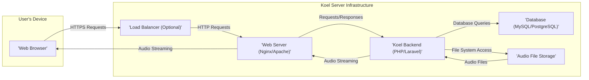

# Project Design Document: Koel - A Personal Music Streaming Server

**Version:** 1.1
**Date:** October 26, 2023
**Prepared By:** AI Software Architect

## 1. Introduction

This document provides an enhanced and detailed design overview of the Koel project, an open-source web-based personal audio streaming server. This document aims to clearly outline the system's architecture, components, data flow, and key technologies. It will serve as the foundation for subsequent threat modeling activities. Improvements in this version focus on providing more granular detail and clarifying potential security considerations.

## 2. System Overview

Koel empowers users to stream their personal music collection through a user-friendly web interface. Its core functionalities include uploading, organizing, managing metadata, and playing audio files. The system is structured with a backend API responsible for data management and content delivery, and a frontend user interface facilitating user interaction.

## 3. Architectural Diagram

## 4. Component Details

*   **Web Browser:** The primary interface through which users interact with Koel. It sends requests to the server and renders the responses, including the audio player and management interfaces.
    *   **Technology:** HTML5, CSS3, JavaScript (likely utilizing a framework such as Vue.js or React for dynamic UI components and interactions).
    *   **Responsibility:** Presenting the user interface, handling user input events (clicks, form submissions), rendering data received from the backend, managing the audio playback experience.
    *   **Key Interactions:** Initiates HTTP/HTTPS requests to the Web Server for API calls (e.g., fetching song lists, initiating playback) and for retrieving static assets (images, scripts, stylesheets). Receives audio streams for playback, typically via progressive download or streaming protocols.

*   **Load Balancer (Optional):**  Distributes incoming user traffic across multiple instances of the Web Server to enhance scalability, availability, and fault tolerance.
    *   **Technology:** Nginx, HAProxy, cloud provider managed load balancers (e.g., AWS ELB, Google Cloud Load Balancing).
    *   **Responsibility:**  Distributing incoming requests based on configured algorithms (e.g., round-robin, least connections), performing health checks on backend servers to ensure traffic is only routed to healthy instances.
    *   **Key Interactions:** Receives all incoming requests from the Web Browser. Forwards these requests to available and healthy Web Server instances.

*   **Web Server (Nginx/Apache):** Serves static assets required by the frontend (HTML, CSS, JavaScript files, images) and acts as a reverse proxy, directing API requests to the Koel Backend application. It often handles SSL/TLS termination.
    *   **Technology:** Nginx or Apache HTTP Server, potentially with modules for reverse proxying and SSL/TLS handling.
    *   **Responsibility:** Serving static content efficiently, handling incoming HTTP/HTTPS connections, terminating SSL/TLS encryption, routing API requests to the appropriate backend server, potentially implementing caching mechanisms for static assets.
    *   **Key Interactions:** Receives requests from the Web Browser (or Load Balancer). Serves static files directly. Proxies API requests to the Koel Backend. Sends audio streams received from the backend to the Web Browser.

*   **Koel Backend (PHP/Laravel):** The core application logic of Koel, responsible for handling user authentication and authorization, managing music metadata (song titles, artists, albums), processing file uploads, and serving audio streams.
    *   **Technology:** PHP programming language, Laravel framework (providing features like routing, ORM (Eloquent), authentication, and API building tools). Likely utilizes other PHP libraries for audio file processing and metadata extraction.
    *   **Responsibility:** Handling API endpoints for various functionalities (user management, library management, playback control), authenticating and authorizing user requests, interacting with the Database to manage and retrieve metadata, interacting with the Audio File Storage to manage and retrieve audio files, implementing the logic for streaming audio content.
    *   **Key Interactions:** Receives API requests from the Web Server. Executes database queries against the Database. Accesses the Audio File Storage to read and write audio files. Sends responses (including audio streams) back to the Web Server.

*   **Database (MySQL/PostgreSQL):**  Stores structured data related to the music library, including song metadata, artist information, album details, user accounts, playlists, and application settings.
    *   **Technology:** MySQL or PostgreSQL relational database management system.
    *   **Responsibility:** Providing persistent storage for application data, ensuring data integrity and consistency, allowing efficient querying and retrieval of data.
    *   **Key Interactions:** Receives SQL queries (SELECT, INSERT, UPDATE, DELETE) from the Koel Backend to manage and retrieve data. Returns query results to the Koel Backend.

*   **Audio File Storage:** The physical or logical location where the actual audio files are stored. This could be the local filesystem of the server, a Network Attached Storage (NAS) device, or a cloud-based object storage service.
    *   **Technology:** Local filesystem, Network File System (NFS), cloud object storage services (e.g., AWS S3, Google Cloud Storage, Azure Blob Storage).
    *   **Responsibility:**  Storing the audio files persistently and making them accessible to the Koel Backend for streaming.
    *   **Key Interactions:** Accessed by the Koel Backend to read audio files for streaming and to write new audio files during the upload process.

## 5. Data Flow

The following outlines the typical data flow for key operations within the Koel system:

*   **User Login:**
    1. The "'Web Browser'" sends login credentials (username/email and password) via an HTTPS POST request to the "'Web Server (Nginx/Apache)'".
    2. The "'Web Server (Nginx/Apache)'" forwards the request to the "'Koel Backend (PHP/Laravel)'".
    3. The "'Koel Backend (PHP/Laravel)'" queries the "'Database (MySQL/PostgreSQL)'" to authenticate the user by comparing the provided credentials with stored user data (likely using a hashed password).
    4. The "'Database (MySQL/PostgreSQL)'" returns the authentication result (success or failure) to the "'Koel Backend (PHP/Laravel)'".
    5. Upon successful authentication, the "'Koel Backend (PHP/Laravel)'" generates a session token or cookie and sends a success response back through the "'Web Server (Nginx/Apache)'" to the "'Web Browser'". This response typically includes the session token for subsequent authenticated requests.

*   **Uploading a Song:**
    1. The "'Web Browser'" sends the audio file (typically via a multipart/form-data POST request) to the "'Web Server (Nginx/Apache)'".
    2. The "'Web Server (Nginx/Apache)'" forwards the file upload request to the "'Koel Backend (PHP/Laravel)'".
    3. The "'Koel Backend (PHP/Laravel)'" receives the uploaded file and saves it to the "'Audio File Storage'".
    4. The "'Koel Backend (PHP/Laravel)'" extracts metadata from the audio file (e.g., using libraries for ID3 tag reading).
    5. The "'Koel Backend (PHP/Laravel)'" stores the extracted metadata (song title, artist, album, etc.) in the "'Database (MySQL/PostgreSQL)'".
    6. The "'Koel Backend (PHP/Laravel)'" sends a success response back through the "'Web Server (Nginx/Apache)'" to the "'Web Browser'".

*   **Browsing Music Library:**
    1. The "'Web Browser'" sends an HTTP GET request to the "'Web Server (Nginx/Apache)'" requesting the music library data.
    2. The "'Web Server (Nginx/Apache)'" forwards the request to the "'Koel Backend (PHP/Laravel)'".
    3. The "'Koel Backend (PHP/Laravel)'" queries the "'Database (MySQL/PostgreSQL)'" for the music metadata.
    4. The "'Database (MySQL/PostgreSQL)'" returns the requested metadata to the "'Koel Backend (PHP/Laravel)'".
    5. The "'Koel Backend (PHP/Laravel)'" formats the metadata (e.g., as JSON) and sends it back through the "'Web Server (Nginx/Apache)'" to the "'Web Browser'".
    6. The "'Web Browser'" receives the metadata and renders the music library in the user interface.

*   **Streaming a Song:**
    1. The "'Web Browser'" sends a request to the "'Web Server (Nginx/Apache)'" to stream a specific song (e.g., by requesting a specific audio file path or using an API endpoint).
    2. The "'Web Server (Nginx/Apache)'" forwards the request to the "'Koel Backend (PHP/Laravel)'".
    3. The "'Koel Backend (PHP/Laravel)'" retrieves the path to the requested audio file from the "'Database (MySQL/PostgreSQL)'".
    4. The "'Koel Backend (PHP/Laravel)'" accesses the "'Audio File Storage'" to retrieve the audio file.
    5. The "'Koel Backend (PHP/Laravel)'" streams the audio data back through the "'Web Server (Nginx/Apache)'" to the "'Web Browser'". This might involve techniques like chunked transfer encoding for efficient streaming.

## 6. Key Technologies

*   **Programming Languages:** PHP, JavaScript
*   **Backend Framework:** Laravel
*   **Frontend Technologies:** HTML5, CSS3, JavaScript (likely with a framework like Vue.js or React)
*   **Web Servers:** Nginx or Apache
*   **Databases:** MySQL or PostgreSQL
*   **Operating System:** Typically Linux-based
*   **Protocols:** HTTP, HTTPS, TCP/IP

## 7. Deployment Model

Koel can be deployed in various configurations, each with its own implications for scalability, resilience, and security:

*   **Single Server Deployment:** All components (Web Server, Koel Backend, Database, Audio File Storage) are hosted on a single physical or virtual server. This is the simplest deployment model but offers limited scalability and redundancy.
*   **Containerized Deployment (Docker):** Each component is packaged into a Docker container. These containers can be orchestrated using tools like Docker Compose or Kubernetes. This model simplifies deployment, provides better resource isolation, and facilitates scaling.
*   **Cloud Deployment:** Leveraging cloud services for hosting. This can involve:
    *   **Managed Compute Instances (e.g., AWS EC2, Google Compute Engine):**  Deploying components on virtual machines in the cloud.
    *   **Container Orchestration Services (e.g., AWS ECS/EKS, Google Kubernetes Engine):** Managing containerized deployments in the cloud.
    *   **Managed Database Services (e.g., AWS RDS, Google Cloud SQL):** Utilizing cloud-managed database instances.
    *   **Object Storage Services (e.g., AWS S3, Google Cloud Storage):** Storing audio files in scalable and durable cloud storage.
    *   **Load Balancers (e.g., AWS ELB, Google Cloud Load Balancing):** Distributing traffic across multiple instances.

## 8. Assumptions and Constraints

*   The application is assumed to implement robust user authentication and authorization mechanisms to protect user data and control access to the music library.
*   The security of the system relies on the underlying operating system, web server configurations, and database security practices.
*   The application needs to efficiently handle potentially large audio files during upload, storage, and streaming.
*   Secure communication over HTTPS is a fundamental requirement for protecting sensitive data transmitted between the client and the server.
*   The specific frontend implementation details (e.g., the exact JavaScript framework and libraries used) are not explicitly defined in the provided link but are assumed to exist and function as a modern web application.

## 9. Security Considerations (Initial)

This section provides a more detailed preliminary overview of security considerations that will be crucial during threat modeling.

*   **Authentication and Authorization:**
    *   **Threats:** Brute-force attacks on login forms, credential stuffing, session hijacking, privilege escalation.
    *   **Considerations:** Strong password policies, multi-factor authentication, secure session management (using HttpOnly and Secure flags for cookies), proper implementation of authorization checks at the backend.
*   **Input Validation:**
    *   **Threats:** Cross-Site Scripting (XSS), SQL Injection, Command Injection, Path Traversal.
    *   **Considerations:**  Sanitizing and validating all user-provided input on both the client-side and the server-side. Using parameterized queries to prevent SQL injection. Avoiding direct execution of user-provided data as commands.
*   **Data Storage Security:**
    *   **Threats:** Unauthorized access to the database or audio file storage, data breaches.
    *   **Considerations:** Encrypting sensitive data at rest (e.g., user passwords, potentially metadata), implementing proper access controls to the database and file storage, regularly backing up data.
*   **Secure Communication:**
    *   **Threats:** Man-in-the-Middle (MITM) attacks, eavesdropping on sensitive data.
    *   **Considerations:** Enforcing HTTPS for all communication, using strong TLS configurations, ensuring proper certificate management.
*   **File Upload Security:**
    *   **Threats:** Uploading malicious files (e.g., malware, web shells), path traversal vulnerabilities during file saving.
    *   **Considerations:** Validating file types and sizes, sanitizing filenames, storing uploaded files in a secure location outside the webroot, implementing virus scanning on uploaded files.
*   **Access Control to Audio Files:**
    *   **Threats:** Unauthorized access to stored audio files, direct access to audio files bypassing authentication.
    *   **Considerations:**  Ensuring that audio files are not directly accessible via predictable URLs, implementing access controls at the backend to verify user authorization before serving audio streams.
*   **Dependency Management:**
    *   **Threats:** Exploiting known vulnerabilities in third-party libraries and frameworks.
    *   **Considerations:** Regularly updating dependencies to the latest secure versions, using dependency scanning tools to identify vulnerabilities.
*   **Error Handling and Logging:**
    *   **Threats:** Information leakage through verbose error messages, insufficient logging for security monitoring and incident response.
    *   **Considerations:** Implementing proper error handling that doesn't reveal sensitive information, logging relevant security events (authentication attempts, authorization failures, suspicious activity).

This enhanced design document provides a more detailed and nuanced understanding of the Koel project's architecture and potential security considerations, making it a more effective foundation for subsequent threat modeling activities.