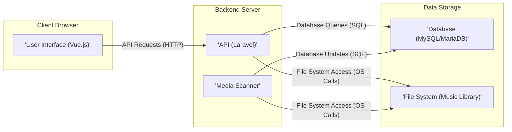
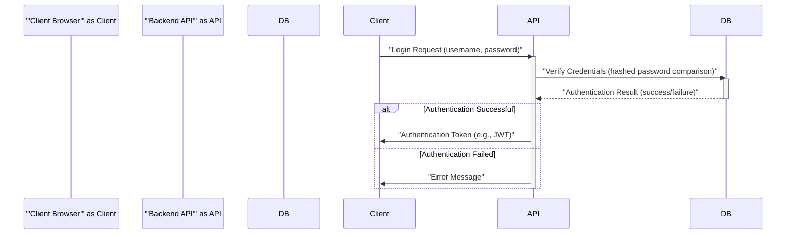
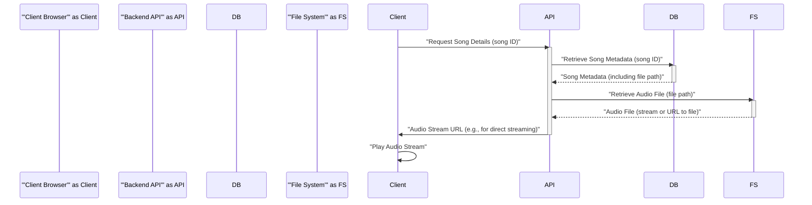
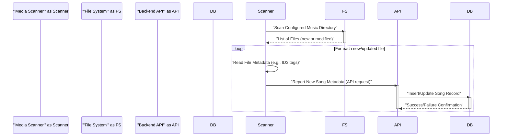

# Project Design Document: Koel - Personal Audio Streaming Server

**Version:** 1.1
**Date:** October 26, 2023
**Prepared By:** Gemini (AI Architecture Expert)

## 1. Introduction

This document outlines the design of Koel, a web-based personal audio streaming server. This design will serve as the foundation for future threat modeling activities, enabling a comprehensive understanding of the system's components, interactions, and potential vulnerabilities. The design focuses on the core functionalities and architecture of Koel as described in the project repository: [https://github.com/koel/koel](https://github.com/koel/koel). This revision includes more detail on component interactions and potential security considerations.

## 2. Goals and Objectives

* Provide a clear and detailed architectural overview of Koel. This includes identifying key components, their responsibilities, and interactions.
* Document the primary data flows within the system, highlighting the movement and transformation of data.
* Describe the technologies and frameworks used in the project, providing context for understanding inherent security characteristics and potential vulnerabilities.
* Establish a robust foundation for subsequent threat modeling activities, ensuring sufficient detail for effective identification and analysis of security threats.

## 3. High-Level Architecture

Koel follows a traditional three-tier architecture, separating concerns for presentation, application logic, and data management.

* **Presentation Tier (Frontend):** The user interface that allows users to interact with the application, primarily through a web browser.
* **Application Tier (Backend API):** Handles the core business logic, data processing, and management of API requests from the frontend.
* **Data Tier:** Responsible for the persistent storage of application data (metadata) and the media files themselves.

## 4. Detailed Component Design

### 4.1. Presentation Tier (Frontend)

* **Component:** User Interface (UI)
    * **Technology:** Vue.js
    * **Responsibilities:**
        * Rendering the user interface components for browsing music libraries, managing playlists, and controlling audio playback.
        * Handling user interactions such as clicks, keyboard input, and form submissions.
        * Making asynchronous API requests (typically HTTP requests) to the backend API to retrieve data or trigger actions.
        * Displaying data received from the backend API in a user-friendly format.
        * Managing the user's authentication state and handling login/logout flows.
        * Potentially caching data locally for improved performance.
    * **Key Features:**
        * Dynamic rendering of music library views (artists, albums, songs, genres).
        * Interactive playlist management features (creation, editing, reordering, deletion).
        * Playback controls with visual feedback (play/pause, skip, volume control, progress bar).
        * Real-time search functionality with suggestions.
        * Securely handling user credentials during login and registration processes.

### 4.2. Application Tier (Backend API)

* **Component:** API (Laravel)
    * **Technology:** PHP (Laravel Framework)
    * **Responsibilities:**
        * Receiving and processing API requests from the frontend application.
        * Implementing the core business logic of the application, such as user management, library management, and playback control.
        * Authenticating and authorizing incoming requests to ensure only authorized users can access specific resources.
        * Interacting with the database to retrieve, create, update, and delete data related to users, songs, and playlists.
        * Accessing the file system to locate and serve media files for streaming.
        * Generating appropriate responses to the frontend, typically in JSON format.
        * Handling errors and exceptions gracefully.
    * **Key Features:**
        * RESTful API endpoints for:
            * User authentication (login, registration, password reset).
            * Retrieving structured music library data (lists of artists, albums, songs, with pagination and filtering).
            * Managing user playlists (creation, retrieval, updating, deletion of playlists and their contents).
            * Streaming audio files securely.
            * Searching the music library based on various criteria.
            * Managing user account settings and preferences.
* **Component:** Media Scanner
    * **Technology:** PHP (likely implemented as a background process or scheduled task within the Laravel application)
    * **Responsibilities:**
        * Periodically scanning the configured music library directory (or directories) for new, modified, or deleted audio files.
        * Reading metadata from audio files using libraries (e.g., ID3 tags for MP3 files) to extract information like title, artist, album, artwork.
        * Populating the database with information about the discovered music files or updating existing entries if changes are detected.
        * Potentially generating thumbnails or other derived data from the audio files or their metadata.
    * **Key Features:**
        * Configurable scan intervals.
        * Handling of various audio file formats.
        * Error handling for corrupted or unreadable files.
        * Potentially utilizing file system monitoring tools for more efficient updates.

### 4.3. Data Tier

* **Component:** Database (MySQL/MariaDB)
    * **Technology:** MySQL or MariaDB (as indicated in the project documentation)
    * **Responsibilities:**
        * Providing persistent storage for all application data, including user accounts, song metadata, and playlist information.
        * Managing relationships between different data entities (e.g., a song belongs to an album and an artist).
        * Ensuring data integrity and consistency through constraints and transactions.
        * Providing efficient mechanisms for querying and retrieving data based on various criteria.
    * **Data Entities:**
        * `Users`: Stores user credentials (hashed passwords), personal information, and settings.
        * `Songs`: Stores metadata about individual audio tracks, including title, artist, album, file path, duration, and other relevant information.
        * `Artists`: Stores information about music artists.
        * `Albums`: Stores information about music albums, potentially linking to an artist.
        * `Playlists`: Stores information about user-created playlists, including the playlist name, owner, and associated songs (through a join table).
        * `Settings`: Stores application-wide or user-specific configuration settings.
* **Component:** File System (Music Library)
    * **Technology:** The underlying operating system's file system.
    * **Responsibilities:**
        * Storing the actual audio files that users will stream.
        * Organizing the files in a logical directory structure, typically based on artist and album.
        * Providing read access to the audio files for the backend API to serve them to users.
    * **Structure:**
        * Typically a hierarchical structure of folders representing artists and albums, containing the audio files.
        * Supports various audio file formats such as MP3, FLAC, and others, depending on Koel's capabilities.

## 5. Data Flow Diagrams

### 5.1. User Authentication

### 5.2. Requesting and Playing a Song

### 5.3. Adding New Music to Library (via Media Scanner)

## 6. Technologies and Frameworks

* **Frontend:**
    * Vue.js: A progressive JavaScript framework for building user interfaces.
    * HTML5, CSS3: For structuring and styling the user interface.
    * JavaScript (ES6+): The primary programming language for frontend logic.
    * Potentially other UI libraries (e.g., for component styling or specific functionalities).
* **Backend:**
    * PHP: The server-side scripting language.
    * Laravel: A robust PHP framework providing structure and tools for web application development.
    * Composer: A dependency management tool for PHP projects.
* **Database:**
    * MySQL or MariaDB: Open-source relational database management systems.
* **Web Server:**
    * Likely Apache or Nginx: Popular web servers used to serve the application.
* **Operating System:**
    * Linux (common deployment environment for Koel).
* **Other Potential Libraries/Tools:**
    * Libraries for audio file metadata extraction (e.g., getID3).
    * Eloquent ORM (Object-Relational Mapper) in Laravel for database interaction.
    * Libraries for image processing (for handling album art).

## 7. Security Considerations (Focus for Threat Modeling)

This section highlights potential areas of security concern, providing specific examples relevant for threat modeling.

* **Authentication and Authorization:**
    * **Threat:** Brute-force attacks on login forms to guess user credentials.
    * **Threat:** Weak password policies leading to easily compromised accounts.
    * **Threat:** Insecure storage of user credentials in the database (e.g., not using strong hashing algorithms).
    * **Threat:** Privilege escalation vulnerabilities allowing users to access resources they shouldn't.
* **Input Validation:**
    * **Threat:** SQL injection vulnerabilities through unsanitized user input in database queries.
    * **Threat:** Cross-site scripting (XSS) attacks by injecting malicious scripts into input fields that are later displayed to other users.
    * **Threat:** Command injection vulnerabilities if user input is used to construct system commands.
* **Cross-Site Scripting (XSS):**
    * **Threat:** Stored XSS vulnerabilities where malicious scripts are stored in the database (e.g., in playlist names) and executed when other users view the content.
    * **Threat:** Reflected XSS vulnerabilities where malicious scripts are injected into URLs and executed when a user clicks the link.
* **Cross-Site Request Forgery (CSRF):**
    * **Threat:** Attackers tricking authenticated users into performing unintended actions on the Koel application without their knowledge.
* **Data Security:**
    * **Threat:** Unauthorized access to the database, potentially exposing sensitive user data and music metadata.
    * **Threat:** Data breaches during transmission if HTTPS is not properly implemented or configured.
    * **Threat:** Insecure storage of sensitive data in logs or temporary files.
* **File System Security:**
    * **Threat:** Unauthorized access to the music library directory, potentially allowing attackers to download, modify, or delete audio files.
    * **Threat:** Path traversal vulnerabilities allowing access to files outside the intended music library directory.
* **API Security:**
    * **Threat:** API endpoints being accessed without proper authentication or authorization.
    * **Threat:** Denial-of-service attacks by flooding API endpoints with requests.
    * **Threat:** Data exposure through API endpoints returning more information than necessary.
* **Dependency Management:**
    * **Threat:** Using outdated libraries or frameworks with known security vulnerabilities.
* **Error Handling:**
    * **Threat:** Information leakage through overly detailed error messages that reveal sensitive system information.

## 8. Assumptions and Constraints

* The design is based on the publicly available information in the Koel GitHub repository and general web application architecture principles.
* Specific implementation details and configurations may vary depending on the deployment environment.
* This document focuses on the core functionalities and does not cover all possible features, edge cases, or third-party integrations.
* The threat modeling process will utilize this design to identify specific vulnerabilities and is a separate, subsequent activity.

## 9. Future Considerations

* **Scalability:** Strategies for scaling the application to handle a growing number of users and a larger music library (e.g., load balancing, database sharding).
* **Performance Optimization:** Techniques for improving the performance of audio streaming and library browsing (e.g., caching, content delivery networks).
* **Security Enhancements:** Implementation of advanced security features such as multi-factor authentication, intrusion detection systems, and regular security audits.
* **Feature Expansion:** Potential future features like podcast support, integration with music streaming services, or mobile applications.

This revised design document provides a more detailed and refined overview of the Koel project's architecture and components, with a stronger emphasis on security considerations relevant for threat modeling.