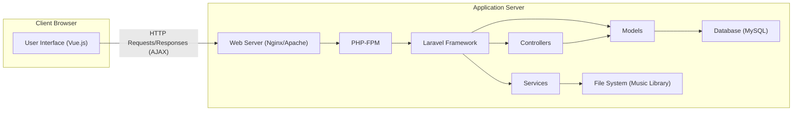
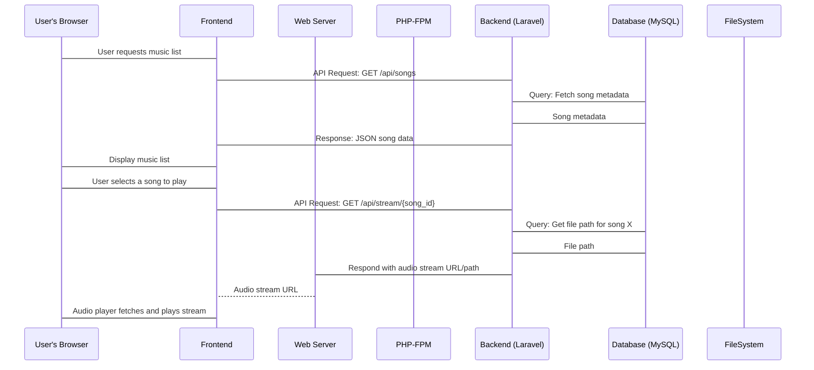

# Project Design Document: Koel - Personal Music Streaming Server

**Version:** 1.1
**Date:** October 26, 2023
**Author:** AI Software Architect

## 1. Introduction

This document provides an enhanced and detailed design overview of the Koel project, an open-source web-based personal audio streaming server. This document aims to clearly articulate the system's architecture, components, data flow, and key considerations, providing a robust foundation for future threat modeling activities. Improvements have been made to provide greater clarity and detail in several areas.

## 2. Goals and Objectives

*   Provide a self-hosted platform for users to stream their personal music collection.
*   Offer a user-friendly web interface for browsing and playing music.
*   Support common audio file formats (e.g., MP3, FLAC, AAC).
*   Enable comprehensive music management features including playlists, queue management, and potentially user libraries.
*   Maintain a lightweight and efficient design suitable for personal servers and resource-constrained environments.

## 3. System Architecture

Koel employs a well-defined three-tier architecture, promoting separation of concerns and maintainability:

*   **Presentation Tier (Frontend):**  The user interface, built with Vue.js, is responsible for rendering the application in the user's web browser, handling user interactions, and providing a dynamic and responsive experience.
*   **Application Tier (Backend):**  The core logic of the application, developed using the Laravel PHP framework, is responsible for processing user requests, managing data persistence, enforcing business rules, and interacting with both the data tier and the file system.
*   **Data Tier:**  Responsible for the persistent storage of application data. This primarily involves a MySQL database for structured data and the local file system for storing the actual audio files.

## 4. Key Components

*   **Frontend (Vue.js):**
    *   Renders the user interface using components, templates, and reactive data binding.
    *   Manages user interactions through event listeners and data updates.
    *   Handles client-side routing and navigation within the application.
    *   Communicates with the backend API using asynchronous JavaScript requests (AJAX).
    *   Implements UI logic for displaying music libraries, playlists, and playback controls.
*   **Backend (Laravel Framework - PHP):**
    *   Provides a robust foundation for building web applications with features like routing, middleware, and an ORM.
    *   Handles HTTP requests and responses, routing them to appropriate controllers.
    *   Implements authentication and authorization mechanisms to secure access to resources.
    *   Provides API endpoints for the frontend to interact with the application logic.
    *   Manages background tasks such as music library scanning and metadata updates (potentially using Laravel Queues).
*   **Web Server (Nginx/Apache):**
    *   Serves static assets (HTML, CSS, JavaScript, images) to the client browser.
    *   Acts as a reverse proxy, forwarding dynamic requests to the PHP-FPM process.
    *   Handles SSL/TLS termination, ensuring secure communication over HTTPS.
    *   Can be configured for performance optimizations like caching and compression.
*   **PHP-FPM (FastCGI Process Manager):**
    *   A highly performant PHP FastCGI implementation.
    *   Manages PHP processes, allowing the web server to efficiently handle PHP requests.
*   **Controllers (Laravel):**
    *   Receive incoming HTTP requests from the web server.
    *   Orchestrate the application logic by interacting with models and services.
    *   Prepare data for responses and return them to the client (typically in JSON format for API endpoints).
    *   Implement request validation to ensure data integrity.
*   **Models (Laravel - Eloquent ORM):**
    *   Represent database tables as PHP objects, providing an intuitive way to interact with data.
    *   Offer methods for querying, inserting, updating, and deleting data in the database.
    *   Define relationships between different database tables (e.g., a song belongs to an album and an artist).
*   **Services (Laravel):**
    *   Encapsulate specific business logic and complex operations, promoting code reusability and maintainability.
    *   Handle tasks such as:
        *   Scanning the music library for new files and metadata.
        *   Extracting metadata from audio files using libraries.
        *   Managing audio streaming and file access.
        *   Implementing playlist management logic.
*   **Database (MySQL):**
    *   A relational database management system used for persistent storage of structured data.
    *   Stores information about:
        *   Users (credentials, settings).
        *   Songs (title, artist, album, file path, metadata).
        *   Albums and Artists.
        *   Playlists (name, associated songs).
        *   Potentially other application settings and data.
*   **File System (Music Library):**
    *   The local file system directory where the user's music files are stored.
    *   The backend application requires read access to this directory to access and stream audio files.

## 5. Data Flow

Here's a more detailed breakdown of the data flow for key operations, highlighting the interaction between components:

*   **User Login:**
    *   User enters login credentials (username/password) in the frontend.
    *   Frontend sends an asynchronous HTTP POST request to the backend's `/api/login` endpoint.
    *   Web Server receives the request and forwards it to PHP-FPM.
    *   Laravel Router directs the request to the appropriate authentication controller.
    *   Controller validates the input and uses the authentication service to verify credentials against the user data in the database.
    *   If successful, the backend generates an authentication token (e.g., a JWT using Laravel Passport or Sanctum).
    *   Backend sends a JSON response containing the token back to the frontend.
    *   Frontend stores the token (e.g., in local storage or a cookie) and includes it in the `Authorization` header of subsequent API requests.
*   **Browsing Music:**
    *   User navigates to the music library view in the frontend.
    *   Frontend sends an asynchronous HTTP GET request to a backend API endpoint (e.g., `/api/songs`).
    *   Web Server and PHP-FPM handle the request, routing it to the appropriate controller.
    *   Controller uses Eloquent models to query the database for song metadata (title, artist, album, etc.).
    *   Database returns the requested metadata to the backend.
    *   Backend formats the data (usually as a JSON array) and sends it back to the frontend.
    *   Frontend receives the JSON data and dynamically renders the music list using Vue.js components.
*   **Playing Music:**
    *   User clicks the "play" button for a specific song in the frontend.
    *   Frontend sends an asynchronous HTTP GET request to a backend API endpoint to retrieve the streaming URL (e.g., `/api/stream/{song_id}`).
    *   Backend receives the request, retrieves the file path of the requested song from the database using the song ID.
    *   Backend generates a signed URL or uses a streaming service to provide secure access to the audio file. Alternatively, it might return the direct file path, relying on the web server's configuration to serve the file.
    *   Backend sends the audio stream URL back to the frontend.
    *   Frontend's audio player component uses the URL to fetch and play the audio stream directly from the web server (or a dedicated streaming endpoint).
*   **Adding Music to Library (Scanning):**
    *   User triggers a music library scan through the frontend UI, or a background process is scheduled.
    *   Frontend sends an asynchronous HTTP POST request to a backend API endpoint (e.g., `/api/scan`).
    *   Backend receives the request and initiates a background job or service to scan the configured music library directory.
    *   The scanning service iterates through the directory, identifying audio files.
    *   For each audio file, the service uses libraries (like `getID3`) to extract metadata.
    *   The service interacts with Eloquent models to store or update the metadata in the database.
    *   The backend may provide progress updates to the frontend via WebSockets or server-sent events.
*   **Creating a Playlist:**
    *   User interacts with the frontend to create a new playlist and add songs.
    *   Frontend sends an asynchronous HTTP POST request to a backend API endpoint (e.g., `/api/playlists`) with the playlist name.
    *   Backend creates a new playlist record in the database.
    *   Frontend sends subsequent asynchronous HTTP POST requests to add songs to the playlist (e.g., `/api/playlists/{playlist_id}/songs`).
    *   Backend updates the database to associate the selected songs with the playlist.

## 6. Security Considerations (Detailed for Threat Modeling)

This section expands on the initial security considerations, providing more specific examples of potential threats and areas to focus on during threat modeling.

*   **Authentication and Authorization:**
    *   **Threats:** Brute-force attacks on login, credential stuffing, insecure password storage, lack of proper session management, privilege escalation.
    *   **Considerations:**  Strength of password hashing algorithms (e.g., bcrypt), use of salting, implementation of rate limiting for login attempts, secure session management (e.g., HTTPOnly and Secure flags on cookies), role-based access control for different functionalities.
*   **Input Validation:**
    *   **Threats:** SQL injection, cross-site scripting (XSS), command injection, path traversal, file upload vulnerabilities.
    *   **Considerations:**  Server-side validation of all user inputs, use of parameterized queries or ORM features to prevent SQL injection, proper sanitization of user-generated content before rendering on the frontend to prevent XSS, validating file types and content during uploads, avoiding direct execution of user-provided data.
*   **Data Security:**
    *   **Threats:** Data breaches, unauthorized access to sensitive data, insecure storage of encryption keys.
    *   **Considerations:**  Enforcing HTTPS for all communication, encrypting sensitive data at rest (e.g., user passwords), securing database credentials, limiting access to the database server, regularly backing up data.
*   **File System Access:**
    *   **Threats:** Unauthorized access to music files, path traversal vulnerabilities allowing access to other parts of the file system.
    *   **Considerations:**  Restricting file system permissions for the web server and PHP processes, validating and sanitizing file paths before accessing files, potentially serving audio files through a controlled streaming mechanism rather than direct file access.
*   **Dependencies:**
    *   **Threats:** Exploiting known vulnerabilities in third-party libraries and frameworks.
    *   **Considerations:**  Regularly updating dependencies to the latest stable versions, using dependency scanning tools to identify vulnerabilities, being aware of security advisories for used libraries.
*   **Session Management:**
    *   **Threats:** Session hijacking, session fixation.
    *   **Considerations:**  Using secure session IDs, regenerating session IDs after login, setting appropriate session timeouts, using HTTPOnly and Secure flags on session cookies.
*   **Cross-Site Scripting (XSS):**
    *   **Threats:**  Malicious scripts injected into the application, potentially stealing user credentials or performing actions on behalf of the user.
    *   **Considerations:**  Properly escaping user-generated content before displaying it in HTML, using a Content Security Policy (CSP) to restrict the sources from which the browser can load resources.
*   **Cross-Site Request Forgery (CSRF):**
    *   **Threats:**  Unauthorized actions performed on behalf of an authenticated user.
    *   **Considerations:**  Implementing CSRF protection mechanisms (e.g., using synchronizer tokens or the SameSite cookie attribute).
*   **Denial of Service (DoS):**
    *   **Threats:**  Overwhelming the server with requests, making the application unavailable.
    *   **Considerations:**  Implementing rate limiting for API endpoints, protecting against resource exhaustion (e.g., large file uploads), using a CDN to distribute static assets.
*   **Information Disclosure:**
    *   **Threats:**  Exposing sensitive information through error messages, API responses, or debugging logs.
    *   **Considerations:**  Disabling detailed error messages in production environments, carefully reviewing API responses to avoid leaking sensitive data, securing logging mechanisms.

## 7. Deployment Model

Koel is designed for self-hosting, placing the responsibility for infrastructure security and maintenance on the user. Key responsibilities include:

*   **Infrastructure Provisioning:** Setting up and maintaining the server hardware or virtual machine.
*   **Operating System Security:**  Securing the underlying operating system, including patching vulnerabilities and configuring firewalls.
*   **Web Server Configuration:**  Properly configuring Nginx or Apache, including setting up HTTPS, configuring virtual hosts, and securing access.
*   **PHP Configuration:**  Securing the PHP environment, disabling unnecessary functions, and configuring appropriate resource limits.
*   **Database Security:**  Securing the MySQL database, including setting strong passwords, limiting access, and regularly backing up data.
*   **Network Security:**  Configuring firewalls and network access controls to restrict access to the server.
*   **Application Updates:**  Regularly updating Koel and its dependencies to patch security vulnerabilities.
*   **Monitoring and Logging:**  Implementing monitoring and logging to detect and respond to security incidents.

## 8. Technologies Used

*   **Frontend:**
    *   Vue.js (JavaScript framework for building user interfaces)
    *   JavaScript (programming language for frontend logic)
    *   HTML (markup language for structuring web content)
    *   CSS (stylesheet language for styling web content)
*   **Backend:**
    *   PHP (server-side scripting language)
    *   Laravel Framework (PHP framework for web application development)
    *   Composer (dependency management for PHP)
*   **Database:**
    *   MySQL (relational database management system)
*   **Web Server (Typical):**
    *   Nginx (high-performance web server and reverse proxy)
    *   Apache HTTP Server (widely used web server)
*   **Other Libraries/Tools (Examples):**
    *   `getID3` (PHP library for extracting metadata from audio files)
    *   Potentially other PHP libraries for image manipulation, audio processing, etc.

## 9. Future Considerations

*   **Enhanced User Management:** Implementing more robust user management features, including user roles, permissions, and potentially multi-user support.
*   **Advanced Search Functionality:**  Improving search capabilities with features like fuzzy search and filtering by metadata.
*   **Integration with External Services:** Exploring integrations with music information databases (e.g., MusicBrainz, Discogs) for richer metadata and artwork.
*   **Mobile Applications:**  Developing native mobile applications (iOS and Android) to provide a dedicated mobile experience.
*   **Podcast Support:**  Adding support for managing and playing podcasts.
*   **API Enhancements:**  Expanding the API to support more advanced features and integrations.

This enhanced design document provides a more detailed and comprehensive overview of the Koel project. It serves as a valuable resource for understanding the system's architecture, components, and data flow, and provides a strong foundation for conducting thorough and effective threat modeling.