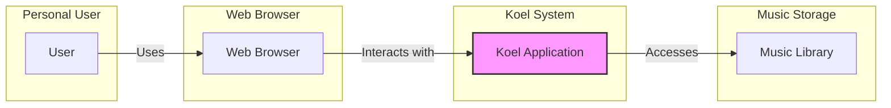

# BUSINESS POSTURE

The Koel project aims to provide a personal music streaming server, allowing users to host and stream their own music library.

- Business Priorities and Goals:
  - Provide a user-friendly and intuitive interface for music streaming.
  - Enable users to access their personal music library from anywhere with internet access.
  - Offer a self-hosted alternative to commercial music streaming services, giving users control over their data and music.
  - Ensure reliable and performant music streaming.

- Most Important Business Risks:
  - Data breaches exposing user credentials and potentially music library metadata.
  - Service unavailability due to technical issues or security incidents.
  - Copyright infringement if users are not properly managing their music library and sharing practices.
  - Performance issues impacting user experience and adoption.

# SECURITY POSTURE

- Existing Security Controls:
  - security control User authentication is implemented to protect access to the music library and settings. (Likely implemented using username/password and session management, details need to be verified in the repository).
  - security control Authorization mechanisms are in place to control user access to different features and data. (Likely role-based access control, details need to be verified in the repository).
  - security control Input validation is expected to be implemented to prevent common web application vulnerabilities such as Cross-Site Scripting (XSS) and SQL Injection. (Details need to be verified in the repository).
  - security control Secure password storage is expected to be implemented using hashing and salting. (Details need to be verified in the repository).

- Accepted Risks:
  - accepted risk Vulnerabilities in third-party dependencies used by the project.
  - accepted risk Potential misconfigurations during deployment by end-users.
  - accepted risk Lack of formal security audits and penetration testing.

- Recommended Security Controls:
  - security control Implement automated dependency scanning to identify and address vulnerabilities in third-party libraries.
  - security control Introduce rate limiting to prevent brute-force attacks and denial-of-service attempts.
  - security control Enforce secure defaults for deployment configurations and provide security hardening guidelines for users.
  - security control Implement regular security testing, including static and dynamic analysis, and consider penetration testing.
  - security control Implement Content Security Policy (CSP) to mitigate XSS attacks.
  - security control Implement HTTP Strict Transport Security (HSTS) to enforce secure connections.

- Security Requirements:
  - Authentication:
    - Requirement Securely authenticate users accessing the Koel web interface.
    - Requirement Support strong password policies and encourage users to choose strong passwords.
    - Requirement Consider implementing multi-factor authentication (MFA) for enhanced security.
  - Authorization:
    - Requirement Implement role-based access control to manage user permissions.
    - Requirement Ensure that users can only access and modify resources they are authorized to.
  - Input Validation:
    - Requirement Validate all user inputs to prevent injection attacks (e.g., SQL injection, XSS, command injection).
    - Requirement Sanitize user inputs before displaying them in the web interface.
  - Cryptography:
    - Requirement Securely store user passwords using strong hashing algorithms and salts.
    - Requirement Use HTTPS to encrypt all communication between the user's browser and the Koel server.
    - Requirement Consider encrypting sensitive data at rest, such as API keys or configuration settings.

# DESIGN

## C4 CONTEXT



- Context Diagram Elements:
  - - Name: User
    - Type: Person
    - Description: An individual who wants to stream their personal music library.
    - Responsibilities: Manages their music library, uses a web browser to access and stream music through Koel.
    - Security controls: Manages their own device security, chooses strong passwords for Koel account.
  - - Name: Web Browser
    - Type: Software System
    - Description: A web browser used by the user to interact with the Koel web application.
    - Responsibilities: Rendering the Koel web interface, sending requests to the Koel application, playing streamed music.
    - Security controls: Browser security features (e.g., sandboxing, content security policy enforcement), user-managed browser extensions and security settings.
  - - Name: Koel Application
    - Type: Software System
    - Description: The Koel music streaming server application, responsible for managing music library metadata, streaming music, and user authentication.
    - Responsibilities: Authenticating users, managing music library metadata, serving the web interface, streaming music files, handling user requests.
    - Security controls: Authentication, authorization, input validation, secure session management, HTTPS encryption, logging and monitoring.
  - - Name: Music Library
    - Type: Data Store
    - Description: The storage location for the user's music files. This could be a local file system, network attached storage, or cloud storage.
    - Responsibilities: Storing music files, providing access to music files for the Koel application.
    - Security controls: File system permissions, access control lists, encryption at rest (depending on storage solution), physical security of storage location.

## C4 CONTAINER

```mermaid
flowchart LR
    subgraph "Koel Application"
        subgraph "Web Server Container"
            WS[Web Server]
            FE[Frontend Application]
            BE[Backend API]
        end
        subgraph "Database Container"
            DB[Database]
        end
        subgraph "Music Storage Container"
            MS[Music Storage]
        end
        WB[Web Browser] --> WS
        WS --> FE
        WS --> BE
        BE --> DB
        BE --> MS
    end
    style "Koel Application" fill:#f9f,stroke:#333,stroke-width:2px
```

- Container Diagram Elements:
  - - Name: Web Browser
    - Type: Client Application
    - Description: User's web browser, used to access the Koel web interface.
    - Responsibilities: Rendering UI, interacting with the Web Server.
    - Security controls: Browser security features.
  - - Name: Web Server
    - Type: Web Server
    - Description: Handles HTTP requests, serves static files (Frontend Application), and proxies requests to the Backend API. (Likely Nginx or Apache).
    - Responsibilities: HTTP request handling, static file serving, reverse proxy, TLS termination.
    - Security controls: HTTPS configuration, access logging, rate limiting, web server hardening.
  - - Name: Frontend Application
    - Type: Web Application
    - Description: The client-side application built with JavaScript frameworks (likely Vue.js based on repository). Provides the user interface for Koel.
    - Responsibilities: User interface rendering, handling user interactions, communicating with the Backend API.
    - Security controls: Input validation on the client-side, Content Security Policy (CSP), protection against client-side vulnerabilities.
  - - Name: Backend API
    - Type: Web Application
    - Description: The server-side application built with PHP (Laravel framework based on repository). Handles business logic, data access, and API endpoints.
    - Responsibilities: User authentication and authorization, music library management, streaming logic, API endpoint implementation, data validation, interaction with the Database and Music Storage.
    - Security controls: Authentication, authorization, input validation, secure coding practices, protection against server-side vulnerabilities, database access control, logging and monitoring.
  - - Name: Database
    - Type: Database
    - Description: Stores application data, including user accounts, music metadata, playlists, and settings. (Likely MySQL or PostgreSQL).
    - Responsibilities: Data persistence, data retrieval, data integrity.
    - Security controls: Database access control, encryption at rest (if configured), regular backups, database hardening, protection against SQL injection.
  - - Name: Music Storage
    - Type: File System
    - Description: Stores the actual music files. Can be local storage, network storage, or cloud storage.
    - Responsibilities: Music file storage, providing access to music files for the Backend API.
    - Security controls: File system permissions, access control lists, encryption at rest (depending on storage solution), physical security of storage location.

## DEPLOYMENT

Deployment options for Koel can vary. Common scenarios include:

1.  **Local Machine Deployment:** Running Koel directly on a personal computer for local access.
2.  **Virtual Private Server (VPS) Deployment:** Deploying Koel on a VPS for wider internet accessibility.
3.  **Containerized Deployment (Docker):** Using Docker to containerize Koel and deploy it on various platforms, including cloud providers or personal servers.

We will focus on **Containerized Deployment (Docker)** as it is a common and flexible approach.

```mermaid
flowchart LR
    subgraph "Deployment Environment"
        subgraph "Server"
            OS[Operating System]
            Docker[Docker Engine]
            subgraph "Koel Containers"
                WC[Web Server Container]
                BC[Backend API Container]
                DBC[Database Container]
            end
        end
        subgraph "Music Storage"
            MSD[Music Storage Directory]
        end
        Internet[Internet] --> WC
        WC -- Runs on --> Docker
        BC -- Runs on --> Docker
        DBC -- Runs on --> Docker
        Docker -- Runs on --> OS
        BC --> DBC
        BC --> MSD
    end
    style "Deployment Environment" fill:#f9f,stroke:#333,stroke-width:2px
```

- Deployment Diagram Elements:
  - - Name: Internet
    - Type: Network
    - Description: The public internet, allowing users to access the Koel application from anywhere.
    - Responsibilities: Network connectivity.
    - Security controls: Firewall at the server level, network security best practices.
  - - Name: Server
    - Type: Physical or Virtual Server
    - Description: A server (physical or virtual) hosting the Koel application.
    - Responsibilities: Providing computing resources, running the operating system and Docker engine.
    - Security controls: Server hardening, operating system security updates, physical security of the server (if applicable).
  - - Name: Operating System
    - Type: Operating System
    - Description: The operating system running on the server (e.g., Linux).
    - Responsibilities: Managing system resources, providing a platform for Docker.
    - Security controls: OS security hardening, regular security updates, access control.
  - - Name: Docker Engine
    - Type: Container Runtime
    - Description: The Docker engine responsible for running and managing Koel containers.
    - Responsibilities: Container orchestration, resource management, container isolation.
    - Security controls: Docker security best practices, container image security scanning, resource limits for containers.
  - - Name: Web Server Container
    - Type: Docker Container
    - Description: Docker container running the Web Server (Nginx/Apache) and Frontend Application.
    - Responsibilities: Serving the web interface, handling HTTP requests.
    - Security controls: Container image security, minimal container image, web server security configuration.
  - - Name: Backend API Container
    - Type: Docker Container
    - Description: Docker container running the Backend API (PHP/Laravel).
    - Responsibilities: Business logic, API endpoints, data access.
    - Security controls: Container image security, minimal container image, application security best practices.
  - - Name: Database Container
    - Type: Docker Container
    - Description: Docker container running the Database (MySQL/PostgreSQL).
    - Responsibilities: Data persistence.
    - Security controls: Container image security, database security configuration, database access control.
  - - Name: Music Storage Directory
    - Type: File System Directory
    - Description: Directory on the server's file system mounted as a volume to the Backend API container, containing the music library.
    - Responsibilities: Persistent storage for music files.
    - Security controls: File system permissions, access control, volume security.

## BUILD

```mermaid
flowchart LR
    subgraph "Developer Workstation"
        Developer[Developer]
        CodeRepo[Code Repository (GitHub)]
    end
    subgraph "CI/CD Pipeline (GitHub Actions)"
        VC[Version Control Checkout]
        Build[Build Application]
        Test[Run Tests]
        SAST[Static Analysis Security Testing]
        DAST[Dynamic Analysis Security Testing]
        ImageBuild[Build Docker Image]
        ImageScan[Container Image Scan]
        Publish[Publish Docker Image]
    end
    Developer --> CodeRepo
    CodeRepo --> VC
    VC --> Build
    Build --> Test
    Test --> SAST
    SAST --> DAST
    DAST --> ImageBuild
    ImageBuild --> ImageScan
    ImageScan --> Publish
    Publish --> ContainerRegistry[Container Registry (Docker Hub/GHCR)]
    style "CI/CD Pipeline (GitHub Actions)" fill:#f9f,stroke:#333,stroke-width:2px
```

- Build Process Elements:
  - - Name: Developer
    - Type: Person
    - Description: Software developer contributing to the Koel project.
    - Responsibilities: Writing code, committing code to the repository, performing local testing.
    - Security controls: Secure development practices, code review, workstation security.
  - - Name: Code Repository (GitHub)
    - Type: Version Control System
    - Description: GitHub repository hosting the Koel source code.
    - Responsibilities: Source code management, version control, collaboration platform.
    - Security controls: Access control, branch protection, audit logs, vulnerability scanning (GitHub Dependabot).
  - - Name: Version Control Checkout
    - Type: CI/CD Step
    - Description: Step in the CI/CD pipeline that checks out the source code from the repository.
    - Responsibilities: Retrieving the latest code version.
    - Security controls: Access control to the repository, secure checkout process.
  - - Name: Build Application
    - Type: CI/CD Step
    - Description: Step that compiles the application code and prepares build artifacts. (e.g., using `npm install`, `composer install`, `npm run build`).
    - Responsibilities: Compiling code, generating build artifacts.
    - Security controls: Dependency management, build environment security, secure build scripts.
  - - Name: Run Tests
    - Type: CI/CD Step
    - Description: Step that executes automated tests (unit tests, integration tests).
    - Responsibilities: Verifying code functionality and quality.
    - Security controls: Test environment security, secure test data, test coverage.
  - - Name: Static Analysis Security Testing (SAST)
    - Type: CI/CD Step
    - Description: Step that performs static code analysis to identify potential security vulnerabilities in the source code. (e.g., using tools like SonarQube, linters with security rules).
    - Responsibilities: Identifying potential code-level vulnerabilities.
    - Security controls: SAST tool configuration, vulnerability reporting and remediation process.
  - - Name: Dynamic Analysis Security Testing (DAST)
    - Type: CI/CD Step
    - Description: Step that performs dynamic application security testing by simulating attacks against a running application. (e.g., using tools like OWASP ZAP, Burp Suite).
    - Responsibilities: Identifying runtime vulnerabilities.
    - Security controls: DAST tool configuration, secure test environment, vulnerability reporting and remediation process.
  - - Name: Build Docker Image
    - Type: CI/CD Step
    - Description: Step that builds the Docker image for the Koel application.
    - Responsibilities: Creating container images.
    - Security controls: Base image selection, minimal image design, secure Dockerfile practices.
  - - Name: Container Image Scan
    - Type: CI/CD Step
    - Description: Step that scans the Docker image for known vulnerabilities. (e.g., using tools like Trivy, Clair).
    - Responsibilities: Identifying vulnerabilities in container images.
    - Security controls: Image scanning tool configuration, vulnerability reporting and remediation process.
  - - Name: Publish Docker Image
    - Type: CI/CD Step
    - Description: Step that publishes the built Docker image to a container registry.
    - Responsibilities: Making container images available for deployment.
    - Security controls: Secure registry access, image signing and verification.
  - - Name: Container Registry (Docker Hub/GHCR)
    - Type: Artifact Repository
    - Description: Container registry (e.g., Docker Hub, GitHub Container Registry) storing Docker images.
    - Responsibilities: Storing and distributing container images.
    - Security controls: Access control, vulnerability scanning, image signing and verification.

# RISK ASSESSMENT

- Critical Business Processes:
  - Music Streaming: Providing users with the ability to stream their music library. Disruption would impact user experience and the core functionality of Koel.
  - User Authentication and Authorization: Ensuring only authorized users can access and manage their music library. Failure could lead to unauthorized access and data breaches.
  - Music Library Management: Allowing users to manage their music library metadata and organization. Data loss or corruption would impact user experience.

- Data to Protect and Sensitivity:
  - User Credentials (usernames, passwords, potentially API keys): Highly sensitive. Compromise could lead to unauthorized access to user accounts and data.
  - Music Library Metadata (song titles, artists, albums, playlists): Sensitive. Personal data that users would expect to be kept private and secure.
  - User Preferences and Settings: Moderately sensitive. User-specific configurations that enhance user experience.
  - Music Files: Sensitivity depends on the user and the nature of their music library. Copyrighted material might have legal implications if exposed.

# QUESTIONS & ASSUMPTIONS

- Questions:
  - What is the intended scale of deployment (number of users, music library size)?
  - What are the specific data storage requirements and constraints?
  - Are there any specific compliance requirements (e.g., GDPR, CCPA) to consider?
  - What is the expected level of technical expertise of the users deploying and managing Koel?
  - Are there any plans for future integrations with external services (e.g., music APIs, cloud storage)?

- Assumptions:
  - BUSINESS POSTURE:
    - Koel is primarily intended for personal use or small groups of users.
    - The primary goal is to provide a functional and user-friendly music streaming experience.
    - Data privacy and security are important but not necessarily under strict regulatory compliance.
  - SECURITY POSTURE:
    - Basic security controls are in place, but there is room for improvement.
    - Security is a concern, but the project may not have dedicated security resources.
    - Users are expected to have some level of technical understanding for deployment and security configuration.
  - DESIGN:
    - The architecture is relatively simple and based on common web application patterns.
    - Containerization (Docker) is a preferred deployment method for flexibility and ease of management.
    - The build process can be enhanced with more robust security checks and automation.