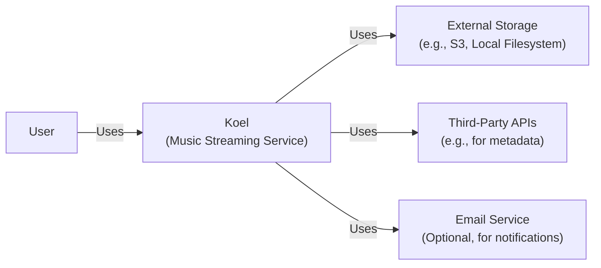
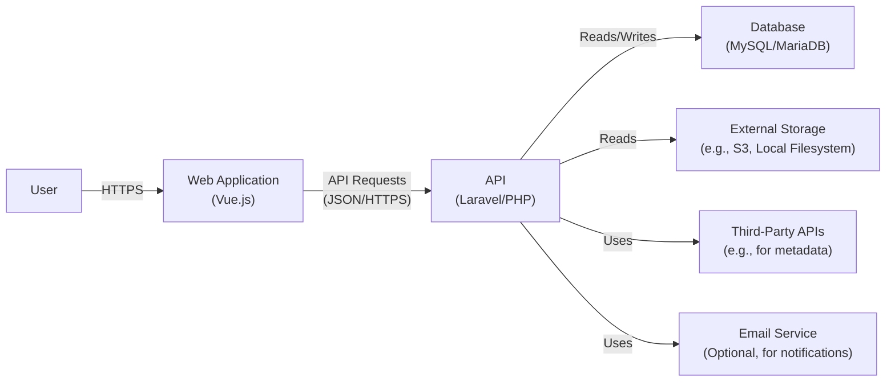
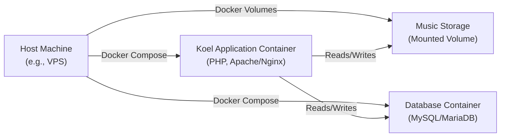
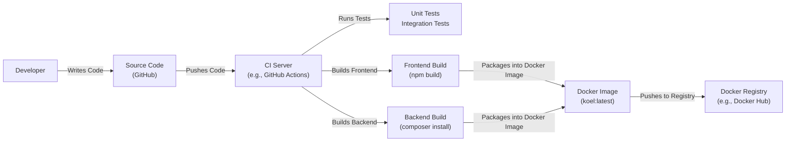

# BUSINESS POSTURE

Koel is a personal music streaming service. Based on the provided GitHub repository, the following business priorities and goals can be inferred:

*   Provide a user-friendly and functional web application for personal music streaming.
*   Allow users to manage and organize their own music collections.
*   Offer a customizable and visually appealing user interface.
*   Support various audio formats.
*   Ensure data privacy and security for user-uploaded content.
*   Provide an alternative to commercial music streaming services.
*   Enable self-hosting and deployment on personal servers.

Most important business risks that need to be addressed:

*   Unauthorized access to user accounts and private music collections.
*   Data breaches and loss of user-uploaded content.
*   Service downtime and unavailability.
*   Copyright infringement issues related to user-uploaded content.
*   Vulnerabilities in the application that could be exploited by attackers.
*   Compromise of the server hosting the application.
*   Supply chain attacks through compromised dependencies.

# SECURITY POSTURE

Existing security controls (inferred from the repository):

*   security control: Authentication via username/password, JWT (JSON Web Tokens), and potentially social logins (implied by Laravel framework capabilities). Described in application code and configuration.
*   security control: Authorization mechanisms to restrict access to user-specific data and functionalities. Implemented in application logic.
*   security control: Use of a web application framework (Laravel) that provides built-in security features like CSRF protection, XSS prevention, and secure session management. Described in framework documentation and implemented in application code.
*   security control: Database encryption (potentially, depending on configuration). Described in database configuration.
*   security control: Input validation to prevent common web vulnerabilities. Implemented in application logic.
*   security control: Dependency management using Composer, which allows for tracking and updating dependencies. Described in `composer.json` and `composer.lock` files.

Accepted risks:

*   accepted risk: The application's security heavily relies on the security of the underlying server infrastructure and its configuration.
*   accepted risk: Users are responsible for managing the security of their own credentials.
*   accepted risk: The application's security depends on the maintainers of the project and its dependencies promptly addressing security vulnerabilities.
*   accepted risk: The application may be vulnerable to zero-day exploits in the underlying technologies (PHP, Laravel, Vue.js, etc.).

Recommended security controls:

*   Implement multi-factor authentication (MFA) for user accounts.
*   Implement regular security audits and penetration testing.
*   Implement robust logging and monitoring to detect and respond to security incidents.
*   Implement a Content Security Policy (CSP) to mitigate XSS attacks.
*   Implement Subresource Integrity (SRI) to ensure that fetched resources haven't been tampered with.
*   Implement a robust vulnerability management program, including automated dependency scanning and updates.
*   Implement a secure software development lifecycle (SSDLC) with security checks at each stage.

Security Requirements:

*   Authentication:
    *   The system MUST provide a secure authentication mechanism for users.
    *   The system SHOULD support multi-factor authentication.
    *   The system MUST securely store user credentials (e.g., using strong hashing algorithms).
    *   The system MUST protect against brute-force attacks.
*   Authorization:
    *   The system MUST implement role-based access control (RBAC) to restrict access to resources based on user roles.
    *   The system MUST ensure that users can only access their own data and functionalities.
*   Input Validation:
    *   The system MUST validate all user inputs to prevent common web vulnerabilities (e.g., XSS, SQL injection, command injection).
    *   The system MUST use a whitelist approach for input validation whenever possible.
*   Cryptography:
    *   The system MUST use strong encryption algorithms to protect sensitive data at rest and in transit.
    *   The system MUST securely manage cryptographic keys.
    *   The system SHOULD use HTTPS for all communication.
*   Session Management:
    *   The system MUST use secure session management techniques to prevent session hijacking and fixation.
    *   Session identifiers MUST be randomly generated and sufficiently long.
    *   Sessions MUST expire after a period of inactivity.

# DESIGN

## C4 CONTEXT

Element descriptions:

*   Element:
    *   Name: User
    *   Type: Person
    *   Description: A person who wants to listen to their music.
    *   Responsibilities: Upload music, create playlists, manage their account, listen to music.
    *   Security controls: Authentication, authorization, password management.

*   Element:
    *   Name: Koel (Music Streaming Service)
    *   Type: Software System
    *   Description: The Koel application, providing the music streaming service.
    *   Responsibilities: Manage user accounts, store music metadata, serve music files, provide a user interface.
    *   Security controls: Input validation, output encoding, session management, authentication, authorization, data validation, error handling.

*   Element:
    *   Name: External Storage (e.g., S3, Local Filesystem)
    *   Type: Software System
    *   Description: Storage location for the actual music files.
    *   Responsibilities: Store and retrieve music files.
    *   Security controls: Access control, encryption at rest, encryption in transit.

*   Element:
    *   Name: Third-Party APIs (e.g., for metadata)
    *   Type: Software System
    *   Description: External APIs used for fetching music metadata (e.g., album art, artist information).
    *   Responsibilities: Provide music metadata.
    *   Security controls: API keys, rate limiting, input validation.

*   Element:
    *   Name: Email Service (Optional, for notifications)
    *   Type: Software System
    *   Description: An external service used for sending email notifications (e.g., password reset).
    *   Responsibilities: Send emails.
    *   Security controls: API keys, secure communication.

## C4 CONTAINER

Element descriptions:

*   Element:
    *   Name: User
    *   Type: Person
    *   Description: A person who wants to listen to their music.
    *   Responsibilities: Upload music, create playlists, manage their account, listen to music.
    *   Security controls: Authentication, authorization, password management.

*   Element:
    *   Name: Web Application (Vue.js)
    *   Type: Web Application
    *   Description: The front-end application running in the user's browser.
    *   Responsibilities: Render the user interface, handle user interactions, communicate with the API.
    *   Security controls: Input validation, output encoding, session management.

*   Element:
    *   Name: API (Laravel/PHP)
    *   Type: Web Application
    *   Description: The back-end API that handles requests from the web application.
    *   Responsibilities: Authenticate users, manage music metadata, serve music files, interact with the database and external storage.
    *   Security controls: Authentication, authorization, input validation, data validation, error handling, session management.

*   Element:
    *   Name: Database (MySQL/MariaDB)
    *   Type: Database
    *   Description: Stores user data, music metadata, and playlists.
    *   Responsibilities: Store and retrieve data.
    *   Security controls: Access control, encryption at rest, input validation (via ORM/query builder).

*   Element:
    *   Name: External Storage (e.g., S3, Local Filesystem)
    *   Type: Software System
    *   Description: Storage location for the actual music files.
    *   Responsibilities: Store and retrieve music files.
    *   Security controls: Access control, encryption at rest, encryption in transit.

*   Element:
    *   Name: Third-Party APIs (e.g., for metadata)
    *   Type: Software System
    *   Description: External APIs used for fetching music metadata (e.g., album art, artist information).
    *   Responsibilities: Provide music metadata.
    *   Security controls: API keys, rate limiting, input validation.

*   Element:
    *   Name: Email Service (Optional, for notifications)
    *   Type: Software System
    *   Description: An external service used for sending email notifications (e.g., password reset).
    *   Responsibilities: Send emails.
    *   Security controls: API keys, secure communication.

## DEPLOYMENT

Possible deployment solutions:

1.  Traditional LAMP stack on a single server.
2.  Dockerized deployment using Docker Compose.
3.  Kubernetes deployment.
4.  Cloud-based deployment using services like AWS Elastic Beanstalk, Google App Engine, or Azure App Service.

Chosen solution for detailed description: Dockerized deployment using Docker Compose. This is a common and relatively straightforward approach for self-hosting applications like Koel.

Element descriptions:

*   Element:
    *   Name: Host Machine (e.g., VPS)
    *   Type: Server
    *   Description: The physical or virtual server hosting the Docker containers.
    *   Responsibilities: Run the Docker engine and host the application containers.
    *   Security controls: Firewall, SSH access control, OS hardening, regular security updates.

*   Element:
    *   Name: Koel Application Container (PHP, Apache/Nginx)
    *   Type: Docker Container
    *   Description: Contains the Koel application code, PHP runtime, and a web server (Apache or Nginx).
    *   Responsibilities: Serve the Koel web application and API.
    *   Security controls: Container isolation, limited privileges, regular image updates.

*   Element:
    *   Name: Database Container (MySQL/MariaDB)
    *   Type: Docker Container
    *   Description: Contains the MySQL or MariaDB database server.
    *   Responsibilities: Store and manage the Koel database.
    *   Security controls: Container isolation, limited privileges, strong database password, regular image updates.

*   Element:
    *   Name: Music Storage (Mounted Volume)
    *   Type: Docker Volume
    *   Description: A persistent volume mounted into the Koel application container to store the music files.
    *   Responsibilities: Persistently store music files.
    *   Security controls: Access control to the host directory, regular backups.

## BUILD

The build process for Koel involves several steps, from development to the creation of deployable artifacts (in this case, Docker images).

Build process description:

1.  Developer writes code and pushes it to the GitHub repository.
2.  A CI server (e.g., GitHub Actions, Travis CI, Jenkins) is triggered by the push.
3.  The CI server runs unit and integration tests.
4.  The CI server builds the frontend using `npm build`.
5.  The CI server builds the backend using `composer install --no-dev --optimize-autoloader`.
6.  The CI server packages the frontend and backend builds into a Docker image.
7.  The CI server pushes the Docker image to a Docker registry (e.g., Docker Hub, a private registry).

Security controls in the build process:

*   security control: Code review before merging changes into the main branch.
*   security control: Automated testing (unit and integration tests) to catch bugs and vulnerabilities early.
*   security control: Dependency management using Composer to track and update dependencies.
*   security control: Static analysis security testing (SAST) tools (e.g., PHPStan, Psalm) can be integrated into the CI pipeline to identify potential security vulnerabilities in the code.
*   security control: Software Composition Analysis (SCA) tools to scan for known vulnerabilities in dependencies.
*   security control: Using a minimal base Docker image to reduce the attack surface.
*   security control: Building the Docker image with a non-root user.
*   security control: Signing Docker images to ensure their integrity.

# RISK ASSESSMENT

*   Critical business processes we are trying to protect:
    *   User authentication and authorization.
    *   Music streaming and playback.
    *   User data management (playlists, settings, etc.).
    *   Music file storage and retrieval.

*   Data we are trying to protect and their sensitivity:
    *   User credentials (passwords): Highly sensitive.
    *   User email addresses: Personally Identifiable Information (PII), moderately sensitive.
    *   User playlists and listening history: Moderately sensitive, could reveal personal preferences.
    *   Music files (uploaded by users): Sensitivity varies depending on the content; could be copyrighted material.
    *   Application logs: Potentially sensitive, could contain information about user activity or system vulnerabilities.

# QUESTIONS & ASSUMPTIONS

Questions:

*   What specific third-party APIs are used for metadata fetching, and what are their security implications?
*   What is the expected user base and traffic volume? This will influence scalability and performance requirements.
*   What are the specific legal and compliance requirements related to user-uploaded content (e.g., copyright, DMCA)?
*   What is the backup and disaster recovery plan for the application and data?
*   Are there any existing security policies or guidelines that need to be followed?
*   What is the process for handling security incidents and vulnerabilities?
*   What is the budget for security tools and services?

Assumptions:

*   BUSINESS POSTURE: The primary goal is to provide a functional and secure personal music streaming service for individual users or small groups. The risk appetite is relatively low, as data breaches or service disruptions could significantly impact user trust and the project's reputation.
*   SECURITY POSTURE: The project relies on the security features of the chosen frameworks (Laravel and Vue.js) and best practices for secure coding. It is assumed that the server infrastructure will be properly secured and maintained.
*   DESIGN: The application will be deployed using Docker Compose for ease of deployment and management. The music files will be stored on a persistent volume mounted to the application container. The database will be a separate container.