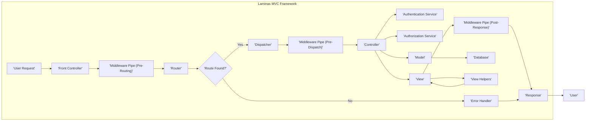

# Project Design Document: Laminas MVC Framework - Enhanced for Threat Modeling

**Version:** 1.1
**Date:** October 26, 2023
**Author:** AI Software Architect

## 1. Introduction

This document provides an enhanced architectural design of the Laminas MVC framework (as represented by the repository: https://github.com/laminas/laminas-mvc). This revised document is specifically tailored to facilitate comprehensive threat modeling activities. It offers a deeper understanding of the framework's internal workings, component interactions, and data flow, with a strong emphasis on security-relevant aspects. The intended audience includes security engineers, developers, penetration testers, and anyone involved in assessing and securing applications built using the Laminas MVC framework.

## 2. Project Overview

Laminas MVC is a mature and highly configurable Model-View-Controller (MVC) framework for developing robust web applications in PHP. It promotes best practices through separation of concerns, code reusability, and testability. The framework handles the complexities of web request processing, routing, and response generation, allowing developers to concentrate on implementing core application logic and features. Its modular design and extensive event system provide significant flexibility and extensibility.

## 3. Architectural Design

The architecture of Laminas MVC is centered around the classic MVC pattern, augmented by several key components that contribute to its flexibility and power.

### 3.1. Key Components (Detailed)

*   **Front Controller (`Laminas\Mvc\Application`):** The singular entry point for all HTTP requests. It bootstraps the application, initializes the service manager, and orchestrates the entire request handling lifecycle. *Security Relevance:* As the entry point, it's a critical point for security checks and initial request filtering.
*   **Router (`Laminas\Router\Http\TreeRouteStack` or similar):** Responsible for mapping incoming HTTP requests to specific controller actions based on a defined set of routes (URL patterns). *Security Relevance:* Incorrectly configured routes can lead to unauthorized access or denial-of-service vulnerabilities. Route constraints and parameter validation are crucial.
*   **Dispatcher (`Laminas\Mvc\DispatchListener` and `Laminas\Mvc\Controller\AbstractController`):** Takes the routed request information (controller and action) and instantiates the appropriate controller class, then executes the specified action method. *Security Relevance:* The dispatcher ensures that only authorized controllers and actions are executed. Vulnerabilities in the dispatching process could allow arbitrary code execution.
*   **Controllers (`Laminas\Mvc\Controller\AbstractActionController`):** Handle specific business logic related to a particular set of requests. They interact with models to retrieve or manipulate data and prepare data for rendering by the view. *Security Relevance:* Controllers are prime locations for input validation, authorization checks, and preventing business logic flaws.
*   **Models (User-defined classes):** Represent the application's data structures and business logic. They typically encapsulate interactions with data sources (databases, APIs, etc.). *Security Relevance:* Models are responsible for data integrity and should implement secure data access patterns to prevent SQL injection or other data manipulation attacks.
*   **Views (`Laminas\View\Renderer\PhpRenderer` or similar):** Responsible for rendering the user interface. They use template files (e.g., PHP, PHTML) to display data provided by the controller. *Security Relevance:* Views must implement proper output encoding to prevent cross-site scripting (XSS) vulnerabilities.
*   **View Helpers (`Laminas\View\HelperPluginManager`):** Reusable components that assist in rendering views, such as formatting data, generating URLs, or including other view scripts. *Security Relevance:* Vulnerabilities in view helpers can lead to XSS or other injection attacks.
*   **Event Manager (`Laminas\EventManager\EventManager`):** A central hub for decoupling components. It allows components to subscribe to and trigger events throughout the request lifecycle, enabling extensibility and customization. *Security Relevance:* Improperly secured event listeners could be exploited to inject malicious code or bypass security checks.
*   **Module Manager (`Laminas\ModuleManager\ModuleManager`):** Manages the loading and initialization of application modules, allowing for organized and reusable code. *Security Relevance:*  Module vulnerabilities can impact the entire application. Secure module loading and isolation are important.
*   **Service Manager (`Laminas\ServiceManager\ServiceManager`):** A powerful dependency injection container responsible for managing the instantiation and dependencies of application services and components. *Security Relevance:*  Misconfigured service managers can lead to insecure instantiation of objects or exposure of sensitive information.
*   **Configuration (`Laminas\Config\Factory` and related components):** Handles application configuration, typically loaded from files (e.g., PHP, INI, YAML) or environment variables. *Security Relevance:*  Configuration files often contain sensitive information (database credentials, API keys) and must be protected from unauthorized access.
*   **Input Filter (`Laminas\InputFilter\InputFilter`):** Provides a robust mechanism for validating and sanitizing user input before it's processed by the application. *Security Relevance:*  Essential for preventing injection attacks and ensuring data integrity.
*   **Hydrator (`Laminas\Hydrator\ObjectPropertyHydrator` or similar):** Facilitates the transfer of data between objects and arrays, commonly used with forms and database interactions. *Security Relevance:*  Improperly configured hydrators could lead to data corruption or unintended data exposure.
*   **Authentication (`Laminas\Authentication\AuthenticationService`):** Components for verifying user identity. *Security Relevance:*  A fundamental security aspect. Weak authentication mechanisms can lead to unauthorized access.
*   **Authorization (`Laminas\Permissions\Acl\Acl` or similar):** Components for controlling user access to resources and actions. *Security Relevance:*  Ensures that users can only access the parts of the application they are permitted to use.
*   **Middleware (`Laminas\Stratigility\MiddlewarePipe`):** Allows for intercepting and processing requests and responses at various stages of the lifecycle, enabling cross-cutting concerns like logging, authentication, and security headers. *Security Relevance:*  Middleware is a powerful tool for implementing security policies and can be a point of vulnerability if not configured correctly.

### 3.2. Component Interactions (Enhanced Diagram)

The following diagram illustrates the detailed flow of a request through the Laminas MVC framework, highlighting key security-relevant components:

**Detailed Interaction Flow (with Security Focus):**

1. **User Request:** A user initiates a request to the web application.
2. **Front Controller:** The Front Controller receives the request and initializes the application.
3. **Middleware Pipe (Pre-Routing):**  Middleware components configured to run before routing can perform tasks like request logging, early security checks (e.g., blocking known bad IPs), or setting security headers.
4. **Router:** The Router analyzes the request URI and attempts to match it against defined routes. *Security Note:* Route definitions should be carefully reviewed to prevent unintended access.
5. **Route Found?:**
    *   **Yes:** If a matching route is found, the Router identifies the associated controller and action.
    *   **No:** If no matching route is found, the request is typically passed to an error handler. *Security Note:* The error handler should not reveal sensitive information.*
6. **Dispatcher:** The Dispatcher receives the controller and action information.
7. **Middleware Pipe (Pre-Dispatch):** Middleware components configured to run before dispatching can perform tasks like authentication checks or authorization checks based on the route.
8. **Controller:** The Dispatcher instantiates the appropriate controller and invokes the specified action method.
9. **Authentication Service:** The controller may use the Authentication Service to verify the user's identity. *Security Note:* Secure authentication mechanisms are crucial.*
10. **Authorization Service:** The controller may use the Authorization Service to check if the authenticated user has permission to access the requested resource or perform the action. *Security Note:*  Fine-grained authorization is essential.*
11. **Model:** The controller interacts with one or more Model components to retrieve or manipulate data. *Security Note:* Models should use secure data access patterns.*
12. **Database:** Models often interact with a database or other data storage mechanisms. *Security Note:* Database interactions must be protected against injection attacks.*
13. **View:** The controller prepares data and passes it to a View component.
14. **View Helpers:** The View uses View Helpers to assist in rendering the output. *Security Note:* View helpers should be carefully vetted for security vulnerabilities.*
15. **Middleware Pipe (Post-Response):** Middleware components configured to run after the response is generated can perform tasks like adding security headers (e.g., Content-Security-Policy, X-Frame-Options).
16. **Response:** The View generates the final HTTP response.
17. **Error Handler:** If no route is found or an error occurs, the Error Handler generates an appropriate error response.
18. **User:** The generated response is sent back to the user's browser or client.

### 3.3. Data Flow (Security Focused)

The data flow within Laminas MVC, from a security perspective, involves careful handling and validation at each stage:

*   **Untrusted Input:** Incoming HTTP request data (headers, query parameters, POST data, cookies) is inherently untrusted and a primary attack vector.
*   **Route Parameters:** Data extracted from the request URI during routing. *Security Note:* Route parameters should be validated.*
*   **Controller Input:** Data passed to the controller action, often derived from route parameters or request body. *Security Note:* Input validation is critical at this stage.*
*   **Validated Data:** Data that has been successfully validated and sanitized by input filters or within the controller.
*   **Model Data:** Data retrieved from or persisted to data sources by the Model. *Security Note:* Data access should be secured.*
*   **View Data:** Data passed from the controller to the View for rendering. *Security Note:* Data should be properly encoded before being rendered.*
*   **Encoded Output:** The rendered response generated by the View, with appropriate encoding to prevent XSS.
*   **Secure Response Headers:** HTTP headers added to the response to enhance security (e.g., HSTS, CSP).

## 4. Security Considerations (Detailed)

This section expands on the initial security considerations, providing more specific examples of potential threats and mitigation strategies.

*   **Input Validation & Sanitization:**
    *   **Threats:** SQL Injection, Cross-Site Scripting (XSS), Command Injection, Header Injection.
    *   **Mitigation:** Utilize Laminas Input Filter component, implement server-side validation for all user inputs, use parameterized queries for database interactions, escape output in views.
*   **Output Encoding:**
    *   **Threats:** Cross-Site Scripting (XSS).
    *   **Mitigation:** Employ appropriate escaping functions in view templates (e.g., `htmlspecialchars`), utilize Content Security Policy (CSP) headers.
*   **Authentication & Authorization:**
    *   **Threats:** Unauthorized access, privilege escalation, session hijacking.
    *   **Mitigation:** Implement strong authentication mechanisms (e.g., multi-factor authentication), use secure session management (HTTPOnly, Secure flags), implement role-based access control (RBAC) or attribute-based access control (ABAC).
*   **Session Management:**
    *   **Threats:** Session fixation, session hijacking.
    *   **Mitigation:** Configure secure session settings (e.g., regenerate session ID on login), use HTTPS, set secure and HTTPOnly flags on session cookies.
*   **Database Security:**
    *   **Threats:** SQL Injection, data breaches.
    *   **Mitigation:** Use parameterized queries or prepared statements, enforce least privilege for database users, regularly update database software.
*   **Dependency Management:**
    *   **Threats:** Exploiting known vulnerabilities in third-party libraries.
    *   **Mitigation:** Regularly update dependencies using Composer, audit dependencies for known vulnerabilities.
*   **Configuration Security:**
    *   **Threats:** Exposure of sensitive credentials, insecure application behavior.
    *   **Mitigation:** Store sensitive configuration data securely (e.g., using environment variables or dedicated secrets management tools), restrict access to configuration files.
*   **Error Handling & Logging:**
    *   **Threats:** Information leakage, aiding attackers in reconnaissance.
    *   **Mitigation:** Implement generic error messages for production environments, log detailed errors securely, and monitor logs for suspicious activity.
*   **Routing Security:**
    *   **Threats:** Unauthorized access to administrative areas, denial of service.
    *   **Mitigation:** Implement proper route constraints and restrictions, avoid exposing internal application structure in URLs.
*   **Middleware Security:**
    *   **Threats:** Bypass of security checks, introduction of vulnerabilities.
    *   **Mitigation:** Carefully review and configure middleware components, ensure middleware order is correct.
*   **File Upload Security:**
    *   **Threats:** Malicious file uploads leading to code execution or data breaches.
    *   **Mitigation:** Validate file types and sizes, sanitize file names, store uploaded files outside the webroot, and implement virus scanning.
*   **Cross-Site Request Forgery (CSRF):**
    *   **Threats:** Unauthorized actions performed on behalf of a legitimate user.
    *   **Mitigation:** Implement CSRF protection mechanisms (e.g., synchronizer tokens).
*   **HTTP Security Headers:**
    *   **Threats:** Various client-side attacks.
    *   **Mitigation:** Configure security headers like HSTS, CSP, X-Frame-Options, X-XSS-Protection, and Referrer-Policy.

## 5. Dependencies (Security Implications)

Laminas MVC's security posture is also influenced by its dependencies:

*   **PHP:** The underlying PHP version and its configuration directly impact security. *Security Note:* Keep PHP updated and configure it securely (e.g., disable dangerous functions).*
*   **Web Server (e.g., Apache, Nginx):** Web server configuration is critical for security. *Security Note:* Configure the web server to prevent directory listing, enable HTTPS, and set appropriate security headers.*
*   **PHP-FPM (or similar):** Secure configuration of the PHP process manager is important.
*   **Composer:** While Composer helps manage dependencies, it's crucial to ensure the integrity of the `composer.lock` file and use trusted package sources.
*   **Database Drivers (e.g., PDO extensions):** Vulnerabilities in database drivers can be exploited. Keep drivers updated.
*   **Templating Engines (e.g., Plates, Twig via integration):** Ensure the templating engine is secure and used correctly to prevent XSS.
*   **Other Laminas Components:**  Vulnerabilities in other Laminas packages can affect the MVC framework. Keep all Laminas components updated.

## 6. Deployment Considerations (Security Aspects)

The deployment environment significantly impacts the security of a Laminas MVC application:

*   **Traditional Web Server:** Requires careful configuration of the web server and PHP environment. Ensure proper file permissions and secure virtual host configurations.
*   **Containerized Environments (e.g., Docker, Kubernetes):** Container images should be built from minimal base images and regularly scanned for vulnerabilities. Secure container orchestration practices are essential.
*   **Cloud Platforms (e.g., AWS, Azure, GCP):** Leverage cloud-specific security services (e.g., firewalls, WAFs, secrets management) and follow platform security best practices. Ensure proper access control for cloud resources.

## 7. Future Considerations

Security should be a continuous focus in the evolution of Laminas MVC applications:

*   **Regular Security Audits:** Conduct periodic security assessments and penetration testing.
*   **Security Training for Developers:** Ensure developers are aware of common security vulnerabilities and secure coding practices.
*   **Automated Security Scanning:** Integrate static and dynamic analysis tools into the development pipeline.
*   **Staying Updated:** Keep the framework, its dependencies, and the underlying infrastructure up-to-date with the latest security patches.

## 8. Conclusion

This enhanced design document provides a more detailed and security-focused view of the Laminas MVC framework's architecture. It highlights key components, their interactions, and potential security vulnerabilities. This information is crucial for conducting thorough threat modeling and implementing effective security measures to protect applications built with Laminas MVC. By understanding the framework's inner workings and potential weaknesses, security professionals and developers can work together to build more secure and resilient web applications.
