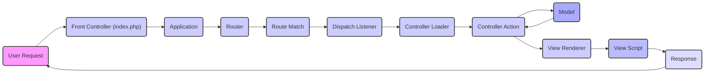
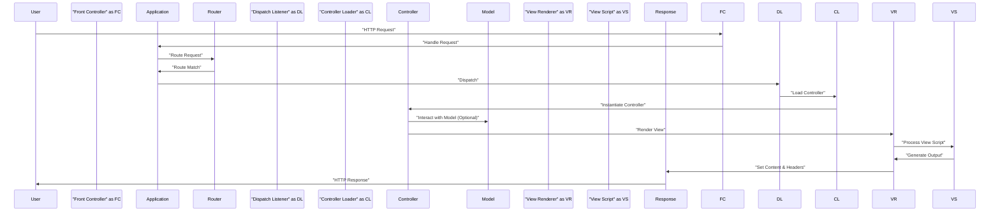

# Project Design Document: Laminas MVC Framework

**Version:** 1.1
**Date:** October 26, 2023
**Author:** AI Software Architect

## 1. Introduction

This document provides a detailed design overview of the Laminas MVC framework. It aims to describe the framework's architecture, key components, data flow, and interactions, serving as a foundation for subsequent threat modeling activities. This document focuses on the core architectural elements relevant to security considerations. This revision clarifies certain aspects and adds more detail to key interaction points.

## 2. Goals and Objectives

*   Provide a comprehensive and clear architectural description of the Laminas MVC framework.
*   Identify key components and articulate their specific responsibilities within the framework.
*   Illustrate the data flow within the framework in a precise and understandable manner.
*   Highlight significant interaction points, both internal and external, and their purpose.
*   Serve as a robust basis for identifying potential security vulnerabilities during subsequent threat modeling exercises.

## 3. Architectural Overview

Laminas MVC adheres to the traditional Model-View-Controller architectural pattern, promoting separation of concerns for building web applications. The core principle is the division into three distinct parts:

*   **Model:** Encapsulates the application's data structures, business logic, and data access mechanisms.
*   **View:** Responsible for rendering the user interface, presenting data to the user in a specific format.
*   **Controller:** Acts as an intermediary, handling user input, interacting with the Model, and selecting the appropriate View for rendering.

The framework employs a front controller pattern, where a single entry point (`index.php`) manages all incoming HTTP requests. This central point initializes the application environment and routes requests to the appropriate controller for processing.

## 4. Component Breakdown

This section provides a detailed breakdown of the key components within the Laminas MVC framework and their respective roles.

*   **Front Controller (`index.php`):**
    *   Serves as the singular entry point for all incoming web requests to the application.
    *   Responsible for initializing the core application environment and setting up essential components.
    *   Bootstraps the application by loading necessary configuration and services.
    *   Delegates the request processing to the main `Application` component.

*   **Application (`Laminas\Mvc\Application`):**
    *   The central orchestrator managing the entire request lifecycle within the MVC framework.
    *   Receives the request from the Front Controller and coordinates the subsequent steps.
    *   Triggers various events throughout the request processing, allowing for extensibility via listeners.

*   **Router (`Laminas\Router`):**
    *   Responsible for examining the incoming request URI and matching it against a defined set of routes.
    *   Defines URL patterns and maps them to specific controller and action pairs within the application.
    *   Supports different routing strategies, including segment-based, literal, and regular expression matching.

*   **Route Match:**
    *   Represents the outcome of the routing process, indicating which route, if any, matched the incoming request.
    *   Contains crucial information such as the matched route name, the target controller and action, and any parameters extracted from the URL.

*   **Dispatch Listener:**
    *   An event listener that is triggered after a successful route match has been determined.
    *   Its primary responsibility is to initiate the process of invoking the appropriate controller.

*   **Controller Loader (`Laminas\ServiceManager`):**
    *   Utilizes the Service Manager to manage the instantiation of controller classes.
    *   Handles dependency injection for controllers, providing them with necessary services and dependencies.

*   **Controller (`Laminas\Mvc\Controller\AbstractActionController` or custom controllers):**
    *   Receives the processed request and performs the necessary actions to handle it.
    *   Interacts with the Model layer to retrieve or manipulate data based on the request.
    *   Selects the appropriate View to render the response to the user.
    *   Contains specific action methods that correspond to different user requests or operations.

*   **Model (Custom Classes):**
    *   Represents the application's data structures, business rules, and logic.
    *   Often interacts with data storage mechanisms such as databases or external APIs.
    *   Encapsulates data access and manipulation logic, promoting separation of concerns.

*   **View Renderer (`Laminas\View\Renderer\PhpRenderer` or others):**
    *   Responsible for taking the output from the Controller and the associated View Script to generate the final response.
    *   Processes the View Script, substituting variables with data provided by the Controller.
    *   Produces the final HTML (or other format) output to be sent to the user.

*   **View Script (`.phtml` files):**
    *   Contains the HTML markup and embedded PHP code responsible for structuring and displaying data to the user.
    *   Receives data from the Controller via variables assigned by the View Renderer.
    *   Often utilizes View Helpers to perform common presentation-related tasks.

*   **Response (`Laminas\Http\Response`):**
    *   Represents the HTTP response that will be sent back to the client's browser.
    *   Contains the rendered output (typically HTML), HTTP headers (e.g., content type, status code), and the HTTP status code itself.

*   **Event Manager (`Laminas\EventManager\EventManager`):**
    *   A central component implementing the observer pattern, enabling decoupled communication between components.
    *   Allows different parts of the framework (and application code) to trigger and listen for specific events.
    *   Extensively used for extending and customizing the framework's behavior.

*   **Module Manager (`Laminas\ModuleManager\ModuleManager`):**
    *   Manages the loading and initialization of application modules, which are self-contained units of functionality.
    *   Modules encapsulate related controllers, models, views, and configuration, promoting modularity and organization.

*   **Service Manager (`Laminas\ServiceManager\ServiceManager`):**
    *   A powerful dependency injection container responsible for managing the creation and retrieval of application services.
    *   Used for managing controllers, view helpers, database adapters, and other shared resources, promoting loose coupling and testability.

## 5. Data Flow

The typical flow of data within a Laminas MVC application follows a well-defined sequence of steps:

1. **User Request Initiation:** A user initiates an interaction by sending an HTTP request to the web server.
2. **Front Controller Reception:** The `index.php` file, acting as the Front Controller, receives the incoming request.
3. **Application Bootstrapping and Initialization:** The `Application` object is instantiated and initialized, configuring essential services and components.
4. **Request Routing:** The `Router` component analyzes the request URI and attempts to match it against the defined routing rules.
5. **Route Matching and Parameter Extraction:** If a matching route is found, a `RouteMatch` object is created, containing information about the matched route, including the target controller, action, and any extracted parameters.
6. **Dispatching Process Initiation:** The `Dispatch Listener` is triggered, initiating the process of dispatching the request to the appropriate controller.
7. **Controller Loading and Instantiation:** The `Controller Loader` utilizes the `Service Manager` to instantiate the target controller class, resolving any dependencies.
8. **Controller Action Execution:** The specified action method within the controller is executed, handling the request logic.
9. **Model Interaction (Conditional):** The controller may interact with the Model layer to retrieve, create, update, or delete data as required by the request.
10. **View Selection and Preparation:** The controller selects the appropriate View to render the response and prepares any necessary data for the View.
11. **View Rendering Process:** The `View Renderer` takes the selected View Script and the data provided by the controller and processes it.
12. **View Script Execution and Output Generation:** The View Script is executed, embedding the data into the HTML markup (or other output format).
13. **Response Object Population:** The rendered output, along with appropriate HTTP headers and status codes, is placed into a `Response` object.
14. **Response Transmission:** The `Response` object is sent back to the user's browser, completing the request cycle.

## 6. Key Interactions and External Dependencies

This section highlights significant interaction points both within the framework and with external systems.

*   **User Interaction via HTTP:** Users interact with the application by sending HTTP requests (GET, POST, etc.) to specific URLs.
*   **Database Interaction (via Laminas DB or other ORMs):** Models frequently interact with relational databases (e.g., MySQL, PostgreSQL, SQLite) using database abstraction layers like Laminas DB or other Object-Relational Mappers.
*   **External API Communication (via Laminas HTTP or other HTTP clients):** Controllers or Models may need to communicate with external APIs or web services using HTTP clients to retrieve or send data.
*   **File System Operations:** The application interacts with the file system for tasks such as loading configuration files, accessing view scripts, handling file uploads, and potentially writing log files.
*   **Session Management (using Laminas Session):** The framework provides mechanisms for managing user sessions, typically relying on cookies or server-side storage to maintain user state across requests.
*   **Caching Mechanisms (e.g., Laminas Cache, Memcached, Redis):** To improve performance, the application may integrate with caching systems to store frequently accessed data in memory.
*   **Logging Services (e.g., Laminas Log, Monolog):** The framework can be configured to integrate with logging libraries to record application events, errors, and security-related information.
*   **Dependency Management via Composer:** Laminas MVC applications rely heavily on Composer to manage dependencies on third-party libraries and components.

## 7. Deployment Model

Laminas MVC applications are commonly deployed in various environments, each with its own considerations.

*   **Traditional Web Server Environment (Apache, Nginx with PHP-FPM):** The application is deployed directly on a web server with PHP and necessary extensions installed. The web server handles incoming requests and passes them to PHP-FPM for processing.
*   **Containerized Environments (Docker, Kubernetes):** The application is packaged into Docker containers, allowing for consistent deployment across different environments. Container orchestration platforms like Kubernetes can manage and scale containerized applications.
*   **Platform as a Service (PaaS) Offerings (e.g., Heroku, AWS Elastic Beanstalk, Google App Engine):** The application is deployed on a PaaS platform that manages the underlying infrastructure, simplifying deployment and scaling.

## 8. Security Considerations (Precursor to Threat Modeling)

Based on the architectural design and interactions, several potential areas of security concern emerge, which will be the focus of subsequent threat modeling activities.

*   **Input Validation Vulnerabilities:** Insufficient validation of user-supplied data can lead to various injection attacks, including SQL injection, cross-site scripting (XSS), and command injection.
*   **Authentication and Authorization Weaknesses:** Flaws in authentication mechanisms can allow unauthorized access, while inadequate authorization can lead to privilege escalation.
*   **Session Management Security:** Vulnerabilities in session handling, such as predictable session IDs or lack of proper session invalidation, can lead to session hijacking or fixation attacks.
*   **Cross-Site Scripting (XSS) Risks:** Improper handling of user-generated content in views can allow attackers to inject malicious scripts that execute in other users' browsers.
*   **Cross-Site Request Forgery (CSRF) Vulnerabilities:** Lack of CSRF protection can allow attackers to trick authenticated users into performing unintended actions.
*   **Dependency Vulnerabilities:** Outdated or vulnerable third-party libraries can introduce security risks into the application.
*   **Error Handling and Information Disclosure:** Verbose error messages or improper logging can inadvertently expose sensitive information.
*   **File Upload Security Risks:** Improperly handled file uploads can lead to malicious file execution or storage vulnerabilities.
*   **Insecure Configuration:** Misconfigured application or server settings can create security loopholes.
*   **Output Encoding Issues:** Failure to properly encode output can lead to XSS vulnerabilities.

This document provides a detailed architectural foundation for the Laminas MVC framework. The identified components, data flow, and interaction points will be further analyzed during the threat modeling process to pinpoint potential security vulnerabilities and devise appropriate mitigation strategies.