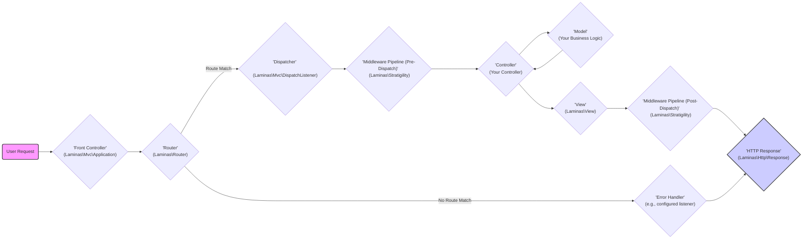

# Project Design Document: Laminas MVC Framework

**Version:** 1.1
**Date:** October 26, 2023
**Author:** AI Software Architect

## 1. Introduction

This document provides a detailed architectural design of the Laminas MVC framework, based on the project repository found at [https://github.com/laminas/laminas-mvc](https://github.com/laminas/laminas-mvc). This document serves as a foundation for understanding the system's components, their interactions, and potential security considerations. It will be used as input for subsequent threat modeling activities.

### 1.1. Purpose

The primary purpose of this document is to clearly articulate the design of the Laminas MVC framework. This will enable stakeholders, particularly security engineers, to understand the system's architecture and identify potential vulnerabilities.

### 1.2. Scope

This document covers the core architectural components and their interactions within the Laminas MVC framework. It focuses on the request lifecycle, key modules, and data flow. It includes considerations for common deployment scenarios and security best practices relevant to the framework's design. It does not delve into the specifics of individual components' internal implementation details unless they are crucial for understanding the overall architecture and security implications.

### 1.3. Target Audience

This document is intended for:

*   Security engineers involved in threat modeling and security assessments.
*   Software developers working with or extending the Laminas MVC framework.
*   Software architects seeking a high-level understanding of the framework's design and its security implications.
*   Operations engineers responsible for deploying and maintaining applications built with Laminas MVC.

## 2. Overview

Laminas MVC is a mature and flexible Model-View-Controller (MVC) framework for developing web applications in PHP. It provides a structured approach to building applications by separating concerns into distinct layers, promoting code organization, maintainability, and testability.

Key characteristics of Laminas MVC include:

*   **Separation of Concerns:** Enforces a clear separation between data (Model), presentation (View), and application logic (Controller).
*   **Request-Driven Architecture:**  Applications are built around handling incoming HTTP requests and generating appropriate responses.
*   **Extensibility:**  Designed to be highly extensible through features like middleware, event listeners, and a robust plugin system.
*   **Dependency Injection:**  Utilizes a Service Manager for managing dependencies, promoting loose coupling and testability.
*   **Configuration-Driven:**  Allows for flexible configuration of application behavior through configuration files.

The framework also incorporates several key features and components that contribute to its functionality and extensibility, such as:

*   **Request Handling:**  Manages the lifecycle of incoming HTTP requests.
*   **Routing:**  Maps incoming request URIs to specific controllers and actions based on defined routes.
*   **Dispatching:**  Instantiates and executes the appropriate controller action based on the matched route.
*   **Dependency Injection:**  Manages object dependencies for better maintainability and testability through the Service Manager.
*   **Event Management:**  Allows for loosely coupled components and extensibility through the dispatch and listening of events.
*   **Middleware:**  Enables processing of requests and responses at various stages of the lifecycle, facilitating cross-cutting concerns.
*   **Configuration Management:**  Provides a mechanism for managing application settings, often loaded from various sources like files or environment variables.

## 3. Architectural Design

The Laminas MVC framework follows a layered architecture, with distinct components responsible for specific aspects of the application lifecycle. This modular design enhances maintainability and allows for independent development and testing of different parts of the application.

### 3.1. Key Components

*   **Front Controller (`Laminas\Mvc\Application`):** The single entry point for all HTTP requests. It bootstraps the application, initializes essential services, and orchestrates the request handling process.
*   **Router (`Laminas\Router\Http\TreeRouteStack` or other implementations):** Responsible for matching the incoming request URI and HTTP method to a specific route. A route typically maps to a controller, action, and potentially parameters.
*   **Route Match (`Laminas\Router\RouteMatch`):**  Represents the result of the routing process, containing information about the matched route, parameters, and the matched controller and action.
*   **Dispatcher (`Laminas\Mvc\DispatchListener`):** Takes the matched route information and instantiates the corresponding Controller using the Service Manager. It then executes the specified Action method on the Controller.
*   **Controller (`Laminas\Mvc\Controller\AbstractActionController` or custom implementations):**  Receives user input (via the `Request` object), interacts with the Model (typically through service dependencies) to retrieve or manipulate data, and selects the appropriate View to render the response.
*   **Model (Typically custom classes):** Represents the application's data and business logic. It encapsulates data access logic and interacts with data sources (e.g., databases, APIs, file systems). This is not a specific framework component but a conceptual layer.
*   **View (`Laminas\View\Renderer\PhpRenderer` or other implementations):**  Responsible for rendering the user interface. It receives data from the Controller (passed via the `ViewModel`) and generates the HTML (or other formats like JSON or XML) to be sent to the client.
*   **View Model (`Laminas\View\Model\ViewModel`):** A container for data passed from the Controller to the View. It allows for setting variables and controlling the template used for rendering.
*   **Middleware Pipeline (`Laminas\Stratigility\MiddlewarePipe`):** A series of interceptors that can process the request and response at various stages. This allows for implementing cross-cutting concerns like authentication, authorization, logging, request/response modification, and more. Middleware components are executed in a specific order.
*   **Event Manager (`Laminas\EventManager\EventManager`):**  Provides a mechanism for components to communicate with each other without direct dependencies. Components can subscribe to specific events and execute code when those events are triggered. This facilitates extensibility and decoupling.
*   **Service Manager (Dependency Injection Container) (`Laminas\ServiceManager\ServiceManager`):**  Manages the instantiation and dependencies of application services and components. It promotes loose coupling, reusability, and testability by providing a central registry for creating and retrieving objects.
*   **Configuration (`Laminas\Config\Factory` or custom configurations):**  Stores application settings and parameters, often loaded from configuration files (e.g., PHP, INI, XML, JSON). Configuration is typically accessed through the Service Manager.
*   **Request (`Laminas\Http\Request`):** Represents the incoming HTTP request, providing access to headers, parameters, and body.
*   **Response (`Laminas\Http\Response`):** Represents the outgoing HTTP response, allowing for setting headers, status codes, and the response body.

### 3.2. Request Lifecycle

The following diagram illustrates the typical request lifecycle within the Laminas MVC framework:

**Detailed Steps:**

1. **User Request:** A user initiates an HTTP request to the application.
2. **Front Controller:** The `Laminas\Mvc\Application` instance receives the request and initializes the application environment, including the Service Manager and Event Manager.
3. **Router:** The configured Router examines the request URI and HTTP method and attempts to match them against defined routes.
    *   **Route Match:** If a matching route is found, the Router creates a `RouteMatch` object containing information about the matched route, parameters, and the target Controller and Action.
    *   **No Route Match:** If no matching route is found, the request is typically passed to an error handler, which might display a 404 Not Found page.
4. **Dispatcher:** The `DispatchListener` receives the `RouteMatch` object. It uses the Service Manager to instantiate the Controller specified in the route match.
5. **Middleware Pipeline (Pre-Dispatch):** Before the Controller action is executed, the request and response objects are passed through a series of middleware components configured for the "dispatch" event. These components can perform tasks like authentication, authorization, request modification, setting up request-specific services, etc.
6. **Controller:** The Dispatcher invokes the specified Action method on the instantiated Controller. The Controller receives the `Request` object and can interact with the Model (typically through services injected via the Service Manager) to retrieve or manipulate data.
7. **Model:** The Controller interacts with the Model layer, which encapsulates the application's business logic and data access.
8. **View:** The Controller typically creates a `ViewModel` object, populates it with data, and returns it. The View Renderer then uses this `ViewModel` to render the output using the specified template.
9. **Middleware Pipeline (Post-Dispatch):** After the Controller action and View rendering, the `Response` object is passed through another set of middleware components configured for the "render" or "finish" events. These can perform tasks like response modification, adding security headers, logging, and finalizing the response.
10. **HTTP Response:** The final `Response` object, potentially modified by post-dispatch middleware, is sent back to the user's browser.
11. **Error Handler:** If no route is matched, or if an exception occurs during the process, a configured error handler (often an event listener attached to the "dispatch.error" or "render.error" events) generates an appropriate error response.

### 3.3. Data Flow

Data flows through the Laminas MVC framework in a structured manner:

*   **Incoming Request Data:** User input from forms, query parameters, request headers, and request body are encapsulated in the `Request` object, which is available to Controllers and middleware.
*   **Routing Data:** The Router processes the request URI and extracts parameters to determine the target Controller and Action. This information is stored in the `RouteMatch` object.
*   **Controller Data:** The Controller receives the `Request` object and interacts with the Model layer (often through services) to fetch, process, or manipulate data.
*   **Model Data:** The Model layer interacts with data sources (e.g., databases, APIs, external services) to retrieve and persist data.
*   **View Data:** The Controller passes data to the View layer by populating a `ViewModel` object.
*   **Outgoing Response Data:** The View Renderer uses the data in the `ViewModel` to generate the HTML, JSON, XML, or other response format. The `Response` object encapsulates this data along with headers and status codes.

### 3.4. Key Modules and Components

*   **`laminas-mvc`:** The core MVC module providing the fundamental classes and interfaces for building MVC applications, including the `Application` class and core event listeners.
*   **`laminas-router`:**  Handles request routing and URL generation, providing various routing strategies.
*   **`laminas-view`:**  Provides view rendering capabilities, including template engines (like PHP templates), view helpers, and layout management.
*   **`laminas-servicemanager`:** Implements a powerful dependency injection container for managing application services and dependencies.
*   **`laminas-eventmanager`:**  Provides an event system for decoupling components and enabling extensibility through listeners and event dispatching.
*   **`laminas-http`:**  Provides classes for working with HTTP requests and responses, including handling headers, body content, and status codes.
*   **`laminas-config`:**  Handles application configuration, allowing loading from various file formats and merging configurations.
*   **`laminas-stdlib`:**  Provides standard utility classes and interfaces used throughout the framework.
*   **`laminas-modulemanager`:**  Manages the loading and initialization of application modules.
*   **`laminas-stratigility`:**  Provides the foundation for building middleware pipelines for processing requests and responses.

## 4. Security Considerations

A thorough understanding of the Laminas MVC architecture is essential for identifying and mitigating potential security vulnerabilities. Here are some key security considerations:

*   **Input Validation and Sanitization:**  All user input received by Controllers (from `Request` objects) must be rigorously validated to ensure it conforms to expected formats and constraints. Sanitize input before using it in any operations to prevent injection attacks (e.g., SQL injection, command injection, LDAP injection).
*   **Output Encoding:** Data rendered by Views should be properly encoded based on the output context (e.g., HTML escaping for HTML output, JavaScript encoding for JavaScript output) to prevent cross-site scripting (XSS) vulnerabilities. Utilize View Helpers provided by Laminas for secure output encoding.
*   **Authentication and Authorization:** Implement robust authentication mechanisms (verifying user identity) and authorization controls (granting access to resources based on roles or permissions). Leverage middleware components to enforce authentication and authorization rules before Controller actions are executed.
*   **Session Management:** Securely manage user sessions to prevent session hijacking and fixation attacks. Use secure session IDs, regenerate session IDs after login, and set appropriate session cookie flags (e.g., `HttpOnly`, `Secure`, `SameSite`).
*   **Routing Security:**  Carefully define routes to prevent unintended access to sensitive parts of the application. Avoid exposing internal implementation details in route patterns. Implement proper authorization checks for each route.
*   **Cross-Site Request Forgery (CSRF) Protection:** Implement CSRF protection mechanisms (e.g., synchronizer tokens) to prevent malicious websites from making unauthorized requests on behalf of authenticated users. Laminas provides components to facilitate CSRF protection.
*   **Error Handling and Logging:**  Implement proper error handling to prevent sensitive information leakage in error messages. Log errors and security-related events for auditing and monitoring purposes. Ensure log files are protected from unauthorized access.
*   **Dependency Management:**  Keep all dependencies (including Laminas components and third-party libraries) up-to-date to patch known security vulnerabilities. Regularly review dependency security advisories.
*   **Configuration Security:**  Store sensitive configuration data (e.g., database credentials, API keys, encryption keys) securely, preferably using environment variables or dedicated secrets management solutions. Avoid hardcoding sensitive information in configuration files.
*   **Middleware Security:**  Ensure that custom middleware components are implemented securely and do not introduce new vulnerabilities. Carefully review the functionality and potential security implications of all middleware in the pipeline.
*   **Event Handling Security:**  While events promote decoupling, ensure that event listeners do not introduce security flaws or unintended side effects. Validate data received in event listeners and avoid performing sensitive operations directly within listeners without proper authorization checks.
*   **Database Security:**  Follow secure database access practices, including using parameterized queries or prepared statements to prevent SQL injection, using least privilege database accounts, and encrypting database connections.
*   **File Upload Security:**  Implement secure file upload mechanisms, including validating file types and sizes, sanitizing file names, and storing uploaded files outside the webroot.
*   **Security Headers:**  Configure appropriate security headers (e.g., `Content-Security-Policy`, `Strict-Transport-Security`, `X-Frame-Options`, `X-Content-Type-Options`) in the HTTP response to mitigate various client-side attacks.

## 5. Dependencies

The Laminas MVC framework relies on several external components and libraries, primarily within the Laminas project itself. Key dependencies include:

*   **PHP (version requirements vary by Laminas MVC version):** The underlying programming language.
*   **Laminas Components:**
    *   `laminas/laminas-stdlib`
    *   `laminas/laminas-config`
    *   `laminas/laminas-eventmanager`
    *   `laminas/laminas-servicemanager`
    *   `laminas/laminas-modulemanager`
    *   `laminas/laminas-router`
    *   `laminas/laminas-view`
    *   `laminas/laminas-http`
    *   `laminas/laminas-stratigility`
*   **Composer:** A dependency management tool for PHP, used to install and manage Laminas components and other dependencies.
*   **Potentially other third-party libraries:** Depending on the specific application built using the framework, such as:
    *   Database abstraction layers (e.g., Doctrine ORM, Laminas DB) and database drivers (e.g., `pdo_mysql`, `pdo_pgsql`).
    *   Templating engines (if not using the default PHP renderer).
    *   Logging libraries (e.g., Monolog).
    *   Caching libraries (e.g., Memcached, Redis).
    *   Security libraries (e.g., for password hashing).

## 6. Deployment Considerations

Laminas MVC applications are typically deployed on web servers such as:

*   **Apache HTTP Server:** Often used with `mod_php` or PHP-FPM (FastCGI Process Manager). PHP-FPM is generally recommended for performance and security.
*   **Nginx:** Typically used with PHP-FPM. Nginx is known for its performance and efficiency in handling concurrent requests.

Deployment environments can range from simple shared hosting to complex cloud-based infrastructures (e.g., AWS, Azure, Google Cloud). Security considerations during deployment include:

*   **Web Server Configuration:** Securely configure the web server to prevent unauthorized access, information disclosure, and common web server vulnerabilities. This includes:
    *   Disabling unnecessary modules.
    *   Setting appropriate file permissions.
    *   Configuring virtual hosts correctly.
    *   Implementing request limits and timeouts.
    *   Protecting sensitive files (e.g., `.env`, configuration files).
*   **PHP Configuration:** Optimize PHP settings for security and performance in the `php.ini` file. Key considerations include:
    *   Disabling dangerous functions.
    *   Setting appropriate error reporting levels.
    *   Configuring `open_basedir` to restrict file access.
    *   Setting memory limits and execution timeouts.
*   **HTTPS (TLS/SSL):** Enforce HTTPS to encrypt all communication between the client and server, protecting sensitive data in transit. Obtain and configure a valid SSL/TLS certificate.
*   **Firewall Configuration:** Configure firewalls to restrict network access to the application, allowing only necessary ports and protocols.
*   **Regular Security Updates:** Keep the operating system, web server, PHP installation, and all other server software up-to-date with the latest security patches. Automate patching where possible.
*   **Secure File Permissions:** Set appropriate file and directory permissions to prevent unauthorized access and modification of application files.
*   **Secrets Management:**  Avoid storing sensitive credentials directly in the codebase or configuration files. Utilize environment variables or dedicated secrets management services provided by cloud providers or third-party tools.
*   **Intrusion Detection and Prevention Systems (IDS/IPS):** Consider implementing IDS/IPS solutions to detect and prevent malicious activity targeting the application.
*   **Web Application Firewall (WAF):** Deploy a WAF to filter malicious traffic and protect against common web application attacks (e.g., SQL injection, XSS).
*   **Content Security Policy (CSP):** Configure a strong CSP header to mitigate XSS attacks by controlling the sources from which the browser is allowed to load resources.

## 7. Future Considerations

This design document provides a comprehensive overview of the current architecture. Future enhancements and changes to the framework may include:

*   **Improved Asynchronous Capabilities:**  Further exploration and integration of asynchronous programming patterns to enhance performance and scalability for I/O-bound operations.
*   **GraphQL Integration:**  Providing more seamless integration with GraphQL for building modern APIs.
*   **Microservices Architecture Support:**  Offering guidance and potentially components to facilitate building applications based on a microservices architecture.
*   **Enhanced Security Features:**  Continuously reviewing and improving security features, providing more built-in security mechanisms, and offering updated best practices for developers.
*   **Performance Optimizations:**  Ongoing efforts to optimize the framework's performance and resource utilization.

This document will be reviewed and updated periodically as the Laminas MVC framework evolves. It serves as a valuable resource for understanding the system's design, its security considerations, and for conducting thorough threat modeling activities.