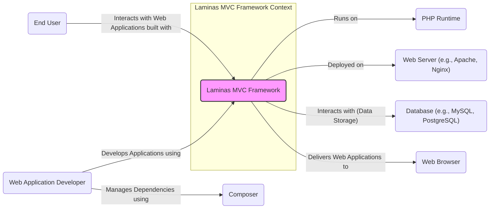
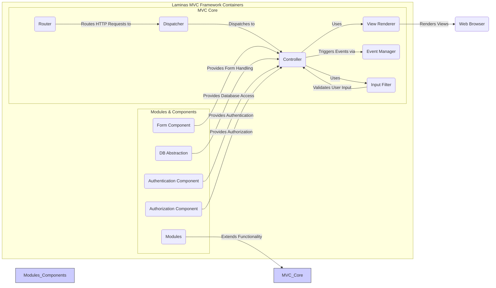
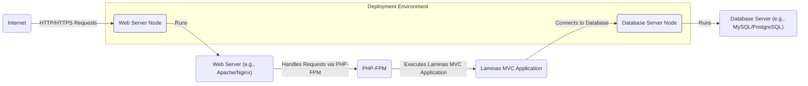

# BUSINESS POSTURE

- Business Priorities and Goals:
 - Facilitate the development of robust, maintainable, and scalable web applications using the Model-View-Controller architectural pattern.
 - Provide a flexible and extensible framework that adapts to diverse project requirements.
 - Foster a thriving community of developers through open-source collaboration and contribution.
 - Ensure long-term stability and support for applications built on the framework.
 - Enable rapid application development while maintaining code quality and security.
- Business Risks:
 - Security vulnerabilities within the framework could compromise applications built upon it.
 - Lack of community support or decline in active development could lead to framework obsolescence.
 - Performance bottlenecks in the framework could negatively impact application performance.
 - Incompatibility issues with evolving PHP versions or other dependencies could disrupt application stability.
 - Complexity of the framework might increase the learning curve for new developers.

# SECURITY POSTURE

- Existing Security Controls:
 - security control: Open Source Codebase - The framework's source code is publicly available on GitHub (https://github.com/laminas/laminas-mvc), allowing for community review and scrutiny.
 - security control: Community Review -  Being an open-source project, the codebase is subject to review by a wide community of developers, potentially identifying and addressing security vulnerabilities.
 - security control: Input Validation Features - The framework likely provides components and best practices for input validation to prevent common injection attacks (e.g., within form handling and data filtering components, described in framework documentation).
 - security control: Output Encoding Features - The framework likely provides components and best practices for output encoding to prevent cross-site scripting (XSS) attacks (e.g., within view rendering and template engines, described in framework documentation).
 - security control: CSRF Protection - The framework likely offers mechanisms to protect against Cross-Site Request Forgery (CSRF) attacks (e.g., form helpers and security middleware, described in framework documentation).
 - security control: Security Advisories -  The Laminas project likely publishes security advisories for reported vulnerabilities (check project website and security channels).
- Accepted Risks:
 - accepted risk: Public Disclosure of Vulnerabilities - As an open-source project, once a vulnerability is discovered and reported, it becomes publicly known before a patch might be available.
 - accepted risk: Reliance on Community for Security Patches - The speed and availability of security patches depend on the responsiveness of the community and maintainers.
 - accepted risk: Potential for Third-Party Dependency Vulnerabilities - The framework relies on third-party libraries, which could introduce vulnerabilities if not properly managed and updated.
- Recommended Security Controls:
 - security control: Automated Security Scanning - Implement automated Static Application Security Testing (SAST) and Dynamic Application Security Testing (DAST) tools in the development pipeline to proactively identify potential vulnerabilities in the framework code.
 - security control: Dependency Vulnerability Scanning - Integrate dependency vulnerability scanning tools to monitor and alert on known vulnerabilities in third-party libraries used by the framework.
 - security control: Regular Security Audits - Conduct periodic security audits by external security experts to thoroughly assess the framework's security posture and identify potential weaknesses.
 - security control: Security Champions Program - Establish a security champions program within the development team to promote security awareness and best practices throughout the development lifecycle.
 - security control: Bug Bounty Program - Consider implementing a bug bounty program to incentivize external security researchers to find and report vulnerabilities.
- Security Requirements:
 - Authentication:
  - Applications built with the framework must be able to implement secure authentication mechanisms to verify user identities. The framework should provide components or guidance to facilitate secure authentication (e.g., session management, integration with authentication libraries).
 - Authorization:
  - Applications built with the framework must be able to implement robust authorization controls to manage user access to resources and functionalities. The framework should provide components or guidance to facilitate secure authorization (e.g., role-based access control, access control lists).
 - Input Validation:
  - The framework must encourage and facilitate comprehensive input validation to prevent injection attacks. This includes validating data from various sources (e.g., HTTP requests, file uploads, external APIs) against expected formats and constraints.
 - Cryptography:
  - The framework should support and promote the use of strong cryptography for protecting sensitive data at rest and in transit. This includes providing secure APIs for encryption, decryption, hashing, and secure random number generation. The framework should avoid insecure cryptographic practices and guide developers towards secure implementations.

# DESIGN

## C4 CONTEXT



- Context Diagram Elements:
 - Element:
  - Name: Laminas MVC Framework
  - Type: Software System
  - Description: A PHP framework for building web applications based on the Model-View-Controller architectural pattern. It provides a structure and components to simplify web development.
  - Responsibilities:
   - Providing a robust and flexible MVC architecture.
   - Handling HTTP requests and responses.
   - Routing requests to appropriate controllers.
   - Rendering views and templates.
   - Managing application configuration.
   - Providing components for common web development tasks (e.g., form handling, input filtering, event management).
  - Security Controls:
   - Security control: Input validation and output encoding features (implemented within framework components).
   - security control: CSRF protection mechanisms (implemented within framework components).
   - security control: Encouraging secure coding practices through documentation and examples.
 - Element:
  - Name: Web Application Developer
  - Type: Person
  - Description: Software developers who use the Laminas MVC Framework to build web applications.
  - Responsibilities:
   - Writing application code using the framework.
   - Configuring and deploying applications.
   - Ensuring the security of applications built with the framework.
  - Security Controls:
   - security control: Secure coding practices (developer responsibility).
   - security control: Utilizing framework security features correctly (developer responsibility).
 - Element:
  - Name: End User
  - Type: Person
  - Description: Users who interact with web applications built using the Laminas MVC Framework through their web browsers.
  - Responsibilities:
   - Using web applications for their intended purpose.
  - Security Controls:
   - security control: Browser security features (user responsibility).
 - Element:
  - Name: PHP Runtime
  - Type: Software System
  - Description: The PHP runtime environment that executes the Laminas MVC Framework and applications built on it.
  - Responsibilities:
   - Executing PHP code.
   - Providing core PHP functionalities.
  - Security Controls:
   - security control: PHP security configurations (server administrator responsibility).
   - security control: Keeping PHP runtime updated with security patches (server administrator responsibility).
 - Element:
  - Name: Web Server (e.g., Apache, Nginx)
  - Type: Software System
  - Description: Web servers that host and serve web applications built with the Laminas MVC Framework.
  - Responsibilities:
   - Handling HTTP requests and responses.
   - Serving static files.
   - Forwarding requests to the PHP runtime.
  - Security Controls:
   - security control: Web server security configurations (server administrator responsibility).
   - security control: HTTPS configuration (server administrator responsibility).
   - security control: Web server access controls (server administrator responsibility).
 - Element:
  - Name: Database (e.g., MySQL, PostgreSQL)
  - Type: Software System
  - Description: Databases used by web applications built with the Laminas MVC Framework to store and retrieve data.
  - Responsibilities:
   - Storing application data.
   - Providing data persistence.
   - Handling database queries.
  - Security Controls:
   - security control: Database access controls (database administrator responsibility).
   - security control: Database security configurations (database administrator responsibility).
   - security control: Data encryption at rest (database administrator responsibility).
 - Element:
  - Name: Web Browser
  - Type: Software System
  - Description: Web browsers used by end users to access and interact with web applications.
  - Responsibilities:
   - Rendering web pages.
   - Executing client-side JavaScript code.
   - Communicating with web servers.
  - Security Controls:
   - security control: Browser security features (browser software).
   - security control: HTTPS enforcement (browser software).
 - Element:
  - Name: Composer
  - Type: Software System
  - Description: A dependency manager for PHP. Used by web application developers to manage the Laminas MVC Framework and its dependencies.
  - Responsibilities:
   - Managing project dependencies.
   - Installing and updating packages.
  - Security Controls:
   - security control: Package integrity checks (Composer software).
   - security control: Secure package repositories (Composer configuration and repository provider responsibility).

## C4 CONTAINER



- Container Diagram Elements:
 - Element:
  - Name: Router
  - Type: Container (Software Component)
  - Description: Responsible for mapping incoming HTTP requests to specific controllers and actions within the application based on defined routes.
  - Responsibilities:
   - Parsing HTTP request URLs.
   - Matching URLs against defined routes.
   - Extracting route parameters.
   - Determining the appropriate controller and action to handle the request.
  - Security Controls:
   - security control: Route definition security (ensure routes are designed to prevent unauthorized access to sensitive functionalities, developer responsibility).
 - Element:
  - Name: Dispatcher
  - Type: Container (Software Component)
  - Description: Responsible for invoking the appropriate controller and action based on the routing results.
  - Responsibilities:
   - Instantiating controllers.
   - Executing controller actions.
   - Handling pre- and post-dispatch events.
  - Security Controls:
   - security control: Controller access control (ensure only authorized users can access specific controllers and actions, implemented in application code using framework authorization components).
 - Element:
  - Name: Controller
  - Type: Container (Software Component)
  - Description: Handles specific business logic and user interactions for a particular part of the application. Acts as an intermediary between the model and the view.
  - Responsibilities:
   - Receiving user input from requests.
   - Interacting with models to retrieve or update data.
   - Preparing data for the view.
   - Returning responses to the client.
  - Security Controls:
   - security control: Input validation (using Input Filter component).
   - security control: Authorization checks (using Authorization Component).
   - security control: Secure data handling (developer responsibility).
 - Element:
  - Name: View Renderer
  - Type: Container (Software Component)
  - Description: Responsible for rendering views (templates) and generating the final output (e.g., HTML, JSON) to be sent to the client.
  - Responsibilities:
   - Processing view templates.
   - Substituting data into templates.
   - Applying output encoding to prevent XSS attacks.
  - Security Controls:
   - security control: Output encoding (built-in features of template engine and view helpers).
   - security control: Template security (ensure templates do not contain vulnerabilities, developer responsibility).
 - Element:
  - Name: Event Manager
  - Type: Container (Software Component)
  - Description: Provides a mechanism for implementing event-driven architecture within the framework, allowing components to communicate and react to events in a decoupled manner.
  - Responsibilities:
   - Managing event listeners.
   - Dispatching events.
   - Allowing components to subscribe to and publish events.
  - Security Controls:
   - security control: Event handling security (ensure event handlers do not introduce vulnerabilities, developer responsibility).
 - Element:
  - Name: Input Filter
  - Type: Container (Software Component)
  - Description: Provides a component for validating and filtering user input to ensure data integrity and prevent injection attacks.
  - Responsibilities:
   - Defining input validation rules.
   - Validating user input against defined rules.
   - Filtering and sanitizing user input.
  - Security Controls:
   - security control: Input validation (core functionality of the component).
   - security control: Secure validation rule definitions (developer responsibility).
 - Element:
  - Name: Modules
  - Type: Container (Software Component)
  - Description: A modularity system that allows for organizing application code into reusable modules, promoting code organization and maintainability.
  - Responsibilities:
   - Encapsulating application features into modules.
   - Providing module configuration and bootstrapping.
   - Facilitating code reuse and organization.
  - Security Controls:
   - security control: Module isolation (modules should not introduce vulnerabilities into other parts of the application, developer responsibility).
 - Element:
  - Name: Form Component
  - Type: Container (Software Component)
  - Description: Provides components for handling HTML forms, including form generation, validation, and processing.
  - Responsibilities:
   - Generating HTML forms.
   - Handling form submissions.
   - Validating form data.
   - CSRF protection for forms.
  - Security Controls:
   - security control: CSRF protection (built-in form component features).
   - security control: Form validation (using Input Filter component).
 - Element:
  - Name: DB Abstraction
  - Type: Container (Software Component)
  - Description: Provides an abstraction layer for interacting with different database systems, simplifying database access and improving portability.
  - Responsibilities:
   - Providing database connection management.
   - Query building and execution.
   - Data mapping and abstraction.
  - Security Controls:
   - security control: Secure database connection management (using secure connection strings and credentials, developer responsibility).
   - security control: Preventing SQL injection vulnerabilities (using parameterized queries or ORM features, developer responsibility).
 - Element:
  - Name: Authentication Component
  - Type: Container (Software Component)
  - Description: Provides components and mechanisms for implementing user authentication in applications.
  - Responsibilities:
   - User credential verification.
   - Session management.
   - Authentication adapters for different authentication methods.
  - Security Controls:
   - security control: Secure authentication mechanisms (using strong password hashing, multi-factor authentication where appropriate, developer responsibility).
   - security control: Secure session management (using secure session cookies, session fixation protection, framework features).
 - Element:
  - Name: Authorization Component
  - Type: Container (Software Component)
  - Description: Provides components and mechanisms for implementing user authorization and access control in applications.
  - Responsibilities:
   - Defining roles and permissions.
   - Enforcing access control policies.
   - Checking user permissions before granting access to resources.
  - Security Controls:
   - security control: Robust authorization policies (developer responsibility).
   - security control: Principle of least privilege (developer responsibility).

## DEPLOYMENT

- Deployment Options:
 - Option 1: Traditional Server Deployment - Deploying the application on a traditional web server (e.g., Apache or Nginx) with PHP-FPM, connecting to a separate database server.
 - Option 2: Containerized Deployment - Deploying the application within Docker containers, orchestrated by Kubernetes or Docker Compose, potentially using containerized database and web server components.
 - Option 3: Cloud Platform Deployment - Deploying the application on a cloud platform (e.g., AWS, Azure, GCP) using managed services for web servers, databases, and container orchestration.

- Detailed Deployment (Option 1: Traditional Server Deployment):



- Deployment Diagram Elements:
 - Element:
  - Name: Web Server Node
  - Type: Infrastructure Node (Physical or Virtual Server)
  - Description: A server (physical or virtual machine) dedicated to running the web server and PHP-FPM processes.
  - Responsibilities:
   - Hosting the web server and PHP-FPM.
   - Providing network connectivity.
   - Managing server resources.
  - Security Controls:
   - security control: Operating system hardening (server administrator responsibility).
   - security control: Firewall configuration (server administrator responsibility).
   - security control: Intrusion detection/prevention systems (server administrator responsibility).
 - Element:
  - Name: Web Server (e.g., Apache/Nginx)
  - Type: Software Component (Running in Web Server Node)
  - Description: The web server software responsible for handling HTTP requests and serving the application.
  - Responsibilities:
   - Handling HTTP/HTTPS requests.
   - Serving static files.
   - Forwarding PHP requests to PHP-FPM.
  - Security Controls:
   - security control: Web server security configurations (server administrator responsibility).
   - security control: HTTPS configuration (server administrator responsibility).
   - security control: Access control lists (server administrator responsibility).
 - Element:
  - Name: PHP-FPM
  - Type: Software Component (Running in Web Server Node)
  - Description: FastCGI Process Manager for PHP, responsible for executing PHP code.
  - Responsibilities:
   - Executing PHP scripts.
   - Managing PHP processes.
  - Security Controls:
   - security control: PHP-FPM security configurations (server administrator responsibility).
   - security control: Restricting PHP execution permissions (server administrator responsibility).
 - Element:
  - Name: Laminas MVC Application
  - Type: Software Component (Running in PHP-FPM)
  - Description: The deployed instance of the web application built using the Laminas MVC Framework.
  - Responsibilities:
   - Handling application logic.
   - Interacting with the database.
   - Serving web pages and APIs.
  - Security Controls:
   - security control: Application-level security controls (implemented within the application code).
   - security control: Framework security features (utilized by the application).
 - Element:
  - Name: Database Server Node
  - Type: Infrastructure Node (Physical or Virtual Server)
  - Description: A server (physical or virtual machine) dedicated to running the database server.
  - Responsibilities:
   - Hosting the database server.
   - Providing data storage and retrieval.
   - Managing database resources.
  - Security Controls:
   - security control: Operating system hardening (server administrator responsibility).
   - security control: Firewall configuration (server administrator responsibility).
   - security control: Database server access controls (database administrator responsibility).
 - Element:
  - Name: Database Server (e.g., MySQL/PostgreSQL)
  - Type: Software Component (Running in Database Server Node)
  - Description: The database server software used to store application data.
  - Responsibilities:
   - Storing application data.
   - Managing database access.
   - Ensuring data persistence and integrity.
  - Security Controls:
   - security control: Database access controls (database administrator responsibility).
   - security control: Database security configurations (database administrator responsibility).
   - security control: Data encryption at rest (database administrator responsibility).
 - Element:
  - Name: Internet
  - Type: External Environment
  - Description: The public internet from which users access the web application.
  - Responsibilities:
   - Providing network connectivity to users.
  - Security Controls:
   - security control: DDoS protection (infrastructure level).

## BUILD

```mermaid
flowchart LR
    developer("Developer") --> code_repository("Code Repository (e.g., GitHub)")
    code_repository --> ci_server("CI Server (e.g., GitHub Actions)")
    ci_server --> build_process("Build Process")
    build_process --> artifact_repository("Artifact Repository (e.g., Package Registry)")
    artifact_repository --> deployment_environment("Deployment Environment")

    subgraph "Build Process Steps"
      build_process --> checkout_code("Checkout Code")
      checkout_code --> install_dependencies("Install Dependencies (Composer)")
      install_dependencies --> run_tests("Run Unit & Integration Tests")
      run_tests --> run_security_scans("Run Security Scans (SAST, Dependency Check)")
      run_security_scans --> build_artifacts("Build Artifacts (e.g., Packages)")
    end
    style build_process fill:#ccf,stroke:#333,stroke-width:1px
    style "Build Process Steps" fill:#eef,stroke:#333,stroke-width:1px
```

- Build Process Description:
 - The build process for Laminas MVC Framework (and applications built with it) typically involves the following steps, focusing on security controls:
  - Developer commits code changes to a Code Repository (e.g., GitHub).
  - A CI Server (e.g., GitHub Actions, Jenkins) is triggered by code changes.
  - Checkout Code: The CI server checks out the latest code from the repository.
   - security control: Access control to code repository (ensure only authorized developers can commit code).
  - Install Dependencies (Composer): Composer is used to install project dependencies defined in `composer.json` and `composer.lock`.
   - security control: Dependency vulnerability scanning (using `composer audit` or dedicated tools to check for known vulnerabilities in dependencies).
   - security control: Integrity check of dependencies (Composer verifies package integrity using hashes).
  - Run Unit & Integration Tests: Automated tests are executed to ensure code quality and functionality.
   - security control: Test coverage (aim for good test coverage to catch regressions and vulnerabilities early).
  - Run Security Scans (SAST, Dependency Check): Static Application Security Testing (SAST) tools are used to analyze the codebase for potential security vulnerabilities. Dependency check tools are used to identify vulnerable dependencies.
   - security control: SAST tools integration (integrate SAST tools into the CI pipeline).
   - security control: Dependency vulnerability scanning (as mentioned above).
  - Build Artifacts (e.g., Packages): Build artifacts are created, such as distributable packages (e.g., Composer packages).
   - security control: Artifact signing (sign build artifacts to ensure integrity and authenticity).
  - Artifact Repository (e.g., Package Registry): Build artifacts are published to an artifact repository (e.g., Packagist for Composer packages, or private package registries).
   - security control: Access control to artifact repository (ensure only authorized users can publish and access artifacts).
  - Deployment Environment: Artifacts from the repository are deployed to the target deployment environment.
   - security control: Secure deployment process (ensure secure transfer and deployment of artifacts).

# RISK ASSESSMENT

- Critical Business Processes:
 - Secure development and deployment of web applications.
 - Maintaining the integrity and availability of web applications built with the framework.
 - Protecting user data processed by applications built with the framework.
- Data to Protect and Sensitivity:
 - Framework Source Code: Publicly available, but integrity is critical to prevent malicious modifications.
  - Sensitivity: Public, Integrity is High.
 - Framework Configuration: Potentially contains sensitive information (e.g., database credentials in example applications or configurations).
  - Sensitivity: Confidential, Integrity is High.
 - Application Data (in applications built with the framework): Varies depending on the application. Could include user credentials, personal information, financial data, etc.
  - Sensitivity: Varies, potentially High Confidentiality, Integrity, and Availability.

# QUESTIONS & ASSUMPTIONS

- Questions:
 - What specific SAST and DAST tools are recommended for scanning Laminas MVC applications and the framework itself?
 - Are there any official security guidelines or best practices documents provided by the Laminas project specifically for security?
 - What is the typical release cycle for security patches for Laminas MVC?
 - Are there any known common security pitfalls developers should be aware of when using Laminas MVC?
 - What are the recommended configurations for PHP and web servers when deploying Laminas MVC applications to enhance security?
- Assumptions:
 - BUSINESS POSTURE:
  - The primary goal is to provide a secure and reliable framework for web application development.
  - Security is a significant concern for both the framework developers and users.
  - The framework is intended for building applications that may handle sensitive data.
 - SECURITY POSTURE:
  - The open-source nature of the project is considered a security strength through community review.
  - The framework developers are responsive to security vulnerability reports.
  - Security best practices are generally followed in the framework's development.
 - DESIGN:
  - The framework is designed with security principles in mind, incorporating features to mitigate common web application vulnerabilities.
  - The framework is modular and extensible, allowing developers to integrate additional security components and controls.
  - The deployment environment is assumed to be a standard web server infrastructure or a containerized environment.
  - A CI/CD pipeline is used for building and deploying applications built with the framework, allowing for automated security checks.