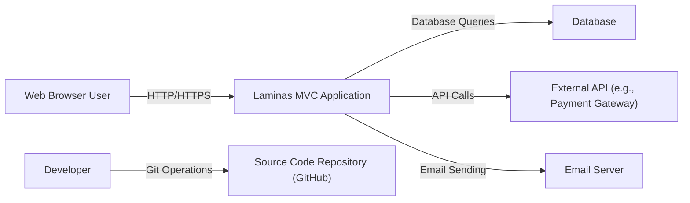
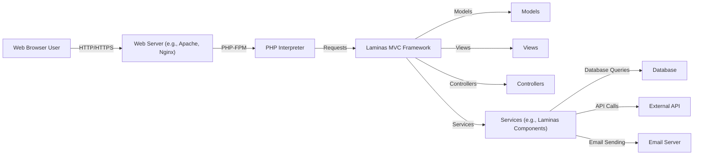
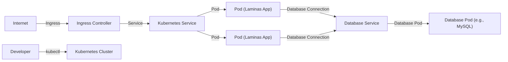
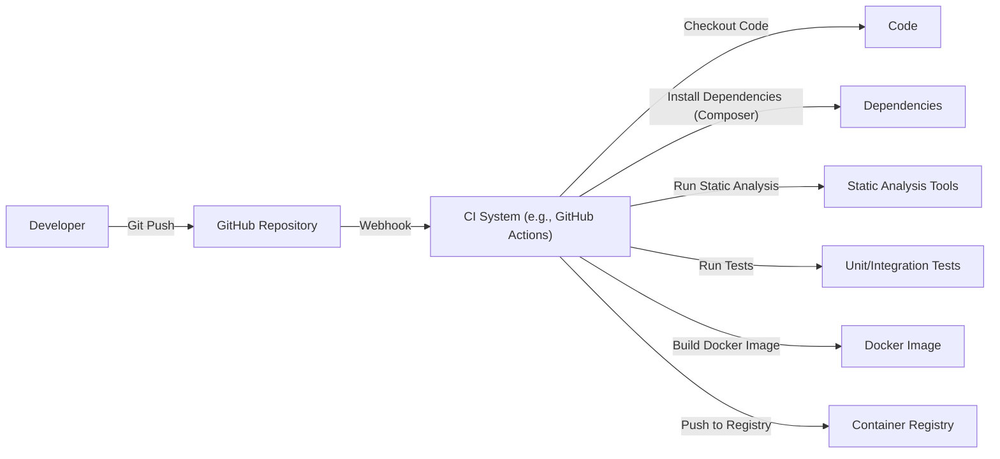

Okay, let's create a design document for the Laminas MVC framework, focusing on aspects relevant to threat modeling.

# BUSINESS POSTURE

Laminas MVC is a foundational component for building web applications and APIs using PHP.  It's an open-source project, implying a community-driven development model.  The business priorities and goals can be inferred as follows:

*   Provide a robust and flexible MVC framework:  The primary goal is to offer developers a solid foundation for building a wide range of web applications.  This includes features like routing, controllers, views, and service management.
*   Promote best practices: Laminas MVC encourages (but doesn't strictly enforce) secure coding practices and modular design.
*   Maintainability and Extensibility: The framework is designed to be maintainable and extensible, allowing developers to adapt it to their specific needs and integrate with other libraries.
*   Community Support and Adoption:  As an open-source project, its success relies on community adoption, contributions, and ongoing support.
*   Performance and Scalability:  While not explicitly stated as the *top* priority, performance and scalability are important considerations for any web framework.

Business Risks:

*   Security Vulnerabilities:  Vulnerabilities in the framework itself could expose applications built upon it to a wide range of attacks (e.g., XSS, SQL injection, CSRF). This is the most critical risk.
*   Lack of Adoption: If developers don't find the framework useful or easy to use, it won't be adopted, hindering its long-term viability.
*   Maintenance Burden:  If the codebase becomes too complex or difficult to maintain, it could lead to stagnation and security issues.
*   Incompatible Changes:  Major version updates that introduce breaking changes could disrupt existing applications and discourage upgrades.
*   Reputation Damage:  Security incidents or negative publicity could damage the reputation of the framework and the Laminas project as a whole.

# SECURITY POSTURE

Laminas MVC provides several built-in security features and encourages secure development practices. However, it's crucial to understand that the framework itself is just one layer of the security onion.  Application developers are ultimately responsible for implementing secure applications *using* the framework.

Existing Security Controls:

*   security control: Input Filtering and Validation: Laminas provides components for filtering and validating user input (e.g., `laminas-filter`, `laminas-validator`). These help prevent common vulnerabilities like XSS and SQL injection. Implemented in separate Laminas components, linked from the MVC framework.
*   security control: Output Escaping:  The `laminas-view` component offers helpers for escaping output, mitigating XSS vulnerabilities. Implemented in `laminas-view` component.
*   security control: CSRF Protection: Laminas provides form elements and helpers to generate and validate CSRF tokens, protecting against Cross-Site Request Forgery attacks. Implemented in `laminas-form` and related components.
*   security control: Session Management:  Laminas offers secure session management features, including configurable session security settings (e.g., HTTP-only cookies, secure cookies). Implemented in `laminas-session`.
*   security control: Cryptography: Laminas provides cryptographic utilities for hashing, encryption, and key management (`laminas-crypt`). Implemented in `laminas-crypt`.
*   security control: Dependency Management: Composer is used for managing dependencies, allowing developers to keep libraries up-to-date and address security vulnerabilities in third-party code. Described in `composer.json`.
*   security control: Security Advisories: The Laminas project actively publishes security advisories and patches for vulnerabilities discovered in the framework. Described on Laminas project website and GitHub repository.

Accepted Risks:

*   accepted risk: Developer Misuse:  The framework provides security features, but developers can still write insecure code *using* the framework.  This is a fundamental risk in any software development project.
*   accepted risk: Zero-Day Vulnerabilities:  Like any software, Laminas MVC may contain undiscovered vulnerabilities (zero-days).
*   accepted risk: Third-Party Component Vulnerabilities:  Applications built with Laminas MVC likely rely on third-party libraries, which may have their own security vulnerabilities.
*   accepted risk: Configuration Errors:  Misconfiguration of the framework or the underlying server environment (e.g., PHP settings, web server configuration) can introduce security risks.

Recommended Security Controls:

*   security control: Regular Security Audits: Conduct regular security audits of applications built with Laminas MVC, including penetration testing and code reviews.
*   security control: Web Application Firewall (WAF): Deploy a WAF to provide an additional layer of protection against common web attacks.
*   security control: Content Security Policy (CSP): Implement CSP headers to mitigate XSS and other code injection attacks.
*   security control: Security Headers: Implement other security-related HTTP headers (e.g., HSTS, X-Frame-Options, X-Content-Type-Options).

Security Requirements:

*   Authentication:
    *   The framework should provide mechanisms for securely authenticating users (e.g., integrating with authentication libraries).  Laminas MVC itself doesn't *implement* authentication, but it provides integration points.
    *   Support for multi-factor authentication (MFA) should be considered.
*   Authorization:
    *   The framework should provide mechanisms for controlling access to resources based on user roles and permissions (e.g., ACLs, RBAC). Laminas provides `laminas-permissions-acl` and `laminas-permissions-rbac`.
    *   Fine-grained access control should be possible.
*   Input Validation:
    *   All user input must be validated rigorously, using whitelists where possible.
    *   Validation rules should be enforced consistently across the application.
*   Cryptography:
    *   Sensitive data (e.g., passwords, API keys) must be stored securely using strong cryptographic algorithms.
    *   Cryptographic keys must be managed securely.
    *   Use up-to-date cryptographic libraries and algorithms.
*   Session Management:
    *   Sessions should be managed securely, using strong session IDs and appropriate timeouts.
    *   Session data should be protected from unauthorized access.
*   Error Handling:
    *   Error messages should not reveal sensitive information about the application or its infrastructure.
    *   Errors should be logged securely for auditing and debugging.

# DESIGN

## C4 CONTEXT

Element Descriptions:

*   Element:
    *   Name: Web Browser User
    *   Type: Person
    *   Description: A user interacting with the Laminas MVC application through a web browser.
    *   Responsibilities: Accessing the application, providing input, viewing output.
    *   Security controls: Browser-based security controls (e.g., same-origin policy, cookie security).

*   Element:
    *   Name: Laminas MVC Application
    *   Type: Software System
    *   Description: The web application built using the Laminas MVC framework.
    *   Responsibilities: Handling user requests, processing data, interacting with other systems.
    *   Security controls: Input validation, output escaping, CSRF protection, session management, authentication and authorization mechanisms (implemented by the application developer using Laminas components).

*   Element:
    *   Name: Database
    *   Type: Software System
    *   Description: The database used by the application to store data.
    *   Responsibilities: Storing and retrieving data.
    *   Security controls: Database access controls, encryption at rest, encryption in transit, regular backups.

*   Element:
    *   Name: External API (e.g., Payment Gateway)
    *   Type: Software System
    *   Description: An external API that the application interacts with.
    *   Responsibilities: Providing specific services (e.g., processing payments).
    *   Security controls: API authentication, authorization, rate limiting, input validation, encryption in transit.

*   Element:
    *   Name: Email Server
    *   Type: Software System
    *   Description: The email server used by the application to send emails.
    *   Responsibilities: Sending emails.
    *   Security controls: Secure email protocols (e.g., SMTPS), sender authentication (e.g., SPF, DKIM, DMARC).

*   Element:
    *   Name: Developer
    *   Type: Person
    *   Description: A developer working on the Laminas MVC application.
    *   Responsibilities: Writing code, testing, deploying.
    *   Security controls: Strong passwords, multi-factor authentication, secure coding practices, code reviews.

*   Element:
    *   Name: Source Code Repository (GitHub)
    *   Type: Software System
    *   Description: The repository where the application's source code is stored.
    *   Responsibilities: Version control, collaboration.
    *   Security controls: Access controls, branch protection rules, code scanning, secret scanning.

## C4 CONTAINER

Element Descriptions:

*   Element:
    *   Name: Web Server (e.g., Apache, Nginx)
    *   Type: Container
    *   Description: The web server that receives requests from users and forwards them to the PHP interpreter.
    *   Responsibilities: Handling HTTP requests, serving static files, proxying requests to PHP-FPM.
    *   Security controls: Web server configuration hardening, TLS/SSL configuration, access logging, WAF integration.

*   Element:
    *   Name: PHP Interpreter
    *   Type: Container
    *   Description: The PHP interpreter (e.g., PHP-FPM) that executes the application code.
    *   Responsibilities: Executing PHP code.
    *   Security controls: Secure PHP configuration (e.g., disabling dangerous functions, limiting memory usage), regular updates.

*   Element:
    *   Name: Laminas MVC Framework
    *   Type: Container
    *   Description: The core Laminas MVC framework.
    *   Responsibilities: Routing requests, dispatching controllers, managing services, rendering views.
    *   Security controls: Framework-level security features (e.g., input filtering, output escaping, CSRF protection).

*   Element:
    *   Name: Models
    *   Type: Container
    *   Description: The application's models, representing data and business logic.
    *   Responsibilities: Interacting with the database, encapsulating business rules.
    *   Security controls: Data validation, secure data access practices.

*   Element:
    *   Name: Views
    *   Type: Container
    *   Description: The application's views, responsible for rendering output to the user.
    *   Responsibilities: Presenting data to the user.
    *   Security controls: Output escaping, secure template engine configuration.

*   Element:
    *   Name: Controllers
    *   Type: Container
    *   Description: The application's controllers, handling user requests and coordinating with models and views.
    *   Responsibilities: Processing user input, interacting with models, selecting views.
    *   Security controls: Input validation, authorization checks.

*   Element:
    *   Name: Services (e.g., Laminas Components)
    *   Type: Container
    *   Description: Reusable services and components used by the application (e.g., Laminas components for database access, email sending, etc.).
    *   Responsibilities: Providing specific functionalities.
    *   Security controls: Component-specific security controls (e.g., secure database queries, secure email sending).

*   Element:
    *   Name: Database
    *   Type: Container
    *   Description: The database used by the application.
    *   Responsibilities: Storing and retrieving data.
    *   Security controls: Database access controls, encryption at rest, encryption in transit.

*   Element:
    *   Name: External API
    *   Type: Container
    *   Description: An external API that the application interacts with.
    *   Responsibilities: Providing specific services.
    *   Security controls: API authentication, authorization, rate limiting, input validation, encryption in transit.

*   Element:
    *   Name: Email Server
    *   Type: Container
    *   Description: The email server used by the application.
    *   Responsibilities: Sending emails.
    *   Security controls: Secure email protocols, sender authentication.

## DEPLOYMENT

Laminas MVC applications can be deployed in various ways, including:

1.  Traditional LAMP/LEMP Stack:  Deploying on a server with Apache/Nginx, MySQL/MariaDB, and PHP.
2.  Cloud Platforms (PaaS):  Deploying on platforms like AWS Elastic Beanstalk, Google App Engine, Azure App Service.
3.  Containerized Environments:  Deploying using Docker and container orchestration platforms like Kubernetes or Docker Swarm.
4.  Serverless Architectures:  While less common for full MVC applications, parts of the application (e.g., API endpoints) could be deployed as serverless functions.

We'll describe the containerized deployment using Docker and Kubernetes:

Element Descriptions:

*   Element:
    *   Name: Internet
    *   Type: External
    *   Description: The public internet.
    *   Responsibilities: Routing traffic to the application.
    *   Security controls: Firewall, DDoS protection.

*   Element:
    *   Name: Ingress Controller
    *   Type: Node
    *   Description: A Kubernetes Ingress controller (e.g., Nginx Ingress Controller) that manages external access to the application.
    *   Responsibilities: Routing traffic to the appropriate Kubernetes service, TLS termination.
    *   Security controls: TLS configuration, access controls, rate limiting.

*   Element:
    *   Name: Kubernetes Service
    *   Type: Node
    *   Description: A Kubernetes Service that provides a stable endpoint for accessing the Laminas application pods.
    *   Responsibilities: Load balancing traffic across pods.
    *   Security controls: Network policies.

*   Element:
    *   Name: Pod (Laminas App)
    *   Type: Node
    *   Description: A Kubernetes Pod running a Docker container with the Laminas MVC application.
    *   Responsibilities: Running the application code.
    *   Security controls: Container security best practices (e.g., using a non-root user, minimizing the container image size), resource limits.

*   Element:
    *   Name: Database Service
    *   Type: Node
    *   Description: A Kubernetes Service for the database.
    *   Responsibilities: Providing a stable endpoint for database access.
    *   Security controls: Network policies.

*   Element:
    *   Name: Database Pod (e.g., MySQL)
    *   Type: Node
    *   Description: A Kubernetes Pod running the database server.
    *   Responsibilities: Storing and retrieving data.
    *   Security controls: Database security best practices (e.g., strong passwords, access controls, encryption).

*   Element:
    *   Name: Developer
    *   Type: Person
    *   Description: A developer interacting with the Kubernetes cluster.
    *   Responsibilities: Deploying and managing the application.
    *   Security controls: Strong authentication, RBAC.

*   Element:
    *   Name: Kubernetes Cluster
    *   Type: Deployment Environment
    *   Description: The Kubernetes cluster where the application is deployed.
    *   Responsibilities: Orchestrating containers, managing resources.
    *   Security controls: Kubernetes security best practices (e.g., network policies, RBAC, pod security policies).

## BUILD

The build process for a Laminas MVC application typically involves the following steps:

1.  Developer writes code and commits to a Git repository (e.g., GitHub).
2.  A Continuous Integration (CI) system (e.g., GitHub Actions, Jenkins, Travis CI) is triggered by the commit.
3.  The CI system checks out the code.
4.  Composer is used to install dependencies.
5.  Static analysis tools (e.g., PHPStan, Psalm) are run to check for code quality and potential errors.
6.  Unit tests and integration tests are executed.
7.  (Optional) A Docker image is built, containing the application code and its dependencies.
8.  (Optional) The Docker image is pushed to a container registry (e.g., Docker Hub, AWS ECR).

Security Controls in the Build Process:

*   security control: Dependency Management (Composer):  Composer helps manage dependencies and ensures that known vulnerable versions are not used.  Tools like `composer audit` can be integrated into the CI pipeline.
*   security control: Static Analysis:  Static analysis tools can identify potential security vulnerabilities in the code (e.g., potential SQL injection, XSS).
*   security control: Software Composition Analysis (SCA): SCA tools can identify vulnerabilities in third-party libraries.
*   security control: Unit and Integration Tests:  Tests help ensure that security-related code (e.g., authentication, authorization) functions correctly.
*   security control: Container Image Scanning:  If Docker images are built, they should be scanned for vulnerabilities before being deployed.
*   security control: Secret Management:  Secrets (e.g., API keys, database credentials) should not be stored in the code repository.  They should be managed securely using a secrets management system (e.g., environment variables, HashiCorp Vault, AWS Secrets Manager).
*   security control: CI System Security: The CI system itself should be secured, with appropriate access controls and audit logging.

# RISK ASSESSMENT

Critical Business Processes:

*   User authentication and authorization.
*   Data processing and storage (especially if handling sensitive user data).
*   Interactions with external APIs (e.g., payment processing).
*   Email sending (if used for critical communications).

Data Sensitivity:

*   User Data:  This may include personally identifiable information (PII), such as names, email addresses, physical addresses, phone numbers, etc. Sensitivity: High.
*   Financial Data:  If the application handles payments or financial transactions, this may include credit card numbers, bank account details, etc. Sensitivity: Very High.
*   Authentication Credentials:  Passwords, session tokens, API keys. Sensitivity: Very High.
*   Application Data:  Data specific to the application's functionality. Sensitivity: Varies depending on the application.
*   Configuration Data:  Configuration files, environment variables. Sensitivity: Medium to High.

# QUESTIONS & ASSUMPTIONS

Questions:

*   What specific types of user data will be collected and stored?
*   Will the application handle any financial transactions or sensitive financial data?
*   What external APIs will the application interact with?
*   What are the specific regulatory requirements (e.g., GDPR, CCPA, HIPAA) that apply to the application?
*   What is the expected traffic volume and scalability requirements?
*   What is the organization's risk tolerance?

Assumptions:

*   BUSINESS POSTURE: The Laminas project prioritizes security and will address reported vulnerabilities promptly.
*   BUSINESS POSTURE: Developers using Laminas MVC are expected to have a basic understanding of secure coding practices.
*   SECURITY POSTURE: The application will be deployed in a reasonably secure environment (e.g., with a firewall, up-to-date software).
*   SECURITY POSTURE: Developers will use the provided security features of Laminas MVC (e.g., input validation, output escaping).
*   DESIGN: The application will use a relational database (e.g., MySQL, PostgreSQL).
*   DESIGN: The application will be deployed using a containerized approach (e.g., Docker, Kubernetes).
*   DESIGN: A CI/CD pipeline will be used for building and deploying the application.