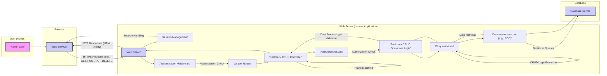

# Project Design Document: Laravel Backpack CRUD

**Version:** 1.1
**Date:** October 26, 2023
**Author:** AI Software Architect

## 1. Introduction

This document provides an enhanced and more detailed design overview of the Laravel Backpack CRUD (Create, Read, Update, Delete) package. This refined design is specifically tailored to facilitate thorough threat modeling, enabling security professionals to effectively identify potential vulnerabilities and risks associated with the package.

## 2. Project Overview

Laravel Backpack is a widely adopted Laravel package that streamlines the creation of admin interfaces. Its primary function is to generate CRUD interfaces for Eloquent models, significantly simplifying the management of application data. This document focuses on the architecture and processes involved in generating and handling these CRUD operations within the package.

## 3. Goals

* Provide a comprehensive and refined architectural overview of the Laravel Backpack CRUD functionality, emphasizing security-relevant aspects.
* Detail the key components involved in the CRUD operations, with a focus on their security responsibilities and potential weaknesses.
* Describe the data flow during typical CRUD interactions, highlighting potential points of data exposure and manipulation.
* Identify the technologies and dependencies involved, noting any known security implications.
* Outline initial security considerations in greater detail, categorized for better threat identification.
* Introduce a preliminary threat landscape relevant to the system.

## 4. Target Audience

This document is intended for:

* Security architects and engineers conducting threat modeling and security assessments.
* Developers working with or extending the Laravel Backpack CRUD package, requiring a deeper understanding of its architecture and security implications.
* System administrators responsible for deploying, configuring, and maintaining applications utilizing Backpack.

## 5. Architecture Diagram

## 6. Component Breakdown

* **Admin User:** A human user who has been authenticated and authorized to access and manipulate data through the Backpack admin panel. Their actions are a primary source of input to the system.
* **Web Browser:** The client-side application used by the admin user. It renders the user interface and transmits user interactions to the web server. It's a potential target for client-side attacks.
* **Web Server (Laravel Application):** The server hosting the Laravel application. It receives and processes HTTP requests, executes application logic, and interacts with the database. It's a critical component for security.
* **Laravel Router:**  The component within Laravel responsible for mapping incoming HTTP requests to specific controller actions based on defined routes. Misconfiguration can lead to unauthorized access.
* **Backpack CRUD Controller:** A Laravel controller (typically extending Backpack's `CrudController`) that handles requests related to a specific Eloquent model's CRUD operations. It receives user input, orchestrates data retrieval and manipulation, and prepares responses. It's crucial for input validation and authorization.
* **Backpack CRUD Operations Logic:** The core of the Backpack CRUD package. This component contains the business logic for:
    * Displaying lists of records (index) - potential for data exposure.
    * Showing details of a single record (show) - potential for sensitive data leakage.
    * Displaying forms for creating new records (create) - entry point for potentially malicious input.
    * Processing form submissions for creating new records (store) - critical for input validation and data sanitization.
    * Displaying forms for editing existing records (edit) - similar input concerns as create.
    * Processing form submissions for updating existing records (update) - critical for input validation and authorization to modify data.
    * Deleting records (destroy) - requires strong authorization to prevent accidental or malicious data loss.
* **Eloquent Model:** A PHP representation of a database table. Backpack CRUD interacts with Eloquent models to retrieve, create, update, and delete data. Mass assignment vulnerabilities can exist here.
* **Database Abstraction (e.g., PDO):** Laravel's database layer, providing an abstraction over the underlying database system. It handles the execution of database queries. Proper configuration is crucial to prevent SQL injection.
* **Database Server:** The actual database system (e.g., MySQL, PostgreSQL) storing the application's persistent data. Security depends on proper access controls, encryption, and hardening.
* **Session Management:**  Laravel's mechanism for maintaining user session state. Secure session handling is essential to prevent session hijacking and fixation attacks.
* **Authentication Middleware:** Laravel middleware responsible for verifying the identity of the incoming request's user. It ensures only authenticated users can access protected routes.
* **Authorization Logic:**  The part of the application that determines if an authenticated user has the necessary permissions to perform a specific action. Backpack provides mechanisms for defining authorization rules.

## 7. Data Flow

The typical data flow for CRUD operations, with a focus on security considerations, is as follows:

* **Read (Listing Records):**
    * The admin user, after successful authentication (handled by Authentication Middleware), requests a list of records through the web browser.
    * The request reaches the Laravel Router, which routes it to the appropriate Backpack CRUD Controller action (e.g., `index`).
    * The Backpack CRUD Controller may perform authorization checks (Authorization Logic) to ensure the user has permission to view this data.
    * The controller action instructs the Eloquent Model to retrieve data from the database via the Database Abstraction.
    * The database returns the data. **Potential point of data exposure if not handled securely.**
    * The Eloquent Model provides the data to the controller.
    * The controller prepares the data for the view, potentially filtering sensitive information based on authorization rules, and sends an HTML response to the browser.
    * The browser renders the list of records. **Client-side vulnerabilities could expose this data.**
* **Read (Viewing a Single Record):**
    * Similar to listing, but focuses on a specific record. Authorization checks are crucial to prevent unauthorized viewing of sensitive data.
* **Create:**
    * The admin user navigates to the "create" form. Authentication and authorization are checked before displaying the form.
    * The request is routed to the controller's `create` action.
    * The controller prepares the form fields and sends an HTML form to the browser.
    * The admin user fills in the form and submits it. **This is a primary entry point for potentially malicious input.**
    * The form submission (typically a POST request) is routed to the controller's `store` action.
    * The controller **must** perform rigorous input validation and sanitization to prevent injection attacks.
    * If validation passes, the controller instructs the Eloquent Model to create a new record in the database with the provided data. **Careful handling of mass assignment is needed here.**
    * The database operation is performed.
    * The controller typically redirects the user.
* **Update:**
    * Similar to create, but involves fetching an existing record and applying updates. Authorization to modify the specific record is critical. Input validation and sanitization are equally important.
* **Delete:**
    * The admin user initiates a delete action. **Strong authorization checks are paramount to prevent accidental or malicious data deletion.**
    * The request (typically a DELETE request) is routed to the controller's `destroy` action.
    * The controller performs authorization checks.
    * If authorized, the controller instructs the Eloquent Model to delete the record from the database.

## 8. Technology Stack

* **Programming Language:** PHP - Requires secure coding practices to avoid vulnerabilities.
* **Framework:** Laravel - Provides built-in security features, but proper usage is essential.
* **Package:** Laravel Backpack/CRUD - Security depends on the package's code and its integration within the application.
* **Database:** Typically MySQL, PostgreSQL, SQLite, or SQL Server - Requires secure configuration, access controls, and potentially encryption.
* **Web Server:** Typically Apache or Nginx - Requires secure configuration to prevent server-level attacks.
* **Frontend Technologies:** HTML, CSS, JavaScript (potentially with libraries like jQuery) - Potential for client-side vulnerabilities like XSS.

## 9. Security Considerations

This section provides a more detailed breakdown of security considerations relevant to threat modeling:

* **Authentication and Authorization:**
    * **Weak or Missing Authentication:** Failure to properly authenticate admin users allows unauthorized access.
    * **Insufficient Authorization:**  Users may be able to access or modify data they shouldn't.
    * **Bypassable Authorization Checks:** Flaws in the authorization logic can be exploited.
* **Input Handling:**
    * **SQL Injection:**  Improperly sanitized user input in database queries.
    * **Cross-Site Scripting (XSS):**  Injecting malicious scripts into web pages viewed by other users.
    * **Cross-Site Request Forgery (CSRF):**  Tricking authenticated users into performing unintended actions.
    * **Mass Assignment Vulnerabilities:**  Allowing users to modify unintended database fields through request parameters.
    * **Insecure File Uploads:**  Allowing the upload of malicious files.
* **Data Protection:**
    * **Sensitive Data Exposure:**  Displaying sensitive information unnecessarily.
    * **Insecure Data Storage:**  Storing sensitive data without proper encryption.
    * **Data Breaches:**  Unauthorized access and exfiltration of data.
* **Session Management:**
    * **Session Fixation:**  An attacker forces a user to use a known session ID.
    * **Session Hijacking:**  An attacker obtains a valid user's session ID.
    * **Insecure Session Cookies:**  Cookies not marked as `HttpOnly` or `Secure`.
* **Error Handling:**
    * **Information Disclosure through Error Messages:**  Revealing sensitive information in error messages.
* **Dependency Management:**
    * **Vulnerable Dependencies:**  Using outdated or vulnerable versions of Laravel, Backpack, or other packages.
* **Logging and Monitoring:**
    * **Insufficient Logging:**  Lack of adequate logging makes it difficult to detect and investigate security incidents.
* **Deployment Environment:**
    * **Insecure Server Configuration:**  Misconfigured web server or database server.
    * **Lack of HTTPS:**  Exposing data in transit.

## 10. Preliminary Threat Landscape

Based on the architecture and security considerations, potential threats to the Laravel Backpack CRUD system include:

* **Injection Attacks:** SQL Injection, Cross-Site Scripting (XSS), Command Injection (if custom code execution is allowed).
* **Authentication and Authorization Failures:** Brute-force attacks, credential stuffing, privilege escalation.
* **Data Breaches:** Unauthorized access to sensitive data through vulnerabilities or misconfigurations.
* **Cross-Site Request Forgery (CSRF):**  Manipulating authenticated admin users.
* **Session Management Attacks:** Session hijacking, session fixation.
* **Denial of Service (DoS):**  Overwhelming the system with requests.
* **Malicious File Uploads:**  Uploading executable files or files that can be used for further attacks.
* **Information Disclosure:**  Leaking sensitive information through error messages or insecure data handling.

## 11. Deployment Considerations

The security of the Laravel Backpack CRUD application is also influenced by its deployment environment. Considerations include:

* **Cloud vs. On-Premise:** Cloud environments may offer different security features and responsibilities compared to on-premise deployments.
* **Server Hardening:**  Properly configuring and securing the web server and database server.
* **Network Security:**  Firewalls, intrusion detection/prevention systems.
* **Regular Security Audits and Penetration Testing:**  Proactively identifying vulnerabilities.

## 12. Future Considerations

This design document will be a key input for a comprehensive threat modeling exercise. Future steps include:

* **System Decomposition:** Further breaking down the system into smaller components for detailed analysis.
* **Asset Identification:**  Identifying valuable assets that need protection.
* **Threat Identification:**  Systematically identifying potential threats based on the STRIDE model or other methodologies.
* **Vulnerability Analysis:**  Identifying weaknesses in the design and implementation that could be exploited.
* **Risk Assessment:**  Evaluating the likelihood and impact of identified threats.
* **Countermeasure Identification:**  Proposing security controls to mitigate identified risks.
* **Security Testing:**  Validating the effectiveness of implemented security controls.

This enhanced design document provides a more detailed and security-focused overview of the Laravel Backpack CRUD package. It serves as a solid foundation for conducting thorough threat modeling and implementing appropriate security measures.