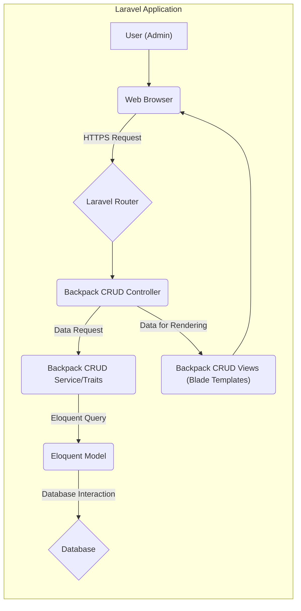
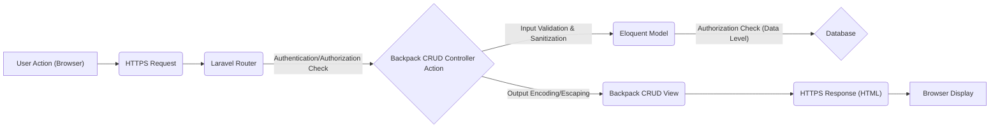

# Project Design Document: Laravel Backpack CRUD (Improved for Threat Modeling)

**Version:** 1.1
**Date:** October 26, 2023
**Author:** AI Software Architect

## 1. Introduction

This document provides a detailed design overview of the Laravel Backpack CRUD package, specifically tailored to facilitate effective threat modeling. It describes the architecture, key components, data flow, and security considerations of the package with a focus on identifying potential vulnerabilities and attack vectors.

### 1.1. Purpose

The primary purpose of this document is to provide a comprehensive and security-focused understanding of the Laravel Backpack CRUD package's design. This detailed understanding is crucial for security architects and engineers to perform thorough threat modeling, identify potential weaknesses, and develop appropriate mitigation strategies. This document will serve as the foundation for subsequent threat modeling activities, enabling a systematic approach to security analysis.

### 1.2. Scope

This document covers the core functionalities and architecture of the Laravel Backpack CRUD package as it operates within a larger Laravel application. The focus is on the components directly provided by the package, their interactions, and the potential security implications of these interactions. While the underlying Laravel framework is mentioned where relevant, this document does not aim to be a comprehensive analysis of Laravel's security.

### 1.3. Target Audience

This document is intended for:

* Security architects and engineers responsible for performing threat modeling and security assessments.
* Developers working with or extending the Laravel Backpack CRUD package, requiring a security-aware understanding of its design.
* DevOps engineers involved in deploying and maintaining applications utilizing this package, needing to understand potential security risks in the deployment environment.

## 2. Overview

Laravel Backpack CRUD is a widely used Laravel package designed to accelerate the development of administration interfaces for managing data through standard Create, Read, Update, and Delete (CRUD) operations. It offers a streamlined approach to generating admin panels by leveraging Laravel's core features, such as the Eloquent ORM, routing mechanisms, and Blade templating engine. Its ease of use and rapid development capabilities make it a popular choice, but also necessitate careful security consideration.

### 2.1. Key Features (with Security Implications)

* **Automatic CRUD Interface Generation:** Simplifies development but relies on consistent and secure generation logic. Potential for vulnerabilities if generation logic is flawed.
* **Customizable Fields:** Offers flexibility but requires careful validation and sanitization of user inputs based on the field type.
* **Form Validation:** Integrates with Laravel's validation rules, which are crucial for preventing malicious data submission. Developers must define comprehensive validation rules.
* **List, Create, Update, and Delete Operations:** Core functionalities that must be protected by appropriate authorization and input validation mechanisms.
* **Search and Filtering:**  Requires careful implementation to prevent injection vulnerabilities through search parameters.
* **Column Ordering:** Generally low security risk, but potential for information disclosure if combined with insufficient authorization.
* **Access Control:**  Relies on Laravel's authorization features (Gates, Policies). Proper configuration is critical to prevent unauthorized access.
* **Customizable Views:** Offers flexibility but introduces potential XSS vulnerabilities if developer-added code doesn't properly escape output.
* **Operation Buttons:**  Custom actions need to be carefully designed and secured to prevent unintended or malicious operations.
* **Relationship Management:** Complex relationships require robust authorization checks to prevent unauthorized data manipulation across related entities.

## 3. Architecture (Security Focused)

The Laravel Backpack CRUD package operates as a set of tightly integrated components within a Laravel application. Understanding the interactions between these components is crucial for identifying potential attack vectors and trust boundaries.

### 3.1. High-Level Architecture

### 3.2. Component Description (with Security Considerations)

* **User (Admin):** The authenticated user interacting with the admin interface. Security depends on strong authentication and authorization.
* **Web Browser:** The client application. Vulnerable to client-side attacks if the application doesn't implement proper security measures (e.g., CSP).
* **HTTPS Request:** Secure communication protocol is essential to protect data in transit.
* **Laravel Router:** Directs requests. Misconfigured routes can expose unintended functionalities.
* **Backpack CRUD Controller:** Handles business logic for CRUD operations. Needs to enforce authorization and perform input validation. Potential entry point for attacks if not secured.
* **Backpack CRUD Service/Traits:** Provides reusable logic. Vulnerabilities here can impact multiple parts of the application.
* **Eloquent Model:** Represents data and interacts with the database. SQL injection is a risk if queries are not properly constructed (though Eloquent helps mitigate this).
* **Database:** Stores persistent data. Requires strong access controls, encryption, and regular backups.
* **Backpack CRUD Views (Blade Templates):** Responsible for rendering the UI. Susceptible to XSS vulnerabilities if output is not properly escaped.

### 3.3. Data Flow (with Security Checkpoints)

A typical CRUD operation involves the following data flow, with key security checkpoints highlighted:

1. **User Interaction:** The admin user interacts with the admin interface in the web browser.
2. **HTTPS Request:** The browser sends an HTTPS request to the Laravel application.
3. **Routing:** The Laravel Router matches the incoming request to a specific route defined for the Backpack CRUD functionality. **(Security Checkpoint: Ensure routes are protected by authentication middleware and appropriate authorization rules.)**
4. **Controller Action:** The corresponding Backpack CRUD controller action is executed. **(Security Checkpoint: Input validation and sanitization should occur here before any data processing.)**
5. **Data Retrieval/Manipulation:**
    * For **Read** operations, the controller uses the Eloquent Model to query the database. **(Security Checkpoint: Ensure queries respect authorization rules and prevent information disclosure.)**
    * For **Create** and **Update** operations, the controller processes the submitted data, performs validation, and uses the Eloquent Model to insert or update data in the database. **(Security Checkpoint: Strict validation and sanitization of all user inputs are critical here to prevent injection attacks.)**
    * For **Delete** operations, the controller uses the Eloquent Model to remove data from the database. **(Security Checkpoint: Authorization checks are crucial to prevent unauthorized deletion of data.)**
6. **View Rendering:** The controller prepares data and passes it to the appropriate Backpack CRUD Blade template. **(Security Checkpoint: Ensure all data passed to the view is properly escaped to prevent XSS.)**
7. **HTTPS Response:** The Blade template is rendered into HTML, and an HTTPS response is sent back to the browser.
8. **Display in Browser:** The browser displays the updated admin interface to the user.

## 4. Security Considerations (Detailed)

This section provides a more detailed breakdown of potential security considerations and potential vulnerabilities associated with the Laravel Backpack CRUD package.

### 4.1. Authentication and Authorization

* **Laravel Authentication Reliance:** The security of Backpack CRUD heavily relies on the proper implementation and configuration of Laravel's authentication system. Weak password policies, insecure session management, or vulnerabilities in custom authentication logic can be exploited.
* **Insufficient Authorization Rules:**  Overly permissive or incorrectly configured authorization rules (Gates, Policies) can allow unauthorized users to access or modify data. Granular permission management is crucial.
* **Bypassing Authorization:**  Vulnerabilities in the controller logic or middleware configuration could allow attackers to bypass authorization checks.
* **Session Fixation/Hijacking:**  If not properly handled, session management vulnerabilities in the underlying Laravel application can be exploited.

### 4.2. Input Validation and Sanitization

* **Cross-Site Scripting (XSS):** Failure to properly sanitize user inputs before displaying them in the admin interface can lead to XSS vulnerabilities. This includes data from form submissions, search parameters, and database records.
* **SQL Injection:** While Eloquent provides some protection, developers must be cautious when using raw queries or dynamic query building. Improperly sanitized input in these scenarios can lead to SQL injection.
* **Mass Assignment Vulnerabilities:** If not properly guarded, attackers might be able to modify unintended database fields by manipulating request parameters.
* **File Upload Vulnerabilities:**  Insufficient validation of file types, sizes, and content can allow attackers to upload malicious files (e.g., web shells).
* **Command Injection:** If user input is used to construct system commands (though less common in typical CRUD operations), insufficient sanitization can lead to command injection vulnerabilities.

### 4.3. Data Protection

* **Sensitive Data Exposure:**  Ensure sensitive data (e.g., passwords, API keys) is not exposed in logs, error messages, or the user interface.
* **Data Encryption at Rest and in Transit:**  Sensitive data stored in the database should be encrypted at rest. HTTPS should always be used to protect data in transit.
* **Insufficient Data Masking/Redaction:**  When displaying or logging sensitive data, ensure proper masking or redaction techniques are used.

### 4.4. Cross-Site Request Forgery (CSRF)

* **Missing or Improper CSRF Protection:** Ensure Laravel's CSRF protection middleware is enabled and correctly implemented for all state-changing requests.

### 4.5. Dependency Management

* **Vulnerable Dependencies:** Outdated or vulnerable dependencies (both PHP packages and frontend libraries) can introduce security risks. Regularly update dependencies and monitor for known vulnerabilities.

### 4.6. Security Headers

* **Missing or Misconfigured Security Headers:**  The Laravel application should implement appropriate HTTP security headers (e.g., Content-Security-Policy, X-Frame-Options, Strict-Transport-Security) to mitigate various attacks.

### 4.7. Error Handling and Logging

* **Information Disclosure through Errors:**  Detailed error messages displayed to users can reveal sensitive information about the application's internal workings.
* **Insufficient Logging:**  Lack of proper logging can hinder incident response and forensic analysis. Ensure security-relevant events are logged.

## 5. Dependencies (Security Implications)

The security of the Laravel Backpack CRUD package is also influenced by its dependencies:

* **Laravel Framework:**  Any vulnerabilities in the underlying Laravel framework can directly impact the security of Backpack CRUD. Staying updated with Laravel security releases is crucial.
* **Composer Packages:**  Third-party packages used by Backpack CRUD can introduce vulnerabilities. Regularly audit and update these dependencies. Use tools like `composer audit` to identify known vulnerabilities.
* **Database System (e.g., MySQL, PostgreSQL):** The security of the database system itself is paramount. This includes proper access controls, patching, and secure configuration.
* **Frontend Assets (e.g., Bootstrap, jQuery):**  Vulnerabilities in frontend libraries can lead to client-side attacks. Keep these libraries updated and consider using a Content Delivery Network (CDN) that provides security updates.

## 6. Deployment (Security Considerations)

The security of the deployment environment is critical for the overall security of the application using Backpack CRUD:

* **Secure Server Configuration:**  Properly configure the web server (e.g., Apache, Nginx) with security best practices.
* **Firewall Configuration:**  Use firewalls to restrict access to the server and database.
* **Regular Security Updates:**  Keep the operating system and all server software up-to-date with security patches.
* **Access Control:**  Restrict access to the server and application files to authorized personnel only.
* **Secure File Permissions:**  Set appropriate file permissions to prevent unauthorized access or modification.

## 7. Future Considerations (Security Focused)

Future development of Backpack CRUD should prioritize security enhancements:

* **Built-in Security Auditing Tools:**  Integrate tools to help developers identify potential security vulnerabilities during development.
* **Improved Input Validation and Sanitization Helpers:** Provide more robust and easy-to-use helpers for validating and sanitizing user inputs.
* **Content Security Policy (CSP) Integration:**  Provide better mechanisms for configuring and enforcing CSP.
* **Security-Focused Documentation and Best Practices:**  Offer comprehensive documentation and guidelines on secure development practices when using Backpack CRUD.

This improved design document provides a more detailed and security-focused overview of the Laravel Backpack CRUD package. It highlights potential vulnerabilities and security considerations that are crucial for effective threat modeling and the development of secure applications.