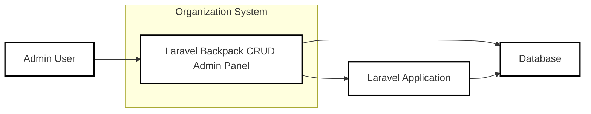
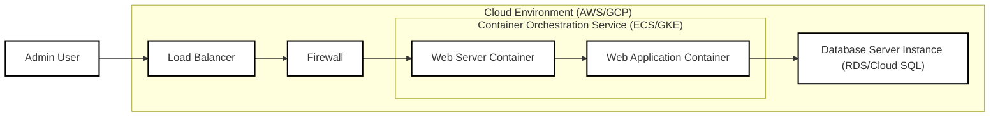

# BUSINESS POSTURE

This project, Laravel Backpack CRUD, aims to provide a rapid development tool for building administration interfaces within Laravel applications. The primary business priority is to accelerate the development process for creating back-office functionalities, enabling developers to quickly generate CRUD (Create, Read, Update, Delete) interfaces. This directly translates to reduced development time and costs for businesses needing admin panels for their Laravel applications. The goal is to empower developers with a user-friendly and efficient way to manage application data and configurations.

The most important business risks associated with this project revolve around data security and system availability. If the generated admin panels are vulnerable, it could lead to unauthorized access to sensitive business data, data breaches, and potential compliance violations. Misconfigurations or vulnerabilities in the CRUD interface could also disrupt business operations by affecting data integrity or system availability. For established companies, data breaches can lead to significant financial and reputational damage. For startups, especially those handling sensitive user data, security vulnerabilities can erode user trust and hinder growth.

# SECURITY POSTURE

Existing security controls for Laravel Backpack CRUD are primarily inherited from the underlying Laravel framework and best practices in web application development.

- security control: Laravel framework provides built-in security features including protection against common web vulnerabilities like Cross-Site Scripting (XSS), SQL Injection, and Cross-Site Request Forgery (CSRF). Implemented within the Laravel core framework.
- security control: Authentication mechanisms provided by Laravel, allowing developers to implement user login and session management for admin panel access. Implemented using Laravel's authentication components.
- security control: Authorization features in Laravel, enabling developers to define roles and permissions to control access to different parts of the admin panel and data. Implemented using Laravel's authorization facilities and Backpack's permission management.
- security control: Input validation is expected to be implemented by developers using Laravel's validation features to sanitize user inputs and prevent injection attacks. Implemented within Laravel controllers and form request classes.
- security control: Secure password hashing using bcrypt algorithm provided by Laravel for storing user credentials securely. Implemented by Laravel's authentication system.
- accepted risk: Reliance on developers to correctly implement and configure Laravel's security features and Backpack's functionalities. Misconfigurations or improper usage can introduce vulnerabilities.
- accepted risk: Security of third-party packages and dependencies used by Laravel and Backpack. Vulnerabilities in these dependencies could impact the security of the admin panel.

Recommended security controls to enhance the security posture:

- security control: Implement automated security scanning (SAST/DAST) in the development pipeline to identify potential vulnerabilities in the code and configuration.
- security control: Regularly perform dependency vulnerability scanning to detect and update vulnerable third-party packages.
- security control: Conduct periodic security audits and penetration testing to proactively identify and address security weaknesses.
- security control: Provide and enforce secure configuration guidelines and best practices for developers using Backpack CRUD to minimize misconfigurations.
- security control: Implement rate limiting and brute-force protection mechanisms for login attempts to prevent unauthorized access.

Security requirements for Laravel Backpack CRUD project:

- Authentication:
    - Requirement: Secure authentication mechanism to verify the identity of admin users accessing the panel.
    - Requirement: Support for strong password policies and multi-factor authentication (MFA) for enhanced security.
    - Requirement: Secure session management to protect user sessions from hijacking.
- Authorization:
    - Requirement: Role-based access control (RBAC) to manage user permissions and restrict access to specific functionalities and data based on roles.
    - Requirement: Granular permission control to define access at the entity and action level (e.g., create users, edit products).
    - Requirement: Audit logging of authorization decisions and access attempts for security monitoring and compliance.
- Input Validation:
    - Requirement: Comprehensive input validation for all user inputs in CRUD operations to prevent injection attacks (SQL injection, XSS, etc.).
    - Requirement: Server-side validation to ensure data integrity and security, complementing client-side validation.
    - Requirement: Proper encoding and sanitization of user inputs when displaying data to prevent XSS vulnerabilities.
- Cryptography:
    - Requirement: Secure storage of sensitive data, including user passwords, API keys, and other confidential information, using strong encryption algorithms.
    - Requirement: Use of HTTPS for all communication between the user's browser and the admin panel server to protect data in transit.
    - Requirement: Consider encryption for sensitive data at rest in the database if required by compliance or business needs.

# DESIGN

## C4 CONTEXT



Context Diagram Elements:

- Element:
    - Name: Admin User
    - Type: Person
    - Description: Individuals who manage the Laravel application's data and configurations through the Backpack CRUD admin panel.
    - Responsibilities: Managing application data, configuring system settings, monitoring application status.
    - Security controls: Strong password policy, multi-factor authentication, role-based access control.

- Element:
    - Name: Laravel Backpack CRUD Admin Panel
    - Type: Software System
    - Description: A web application built using Laravel Backpack CRUD package, providing a user interface for performing CRUD operations on the application's data.
    - Responsibilities: Presenting a user interface for data management, handling user requests, interacting with the Laravel Application and Database.
    - Security controls: Authentication, authorization, input validation, session management, HTTPS, security headers.

- Element:
    - Name: Laravel Application
    - Type: Software System
    - Description: The core Laravel application that Backpack CRUD is integrated into. It contains the business logic, models, and data that the admin panel manages.
    - Responsibilities: Handling business logic, data processing, interacting with the database, providing data to the admin panel.
    - Security controls: Framework-level security features, input validation, authorization within the application logic.

- Element:
    - Name: Database
    - Type: Data Store
    - Description: The database system (e.g., MySQL, PostgreSQL) used by the Laravel application to store and retrieve data.
    - Responsibilities: Persisting application data, ensuring data integrity and availability.
    - Security controls: Database access controls, encryption at rest (optional), regular backups, database hardening.

## C4 CONTAINER

```mermaid
flowchart LR
    subgraph "Laravel Backpack CRUD Admin Panel"
        A["Web Application" <br> (PHP/Laravel)]
    end
    B["Web Server" <br> (Nginx/Apache)]
    C["Database Server" <br> (MySQL/PostgreSQL)]
    D["Admin User" ]

    D --> B
    B --> A
    A --> C

    classDef element stroke:#000,fill:#fff,stroke-width:2px
    class A,B,C,D element
```

Container Diagram Elements:

- Element:
    - Name: Web Application
    - Type: Container
    - Description: The Laravel application code, including Backpack CRUD package, controllers, views, and models, written in PHP and utilizing the Laravel framework.
    - Responsibilities: Handling HTTP requests from users, implementing application logic, interacting with the database, rendering user interfaces.
    - Security controls: Laravel framework security features (XSS, CSRF protection), input validation, authorization logic, secure session management, vulnerability scanning during development.

- Element:
    - Name: Web Server
    - Type: Container
    - Description: Web server software (e.g., Nginx or Apache) responsible for serving the Laravel application and handling HTTP requests and responses.
    - Responsibilities: Accepting HTTP requests, serving static files, routing requests to the application server, handling SSL/TLS termination.
    - Security controls: HTTPS configuration, web server hardening, access control lists, rate limiting, regular security updates.

- Element:
    - Name: Database Server
    - Type: Container
    - Description: Database management system (e.g., MySQL or PostgreSQL) used to store and manage the application's data.
    - Responsibilities: Storing application data, providing data persistence, handling database queries from the application.
    - Security controls: Database access controls, database user authentication, encryption at rest (optional), regular backups, database server hardening, monitoring database activity.

- Element:
    - Name: Admin User
    - Type: Person
    - Description: Individuals interacting with the admin panel through a web browser.
    - Responsibilities: Accessing and managing application data through the web interface.
    - Security controls: Strong passwords, multi-factor authentication, secure browsing practices.

## DEPLOYMENT

Deployment Solution: Cloud-based deployment using a containerized environment (e.g., Docker on AWS ECS or Google Kubernetes Engine).



Deployment Diagram Elements:

- Element:
    - Name: Web Application Container
    - Type: Container Instance
    - Description: Docker container running the Laravel application code and Backpack CRUD.
    - Responsibilities: Executing the application logic, handling requests, interacting with the database.
    - Security controls: Container image scanning for vulnerabilities, least privilege container user, resource limits, regular container updates.

- Element:
    - Name: Web Server Container
    - Type: Container Instance
    - Description: Docker container running a web server (e.g., Nginx) to serve the application.
    - Responsibilities: Serving static files, routing requests to the application container, handling SSL/TLS termination.
    - Security controls: Web server hardening within the container, minimal container image, regular container updates.

- Element:
    - Name: Database Server Instance
    - Type: Infrastructure as a Service (IaaS)
    - Description: Managed database service (e.g., AWS RDS or Google Cloud SQL) providing a database server instance.
    - Responsibilities: Providing database services, managing database infrastructure, ensuring data persistence and availability.
    - Security controls: Database access controls (VPC, firewall rules), encryption at rest and in transit, automated backups, database monitoring, regular patching.

- Element:
    - Name: Load Balancer
    - Type: Network Device
    - Description: Load balancer distributing traffic across multiple web server containers for scalability and availability.
    - Responsibilities: Distributing incoming traffic, health checks for containers, SSL/TLS termination.
    - Security controls: HTTPS enforcement, DDoS protection, access control lists, security logging.

- Element:
    - Name: Firewall
    - Type: Network Device
    - Description: Network firewall controlling inbound and outbound traffic to the deployment environment.
    - Responsibilities: Filtering network traffic, blocking unauthorized access, protecting against network-based attacks.
    - Security controls: Network access control lists (ACLs), intrusion detection/prevention system (IDS/IPS) (optional).

- Element:
    - Name: Admin User
    - Type: Person
    - Description: Admin users accessing the admin panel from their browsers.
    - Responsibilities: Managing the application through the web interface.
    - Security controls: Secure endpoint access (HTTPS), user authentication, strong passwords, MFA.

## BUILD

```mermaid
flowchart LR
    A["Developer"] --> B["Code Repository (GitHub)"]
    B --> C["CI/CD Pipeline (GitHub Actions)"]
    C --> D["Build Process"]
    D --> E["Security Scanners (SAST/Dependency Check)"]
    E --> F["Artifact Repository (Container Registry)"]

    subgraph "Build Process Steps"
        D1["Code Checkout"]
        D2["Dependency Installation (Composer)"]
        D3["Code Compilation (if needed)"]
        D4["Unit Tests"]
        D5["Build Artifact Creation (Docker Image)"]
    end
    D --> D1
    D1 --> D2
    D2 --> D3
    D3 --> D4
    D4 --> D5
    D5 --> E

    classDef element stroke:#000,fill:#fff,stroke-width:2px
    class A,B,C,D,E,F,D1,D2,D3,D4,D5 element
```



Build Process Description:

1. Developer: Developers write code and commit changes to the code repository.
2. Code Repository (GitHub): Source code is stored and version controlled in a Git repository on GitHub.
3. CI/CD Pipeline (GitHub Actions): A CI/CD pipeline, such as GitHub Actions, is triggered upon code changes.
4. Build Process:
    - Code Checkout: The pipeline checks out the latest code from the repository.
    - Dependency Installation (Composer): Composer is used to install PHP dependencies defined in `composer.json`.
    - Code Compilation (if needed): For PHP projects, compilation might involve tasks like asset compilation (e.g., using Laravel Mix).
    - Unit Tests: Automated unit tests are executed to ensure code quality and functionality.
    - Build Artifact Creation (Docker Image): A Docker image is built containing the application code, dependencies, and web server configuration.
5. Security Scanners (SAST/Dependency Check): Security scans are performed on the built artifacts:
    - SAST (Static Application Security Testing): Scans the source code for potential vulnerabilities.
    - Dependency Check: Checks for known vulnerabilities in third-party dependencies.
6. Artifact Repository (Container Registry): The built and scanned Docker image is pushed to a container registry (e.g., Docker Hub, AWS ECR, Google GCR).

Build Process Security Controls:

- security control: Secure code repository (GitHub) with access controls and audit logging.
- security control: CI/CD pipeline (GitHub Actions) configured with secure credentials management and workflow permissions.
- security control: Automated security scanning (SAST, dependency check) integrated into the CI/CD pipeline to identify vulnerabilities early in the development lifecycle.
- security control: Use of trusted base images for Docker image builds to minimize the attack surface.
- security control: Image signing and verification to ensure the integrity and authenticity of built artifacts.
- security control: Access control to the artifact repository to restrict who can push and pull images.

# RISK ASSESSMENT

Critical business process being protected: Management of application data and configurations through the admin panel. This includes creating, reading, updating, and deleting sensitive business information. Disruption or compromise of this process can directly impact business operations and data integrity.

Data being protected and its sensitivity: The data being protected depends on the specific Laravel application using Backpack CRUD. It can range from relatively low-sensitivity data to highly sensitive data, including:

- User data (personal information, contact details, etc.): Sensitivity level depends on privacy regulations and business context.
- Financial data (transaction records, payment information): Highly sensitive, requires strong protection due to financial and regulatory risks.
- Business-critical data (product information, customer orders, internal documents): Sensitivity level depends on the business impact of data loss or breach.
- Application configuration data (API keys, database credentials): Highly sensitive, compromise can lead to complete system compromise.

The sensitivity of data managed through the admin panel directly correlates with the potential impact of a security breach. Higher sensitivity data requires stronger security controls and risk mitigation measures.

# QUESTIONS & ASSUMPTIONS

Questions:

- What type of data will be managed through the admin panel using Backpack CRUD? Understanding the data sensitivity is crucial for tailoring security controls.
- What are the specific compliance requirements (e.g., GDPR, HIPAA, PCI DSS) that the application and admin panel need to adhere to? Compliance requirements will dictate specific security controls and data protection measures.
- What is the expected user base and access patterns for the admin panel? This will help in determining scalability and performance requirements, as well as potential attack vectors.
- What is the organization's risk appetite? A higher risk appetite might lead to accepting certain security risks in favor of faster development or lower costs.
- Are there any existing security policies or standards within the organization that need to be followed? Alignment with existing policies ensures consistency and reduces security gaps.

Assumptions:

- BUSINESS POSTURE:
    - The primary business goal is rapid development of admin interfaces.
    - Data security and system availability are important business risks.
    - The organization values both developer productivity and security.
- SECURITY POSTURE:
    - Laravel framework's security features are utilized as a baseline.
    - Developers are expected to follow secure coding practices.
    - Security is a shared responsibility between the Backpack CRUD package and the developers implementing it.
- DESIGN:
    - The admin panel is deployed in a cloud environment using containers.
    - A CI/CD pipeline is used for building and deploying the application.
    - Standard web application security best practices are applicable.