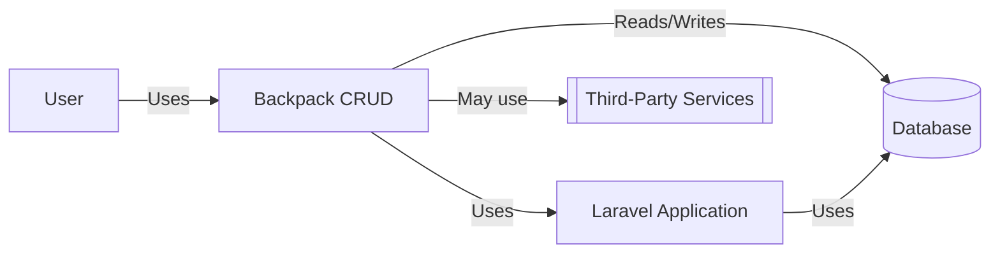
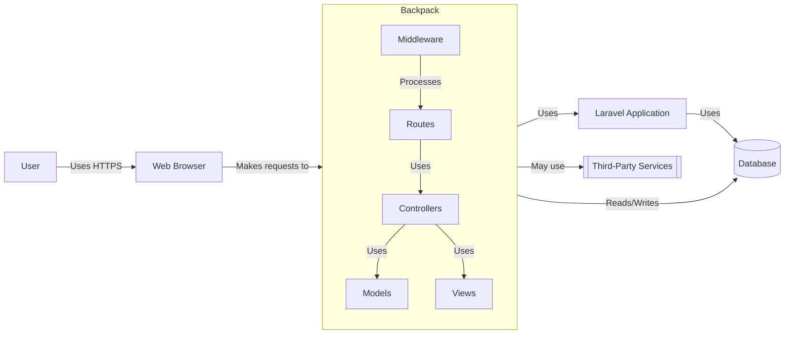
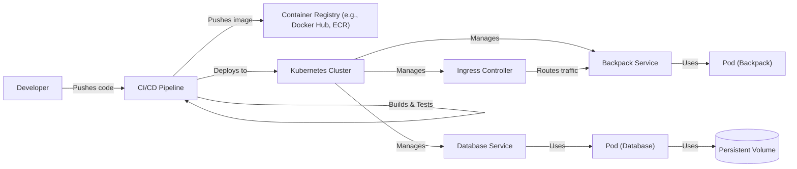
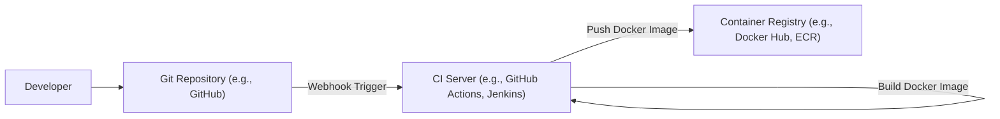

Okay, let's create a design document for the Laravel Backpack CRUD project.

# BUSINESS POSTURE

Business Priorities and Goals:

*   Provide a fast and efficient way to build admin panels for Laravel applications.
*   Reduce development time and cost associated with creating custom admin interfaces.
*   Offer a flexible and customizable solution that can adapt to various project needs.
*   Maintain a high level of code quality and security.
*   Foster a strong community around the project.
*   Provide good documentation and support.

Most Important Business Risks:

*   Security vulnerabilities in the package could expose user data or compromise applications using it.
*   Lack of maintainability or extensibility could limit the project's long-term viability.
*   Poor performance or scalability could impact the usability of admin panels built with Backpack.
*   Inadequate documentation or support could hinder adoption and user satisfaction.
*   Competition from other admin panel solutions could reduce market share.

# SECURITY POSTURE

Existing Security Controls:

*   security control: Laravel's built-in security features: Backpack leverages Laravel's underlying security mechanisms, including authentication, authorization, encryption, and protection against common web vulnerabilities (e.g., XSS, CSRF, SQL injection). Described in Laravel documentation.
*   security control: Input validation: Backpack likely uses Laravel's validation features to sanitize and validate user input, reducing the risk of injection attacks. Described in Backpack and Laravel documentation.
*   security control: Role-based access control (RBAC): Backpack provides mechanisms for defining user roles and permissions, allowing granular control over access to different parts of the admin panel. Described in Backpack documentation.
*   security control: Regular updates and security patches: The Backpack team actively maintains the project and releases updates to address security vulnerabilities. Described in GitHub repository and release notes.

Accepted Risks:

*   accepted risk: Dependence on third-party packages: Backpack, like any Laravel project, relies on external dependencies. Vulnerabilities in these dependencies could potentially impact Backpack's security.
*   accepted risk: User misconfiguration: While Backpack provides security features, incorrect configuration by users (e.g., weak passwords, overly permissive roles) could still lead to security breaches.
*   accepted risk: Potential for unknown vulnerabilities: Despite best efforts, there's always a possibility of undiscovered security flaws in the codebase.

Recommended Security Controls:

*   security control: Implement strict Content Security Policy (CSP) to mitigate XSS attacks.
*   security control: Enforce strong password policies and multi-factor authentication (MFA).
*   security control: Conduct regular security audits and penetration testing.
*   security control: Implement robust logging and monitoring to detect and respond to security incidents.
*   security control: Use a dependency vulnerability scanner to identify and address known vulnerabilities in third-party packages.
*   security control: Provide security hardening guidelines for users deploying Backpack applications.

Security Requirements:

*   Authentication:
    *   Support for secure user authentication using strong password hashing algorithms (e.g., bcrypt, Argon2).
    *   Integration with Laravel's authentication system.
    *   Option for multi-factor authentication (MFA).
*   Authorization:
    *   Fine-grained role-based access control (RBAC) to restrict access to specific resources and operations.
    *   Ability to define custom permissions and roles.
*   Input Validation:
    *   Thorough validation of all user inputs to prevent injection attacks (SQL injection, XSS, etc.).
    *   Use of whitelisting and data type validation.
*   Cryptography:
    *   Secure storage of sensitive data (e.g., passwords, API keys) using appropriate encryption techniques.
    *   Use of HTTPS for all communication.
*   Output Encoding:
    *   Proper encoding of all output to prevent cross-site scripting (XSS) vulnerabilities.

# DESIGN

## C4 CONTEXT

Element Descriptions:

*   Element:
    *   Name: User
    *   Type: Person
    *   Description: A person who interacts with the Backpack admin panel.
    *   Responsibilities: Managing data, configuring settings, performing administrative tasks.
    *   Security controls: Authentication, Authorization (RBAC).
*   Element:
    *   Name: Backpack CRUD
    *   Type: Software System
    *   Description: The Laravel Backpack CRUD package, providing the admin panel functionality.
    *   Responsibilities: Providing UI for CRUD operations, handling user input, interacting with the database and Laravel application.
    *   Security controls: Input validation, output encoding, authentication, authorization (RBAC), CSRF protection.
*   Element:
    *   Name: Database
    *   Type: Database
    *   Description: The database used by the Laravel application and Backpack.
    *   Responsibilities: Storing application data.
    *   Security controls: Access controls, encryption at rest, regular backups.
*   Element:
    *   Name: Laravel Application
    *   Type: Software System
    *   Description: The main Laravel application that Backpack extends.
    *   Responsibilities: Handling business logic, interacting with the database.
    *   Security controls: Laravel's built-in security features.
*   Element:
    *   Name: Third-Party Services
    *   Type: Software System
    *   Description: External services that Backpack might interact with (e.g., email providers, payment gateways).
    *   Responsibilities: Providing specific functionalities.
    *   Security controls: Secure communication (HTTPS), API keys, authentication.

## C4 CONTAINER

Element Descriptions:

*   Element:
    *   Name: User
    *   Type: Person
    *   Description: A person who interacts with the Backpack admin panel.
    *   Responsibilities: Managing data, configuring settings, performing administrative tasks.
    *   Security controls: Authentication, Authorization (RBAC).
*   Element:
    *   Name: Web Browser
    *   Type: Software System
    *   Description: User's web browser.
    *   Responsibilities: Rendering the admin panel UI, making requests to the server.
    *   Security controls: Browser security settings, HTTPS.
*   Element:
    *   Name: Backpack CRUD
    *   Type: Software System
    *   Description: The Laravel Backpack CRUD package.
    *   Responsibilities: Providing UI for CRUD operations, handling user input, interacting with the database and Laravel application.
    *   Security controls: Input validation, output encoding, authentication, authorization (RBAC), CSRF protection.
*   Element:
    *   Name: Laravel Application
    *   Type: Software System
    *   Description: The main Laravel application.
    *   Responsibilities: Handling business logic, interacting with the database.
    *   Security controls: Laravel's built-in security features.
*   Element:
    *   Name: Database
    *   Type: Database
    *   Description: The database.
    *   Responsibilities: Storing application data.
    *   Security controls: Access controls, encryption at rest, regular backups.
*   Element:
    *   Name: Third-Party Services
    *   Type: Software System
    *   Description: External services.
    *   Responsibilities: Providing specific functionalities.
    *   Security controls: Secure communication (HTTPS), API keys, authentication.
*   Element:
    *   Name: Controllers
    *   Type: Container
    *   Description: Backpack CRUD controllers.
    *   Responsibilities: Handling user requests, interacting with models and views.
    *   Security controls: Input validation, authorization checks.
*   Element:
    *   Name: Views
    *   Type: Container
    *   Description: Backpack CRUD views.
    *   Responsibilities: Rendering the user interface.
    *   Security controls: Output encoding.
*   Element:
    *   Name: Models
    *   Type: Container
    *   Description: Backpack CRUD models (and Laravel Eloquent models).
    *   Responsibilities: Representing data and interacting with the database.
    *   Security controls: Data validation.
*   Element:
    *   Name: Routes
    *   Type: Container
    *   Description: Backpack CRUD routes.
    *   Responsibilities: Mapping URLs to controller actions.
    *   Security controls: Route-level middleware.
*   Element:
    *   Name: Middleware
    *   Type: Container
    *   Description: Backpack and Laravel middleware.
    *   Responsibilities: Intercepting requests and performing actions (e.g., authentication, authorization, CSRF protection).
    *   Security controls: Authentication, authorization, CSRF protection.

## DEPLOYMENT

Possible Deployment Solutions:

1.  Traditional VPS (Virtual Private Server): Deploying the Laravel application and Backpack on a VPS like DigitalOcean, Linode, or AWS EC2.
2.  PaaS (Platform as a Service): Using a PaaS provider like Heroku, AWS Elastic Beanstalk, or Google App Engine to simplify deployment and scaling.
3.  Containerized Deployment: Using Docker and Kubernetes to containerize the application and deploy it on a container orchestration platform like AWS ECS, Google Kubernetes Engine (GKE), or Azure Kubernetes Service (AKS).
4.  Serverless Deployment: Using AWS Lambda, Azure Functions, or Google Cloud Functions to deploy parts of the application as serverless functions. This is less likely for a full admin panel but could be used for specific API endpoints.

Chosen Solution (Containerized Deployment with Kubernetes):

Element Descriptions:

*   Element:
    *   Name: Developer
    *   Type: Person
    *   Description: A developer working on the project.
    *   Responsibilities: Writing code, committing changes.
    *   Security controls: Code reviews, secure coding practices.
*   Element:
    *   Name: CI/CD Pipeline
    *   Type: Process
    *   Description: The continuous integration and continuous deployment pipeline.
    *   Responsibilities: Building, testing, and deploying the application.
    *   Security controls: SAST, DAST, dependency scanning.
*   Element:
    *   Name: Container Registry
    *   Type: System
    *   Description: A registry for storing Docker images.
    *   Responsibilities: Storing and serving container images.
    *   Security controls: Access controls, image scanning.
*   Element:
    *   Name: Kubernetes Cluster
    *   Type: System
    *   Description: The Kubernetes cluster where the application is deployed.
    *   Responsibilities: Orchestrating containers, managing resources.
    *   Security controls: Network policies, RBAC, pod security policies.
*   Element:
    *   Name: Ingress Controller
    *   Type: Component
    *   Description: An Ingress controller to manage external access to the application.
    *   Responsibilities: Routing traffic to the correct services.
    *   Security controls: TLS termination, access controls.
*   Element:
    *   Name: Backpack Service
    *   Type: Component
    *   Description: A Kubernetes service for the Backpack application.
    *   Responsibilities: Exposing the Backpack pods.
    *   Security controls: Network policies.
*   Element:
    *   Name: Database Service
    *   Type: Component
    *   Description: A Kubernetes service for the database.
    *   Responsibilities: Exposing the database pod.
    *   Security controls: Network policies.
*   Element:
    *   Name: Persistent Volume
    *   Type: Component
    *   Description: Persistent storage for the database.
    *   Responsibilities: Providing persistent storage.
    *   Security controls: Encryption at rest.
*   Element:
    *   Name: Pod (Backpack)
    *   Type: Component
    *   Description: A Kubernetes pod running the Backpack application container.
    *   Responsibilities: Running the application code.
    *   Security controls: Resource limits, security context.
*   Element:
    *   Name: Pod (Database)
    *   Type: Component
    *   Description: A Kubernetes pod running the database container.
    *   Responsibilities: Running the database server.
    *   Security controls: Resource limits, security context.

## BUILD

Build Process Description:

1.  Developer commits code to the Git repository (e.g., GitHub).
2.  A webhook triggers the CI server (e.g., GitHub Actions, Jenkins).
3.  The CI server checks out the code from the repository.
4.  The CI server runs unit tests (e.g., using PHPUnit).
5.  The CI server runs static analysis (SAST) tools (e.g., Psalm, PHPStan) to identify potential code quality and security issues.
6.  The CI server runs a dependency check (e.g., Composer Audit) to identify known vulnerabilities in third-party packages.
7.  The CI server builds the Laravel application (e.g., runs `composer install`, compiles assets).
8.  The CI server builds a Docker image containing the application code and its dependencies.
9.  The CI server pushes the Docker image to a container registry (e.g., Docker Hub, ECR).

Security Controls in Build Process:

*   security control: Code reviews: All code changes should be reviewed by another developer before being merged.
*   security control: SAST (Static Application Security Testing): Use tools like Psalm or PHPStan to identify potential security vulnerabilities in the code.
*   security control: Dependency scanning: Use tools like Composer Audit or Dependabot to identify known vulnerabilities in third-party packages.
*   security control: Secure build environment: The CI server should be configured securely, with limited access and appropriate security measures.
*   security control: Image signing: Consider signing Docker images to ensure their integrity.

# RISK ASSESSMENT

Critical Business Processes to Protect:

*   User authentication and authorization.
*   Data management (CRUD operations).
*   Configuration of the admin panel.
*   Access to sensitive data (if any) managed through the admin panel.

Data to Protect and Sensitivity:

*   User credentials (passwords, usernames, email addresses): Highly sensitive.
*   Application data managed through the admin panel: Sensitivity depends on the specific application. It could range from non-sensitive to highly sensitive (e.g., PII, financial data).
*   Configuration settings: Moderately sensitive, as they could be used to exploit vulnerabilities if misconfigured.

# QUESTIONS & ASSUMPTIONS

Questions:

*   What specific types of data will be managed through Backpack in typical use cases? This will help to better assess the data sensitivity.
*   Are there any specific compliance requirements (e.g., GDPR, HIPAA) that need to be considered?
*   What is the expected scale of deployments (number of users, data volume)?
*   Are there any existing security policies or guidelines that should be followed?
*   What level of access will developers have to production environments?

Assumptions:

*   BUSINESS POSTURE: The primary goal is to provide a secure and efficient way to build admin panels. Security is a high priority.
*   SECURITY POSTURE: Laravel's built-in security features are properly utilized. Developers using Backpack are expected to have a basic understanding of security best practices.
*   DESIGN: The application will be deployed using a containerized approach (e.g., Docker and Kubernetes). A database will be used to store application data. The application will primarily interact with a single Laravel application.