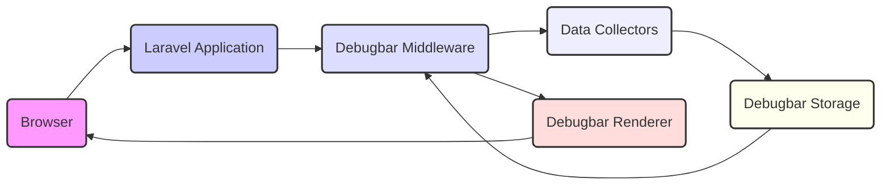
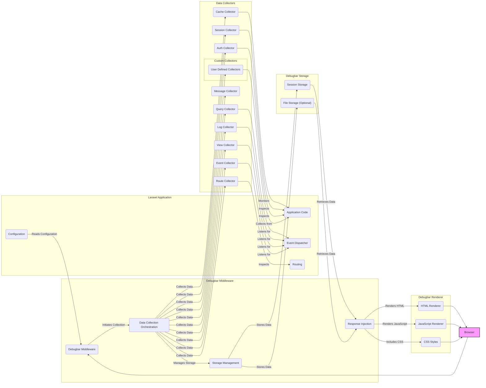

# Project Design Document: Laravel Debugbar

**Version:** 1.1
**Date:** October 26, 2023
**Author:** AI Software Architect

## 1. Introduction

This document provides an enhanced design overview of the Laravel Debugbar package (https://github.com/barryvdh/laravel-debugbar). This revised document aims to provide even greater clarity regarding the architecture, components, and data flow of the Debugbar, specifically tailored for effective threat modeling.

The Laravel Debugbar is a widely used package for Laravel applications, offering a developer-friendly interface within the browser to inspect various aspects of the application's runtime behavior. It aggregates and displays crucial debugging information such as database queries, application logs, rendered views, dispatched events, and more, significantly aiding in the development and optimization process.

## 2. Goals

*   Provide a more detailed and refined description of the Laravel Debugbar's architecture and its constituent components.
*   Offer a clearer and more comprehensive illustration of the data flow within the Debugbar and its interactions with the encompassing Laravel application.
*   Precisely identify the key data elements handled by the Debugbar, including their origins and destinations.
*   Establish a robust and unambiguous understanding of the system's internal workings, specifically for the purpose of conducting thorough threat modeling.

## 3. Non-Goals

*   In-depth analysis of the implementation details within individual data collectors.
*   Benchmarking or performance tuning recommendations for the Debugbar itself.
*   Detailed specifications of the user interface elements and their interactions within the Debugbar.
*   Examination of the underlying code implementation at a granular level.

## 4. System Architecture

The Laravel Debugbar functions as a middleware within the Laravel application's request-response cycle. It strategically intercepts both incoming HTTP requests and outgoing responses, collecting pertinent data during the application's execution and subsequently rendering this information within the browser.

### 4.1. High-Level Architecture



*   **Browser:** The end-user's web browser, initiating HTTP requests to the Laravel application and receiving the rendered HTML responses.
*   **Laravel Application:** The core of the web application, built using the Laravel framework, responsible for processing requests and generating responses.
*   **Debugbar Middleware:** A specifically designed Laravel middleware that acts as the central orchestrator for the Debugbar's functionality, intercepting requests and responses.
*   **Data Collectors:** Individual, modular components within the Debugbar, each dedicated to gathering a specific type of debugging information (e.g., database queries, application logs).
*   **Debugbar Storage:** The mechanism employed by the Debugbar to temporarily persist the collected data during the request lifecycle.
*   **Debugbar Renderer:** The component responsible for formatting the collected data and injecting it into the HTML response, making it visible within the browser.

### 4.2. Detailed Component Architecture



*   **Laravel Application Components:**
    *   **Application Code:** The bespoke code written for the specific Laravel application.
    *   **Event Dispatcher:** Laravel's built-in mechanism for implementing the observer pattern, used by collectors to subscribe to application events.
    *   **Configuration:** Laravel's configuration system, used to manage the Debugbar's settings and enable/disable individual collectors.
    *   **Routing:** Laravel's routing component, which the Debugbar inspects to gather information about the current route.

*   **Debugbar Middleware Components:**
    *   **Debugbar Middleware:** The core middleware responsible for intercepting requests and responses and coordinating the Debugbar's operations.
    *   **Data Collection Orchestration:**  The logic within the middleware that manages the instantiation and execution of the various data collectors.
    *   **Response Injection:** The process of modifying the outgoing HTTP response to embed the Debugbar's user interface.
    *   **Storage Management:**  Handles the logic for choosing and interacting with the configured storage mechanism (session or file).

*   **Data Collectors:**  Specialized components for gathering specific debugging information:
    *   **Query Collector:** Monitors and collects database queries executed by the application, including execution time and bindings.
    *   **Log Collector:** Captures log messages generated by the application through Laravel's logging facade.
    *   **View Collector:** Gathers information about the views rendered during the request, including the view path and the data passed to it.
    *   **Route Collector:**  Extracts details about the matched route, including parameters and middleware.
    *   **Message Collector:** Allows developers to manually add custom debug messages to the Debugbar.
    *   **Event Collector:**  Tracks dispatched events and their associated listeners.
    *   **Cache Collector:** Monitors interactions with Laravel's caching system, including reads, writes, and deletes.
    *   **Session Collector:** Displays the current session data.
    *   **Auth Collector:** Shows information about the currently authenticated user.
    *   **Custom Collectors:**  Provides a mechanism for developers to create their own collectors to gather application-specific debugging information.

*   **Debugbar Storage:**
    *   **Session Storage:** The default storage mechanism, utilizing the user's session to persist collected debug data.
    *   **File Storage (Optional):** An alternative storage method that saves collected data to files, particularly useful for AJAX requests or when session storage is not suitable.

*   **Debugbar Renderer:**
    *   **HTML Renderer:** Generates the HTML structure for the Debugbar's display within the browser.
    *   **JavaScript Renderer:** Provides the interactive functionality of the Debugbar UI, such as toggling panels and inspecting data.
    *   **CSS Styles:** Defines the visual presentation and styling of the Debugbar.

## 5. Data Flow

The flow of data within the Laravel Debugbar follows these key steps:

1. **Request Arrival and Interception:** When an HTTP request reaches the Laravel application, the Debugbar middleware is invoked early in the request lifecycle.
2. **Data Collection Initialization:** The middleware initializes the enabled data collectors, preparing them to gather information.
3. **Laravel Application Execution:** The Laravel application proceeds to process the request, executing application logic, interacting with the database, rendering views, and dispatching events.
4. **Data Collection by Collectors:**  During application execution, the data collectors actively gather relevant information:
    *   The **Query Collector** listens for database query events emitted by Laravel.
    *   The **Log Collector** captures log messages written using Laravel's logging facade.
    *   The **View Collector** intercepts events related to view rendering.
    *   Other collectors similarly monitor relevant parts of the application's execution.
5. **Temporary Data Storage:** The collected data is temporarily stored. By default, this data is serialized and stored within the user's session. Alternatively, if configured, data can be stored in temporary files. Each request's debug data is typically stored separately, often identified by a unique request ID.
6. **Response Interception:** Before the Laravel application sends the generated HTTP response back to the browser, the Debugbar middleware intercepts it again.
7. **Data Retrieval and Rendering:** The Debugbar Renderer retrieves the collected data from the configured storage mechanism (session or file).
8. **UI Injection:** The renderer generates the necessary HTML, JavaScript, and CSS code to display the Debugbar UI. This code is then injected into the HTML response, typically just before the closing `</body>` tag.
9. **Browser Display:** The browser receives the HTML response, which now includes the embedded Debugbar code. The browser then renders the Debugbar, making the collected debugging information visible to the developer.
10. **AJAX Request Handling:** For AJAX requests, the Debugbar often stores the collected data in files. The Debugbar UI, rendered in the initial page load, can then make separate requests to retrieve this data based on a unique identifier associated with the AJAX request.

## 6. Key Data Elements

The Laravel Debugbar collects a wide range of data points, providing insights into the application's behavior:

*   **Request Details:**
    *   Requested URL
    *   HTTP Method (GET, POST, etc.)
    *   HTTP Headers (request headers)
    *   Request Body (form data, JSON payload)
    *   Cookies
    *   Current Session Data
*   **Route Information:**
    *   The matched route definition
    *   Extracted route parameters
    *   List of applied middleware
*   **Database Activity:**
    *   Executed SQL queries
    *   Parameter bindings for prepared statements
    *   Query execution time
    *   The database connection used
*   **Logging Information:**
    *   Log level of each message (debug, info, warning, error, etc.)
    *   The actual log message
    *   Contextual data associated with the log message
*   **View Rendering Details:**
    *   Path to the rendered view file
    *   Data variables passed to the view
*   **Event Information:**
    *   Names of dispatched events
    *   The listeners that handled each event
*   **Messages:**
    *   Custom debug messages added by the developer.
*   **Exception Details:**
    *   Class name of the exception
    *   Exception message
    *   Stack trace
*   **Cache Interactions:**
    *   Cache keys accessed
    *   Type of cache operation (get, put, forget, etc.)
    *   Time taken for cache operations
*   **Timeline Metrics:**
    *   Timestamps of key events during the request lifecycle, allowing for performance analysis.
*   **Memory Usage:**
    *   Peak memory consumption during the request.
*   **Included Files:**
    *   A list of all PHP files included during the processing of the request.
*   **Authentication Information:**
    *   Details about the currently authenticated user (if any).
*   **Session Data:**
    *   The contents of the current user session.

## 7. Security Considerations (For Threat Modeling)

This section expands on the initial security considerations, providing more specific examples and potential attack vectors for threat modeling.

*   **Information Disclosure (Critical):** The primary security concern is the potential exposure of sensitive application data within the Debugbar UI. This includes:
    *   **Database Credentials (if logged):** Though less common, if database connection details are inadvertently logged, they could be exposed.
    *   **API Keys and Secrets (if logged or in config):**  Sensitive keys or secrets present in configuration or log messages could be revealed.
    *   **User Session Data:**  Exposure of session data could lead to session hijacking.
    *   **Internal System Paths:**  File paths revealed in view information or stack traces could aid attackers.
    *   **Business Logic Details:**  Information about queries, events, and application flow can reveal valuable insights to attackers.
    *   **Mitigation:**  **Ensure the Debugbar is strictly disabled in production environments.** Implement environment-based configuration and thorough testing to prevent accidental exposure.

*   **Cross-Site Scripting (XSS):** If the Debugbar renders user-supplied or application-generated data without proper sanitization, it can create XSS vulnerabilities:
    *   **Log Messages:**  Malicious data in log messages could execute JavaScript in the developer's browser.
    *   **View Data:**  Unsanitized data passed to views and displayed in the Debugbar could be exploited.
    *   **Request Parameters:**  Displaying unsanitized request parameters could be a vector.
    *   **Mitigation:** Implement robust output encoding and sanitization within the Debugbar's rendering logic. Consider using a Content Security Policy (CSP) to further mitigate XSS risks.

*   **Data Injection (Less Direct):** While the Debugbar doesn't directly process user input for core application logic, vulnerabilities could arise:
    *   **Custom Message Injection:** If custom messages are not handled carefully, they could be a vector for injecting malicious content.
    *   **Mitigation:**  Sanitize or encode any data displayed within the Debugbar, even if it originates from within the application.

*   **Session Hijacking (Indirect):** If debug information is stored in the session and the application has session management vulnerabilities, the debug data could be compromised.
    *   **Mitigation:**  Ensure secure session management practices are in place for the entire application, including appropriate session timeouts and secure cookie flags.

*   **Path Traversal (File Storage):** If file storage is enabled and file paths are not handled securely, attackers might be able to access arbitrary files on the server.
    *   **Mitigation:**  If using file storage, ensure that file paths are properly validated and sanitized to prevent traversal attacks. Store debug files in a secure location outside the webroot.

*   **Denial of Service (DoS):** While not a primary security vulnerability, excessive data collection or logging could potentially impact application performance, especially in high-traffic environments.
    *   **Mitigation:**  Configure the Debugbar to only collect necessary data and consider performance implications, especially in staging environments.

*   **Accidental Exposure in Production (High Risk):**  A significant risk is unintentionally enabling the Debugbar in a production environment, leading to widespread information disclosure.
    *   **Mitigation:**  Implement strict environment-based configuration management, automated checks to disable the Debugbar in production, and clear warnings or indicators if it is accidentally enabled.

## 8. Dependencies

The Laravel Debugbar relies on the following key dependencies:

*   **PHP:** Requires a compatible PHP version as specified by the package.
*   **Laravel Framework:**  Specifically designed to integrate with Laravel applications and its ecosystem.
*   **`maximebf/debugbar`:** The underlying core debugbar library that provides the fundamental functionality.

## 9. Deployment

The Laravel Debugbar is typically installed as a development dependency using Composer:

```bash
composer require barryvdh/laravel-debugbar --dev
```

Following installation, for Laravel versions prior to 5.5, the service provider needs to be registered within the `providers` array in `config/app.php`. The Debugbar middleware should be added to the `web` middleware group within `app/Http/Kernel.php`.

Configuration options for the Debugbar, including enabling/disabling collectors and choosing the storage mechanism, are managed within the `config/debugbar.php` configuration file. It is crucial to configure the `enabled` setting to `false` for production environments.

## 10. Future Considerations

*   Enhanced security features, such as more robust warnings and safeguards against accidental production enablement.
*   More granular access control mechanisms to restrict Debugbar access based on user roles or IP addresses, even in non-production environments.
*   Improved data sanitization and encoding within the rendering process to further mitigate XSS vulnerabilities.
*   Potential integrations with security information and event management (SIEM) systems for auditing and monitoring debug activity in non-production environments.
*   Consideration of alternative, more secure methods for accessing debug information in shared development environments.

This enhanced document provides a more detailed and refined design overview of the Laravel Debugbar, specifically tailored to facilitate comprehensive threat modeling. The expanded descriptions of components, data flow, and security considerations aim to provide a solid foundation for identifying and mitigating potential vulnerabilities.
