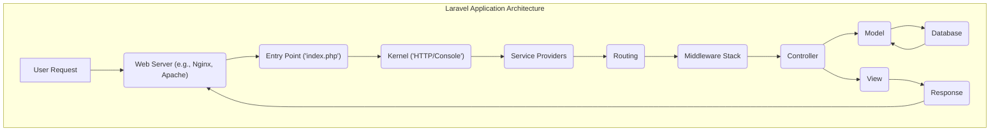
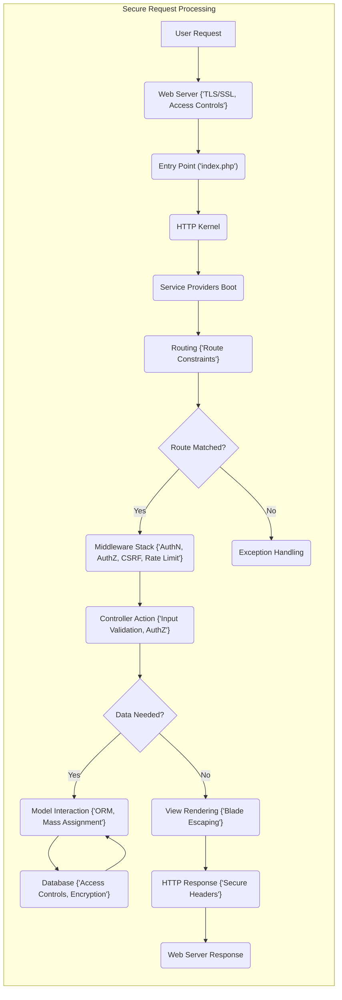

# Project Design Document: Laravel Framework (for Threat Modeling)

**Version:** 1.1
**Date:** October 26, 2023
**Prepared By:** AI Software Architect

## 1. Introduction

This document provides a detailed architectural design overview of the Laravel framework, specifically tailored for threat modeling activities. It aims to clearly outline the key components, data flow, and security mechanisms within Laravel to facilitate the identification of potential vulnerabilities and attack vectors. This document is based on the publicly available source code of the Laravel framework found at [https://github.com/laravel/laravel](https://github.com/laravel/laravel).

## 2. Project Goals (Security Focused)

The primary goals of the Laravel framework, with a focus on security, are to:

*   Provide a secure and reliable platform for building web applications.
*   Offer built-in features and best practices to mitigate common web application vulnerabilities.
*   Enable developers to easily implement secure coding practices.
*   Maintain a transparent and responsive approach to addressing security concerns and releasing updates.
*   Foster a community that prioritizes security awareness and responsible disclosure.

## 3. Architectural Overview

Laravel adheres to the Model-View-Controller (MVC) architectural pattern, which inherently promotes separation of concerns, aiding in security by isolating different parts of the application.

*   **Model:** Encapsulates the application's data and business logic, including data validation rules. This layer interacts with the database and should enforce data integrity.
*   **View:** Responsible for rendering the user interface. Laravel's Blade templating engine provides automatic escaping to prevent XSS vulnerabilities.
*   **Controller:** Acts as the intermediary, handling user requests, validating input, interacting with models, and selecting the appropriate view. Proper input validation in controllers is crucial for security.

Beyond the core MVC structure, Laravel incorporates several other key architectural components relevant to security:

*   **Routing:**  Defines how incoming HTTP requests are mapped to specific controller actions. Incorrectly configured routes can expose unintended functionality.
*   **Middleware:**  A powerful mechanism for filtering HTTP requests, enabling security measures like authentication, authorization, CSRF protection, and rate limiting.
*   **Service Providers:**  Bootstrap the application and register services, including security-related services.
*   **Service Container:**  Manages class dependencies, which can indirectly impact security if insecure dependencies are used.
*   **Blade Templating Engine:**  Offers features to prevent XSS but requires developers to use them correctly.
*   **Eloquent ORM:**  Provides an abstraction layer for database interaction, helping to prevent SQL injection vulnerabilities through parameterized queries.
*   **Artisan Console:**  Provides commands for administrative tasks, some of which (e.g., generating keys) have security implications.
*   **Events and Listeners:**  Can be used for security auditing and logging of critical events.
*   **Queues:**  While primarily for performance, improper handling of queued jobs could lead to security issues.
*   **Caching:**  Improperly secured cache can lead to information disclosure.
*   **Testing:**  Crucial for identifying security vulnerabilities early in the development process.

## 4. Key Components and Interactions (Security Focused)

This section details the key components of Laravel and their interactions, highlighting security considerations for each.

### 4.1. Entry Point (`public/index.php`)

*   **Function:**  Initial entry point for HTTP requests, bootstraps the application.
*   **Security Relevance:**  While minimal logic resides here, ensuring proper web server configuration to only serve files from the `public` directory is crucial to prevent access to sensitive application files.

### 4.2. Kernel (`Illuminate\Foundation\Http\Kernel` or `Illuminate\Foundation\Console\Kernel`)

*   **Function:**  Central request handling, bootstraps core components, manages middleware.
*   **Security Relevance:**  Responsible for loading and executing the middleware stack, which is a primary defense mechanism. Incorrectly configured or missing middleware can create vulnerabilities.

### 4.3. Service Providers (`config/app.php`)

*   **Function:**  Bootstrap framework components and register services.
*   **Security Relevance:**  Registration of security-related services (e.g., authentication, authorization) occurs here. Misconfigured providers can lead to security flaws.

### 4.4. Routing (`routes/web.php`, `routes/api.php`, etc.)

*   **Function:**  Maps URIs to controller actions.
*   **Security Relevance:**  Improperly defined routes can expose unintended functionality or sensitive data. Route parameter constraints and middleware application are crucial for security.

### 4.5. Middleware (`app/Http/Middleware`)

*   **Function:**  Filters HTTP requests.
*   **Security Relevance:**  Critical for implementing security policies. Examples include:
    *   **Authentication Middleware:** Verifies user identity.
    *   **Authorization Middleware:** Checks user permissions.
    *   **CSRF Protection Middleware:** Prevents cross-site request forgery attacks.
    *   **Rate Limiting Middleware:** Protects against brute-force attacks.
    *   **Input Sanitization Middleware:**  (While not built-in, custom middleware can be used for this).

### 4.6. Controllers (`app/Http/Controllers`)

*   **Function:**  Handles requests, interacts with models, and returns responses.
*   **Security Relevance:**  Primary location for input validation and authorization logic. Vulnerabilities can arise from:
    *   Lack of input validation leading to injection attacks (SQL, command).
    *   Insufficient authorization checks allowing unauthorized access.
    *   Exposure of sensitive data in responses.

### 4.7. Models (`app/Models`)

*   **Function:**  Represents data and business logic.
*   **Security Relevance:**  Enforces data integrity and validation rules. Mass assignment vulnerabilities can occur if not properly configured.

### 4.8. Views (`resources/views`)

*   **Function:**  Renders the user interface.
*   **Security Relevance:**  Susceptible to XSS vulnerabilities if data is not properly escaped. Blade's automatic escaping helps, but developers need to be aware of contexts where manual escaping might be necessary.

### 4.9. Database (`config/database.php`)

*   **Function:**  Configuration for database connections.
*   **Security Relevance:**  Secure database credentials management is essential. Eloquent ORM helps prevent SQL injection, but raw queries should be used with caution.

### 4.10. Session (`config/session.php`)

*   **Function:**  Manages user session data.
*   **Security Relevance:**  Session hijacking and fixation are potential threats. Secure session configuration (e.g., HTTPS-only cookies, secure drivers) is important.

### 4.11. Cache (`config/cache.php`)

*   **Function:**  Provides a unified interface for caching.
*   **Security Relevance:**  Sensitive data stored in the cache needs to be protected. Cache poisoning is a potential risk.

### 4.12. Events and Listeners (`app/Providers/EventServiceProvider.php`)

*   **Function:**  Enables decoupled communication between components.
*   **Security Relevance:**  Can be used for security auditing and logging. Care must be taken to avoid exposing sensitive information in event payloads.

## 5. Data Flow (Security Focused)

A typical HTTP request flow in a Laravel application, highlighting security checkpoints:

1. **User Request:** A user initiates a request.
2. **Web Server:** The web server receives the request. **Security Checkpoint:** Web server configuration (e.g., TLS/SSL, access controls).
3. **Entry Point:** The request enters `public/index.php`.
4. **Kernel:** The HTTP Kernel is invoked.
5. **Service Providers Boot:** Security-related services are registered.
6. **Routing:** The Router matches the URI to a route. **Security Checkpoint:** Route configuration and parameter constraints.
7. **Middleware Stack:** The request passes through middleware. **Security Checkpoints:** Authentication, authorization, CSRF protection, rate limiting.
8. **Controller:** The appropriate controller action is executed. **Security Checkpoints:** Input validation, authorization logic.
9. **Model Interaction:** The controller interacts with models. **Security Checkpoints:** Eloquent ORM (parameterized queries), mass assignment protection.
10. **Database:** Data is retrieved or modified. **Security Checkpoint:** Database security (access controls, encryption).
11. **View Rendering:** The view is rendered. **Security Checkpoint:** Blade templating engine (automatic escaping).
12. **Response:** An HTTP response is generated. **Security Checkpoint:** Secure headers (e.g., Content-Security-Policy, X-Frame-Options).
13. **Web Server Response:** The web server sends the response.

## 6. Security Considerations (Detailed)

Laravel provides several built-in security features, but developers must use them correctly and be aware of potential pitfalls:

*   **Cross-Site Scripting (XSS) Protection:**
    *   **Mechanism:** Blade's `{{ }}` syntax automatically escapes output.
    *   **Considerations:** Be mindful of using `{{{ }}}` for unescaped output and sanitize data appropriately in those cases. Also, consider context-aware escaping.
*   **Cross-Site Request Forgery (CSRF) Protection:**
    *   **Mechanism:**  CSRF tokens are generated and verified using the `@csrf` directive in forms and the `VerifyCsrfToken` middleware.
    *   **Considerations:** Ensure the middleware is applied to all relevant routes and that AJAX requests include the CSRF token.
*   **SQL Injection Prevention:**
    *   **Mechanism:** Eloquent ORM uses parameterized queries.
    *   **Considerations:** Avoid using raw SQL queries where possible. If necessary, use proper parameter binding.
*   **Authentication and Authorization:**
    *   **Mechanism:**  Built-in authentication scaffolding, middleware (`auth`), and authorization features (gates and policies).
    *   **Considerations:** Implement robust authentication mechanisms (e.g., multi-factor authentication). Define clear authorization rules and apply them consistently.
*   **Password Hashing:**
    *   **Mechanism:**  `bcrypt` hashing algorithm by default.
    *   **Considerations:**  Use the provided hashing facilities and avoid implementing custom hashing.
*   **Rate Limiting:**
    *   **Mechanism:**  `throttle` middleware.
    *   **Considerations:**  Configure appropriate rate limits for different routes to prevent abuse.
*   **Mass Assignment Protection:**
    *   **Mechanism:**  `$fillable` and `$guarded` properties on models.
    *   **Considerations:**  Carefully define which attributes can be mass assigned to prevent unintended data modification.
*   **Secure File Uploads:**
    *   **Mechanism:**  Validation rules and secure storage options.
    *   **Considerations:**  Validate file types, sizes, and content. Store uploaded files outside the web root and use signed URLs for access.
*   **Session Security:**
    *   **Mechanism:**  Configurable session drivers and options (e.g., `secure` and `http_only` flags).
    *   **Considerations:**  Use secure session drivers (e.g., database, Redis). Enforce HTTPS and configure secure cookie settings.
*   **Regular Security Updates:**
    *   **Mechanism:**  Following Laravel's release cycle and applying updates.
    *   **Considerations:**  Stay informed about security releases and promptly update dependencies.

## 7. External Dependencies and Integrations (Security Risks)

Laravel's reliance on external dependencies and integrations introduces potential security risks:

*   **Dependency Vulnerabilities:**  Third-party packages may contain vulnerabilities. Regularly audit and update dependencies using tools like `composer audit`.
*   **Compromised Dependencies:**  Supply chain attacks targeting dependencies are a growing threat. Use reputable sources and verify package integrity.
*   **API Key Management:**  Securely store and manage API keys for external services. Avoid hardcoding keys in the application. Use environment variables and consider using a secrets management service.
*   **Data Exposure:**  Ensure data exchanged with external services is transmitted securely (HTTPS) and that the services themselves have adequate security measures.
*   **Authentication and Authorization with External Services:**  Implement secure authentication and authorization mechanisms when interacting with external APIs (e.g., OAuth 2.0).
*   **Integration Vulnerabilities:**  Flaws in the integration logic between Laravel and external services can create vulnerabilities.

## 8. Deployment Considerations (Security Best Practices)

Secure deployment of a Laravel application involves:

*   **Web Server Hardening:**  Configure the web server (Nginx, Apache) with security best practices, including disabling unnecessary modules and setting appropriate access controls.
*   **PHP Security Hardening:**  Configure `php.ini` with security-focused settings (e.g., `disable_functions`, `open_basedir`).
*   **HTTPS Enforcement:**  Always serve the application over HTTPS. Configure redirects from HTTP to HTTPS.
*   **Secure File Permissions:**  Set restrictive file permissions to prevent unauthorized access.
*   **Environment Variable Management:**  Securely manage environment variables containing sensitive information. Avoid storing them in version control.
*   **Database Security:**  Secure the database server, use strong passwords, and restrict access.
*   **Regular Security Audits:**  Perform regular security audits and penetration testing.
*   **Intrusion Detection and Prevention Systems (IDPS):**  Consider implementing IDPS to detect and prevent malicious activity.
*   **Web Application Firewall (WAF):**  A WAF can help protect against common web application attacks.

## 9. Future Considerations (Security Implications)

Future developments in Laravel and its ecosystem may introduce new security considerations:

*   **New Features:**  Each new feature needs to be assessed for potential security implications.
*   **Changes in Dependencies:**  Updates to underlying Symfony components or other dependencies may introduce new vulnerabilities or require adjustments to security practices.
*   **Emerging Threats:**  Staying informed about emerging web security threats and adapting the framework and application accordingly is crucial.
*   **Community Contributions:**  While beneficial, community contributions need to be reviewed for security vulnerabilities.

This document provides a comprehensive architectural design overview of the Laravel framework with a strong focus on security considerations for threat modeling. It highlights key components, data flow, and potential vulnerabilities to aid in identifying and mitigating security risks.