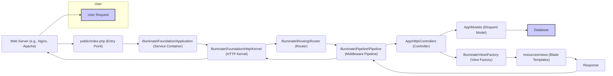
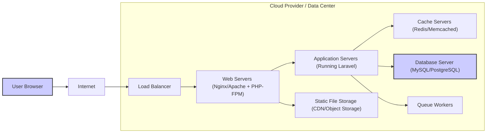

# Project Design Document: Laravel Framework (Improved)

**Version:** 1.1
**Date:** October 26, 2023
**Prepared By:** AI Software Architecture Expert

## 1. Introduction

This document provides an enhanced architectural design of the Laravel PHP framework, focusing on aspects relevant to threat modeling. It details the key components, their interactions, and data flow within the framework, with a particular emphasis on potential security implications. This design is based on the publicly available source code of the Laravel framework found at [https://github.com/laravel/framework](https://github.com/laravel/framework). This improved version aims to provide a more granular and security-focused perspective for effective threat modeling.

## 2. Goals and Objectives

The primary goal of the Laravel framework is to facilitate the rapid development of robust and secure web applications using PHP. Key objectives include:

*   Providing a developer-friendly and expressive syntax for common web development tasks.
*   Enforcing best practices through features like dependency injection, inversion of control, and a powerful ORM.
*   Offering built-in security features and guidance to mitigate common web vulnerabilities.
*   Providing a scalable and maintainable architecture for applications of varying complexity.
*   Fostering a vibrant ecosystem of packages and tools to extend core functionality.

## 3. Scope

This design document focuses on the core architectural components and request lifecycle of the Laravel framework itself. It provides a deeper dive into the internal workings compared to the previous version. The scope includes the handling of HTTP requests and console commands. It does not cover specific user applications built on Laravel or the entirety of the Laravel package ecosystem, but it will touch upon key external dependencies. The primary focus remains on the framework's inherent structure and potential vulnerabilities within that structure.

## 4. High-Level Architecture

The Laravel framework adheres to the Model-View-Controller (MVC) architectural pattern. The following diagram provides a more detailed overview of the request flow, highlighting key components within each stage:

**Explanation of the Flow:**

*   A user initiates a request through their web browser or other client.
*   The web server receives the request and directs it to the application's entry point (`public/index.php`).
*   The `Application` instance (service container) is bootstrapped.
*   The `HTTP Kernel` is the core of the request handling process.
*   The `Router` matches the incoming request to a defined route.
*   The `Middleware Pipeline` executes registered middleware.
*   The appropriate `Controller` handles the application logic.
*   `Eloquent Models` interact with the database.
*   The `View Factory` and `Blade Templates` render the response.
*   The `Response` is sent back through the middleware pipeline, kernel, and web server to the user.

## 5. Key Components and Interactions

This section provides a more detailed description of the major components within the Laravel framework and their interactions, with a focus on security-relevant aspects:

*   **`public/index.php` (Entry Point):**
    *   The first script executed for all web requests.
    *   Bootstraps the Laravel application by loading the Composer autoloader and creating the application instance.
    *   Crucial for initial security setup; any vulnerabilities here could compromise the entire application.

*   **`Illuminate\Foundation\Application` (Service Container):**
    *   Manages the instantiation and dependencies of application services.
    *   Centralized location for registering bindings, which can influence how components interact and potentially introduce vulnerabilities if misconfigured.

*   **`Illuminate\Foundation\Http\Kernel` (HTTP Kernel):**
    *   The central handler for HTTP requests.
    *   Bootstraps core framework components, including error handling and logging.
    *   Manages the request lifecycle and the execution of middleware.
    *   Error handling configurations here are important for preventing information disclosure.

*   **`Illuminate\Console\Kernel` (Console Kernel):**
    *   Handles Artisan console commands.
    *   Provides a command-line interface for various tasks.
    *   Improperly secured console commands can be a significant attack vector.

*   **`Illuminate\Routing\Router` (Router):**
    *   Matches incoming requests to defined routes based on URL patterns and HTTP methods.
    *   Responsible for route parameter binding.
    *   Incorrectly configured routes can lead to unauthorized access or unexpected behavior.

*   **`Illuminate\Pipeline\Pipeline` (Middleware Pipeline):**
    *   Provides a mechanism to filter and inspect HTTP requests and responses.
    *   Middleware can be used for authentication, authorization, request modification, logging, and more.
    *   Vulnerabilities in custom middleware or misconfiguration of existing middleware can create security holes.

*   **`App\Http\Controllers` (Controllers):**
    *   Handle application logic for specific routes.
    *   Receive user input and interact with models and views.
    *   A primary area for security vulnerabilities if input is not properly validated and sanitized.

*   **`App\Models` (Eloquent ORM - `Illuminate\Database\Eloquent\Model`):**
    *   Provides an object-relational mapper for interacting with databases.
    *   Simplifies database queries but can introduce vulnerabilities like SQL injection if not used carefully (e.g., using raw queries with unsanitized input).

*   **`Illuminate\View\Factory` (View Factory) and `resources/views` (Blade Templates):**
    *   Responsible for loading and rendering views using the Blade templating engine.
    *   Blade helps prevent XSS attacks by automatically escaping output, but developers need to be aware of when and how to use raw output.

*   **`Illuminate\Contracts\Auth\Authenticator` (Authentication System):**
    *   Provides interfaces and implementations for user authentication.
    *   Handles user login, logout, and session management.
    *   Misconfigurations or vulnerabilities in the authentication system can lead to unauthorized access.

*   **`Illuminate\Contracts\Auth\Access\Gate` (Authorization System):**
    *   Provides interfaces and implementations for defining and checking user authorization policies.
    *   Ensures users can only access resources they are permitted to.
    *   Incorrectly defined policies can lead to privilege escalation.

*   **`Illuminate\Session` (Session Management):**
    *   Manages user session data.
    *   Secure session configuration (e.g., secure cookies, HTTP only) is crucial to prevent session hijacking.

*   **`Illuminate\Cookie` (Cookie Management):**
    *   Handles the creation and management of HTTP cookies.
    *   Insecure cookie settings can expose sensitive information.

*   **`Illuminate\Encryption\Encrypter` (Encryption Service):**
    *   Provides encryption and decryption services for sensitive data.
    *   Using strong encryption keys and proper encryption techniques is vital.

*   **`Illuminate\Foundation\Exceptions\Handler` (Exception Handler):**
    *   Handles exceptions thrown during the request lifecycle.
    *   Properly configured exception handling prevents sensitive information from being leaked in error messages.

*   **`config/` directory:**
    *   Contains configuration files for various aspects of the framework.
    *   Misconfigured settings (e.g., database credentials, application key) can introduce significant security risks.

*   **`routes/` directory:**
    *   Defines the application's routes.
    *   Examine for exposed administrative routes or insecure route definitions.

*   **`app/Providers` directory:**
    *   Contains service providers that bootstrap various framework components and register services.
    *   Custom service providers can introduce vulnerabilities if not implemented securely.

## 6. Data Flow (Detailed)

A typical web request in Laravel involves a more intricate data flow than previously described. This detailed flow is crucial for identifying potential points of vulnerability:

```mermaid
graph LR
    subgraph "User"
        A["User Request (HTTP)"]
    end
    B["Web Server (Nginx/Apache)"] --> C("public/index.php");
    C --> D("Composer Autoload");
    D --> E("Bootstrap Application (Application.php)");
    E --> F("Create Request Object (Symfony\Component\HttpFoundation\Request)");
    F --> G("Send Request to HTTP Kernel (Kernel.php)");
    G --> H("Load Global Middleware");
    H --> I("Route Matching (Router.php)");
    I --> J("Load Route Specific Middleware");
    J --> K("Execute Middleware Pipeline (Pipeline.php)");
    K --> L("Instantiate Controller");
    L --> M("Execute Controller Action");
    M --> N{"Interact with Model (Eloquent)"};
    N -- "Database Query" --> O["Database"];
    N -- "Data" --> P("Prepare Data for View");
    M --> Q("Load View (ViewFactory.php)");
    Q --> R("Render View (Blade Compiler)");
    R --> S("Create Response Object (Symfony\Component\HttpFoundation\Response)");
    S --> T("Execute Response Middleware Pipeline");
    T --> U("Send Response to HTTP Kernel");
    U --> V("Send Response to Web Server");
    V --> A;
    style A fill:#ccf,stroke:#333,stroke-width:2px
    style O fill:#ccf,stroke:#333,stroke-width:2px
```

**Detailed Breakdown:**

1. **User Request (HTTP):** The user sends an HTTP request.
2. **Web Server:** The web server receives the request.
3. **`public/index.php`:** The entry point is executed.
4. **Composer Autoload:** Loads necessary classes.
5. **Bootstrap Application:** The Laravel application instance is created and bootstrapped.
6. **Create Request Object:** A `Request` object is created to represent the incoming HTTP request.
7. **Send Request to HTTP Kernel:** The request is passed to the `HTTP Kernel`.
8. **Load Global Middleware:** Global middleware is loaded and prepared for execution.
9. **Route Matching:** The `Router` attempts to match the request URL to a defined route.
10. **Load Route Specific Middleware:** Middleware specific to the matched route is loaded.
11. **Execute Middleware Pipeline:** Middleware is executed in a defined order, potentially modifying the request or response.
12. **Instantiate Controller:** The appropriate controller is instantiated.
13. **Execute Controller Action:** The designated controller action is executed.
14. **Interact with Model (Eloquent):** The controller may interact with Eloquent models to:
    *   **Database Query:** Query the database.
    *   **Data:** Retrieve data from the database.
15. **Prepare Data for View:** The controller prepares data to be passed to the view.
16. **Load View:** The `ViewFactory` loads the specified view file.
17. **Render View:** The Blade compiler processes the view template, replacing placeholders with data.
18. **Create Response Object:** A `Response` object is created containing the rendered content.
19. **Execute Response Middleware Pipeline:** Middleware can also operate on the outgoing response.
20. **Send Response to HTTP Kernel:** The response is sent back to the `HTTP Kernel`.
21. **Send Response to Web Server:** The `HTTP Kernel` sends the response to the web server.
22. **Response to User:** The web server sends the response back to the user.

## 7. Security Considerations (for Threat Modeling) - Expanded

This section expands on the security considerations, providing more specific examples of potential threats:

*   **User Input Handling:**
    *   **Threats:** SQL Injection (through unsanitized input in database queries), Cross-Site Scripting (XSS) (through unescaped output of user-provided data), Command Injection (through unsanitized input passed to system commands), Path Traversal (through manipulated file paths).
    *   **Areas to Investigate:** Route parameter binding, request body parsing, header processing, file uploads.

*   **Authentication and Authorization:**
    *   **Threats:** Brute-force attacks on login forms, credential stuffing, session hijacking, privilege escalation, insecure password storage (weak hashing algorithms).
    *   **Areas to Investigate:** Login controllers, authentication middleware, password reset mechanisms, authorization policies (gates and policies).

*   **Session Management:**
    *   **Threats:** Session fixation, session hijacking (through stolen session cookies), insecure session storage.
    *   **Areas to Investigate:** Session configuration (driver, lifetime, secure flag), session middleware.

*   **Database Interactions:**
    *   **Threats:** SQL Injection (as mentioned above), insecure database credentials, lack of proper database access controls.
    *   **Areas to Investigate:** Eloquent queries, raw database queries, database connection configuration.

*   **Cross-Site Scripting (XSS):**
    *   **Threats:** Execution of malicious scripts in the user's browser, leading to data theft, session hijacking, or defacement.
    *   **Areas to Investigate:** Blade templates, handling of user-generated content, use of raw output in views.

*   **Cross-Site Request Forgery (CSRF):**
    *   **Threats:** Unauthorized actions performed on behalf of an authenticated user.
    *   **Areas to Investigate:** CSRF protection middleware, form generation, AJAX requests.

*   **Middleware:**
    *   **Threats:** Vulnerabilities in custom middleware, misconfigured or bypassed middleware, denial-of-service through resource-intensive middleware.
    *   **Areas to Investigate:** Global middleware, route-specific middleware, order of middleware execution.

*   **File Handling:**
    *   **Threats:** Arbitrary file upload (leading to code execution), path traversal (allowing access to sensitive files), denial-of-service through excessive file uploads.
    *   **Areas to Investigate:** File upload controllers, storage configurations, file validation.

*   **Encryption and Hashing:**
    *   **Threats:** Weak encryption algorithms, insecure key management, rainbow table attacks on password hashes.
    *   **Areas to Investigate:** Encryption configuration, password hashing implementation, handling of sensitive data.

*   **Error Handling and Logging:**
    *   **Threats:** Information disclosure through verbose error messages, lack of proper logging for security auditing.
    *   **Areas to Investigate:** Exception handling configuration, logging configuration, error reporting levels.

*   **Dependencies:**
    *   **Threats:** Vulnerabilities in third-party Composer packages.
    *   **Areas to Investigate:** `composer.json` file, dependency update process, security auditing of dependencies.

*   **Configuration:**
    *   **Threats:** Exposed database credentials, insecure application key, misconfigured security settings.
    *   **Areas to Investigate:** Configuration files in the `config/` directory, environment variable handling.

## 8. Deployment Architecture (Illustrative)

The following diagram illustrates a typical deployment architecture for a Laravel application:

**Components:**

*   **User Browser:** The client accessing the application.
*   **Internet:** The public network.
*   **Load Balancer:** Distributes traffic across multiple web servers.
*   **Web Servers (Nginx/Apache + PHP-FPM):** Handle incoming HTTP requests and serve static content. PHP-FPM executes PHP code.
*   **Application Servers (Running Laravel):** Execute the Laravel application code.
*   **Cache Servers (Redis/Memcached):** Store frequently accessed data for faster retrieval.
*   **Database Server (MySQL/PostgreSQL):** Stores persistent application data.
*   **Queue Workers:** Process background tasks asynchronously.
*   **Static File Storage (CDN/Object Storage):** Stores static assets like images and CSS.

**Security Considerations in Deployment:**

*   Secure communication (HTTPS) between all tiers.
*   Firewall rules to restrict access to specific ports and services.
*   Regular security updates for all components.
*   Secure configuration of web servers and database servers.
*   Proper access controls and authentication for internal services.

## 9. External Dependencies

Laravel relies on several external dependencies managed by Composer. Key dependencies with potential security implications include:

*   **`symfony/*` components:** Laravel utilizes many Symfony components for core functionalities like routing, HTTP handling, and event dispatching. Security vulnerabilities in Symfony components can directly impact Laravel applications.
*   **`nesbot/carbon`:** For date and time manipulation.
*   **`monolog/monolog`:** For logging.
*   **Database drivers (e.g., `doctrine/dbal`, `mysqlnd`):** For database interaction.
*   **Testing libraries (e.g., `phpunit/phpunit`, `mockery/mockery`):** Used in development but should be considered in the overall security posture.

It is crucial to regularly update these dependencies to patch any known security vulnerabilities.

This improved design document provides a more comprehensive and security-focused view of the Laravel framework's architecture, facilitating more effective threat modeling activities.