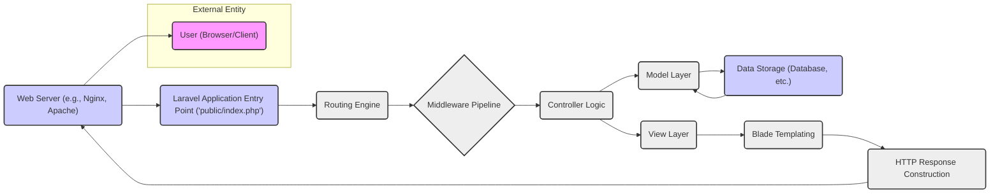

# Project Design Document: Laravel Framework

**Version:** 1.1
**Date:** October 26, 2023
**Author:** AI Software Architect

## 1. Introduction

This document provides an enhanced architectural design of the Laravel framework, building upon the publicly available source code repository: [https://github.com/laravel/framework](https://github.com/laravel/framework). This revised design document is specifically tailored to facilitate threat modeling activities by providing a more detailed view of the framework's components, interactions, and inherent security considerations. It focuses on the core framework and does not delve into specific applications built using Laravel.

## 2. Goals and Objectives

*   Provide a clear and concise overview of the Laravel framework's architecture, optimized for security analysis.
*   Identify the major components and their responsibilities, with a focus on potential security implications.
*   Describe the key interactions and data flows within the framework, highlighting security-relevant pathways.
*   Explicitly outline potential areas of security concern from an architectural perspective, serving as inputs for threat identification.
*   Serve as a robust basis for conducting a comprehensive threat model of the Laravel framework.

## 3. High-Level Architecture

The Laravel framework adheres to the Model-View-Controller (MVC) architectural pattern. The following diagram illustrates the high-level flow of a typical web request, emphasizing key components involved in processing and responding.

## 4. Component Breakdown (Security Focused)

This section details the key components of the Laravel framework, with a particular emphasis on their role in security.

*   **Kernel (Illuminate\Foundation\Http\Kernel):**
    *   Serves as the central request handler.
    *   Bootstrapping process is a critical point; vulnerabilities here could compromise the entire application.
    *   Responsible for exception handling, which needs to be secure to prevent information leakage.
*   **HTTP Request (Illuminate\Http\Request):**
    *   Encapsulates user input, making it a primary attack vector.
    *   Proper handling and sanitization of request data are crucial to prevent injection attacks.
    *   Potential vulnerabilities include parameter tampering and header manipulation.
*   **Routing (Illuminate\Routing):**
    *   Maps URLs to specific application logic.
    *   Misconfigured routes can expose unintended functionality or administrative endpoints.
    *   Route parameter constraints and middleware are important security controls.
*   **Middleware (Illuminate\Pipeline\Pipeline):**
    *   Acts as a series of filters for incoming requests.
    *   Provides opportunities for authentication, authorization, input validation, and CSRF protection.
    *   Vulnerabilities in custom or third-party middleware can introduce significant security risks.
*   **Controllers (App\Http\Controllers):**
    *   Contains the application's business logic.
    *   Responsible for handling user input and interacting with models.
    *   Needs to be designed to prevent unauthorized actions and data manipulation.
    *   Vulnerable to logic flaws if not carefully implemented.
*   **Models (App\Models):**
    *   Represents data and interacts with the database.
    *   Eloquent ORM provides some protection but is still susceptible to mass assignment vulnerabilities if not configured correctly.
    *   Care must be taken to avoid exposing sensitive data through model relationships.
*   **Eloquent ORM (Illuminate\Database\Eloquent):**
    *   Provides an abstraction layer for database interactions.
    *   While it helps prevent direct SQL injection, developers need to be aware of potential issues with dynamic queries and raw SQL.
*   **Database Layer (Illuminate\Database):**
    *   Provides database connection management and query building.
    *   Secure database credentials and connection settings are paramount.
    *   Vulnerable to SQL injection if raw queries are used without proper sanitization.
*   **Views (resources\views):**
    *   Responsible for rendering the user interface.
    *   Vulnerable to Cross-Site Scripting (XSS) attacks if user-provided data is not properly escaped before being displayed.
*   **Blade Templating Engine (Illuminate\View\Compilers\BladeCompiler):**
    *   Facilitates dynamic view generation.
    *   Provides mechanisms for output escaping to mitigate XSS vulnerabilities.
    *   Developers must use these features correctly.
*   **HTTP Response (Illuminate\Http\Response):**
    *   Represents the data sent back to the client.
    *   Security headers (e.g., Content-Security-Policy, X-Frame-Options) should be configured here to enhance security.
    *   Sensitive information should not be inadvertently included in responses.
*   **Service Container (Illuminate\Container\Container):**
    *   Manages dependencies and performs dependency injection.
    *   Potential for vulnerabilities if dependencies are not properly managed or if insecure dependencies are used.
*   **Service Providers (App\Providers):**
    *   Bootstrap various framework components and services.
    *   Misconfiguration of service providers can lead to security issues.
*   **Events and Listeners (Illuminate\Events\Dispatcher):**
    *   Provides an observer pattern implementation.
    *   Care must be taken to ensure that event listeners do not introduce security vulnerabilities.
*   **Cache (Illuminate\Cache):**
    *   Stores frequently accessed data to improve performance.
    *   Sensitive data stored in the cache needs to be protected.
    *   Cache poisoning is a potential threat.
*   **Session (Illuminate\Session):**
    *   Manages user session data.
    *   Secure session configuration (e.g., `HttpOnly`, `Secure` flags, secure storage) is critical to prevent session hijacking.
*   **Authentication (Illuminate\Auth):**
    *   Handles user login and authentication.
    *   Needs to be robust against brute-force attacks and credential stuffing.
    *   Proper password hashing and storage are essential.
*   **Authorization (Illuminate\Foundation\Auth\Access\Gate):**
    *   Manages user permissions and access control.
    *   Misconfigured authorization rules can lead to unauthorized access to resources.
*   **Encryption (Illuminate\Encryption\Encrypter):**
    *   Provides secure encryption and decryption of data.
    *   Uses application-specific keys that must be securely managed.
    *   Weak encryption configurations can be a vulnerability.
*   **Hashing (Illuminate\Hashing):**
    *   Provides secure one-way hashing for passwords.
    *   Using strong hashing algorithms and salting is crucial.
*   **Validation (Illuminate\Validation\Factory):**
    *   Validates incoming data.
    *   Proper validation is essential to prevent injection attacks and ensure data integrity.
    *   Insufficient validation is a common vulnerability.
*   **Filesystem (Illuminate\Filesystem):**
    *   Provides an abstraction layer for file system operations.
    *   Care must be taken to prevent path traversal vulnerabilities and unauthorized file access.
*   **Queues (Illuminate\Queue):**
    *   Handles asynchronous task processing.
    *   Potential security risks if queue workers are not properly secured or if sensitive data is passed through queues.
*   **Console (Symfony\Component\Console):**
    *   Provides a command-line interface (Artisan).
    *   Access to Artisan commands should be restricted to authorized users.
    *   Sensitive operations should require additional authentication.

## 5. Data Flow (Security Perspective)

The typical data flow, viewed through a security lens, highlights critical points for security checks and potential vulnerabilities:

1. **User Request:**  Untrusted input enters the system. This is the primary attack surface.
2. **Web Server:**  Initial point of contact; security configurations (e.g., SSL/TLS, security headers) are applied here.
3. **Laravel Entry Point:**  The `public/index.php` file and the bootstrapping process must be secure to prevent early compromise.
4. **Routing Engine:**  Determines the application logic to be executed. Secure routing prevents unauthorized access to sensitive endpoints.
5. **Middleware Pipeline:**  Applies security filters such as authentication, authorization, CSRF protection, and input sanitization. Properly configured middleware is crucial for defense in depth.
6. **Controller Logic:**  Handles business logic and interacts with data. Controllers must implement authorization checks and prevent data manipulation vulnerabilities.
7. **Model Layer:**  Interacts with the database. Eloquent ORM helps prevent SQL injection, but developers must be aware of mass assignment and other potential issues.
8. **Data Storage:**  The database or other storage mechanism must be secured with proper access controls and encryption for sensitive data.
9. **View Layer:**  Data is rendered for the user. Output encoding is essential to prevent XSS attacks.
10. **Blade Templating:**  Provides mechanisms for secure output escaping. Developers must utilize these features correctly.
11. **HTTP Response Construction:**  Security headers are added to the response to further protect the client.
12. **Web Server Response:**  The secured response is sent back to the user.

## 6. Security Considerations (Detailed)

This section provides a more detailed breakdown of potential security concerns at the architectural level.

*   **Input Validation and Sanitization:**
    *   Failure to validate and sanitize user input at all entry points (request parameters, headers, file uploads) can lead to various injection attacks (SQL injection, XSS, command injection).
    *   Laravel's validation features should be used consistently and comprehensively.
*   **Output Encoding:**
    *   Not encoding output displayed in views can result in XSS vulnerabilities.
    *   Blade's templating engine provides mechanisms for secure output encoding, which must be utilized.
*   **Authentication and Authorization:**
    *   Weak or improperly implemented authentication mechanisms can allow unauthorized access.
    *   Insufficient or flawed authorization logic can lead to privilege escalation and access to sensitive resources.
    *   Laravel's built-in authentication and authorization features should be used and configured securely.
*   **Session Management:**
    *   Insecure session handling (e.g., lack of `HttpOnly` or `Secure` flags, predictable session IDs) can lead to session hijacking.
    *   Laravel's session configuration should be reviewed and hardened.
*   **Database Security:**
    *   SQL injection vulnerabilities can arise from using raw database queries without proper sanitization or from flaws in ORM usage.
    *   Database credentials must be securely stored and managed.
    *   Database access should be restricted based on the principle of least privilege.
*   **Cross-Site Scripting (XSS):**
    *   Occurs when malicious scripts are injected into web pages viewed by other users.
    *   Primarily mitigated through proper output encoding in Blade templates.
*   **Cross-Site Request Forgery (CSRF):**
    *   Allows attackers to trick users into performing unintended actions on a web application they are authenticated with.
    *   Laravel provides built-in CSRF protection middleware that should be enabled.
*   **SQL Injection:**
    *   Allows attackers to interfere with the queries that an application makes to its database.
    *   Mitigated by using parameterized queries (which Eloquent ORM does by default) and avoiding raw queries where possible.
*   **File Uploads:**
    *   Improperly handled file uploads can lead to various vulnerabilities, including remote code execution and denial of service.
    *   Laravel provides features for validating file types and sizes, which should be used. Stored files should be protected.
*   **Dependency Management:**
    *   Using outdated or vulnerable dependencies can introduce security risks.
    *   Composer should be used to manage dependencies, and regular updates should be performed. Security auditing tools for dependencies can be beneficial.
*   **Error Handling and Logging:**
    *   Verbose error messages can leak sensitive information.
    *   Logging should be implemented to track security-related events, but logs themselves must be secured.
*   **Cryptographic Security:**
    *   Using weak encryption algorithms or insecure key management practices can compromise sensitive data.
    *   Laravel's encryption and hashing facilities should be used with strong configurations.

## 7. Deployment Considerations (Security Focused)

Secure deployment practices are crucial for the overall security of a Laravel application.

*   **Web Server Hardening:**
    *   Configure the web server (Nginx or Apache) with security best practices, including disabling unnecessary modules, setting appropriate permissions, and configuring security headers (e.g., HSTS, X-Content-Type-Options).
*   **Operating System Security:**
    *   Harden the underlying operating system by applying security patches, disabling unnecessary services, and configuring firewalls.
*   **PHP Configuration:**
    *   Configure `php.ini` with security in mind, disabling dangerous functions and setting appropriate resource limits.
*   **File Permissions:**
    *   Set restrictive file and directory permissions to prevent unauthorized access and modification.
*   **Secure Communication (HTTPS):**
    *   Enforce HTTPS to encrypt communication between the client and the server, protecting sensitive data in transit.
*   **Environment Variable Management:**
    *   Securely manage environment variables containing sensitive information (e.g., database credentials, API keys). Avoid storing them directly in code.
*   **Containerization Security:**
    *   If using containers (e.g., Docker), follow security best practices for container image creation and runtime configuration.
*   **Cloud Security:**
    *   Leverage security features provided by cloud platforms (e.g., AWS, Azure, GCP), such as firewalls, security groups, and access control mechanisms.
*   **Regular Security Audits:**
    *   Conduct regular security assessments and penetration testing to identify and address potential vulnerabilities.

## 8. Technologies Used

*   **PHP:** Core language.
*   **Composer:** Dependency manager.
*   **Symfony Components:**  Foundation for many Laravel features.
*   **Database Systems:**  MySQL, PostgreSQL, SQLite, SQL Server, etc.
*   **Blade:** Templating engine.
*   **JavaScript Frameworks (Optional):**  Often used for front-end development.

## 9. Future Considerations

Ongoing security vigilance and adaptation to evolving threats are essential. Future considerations include:

*   Staying updated with the latest security best practices for web application development.
*   Continuously monitoring for and addressing newly discovered vulnerabilities in Laravel and its dependencies.
*   Exploring and implementing advanced security features and techniques.

This enhanced design document provides a more comprehensive foundation for threat modeling the Laravel framework, emphasizing security considerations at each architectural level.