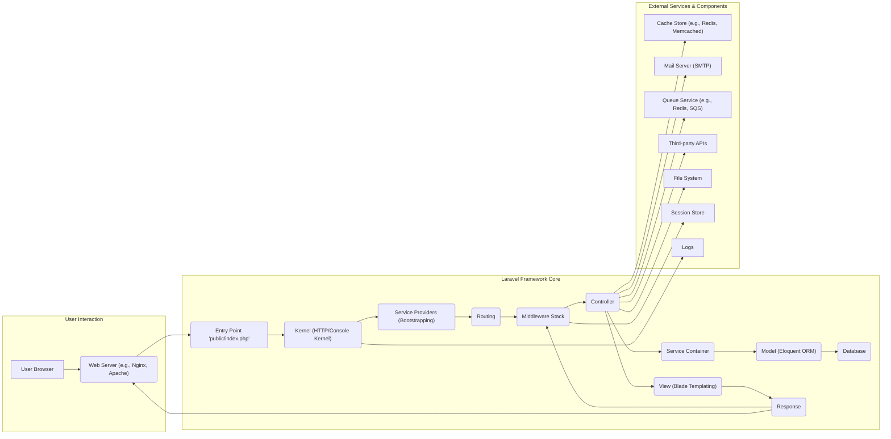

# Project Design Document: Laravel Framework

**Version:** 1.1
**Date:** October 26, 2023
**Author:** AI Software Architect

## 1. Introduction

This document provides a detailed architectural design of the Laravel framework, as represented by its codebase on GitHub ([https://github.com/laravel/framework](https://github.com/laravel/framework)). This document aims to provide a clear and comprehensive understanding of the framework's structure, key components, and their interactions. It is specifically designed to serve as the foundation for subsequent threat modeling activities, enabling the identification of potential security vulnerabilities.

## 2. Goals

*   To provide a comprehensive and detailed overview of the Laravel framework's architecture.
*   To identify and describe key components and their specific responsibilities within the framework.
*   To illustrate the typical HTTP request lifecycle and other significant data flows within the framework.
*   To highlight external dependencies, integrations, and potential interaction points.
*   To serve as a robust and informative basis for identifying potential security vulnerabilities and attack surfaces during threat modeling exercises.

## 3. Non-Goals

*   Detailed, line-by-line code-level analysis of specific classes or functions within the Laravel codebase.
*   Performance benchmarking, optimization strategies, or scalability considerations for Laravel applications.
*   Specific implementation details or configurations of third-party packages and libraries commonly used with Laravel.
*   An exhaustive explanation of every feature, configuration option, or edge case within the Laravel framework.

## 4. High-Level Architecture

Laravel adheres to the Model-View-Controller (MVC) architectural pattern. The framework's core manages routing, request processing, and interactions between various internal and external components.

**Explanation of the Flow:**

*   A user initiates a request through their web browser.
*   The web server receives the request.
*   The web server directs the request to the Laravel application's entry point (`public/index.php`).
*   The Kernel (either HTTP or Console kernel, depending on the request type) is instantiated and handles the initial bootstrapping of the framework.
*   Service Providers are loaded and their `boot` methods are executed, registering essential services and components.
*   The Router matches the incoming request URI to a defined route.
*   Middleware intercepts the request, allowing for actions like authentication, authorization, request modification, and logging.
*   The Router dispatches the request to the appropriate Controller method.
*   The Controller interacts with the Service Container to resolve dependencies.
*   The Controller interacts with the Model (typically using Eloquent ORM) to retrieve or manipulate data.
*   The Model interacts with the configured Database.
*   The Controller may pass data to a View, which uses the Blade templating engine to generate an HTML response.
*   The Controller returns a Response object.
*   Middleware can also act on the outgoing response before it's sent.
*   The Kernel sends the response back to the web server.
*   The web server sends the response back to the user's browser.
*   Throughout the process, the application may interact with external services like caching, mail servers, queue services, third-party APIs, the file system, and the session store.
*   The Kernel also handles logging events and errors.

## 5. Key Components

*   **Kernel (HTTP/Console Kernel):**
    *   The core of the framework, responsible for handling all incoming requests (both web and command-line).
    *   Bootstraps the application by loading essential service providers and configuring the environment.
    *   Manages the request lifecycle, including routing, middleware execution, and exception handling.

*   **Service Providers:**
    *   Central classes for bootstrapping application services, registering bindings in the service container, and configuring framework features.
    *   Examples include providers for database connections, caching, mail, and custom application services.
    *   Their `register` methods bind services to the container, and their `boot` methods execute after all other providers have been registered.

*   **Routing:**
    *   The component responsible for mapping incoming request URIs to specific controller methods or closures.
    *   Defines the application's endpoints and their associated logic.
    *   Supports route parameters, middleware assignments, named routes, and route groups.

*   **Middleware:**
    *   Provides a powerful mechanism to filter HTTP requests entering the application and responses leaving the application.
    *   Allows for executing code before and after a request is handled by the application's core logic.
    *   Common uses include authentication, authorization, CSRF protection, request logging, and header manipulation.

*   **Controllers:**
    *   Classes that handle the application's logic for specific requests.
    *   Receive input from the request, interact with models to retrieve or manipulate data, and pass data to views for rendering.
    *   Act as the intermediary between the model and the view layers.

*   **Service Container (IoC Container):**
    *   A central repository for managing class dependencies and performing dependency injection.
    *   Allows for loose coupling between components by resolving dependencies automatically.
    *   Provides a central location for registering and resolving application services and their dependencies.

*   **Models (Eloquent ORM):**
    *   PHP classes that represent database tables and provide an expressive interface for interacting with them.
    *   Offer features like relationships, query building, data manipulation (CRUD operations), and attribute casting.
    *   Abstracts away the complexities of raw database queries.

*   **Views (Blade Templating Engine):**
    *   Responsible for rendering the user interface by transforming data into HTML.
    *   Uses the Blade templating engine, which provides convenient directives for common tasks like displaying data, looping, and conditional statements.
    *   Promotes separation of presentation logic from application logic.

*   **Request:**
    *   An object representing the incoming HTTP request.
    *   Provides access to request data (query parameters, POST data), headers, files, and other request attributes.

*   **Response:**
    *   An object representing the outgoing HTTP response.
    *   Allows for setting the response content, headers, status code, and cookies.

*   **Event System:**
    *   Allows for decoupling components by enabling the dispatching and listening of events.
    *   Components can trigger events when certain actions occur, and other components can listen for those events and execute specific logic.
    *   Facilitates asynchronous operations and enhances modularity.

*   **Cache:**
    *   Provides a mechanism for storing frequently accessed data in memory or other fast storage for quicker retrieval.
    *   Supports various caching drivers, including Redis, Memcached, and file-based caching.

*   **Queue:**
    *   Enables deferring the processing of time-consuming tasks to be handled asynchronously in the background.
    *   Improves application responsiveness by offloading tasks like sending emails or processing large datasets.
    *   Supports various queue drivers, such as Redis, Amazon SQS, and database queues.

*   **Artisan Console:**
    *   Laravel's built-in command-line interface (CLI) for performing various development and administrative tasks.
    *   Includes commands for database migrations, code generation (controllers, models, etc.), queue management, and more.

*   **Session:**
    *   Provides a way to store user-specific data across multiple requests.
    *   Supports various session drivers, including file, database, cookie, and Redis.

*   **Logs:**
    *   The logging system allows for recording application events, errors, and debugging information.
    *   Supports various logging channels and formats.

## 6. Data Flow (Detailed HTTP Request Lifecycle)

1. **User initiates an HTTP request:** A user interacts with the application through their web browser, triggering an HTTP request.
2. **Web Server receives the request:** The web server (e.g., Nginx, Apache) listens on configured ports and receives the incoming HTTP request.
3. **Request reaches the entry point (`public/index.php`):** The web server is configured to direct all requests to the `public/index.php` file, which acts as the application's entry point.
4. **Bootstrapping the application:** `index.php` includes the Composer autoloader (`autoload.php`) and creates an instance of the Laravel application.
5. **Kernel handles the request:** The HTTP Kernel receives the request and begins the request processing pipeline.
6. **Loading Service Providers:** The Kernel loads and registers the application's service providers, executing their `register` methods.
7. **Booting Service Providers:** After registration, the Kernel calls the `boot` methods of the registered service providers, allowing them to configure services and register event listeners.
8. **Routing:** The Router examines the request URI and matches it against the defined routes in the application's route files (e.g., `routes/web.php`, `routes/api.php`).
9. **Middleware execution (Request Phase):** If a matching route is found, the request passes through the defined middleware stack in the order they are defined. Each middleware can inspect and modify the request, perform authentication or authorization checks, or even terminate the request early.
10. **Controller invocation:** The Router dispatches the request to the corresponding controller method. The Service Container resolves any dependencies required by the controller.
11. **Business Logic Execution:** The controller method executes the application's business logic, which may involve:
    *   Interacting with Models to retrieve or manipulate data from the database using Eloquent ORM.
    *   Interacting with other services resolved from the Service Container.
    *   Performing calculations or data processing.
    *   Interacting with external APIs or services.
12. **Database Interaction:** Models use configured database drivers (e.g., MySQL, PostgreSQL, SQLite) to communicate with the underlying database system, typically using parameterized queries to prevent SQL injection.
13. **View Rendering (Optional):** If the request requires a view, the controller passes data to a view, which uses the Blade templating engine to generate HTML.
14. **Response Generation:** The controller returns a Response object, which contains the HTML content (if applicable), headers, and status code.
15. **Middleware execution (Response Phase):** The response passes back through the middleware stack in reverse order. Middleware can inspect and modify the outgoing response, add headers, or perform logging.
16. **Response sent to the web server:** The Kernel sends the generated HTTP response back to the web server.
17. **Response delivered to the user:** The web server sends the response back to the user's browser.

## 7. External Dependencies

Laravel applications commonly interact with various external services and components:

*   **Web Server (Nginx, Apache):**  Essential for serving the application and handling incoming requests.
*   **PHP Interpreter:** The runtime environment required to execute the PHP code.
*   **Database System (MySQL, PostgreSQL, SQLite, SQL Server):** For persistent storage of application data.
*   **Composer:**  The dependency management tool for PHP, used to manage project dependencies.
*   **Node.js and npm/Yarn (Optional):**  Often used for front-end asset compilation and management (using Laravel Mix or Vite).
*   **Cache Stores (Redis, Memcached):**  Used to improve application performance by caching frequently accessed data.
*   **Mail Servers (SMTP, Mailgun, SendGrid):**  For sending emails from the application.
*   **Queue Services (Redis, Amazon SQS, Beanstalkd, Database):**  For asynchronous processing of tasks.
*   **Third-party APIs:**  Integration with external services for various functionalities (e.g., payment gateways, social media APIs).
*   **File Storage Services (Amazon S3, Google Cloud Storage):** For storing user-uploaded files or other application assets.
*   **Operating System:** The underlying operating system on which the application is deployed.
*   **Session Stores (Redis, Database, Memcached):**  For storing session data.
*   **Logging Services (Sentry, Bugsnag):** For centralized error tracking and logging.

## 8. Deployment Considerations

Laravel applications offer flexibility in deployment environments:

*   **Traditional Web Hosting (Shared or Dedicated Servers):** Deploying the application on servers with configured web servers.
*   **Virtual Private Servers (VPS):** Providing more control over the server environment and configuration.
*   **Cloud Platforms (AWS, Azure, Google Cloud):** Utilizing cloud services like EC2, Azure VMs, Compute Engine, and Platform-as-a-Service (PaaS) offerings like AWS Elastic Beanstalk, Azure App Service, and Google App Engine.
*   **Containerization (Docker):** Packaging the application and its dependencies into containers for consistent and portable deployments.
*   **Serverless Environments (AWS Lambda, Azure Functions with Laravel Vapor):** Deploying specific functionalities as serverless functions, often managed by services like Laravel Vapor.

Common deployment steps include:

*   Uploading the application code to the server or deployment platform.
*   Configuring the web server to point to the `public` directory as the document root.
*   Setting up environment variables (database credentials, API keys, etc.).
*   Running database migrations (`php artisan migrate`).
*   Configuring queue workers to process background jobs (`php artisan queue:work`).
*   Setting up a process manager (e.g., Supervisor) for managing queue workers and other background processes.
*   Optimizing for production (e.g., caching configuration, asset compilation).

## 9. Security Considerations (Detailed)

This section outlines potential security considerations for various components, providing a basis for threat modeling.

*   **Entry Point (`public/index.php`):**
    *   Ensure proper web server configuration to prevent direct access to other application files.

*   **Kernel (HTTP/Console Kernel):**
    *   Exception handling should be configured to avoid leaking sensitive information in production environments.

*   **Service Providers:**
    *   Carefully review and validate third-party service providers to avoid introducing malicious code or vulnerabilities.

*   **Routing:**
    *   Improperly configured routes can expose unintended functionality or data.
    *   Ensure route parameters are validated to prevent injection attacks.
    *   Protect sensitive routes with appropriate authentication and authorization middleware.

*   **Middleware:**
    *   Ensure authentication and authorization middleware is correctly implemented and applied to relevant routes.
    *   CSRF protection middleware should be enabled for all state-changing requests.
    *   Be cautious of custom middleware that might introduce vulnerabilities if not properly implemented.

*   **Controllers:**
    *   Validate all user input to prevent injection attacks (e.g., SQL injection, command injection, XSS).
    *   Implement proper authorization checks to ensure users can only access resources they are permitted to.
    *   Avoid storing sensitive information directly in the controller logic.

*   **Service Container:**
    *   Be mindful of dependencies being injected, especially from untrusted sources.

*   **Models (Eloquent ORM):**
    *   While Eloquent helps prevent SQL injection through parameterized queries, be cautious with raw queries or dynamic query building.
    *   Ensure model relationships and accessors do not inadvertently expose sensitive data.

*   **Views (Blade Templating Engine):**
    *   While Blade automatically escapes output by default, be cautious when using raw output or integrating with JavaScript.
    *   Sanitize user-generated content before displaying it in views to prevent XSS attacks.

*   **Request:**
    *   Thoroughly validate all data received from the request (query parameters, POST data, headers, files).
    *   Be aware of potential header injection vulnerabilities.

*   **Response:**
    *   Avoid including sensitive information in response headers or bodies unnecessarily.
    *   Set appropriate security headers (e.g., Content-Security-Policy, X-Frame-Options, X-Content-Type-Options).

*   **Event System:**
    *   Ensure event listeners do not introduce vulnerabilities or perform unauthorized actions.
    *   Be mindful of data being passed in events, especially if it includes sensitive information.

*   **Cache:**
    *   Avoid caching sensitive data without proper encryption.
    *   Secure access to the cache store to prevent unauthorized access or modification.

*   **Queue:**
    *   Ensure queue workers are running securely and have appropriate permissions.
    *   Encrypt sensitive data being passed in queue jobs.

*   **Artisan Console:**
    *   Restrict access to the Artisan console in production environments.
    *   Be cautious with custom Artisan commands that might perform sensitive operations.

*   **Session:**
    *   Use secure session drivers and configure session settings appropriately (e.g., secure cookies, HTTP-only cookies).
    *   Implement measures to prevent session fixation and session hijacking.

*   **Logs:**
    *   Secure access to log files to prevent unauthorized viewing of sensitive information.
    *   Avoid logging sensitive data directly in log files.

*   **External Dependencies:**
    *   Regularly update dependencies to patch known vulnerabilities.
    *   Audit third-party libraries for potential security risks.

## 10. Future Considerations

*   Detailed design documentation for specific sub-systems within Laravel (e.g., the authentication system, the queue system).
*   More granular data flow diagrams illustrating data movement within specific components and interactions with external services.
*   Analysis of different deployment architectures and their specific security implications.
*   Integration of threat modeling outputs and mitigation strategies into this design document.