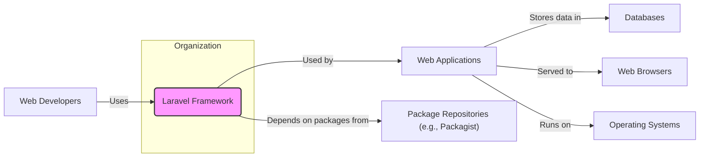
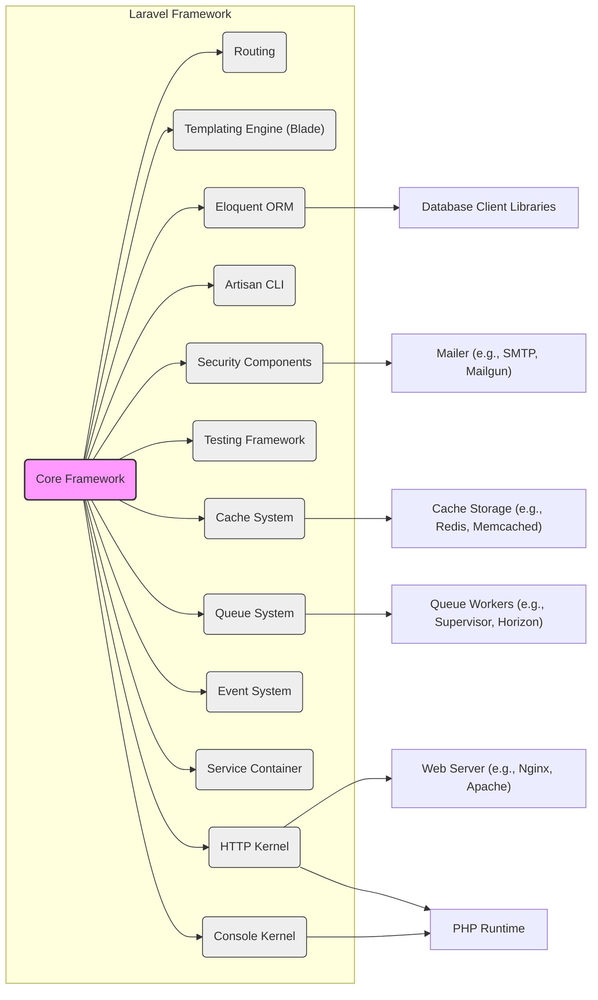
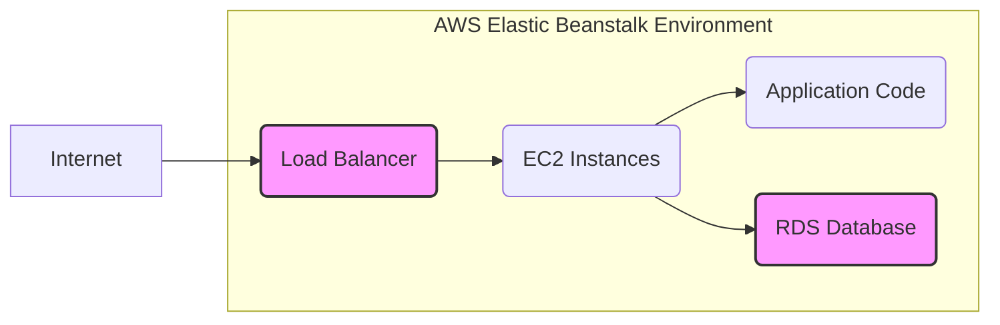
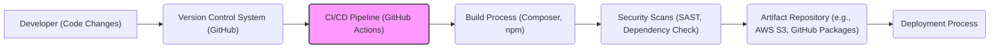

# BUSINESS POSTURE

- Business Priorities and Goals:
  - To provide a robust and developer-friendly PHP framework for building web applications of various sizes and complexities.
  - To enable rapid application development by offering expressive syntax and a rich set of features.
  - To foster a large and active community, ensuring continuous improvement, support, and a wide range of packages and resources.
  - To maintain a secure and reliable framework, minimizing vulnerabilities and providing tools for secure application development.
- Most Important Business Risks:
  - Security vulnerabilities in the framework could lead to widespread security breaches in applications built with Laravel, damaging the reputation of both Laravel and the businesses using it.
  - Lack of backward compatibility in new releases could cause significant disruption and rework for existing applications, hindering adoption and developer satisfaction.
  - Performance bottlenecks in the framework could limit the scalability and responsiveness of applications, impacting user experience and business operations.
  - Dependence on community contributions for certain features or security patches could introduce uncertainty and potential delays in addressing critical issues.

# SECURITY POSTURE

- Existing Security Controls:
  - security control: Protection against Cross-Site Scripting (XSS) attacks through output escaping mechanisms in the Blade templating engine. Implemented in: Laravel Blade templating engine.
  - security control: Protection against Cross-Site Request Forgery (CSRF) attacks using automatically generated CSRF tokens. Implemented in: Laravel core middleware and form helpers.
  - security control: Protection against SQL Injection attacks through the Eloquent ORM and query builder, which use parameterized queries. Implemented in: Laravel Eloquent ORM and database query builder.
  - security control: Protection against mass assignment vulnerabilities through guarded and fillable attributes in Eloquent models. Implemented in: Laravel Eloquent ORM.
  - security control: Rate limiting middleware to protect against brute-force attacks and denial-of-service attempts. Implemented in: Laravel core middleware.
  - security control: Secure password hashing using bcrypt algorithm by default. Implemented in: Laravel authentication system and Hash facade.
  - security control: Input validation and sanitization features available through request validation rules. Implemented in: Laravel request validation system.
  - security control: Middleware for handling common security headers like X-Content-Type-Options, X-Frame-Options, and X-XSS-Protection. Implemented in: Laravel core middleware.
  - security control: Security advisories and patch releases are communicated through official channels and security mailing lists. Described in: Laravel documentation and security policy.
- Accepted Risks:
  - accepted risk: Vulnerabilities in third-party packages used by Laravel applications, as dependency management is the responsibility of the application developer.
  - accepted risk: Misconfiguration of the web server or hosting environment by application developers, leading to security weaknesses.
  - accepted risk: Security vulnerabilities introduced by custom code written by application developers on top of the Laravel framework.
  - accepted risk: Denial-of-service attacks that are beyond the scope of application-level rate limiting, requiring infrastructure-level protection.
- Recommended Security Controls:
  - security control: Implement static application security testing (SAST) tools in the Laravel development and CI/CD pipeline to automatically detect potential vulnerabilities in the framework code.
  - security control: Conduct regular penetration testing and security audits of the Laravel framework by external security experts to identify and address security weaknesses proactively.
  - security control: Enhance documentation and developer education on secure coding practices within the Laravel ecosystem, including common pitfalls and best practices.
  - security control: Provide security-focused code examples and templates to guide developers in building secure Laravel applications.
- Security Requirements:
  - Authentication:
    - Requirement: Laravel should provide secure and flexible authentication mechanisms to verify the identity of users accessing applications built with it.
    - Requirement: Support for various authentication methods, including session-based authentication, token-based authentication (for APIs), and social authentication.
    - Requirement: Protection against common authentication attacks such as brute-force attacks and credential stuffing.
  - Authorization:
    - Requirement: Laravel should offer robust authorization features to control access to resources and functionalities based on user roles and permissions.
    - Requirement: Support for role-based access control (RBAC) and attribute-based access control (ABAC) models.
    - Requirement: Mechanisms to prevent authorization bypass vulnerabilities and ensure consistent enforcement of access policies.
  - Input Validation:
    - Requirement: Laravel must provide comprehensive input validation capabilities to prevent injection attacks and data integrity issues.
    - Requirement: Support for validating various types of user inputs, including form data, query parameters, and API requests.
    - Requirement: Clear and user-friendly error messages for invalid inputs to guide developers in implementing proper validation.
  - Cryptography:
    - Requirement: Laravel should provide secure cryptographic functions for protecting sensitive data at rest and in transit.
    - Requirement: Support for encryption, decryption, hashing, and digital signatures using industry-standard algorithms and best practices.
    - Requirement: Secure key management practices to protect cryptographic keys from unauthorized access and disclosure.

# DESIGN

## C4 CONTEXT

- Context Diagram Elements:
  - - Name: Laravel Framework
    - Type: Software System
    - Description: A free, open-source PHP web framework, designed for the development of web applications following the model–view–controller (MVC) architectural pattern.
    - Responsibilities: Provides the core functionalities and tools for building web applications, including routing, templating, ORM, security features, and utilities.
    - Security controls: Implements various security controls as described in the SECURITY POSTURE section, such as XSS protection, CSRF protection, SQL injection prevention, and secure password hashing.
  - - Name: Web Developers
    - Type: Person
    - Description: Software engineers who use the Laravel Framework to build web applications.
    - Responsibilities: Develop, maintain, and deploy web applications using Laravel, ensuring application security and functionality.
    - Security controls: Responsible for implementing secure coding practices, utilizing Laravel's security features correctly, and managing application-level security configurations.
  - - Name: Web Applications
    - Type: Software System
    - Description: Applications built using the Laravel Framework, serving various purposes such as e-commerce platforms, content management systems, APIs, and web portals.
    - Responsibilities: Provide specific functionalities to end-users, process user requests, manage data, and interact with other systems.
    - Security controls: Implement application-specific security controls, such as authentication, authorization, input validation, and data protection, leveraging Laravel's security features and adding custom security measures.
  - - Name: Databases
    - Type: External System
    - Description: Relational or NoSQL databases used by Laravel applications to store and retrieve data. Examples include MySQL, PostgreSQL, SQLite, MongoDB.
    - Responsibilities: Persistently store application data, ensure data integrity and availability, and provide efficient data access.
    - Security controls: Implement database-level security controls, such as access control lists, encryption at rest, and regular backups, to protect sensitive data stored in databases.
  - - Name: Web Browsers
    - Type: External System
    - Description: Software applications used by end-users to access and interact with web applications built with Laravel. Examples include Chrome, Firefox, Safari, Edge.
    - Responsibilities: Render web pages, execute client-side scripts, and facilitate user interaction with web applications.
    - Security controls: Implement browser-level security controls, such as content security policy (CSP), HTTP Strict Transport Security (HSTS), and secure cookie settings, to protect users from browser-based attacks.
  - - Name: Operating Systems
    - Type: Infrastructure
    - Description: Operating systems on which Laravel applications and their dependencies are deployed. Examples include Linux, Windows, macOS.
    - Responsibilities: Provide the runtime environment for Laravel applications, manage system resources, and ensure system stability.
    - Security controls: Implement operating system-level security controls, such as firewall rules, user access management, and regular security patching, to protect the underlying infrastructure.
  - - Name: Package Repositories (e.g., Packagist)
    - Type: External System
    - Description: Repositories that host PHP packages and libraries, including those used by Laravel and Laravel applications. Packagist is the primary package repository for PHP.
    - Responsibilities: Provide a central repository for PHP packages, manage package versions, and facilitate dependency management for PHP projects.
    - Security controls: Implement security measures to ensure the integrity and authenticity of packages, such as package signing and vulnerability scanning, to mitigate supply chain risks.

## C4 CONTAINER

- Container Diagram Elements:
  - - Name: Core Framework
    - Type: Container
    - Description: The central component of Laravel, providing the foundational structure and functionalities. It orchestrates all other containers and manages the application lifecycle.
    - Responsibilities: Bootstrapping the application, managing configuration, handling requests, and providing core utilities.
    - Security controls: Implements core security features, such as request handling middleware, and integrates security components.
  - - Name: Routing
    - Type: Container
    - Description: Handles incoming HTTP requests and maps them to specific controllers or closures based on defined routes.
    - Responsibilities: Route request dispatching, route parameter binding, and route middleware execution.
    - Security controls: Route middleware for authentication, authorization, and rate limiting.
  - - Name: Templating Engine (Blade)
    - Type: Container
    - Description: A powerful templating engine that allows developers to create dynamic views using simple syntax.
    - Responsibilities: Rendering views, output escaping for XSS protection, and template inheritance.
    - Security controls: Automatic output escaping to prevent XSS vulnerabilities.
  - - Name: Eloquent ORM
    - Type: Container
    - Description: An object-relational mapper that simplifies database interactions by allowing developers to work with databases using PHP objects and models.
    - Responsibilities: Database query building, data mapping, and relationship management.
    - Security controls: Parameterized queries to prevent SQL injection, mass assignment protection.
  - - Name: Artisan CLI
    - Type: Container
    - Description: A command-line interface that provides helpful commands for development tasks, such as database migrations, code generation, and cache clearing.
    - Responsibilities: Running commands, managing application tasks, and providing development utilities.
    - Security controls: Access control to Artisan commands in production environments to prevent unauthorized administrative actions.
  - - Name: Security Components
    - Type: Container
    - Description: A collection of components dedicated to security features, including authentication, authorization, encryption, and hashing.
    - Responsibilities: Providing security functionalities, managing user authentication, enforcing authorization policies, and handling cryptographic operations.
    - Security controls: Implements various security controls as described in the SECURITY POSTURE section, such as CSRF protection, secure password hashing, and encryption utilities.
  - - Name: Testing Framework
    - Type: Container
    - Description: Provides tools and utilities for writing and running various types of tests, including unit tests, feature tests, and integration tests.
    - Responsibilities: Facilitating automated testing, ensuring code quality, and detecting regressions.
    - Security controls: Security testing as part of the development process to identify and fix vulnerabilities early.
  - - Name: Cache System
    - Type: Container
    - Description: Provides a unified interface for various caching backends, allowing developers to improve application performance by storing frequently accessed data in memory.
    - Responsibilities: Caching data, retrieving cached data, and managing cache invalidation.
    - Security controls: Securely storing cached data, especially sensitive information, and preventing cache poisoning attacks.
  - - Name: Queue System
    - Type: Container
    - Description: Enables asynchronous task processing by allowing developers to defer time-consuming tasks to background queues.
    - Responsibilities: Managing queues, dispatching jobs, and processing jobs asynchronously.
    - Security controls: Securely handling queued jobs, especially those containing sensitive data, and preventing unauthorized job execution.
  - - Name: Event System
    - Type: Container
    - Description: Implements an observer pattern, allowing developers to subscribe to and listen for events that occur in the application.
    - Responsibilities: Event dispatching, event handling, and decoupling components through event-driven architecture.
    - Security controls: Secure event handling to prevent malicious event injection or manipulation.
  - - Name: Service Container
    - Type: Container
    - Description: A powerful tool for managing class dependencies and performing dependency injection.
    - Responsibilities: Dependency resolution, object instantiation, and managing application services.
    - Security controls: Securely managing service dependencies and preventing dependency injection vulnerabilities.
  - - Name: HTTP Kernel
    - Type: Container
    - Description: The central point for handling HTTP requests, responsible for bootstrapping the application and dispatching requests to the router.
    - Responsibilities: Request handling, middleware execution, and response generation for web requests.
    - Security controls: HTTP request handling middleware for security checks and request filtering.
  - - Name: Console Kernel
    - Type: Container
    - Description: The central point for handling console commands, responsible for bootstrapping the application and dispatching commands to the appropriate command handlers.
    - Responsibilities: Command handling, command registration, and providing the command-line interface.
    - Security controls: Access control for console commands, especially in production environments.
  - - Name: Web Server (e.g., Nginx, Apache)
    - Type: External Container
    - Description: Web servers that handle HTTP requests and serve Laravel applications.
    - Responsibilities: Serving static files, proxying requests to PHP runtime, and handling web server configurations.
    - Security controls: Web server security configurations, such as TLS/SSL configuration, firewall rules, and access control.
  - - Name: PHP Runtime
    - Type: External Container
    - Description: The PHP interpreter that executes Laravel application code.
    - Responsibilities: Executing PHP code, managing PHP extensions, and providing the runtime environment for Laravel.
    - Security controls: PHP runtime security configurations, such as disabling unsafe functions and enabling security extensions.
  - - Name: Database Client Libraries
    - Type: External Container
    - Description: Libraries that allow PHP to communicate with different database systems.
    - Responsibilities: Providing database connectivity, handling database protocols, and facilitating data exchange.
    - Security controls: Secure database client library configurations and secure communication protocols.
  - - Name: Cache Storage (e.g., Redis, Memcached)
    - Type: External Container
    - Description: In-memory data stores used for caching application data.
    - Responsibilities: Storing cached data, providing fast data access, and managing cache eviction.
    - Security controls: Secure cache storage configurations, access control, and encryption for sensitive cached data.
  - - Name: Queue Workers (e.g., Supervisor, Horizon)
    - Type: External Container
    - Description: Processes that execute queued jobs in the background.
    - Responsibilities: Processing queued jobs, managing job execution, and handling job failures.
    - Security controls: Secure queue worker configurations, access control, and monitoring of job execution.
  - - Name: Mailer (e.g., SMTP, Mailgun)
    - Type: External Container
    - Description: Services or servers used for sending emails from Laravel applications.
    - Responsibilities: Sending emails, managing email queues, and handling email delivery.
    - Security controls: Secure mailer configurations, TLS/SSL encryption for email transmission, and authentication for mail servers.

## DEPLOYMENT

- Possible Deployment Solutions:
  - Cloud Platforms (e.g., AWS, Azure, Google Cloud): Deploying Laravel applications on cloud platforms offers scalability, reliability, and managed services.
  - Containerized Deployment (e.g., Docker, Kubernetes): Containerizing Laravel applications allows for consistent deployments across different environments and simplifies scaling.
  - Traditional Servers (e.g., VPS, Dedicated Servers): Deploying Laravel applications on traditional servers provides more control over the infrastructure but requires more manual configuration and management.

- Detailed Deployment Architecture (Cloud Platforms - AWS Elastic Beanstalk):

- Deployment Diagram Elements:
  - - Name: Load Balancer
    - Type: Infrastructure Component
    - Description: An AWS Elastic Load Balancer distributes incoming traffic across multiple EC2 instances running the Laravel application.
    - Responsibilities: Traffic distribution, health checks, SSL termination, and high availability.
    - Security controls: SSL/TLS encryption, security groups to control inbound and outbound traffic, and DDoS protection.
  - - Name: EC2 Instances
    - Type: Compute Resource
    - Description: Amazon EC2 instances running the Laravel application code and the PHP runtime environment.
    - Responsibilities: Executing application code, handling HTTP requests, and interacting with the database.
    - Security controls: Security groups to restrict access, instance profiles for IAM roles, regular security patching of the operating system and PHP runtime, and intrusion detection systems.
  - - Name: Application Code
    - Type: Software Component
    - Description: The deployed Laravel application code, including controllers, models, views, and configuration files.
    - Responsibilities: Implementing application logic, handling user requests, and interacting with the database.
    - Security controls: Secure coding practices, input validation, output escaping, and regular security audits of the application code.
  - - Name: RDS Database
    - Type: Data Storage
    - Description: Amazon RDS (Relational Database Service) instance hosting the application database (e.g., MySQL, PostgreSQL).
    - Responsibilities: Storing application data, ensuring data integrity and availability, and providing database services.
    - Security controls: Database security groups to restrict access, encryption at rest and in transit, database user access control, regular database backups, and database monitoring.
  - - Name: Internet
    - Type: Network
    - Description: The public internet through which users access the Laravel application.
    - Responsibilities: Providing network connectivity for users to access the application.
    - Security controls: Web Application Firewall (WAF) to protect against web attacks, DDoS mitigation services, and network security monitoring.

## BUILD

- Build Process Description:
  - Developer makes code changes and commits them to a version control system (GitHub).
  - A CI/CD pipeline (e.g., GitHub Actions) is triggered upon code changes.
  - The build process starts, typically involving:
    - Dependency installation using Composer for PHP packages and npm/yarn for frontend assets.
    - Code compilation and optimization.
    - Asset building (e.g., compiling CSS and JavaScript).
  - Security scans are performed as part of the build process:
    - Static Application Security Testing (SAST) tools analyze the code for potential vulnerabilities.
    - Dependency vulnerability checks are performed to identify known vulnerabilities in project dependencies.
  - Build artifacts (e.g., application code, compiled assets, dependencies) are packaged and stored in an artifact repository.
  - The deployment process then retrieves the build artifacts from the repository and deploys them to the target environment.

- Build Diagram Elements:
  - - Name: Developer (Code Changes)
    - Type: Person/Process
    - Description: Software developers writing and modifying the Laravel application code.
    - Responsibilities: Writing code, committing changes to version control, and ensuring code quality.
    - Security controls: Secure development practices, code reviews, and access control to development environments.
  - - Name: Version Control System (GitHub)
    - Type: Tool/Service
    - Description: A version control system (e.g., Git hosted on GitHub) used to manage the source code of the Laravel framework and applications.
    - Responsibilities: Source code management, version tracking, collaboration, and code repository.
    - Security controls: Access control to the repository, branch protection rules, and audit logging of code changes.
  - - Name: CI/CD Pipeline (GitHub Actions)
    - Type: Automation Tool
    - Description: An automated CI/CD pipeline (e.g., GitHub Actions) that builds, tests, and deploys the Laravel application.
    - Responsibilities: Automated build process, testing, security scans, and deployment automation.
    - Security controls: Secure pipeline configuration, access control to pipeline workflows, secret management for credentials, and audit logging of pipeline executions.
  - - Name: Build Process (Composer, npm)
    - Type: Build Tool
    - Description: Build tools like Composer (for PHP dependencies) and npm/yarn (for frontend dependencies) used to manage project dependencies and build assets.
    - Responsibilities: Dependency resolution, package installation, code compilation, and asset building.
    - Security controls: Dependency vulnerability scanning, using trusted package repositories, and verifying package integrity.
  - - Name: Security Scans (SAST, Dependency Check)
    - Type: Security Tool
    - Description: Security scanning tools, including SAST and dependency checkers, used to identify vulnerabilities in the code and dependencies during the build process.
    - Responsibilities: Vulnerability detection, security analysis, and reporting security findings.
    - Security controls: Regularly updated vulnerability databases, accurate scan configurations, and integration with the CI/CD pipeline for automated security checks.
  - - Name: Artifact Repository (e.g., AWS S3, GitHub Packages)
    - Type: Storage Service
    - Description: A repository (e.g., AWS S3, GitHub Packages) used to store build artifacts, such as packaged application code and dependencies.
    - Responsibilities: Storing build artifacts, versioning artifacts, and providing access to artifacts for deployment.
    - Security controls: Access control to the artifact repository, encryption at rest and in transit, and integrity checks for stored artifacts.
  - - Name: Deployment Process
    - Type: Automation Process
    - Description: The process of deploying build artifacts from the artifact repository to the target environment.
    - Responsibilities: Deploying application code, configuring the environment, and ensuring application availability.
    - Security controls: Secure deployment scripts, access control to deployment environments, and deployment monitoring.

# RISK ASSESSMENT

- Critical Business Processes:
  - Development and deployment of web applications: Laravel is fundamental for enabling organizations to build and deploy web applications efficiently and securely. Any compromise to Laravel's integrity or availability directly impacts the ability to develop and maintain web services.
  - Secure web application functionality: Laravel provides security features that are crucial for protecting web applications from common vulnerabilities. Failures in these security features or vulnerabilities within Laravel itself can directly lead to breaches in applications built upon it.
  - Community and ecosystem trust: The Laravel framework relies heavily on community trust and a healthy ecosystem of packages and resources. Security incidents or lack of responsiveness to security issues can erode this trust, impacting adoption and the overall health of the Laravel ecosystem.

- Data to Protect and Sensitivity:
  - Laravel framework source code: Sensitivity: High. Compromise could lead to vulnerabilities being exploited in the framework itself, affecting all applications built with it. Integrity and confidentiality are important.
  - Security-related components and configurations: Sensitivity: High. Components like authentication, authorization, and cryptography need to be protected to ensure the security of applications. Confidentiality and integrity are paramount.
  - Build and deployment pipelines: Sensitivity: Medium to High. Compromise could lead to malicious code injection into the framework or applications. Integrity is crucial.
  - Metadata about vulnerabilities and security issues: Sensitivity: Medium. Confidentiality is important to prevent premature disclosure before patches are available, but transparency is also needed for the community.
  - Community contributions and packages: Sensitivity: Medium. Integrity is important to ensure that contributed code and packages are not malicious.

# QUESTIONS & ASSUMPTIONS

- Questions:
  - What is the intended risk appetite for the Laravel project? Is it geared towards startups with a higher risk tolerance or large enterprises with stricter security requirements?
  - What are the specific compliance requirements (e.g., GDPR, PCI DSS, HIPAA) that Laravel needs to adhere to, if any?
  - Are there specific threat actors that Laravel is particularly concerned about (e.g., nation-state actors, cybercriminals, script kiddies)?
  - What is the process for handling and disclosing security vulnerabilities in Laravel?
  - What is the expected level of security expertise among developers using Laravel?

- Assumptions:
  - BUSINESS POSTURE: The primary business goal is to provide a secure, reliable, and developer-friendly web framework that is widely adopted and supported by a strong community. Security is a high priority due to the potential impact of vulnerabilities on a large number of applications.
  - SECURITY POSTURE: Laravel aims to provide a secure foundation for web applications by incorporating security best practices and features into the framework itself. However, it is assumed that application developers are ultimately responsible for implementing secure coding practices and configuring application-level security controls.
  - DESIGN: The design of Laravel is modular and component-based, allowing for flexibility and extensibility. The framework is designed to be deployed in various environments, from simple shared hosting to complex cloud infrastructures. The build process is automated and includes security checks to minimize supply chain risks.