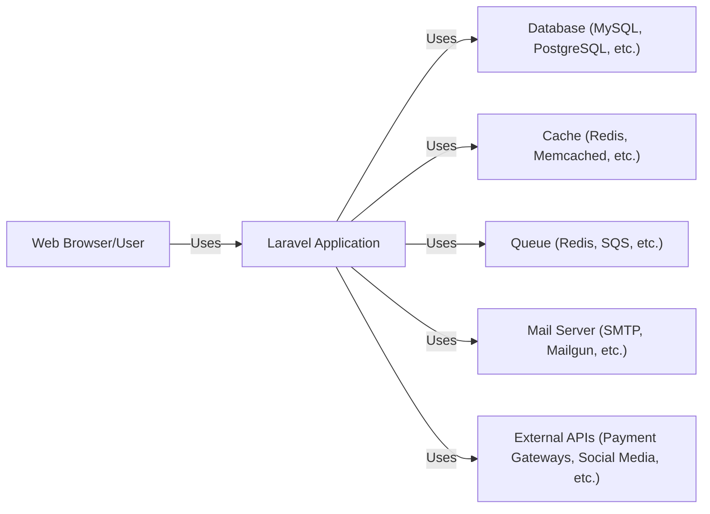
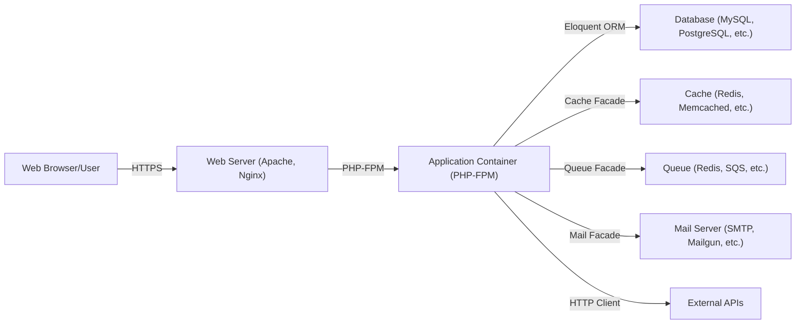
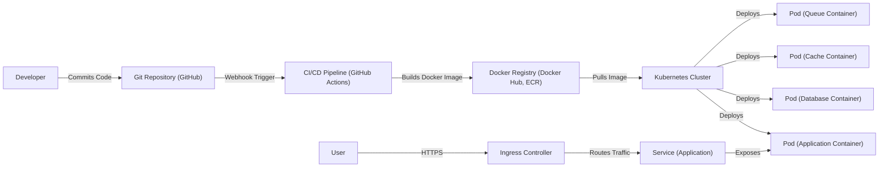

Okay, let's create a design document for the Laravel Framework, keeping in mind its purpose and potential users.

# BUSINESS POSTURE

Laravel is a free, open-source PHP web framework, intended for the development of web applications following the model–view–controller (MVC) architectural pattern and based on Symfony.  The business goals revolve around providing a robust, developer-friendly, and maintainable framework that accelerates web application development.  It aims to reduce development time and cost, while promoting best practices and secure coding patterns.

Business Priorities:

*   Rapid Development: Enable developers to build applications quickly and efficiently.
*   Maintainability:  Ensure the codebase is easy to understand, modify, and extend.
*   Community & Ecosystem: Foster a strong community and a rich ecosystem of packages and tools.
*   Security: Provide built-in features and encourage practices that minimize security vulnerabilities.
*   Scalability: Allow applications built with the framework to scale to handle increasing traffic and data.
*   Performance: Offer good performance characteristics to ensure responsive applications.

Business Risks:

*   Security Vulnerabilities:  Flaws in the framework itself or in common usage patterns could lead to exploits in applications built upon it. This is the most critical risk.
*   Dependency Issues: Reliance on third-party packages (via Composer) introduces supply chain risks.
*   Breaking Changes:  Major version updates could introduce incompatibilities, requiring significant refactoring for existing applications.
*   Performance Bottlenecks:  Poorly optimized framework features or inefficient usage could lead to performance issues.
*   Lack of Adoption:  If the framework fails to attract and retain developers, its long-term viability is threatened.
*   Community Fragmentation:  Competing frameworks or internal divisions could weaken the community and ecosystem.

# SECURITY POSTURE

Laravel incorporates several security features by default and encourages secure development practices. However, the ultimate security of an application built with Laravel depends heavily on how the developer utilizes the framework and addresses potential vulnerabilities.

Existing Security Controls:

*   security control: Protection against Cross-Site Scripting (XSS): Laravel's Blade templating engine automatically escapes output, mitigating XSS risks. Implemented in: `Illuminate\View\Compilers\BladeCompiler`.
*   security control: Protection against Cross-Site Request Forgery (CSRF): Laravel provides built-in CSRF token generation and validation. Implemented in: `Illuminate\Foundation\Http\Middleware\VerifyCsrfToken`.
*   security control: Input Validation: Laravel offers a robust validation system to sanitize and validate user input. Implemented in: `Illuminate\Validation`.
*   security control: Database Security: Laravel's Eloquent ORM uses parameterized queries, preventing SQL injection vulnerabilities when used correctly. Implemented in: `Illuminate\Database`.
*   security control: Authentication and Authorization: Laravel provides built-in authentication and authorization mechanisms (guards and policies). Implemented in: `Illuminate\Auth` and `Illuminate\Foundation\Auth`.
*   security control: Encryption: Laravel offers encryption services for securing sensitive data. Implemented in: `Illuminate\Encryption`.
*   security control: Hashing: Laravel provides hashing functions (e.g., Bcrypt, Argon2) for securely storing passwords. Implemented in: `Illuminate\Hashing`.
*   security control: Secure Configuration Defaults: Laravel encourages secure configuration practices, such as disabling debug mode in production.

Accepted Risks:

*   accepted risk: Developers may bypass or misconfigure built-in security features, introducing vulnerabilities.
*   accepted risk: Third-party packages may contain vulnerabilities, despite efforts to vet them.
*   accepted risk: Zero-day vulnerabilities in the framework itself or its dependencies may exist.
*   accepted risk: Developers may not keep the framework and its dependencies up-to-date, leaving known vulnerabilities unpatched.

Recommended Security Controls:

*   security control: Implement a robust Content Security Policy (CSP) to mitigate XSS and data injection attacks.
*   security control: Regularly run static analysis tools (SAST) on the codebase to identify potential vulnerabilities.
*   security control: Conduct regular security audits and penetration testing.
*   security control: Implement a Web Application Firewall (WAF) to protect against common web attacks.
*   security control: Use a dependency vulnerability scanner (e.g., Composer audit, Snyk) to identify and address vulnerabilities in third-party packages.
*   security control: Implement rate limiting to mitigate brute-force attacks and denial-of-service attacks.

Security Requirements:

*   Authentication:
    *   All user accounts must be authenticated before accessing protected resources.
    *   Support for multi-factor authentication (MFA) should be considered.
    *   Password reset mechanisms must be secure and prevent account takeover.
    *   Session management must be secure, using HTTPS and appropriate cookie settings (HttpOnly, Secure).

*   Authorization:
    *   Access to resources must be controlled based on user roles and permissions (RBAC or ABAC).
    *   Authorization checks must be performed on every request to protected resources.

*   Input Validation:
    *   All user input must be validated against a strict whitelist of allowed characters and formats.
    *   Input validation must be performed on both the client-side and server-side.
    *   Output encoding must be used to prevent XSS vulnerabilities.

*   Cryptography:
    *   Sensitive data (e.g., passwords, API keys) must be encrypted at rest and in transit.
    *   Strong, industry-standard cryptographic algorithms must be used.
    *   Cryptographic keys must be managed securely.

*   Error Handling
    *   Detailed error messages should not be exposed to the user.
    *   Errors should be logged for debugging and security analysis.

# DESIGN

## C4 CONTEXT

C4 Context Element List:

*   Element:
    *   Name: Web Browser/User
    *   Type: Person
    *   Description: A user interacting with the Laravel application through a web browser or other client.
    *   Responsibilities: Initiates requests, views responses, provides input.
    *   Security controls: Browser security settings, HTTPS.

*   Element:
    *   Name: Laravel Application
    *   Type: Software System
    *   Description: The web application built using the Laravel framework.
    *   Responsibilities: Handles user requests, processes data, interacts with other systems.
    *   Security controls: XSS protection, CSRF protection, input validation, authentication, authorization, encryption, hashing.

*   Element:
    *   Name: Database (MySQL, PostgreSQL, etc.)
    *   Type: Software System
    *   Description: The database used to store application data.
    *   Responsibilities: Stores and retrieves data.
    *   Security controls: Database access controls, encryption at rest, parameterized queries.

*   Element:
    *   Name: Cache (Redis, Memcached, etc.)
    *   Type: Software System
    *   Description: The caching system used to improve performance.
    *   Responsibilities: Stores frequently accessed data.
    *   Security controls: Access controls, data encryption (if sensitive data is cached).

*   Element:
    *   Name: Queue (Redis, SQS, etc.)
    *   Type: Software System
    *   Description: The queue system used for asynchronous task processing.
    *   Responsibilities: Manages and executes background tasks.
    *   Security controls: Access controls, message encryption (if sensitive data is queued).

*   Element:
    *   Name: Mail Server (SMTP, Mailgun, etc.)
    *   Type: Software System
    *   Description: The mail server used to send emails.
    *   Responsibilities: Sends emails.
    *   Security controls: Authentication, encryption (TLS/SSL).

*   Element:
    *   Name: External APIs (Payment Gateways, Social Media, etc.)
    *   Type: Software System
    *   Description: External APIs used by the application.
    *   Responsibilities: Provides specific functionalities (e.g., payment processing, social login).
    *   Security controls: API keys, OAuth, HTTPS.

## C4 CONTAINER

C4 Container Element List:

*   Element:
    *   Name: Web Browser/User
    *   Type: Person
    *   Description: A user interacting with the Laravel application.
    *   Responsibilities: Initiates requests, views responses, provides input.
    *   Security controls: Browser security settings, HTTPS.

*   Element:
    *   Name: Web Server (Apache, Nginx)
    *   Type: Container
    *   Description: The web server that receives requests from users.
    *   Responsibilities: Serves static content, forwards requests to the application container.
    *   Security controls: Web server configuration, HTTPS, WAF.

*   Element:
    *   Name: Application Container (PHP-FPM)
    *   Type: Container
    *   Description: The container that runs the Laravel application code.
    *   Responsibilities: Executes application logic, interacts with other containers.
    *   Security controls: XSS protection, CSRF protection, input validation, authentication, authorization, encryption, hashing.

*   Element:
    *   Name: Database (MySQL, PostgreSQL, etc.)
    *   Type: Container
    *   Description: The database used to store application data.
    *   Responsibilities: Stores and retrieves data.
    *   Security controls: Database access controls, encryption at rest, parameterized queries.

*   Element:
    *   Name: Cache (Redis, Memcached, etc.)
    *   Type: Container
    *   Description: The caching system.
    *   Responsibilities: Stores frequently accessed data.
    *   Security controls: Access controls, data encryption (if sensitive data is cached).

*   Element:
    *   Name: Queue (Redis, SQS, etc.)
    *   Type: Container
    *   Description: The queue system.
    *   Responsibilities: Manages and executes background tasks.
    *   Security controls: Access controls, message encryption (if sensitive data is queued).

*   Element:
    *   Name: Mail Server (SMTP, Mailgun, etc.)
    *   Type: Container
    *   Description: The mail server.
    *   Responsibilities: Sends emails.
    *   Security controls: Authentication, encryption (TLS/SSL).

*   Element:
    *   Name: External APIs
    *   Type: Container
    *   Description: External APIs used by the application.
    *   Responsibilities: Provides specific functionalities.
    *   Security controls: API keys, OAuth, HTTPS.

## DEPLOYMENT

Possible Deployment Solutions:

1.  Traditional Hosting: Deploying to a shared or dedicated server with Apache/Nginx and PHP-FPM.
2.  Cloud Platform (PaaS): Deploying to a platform like Heroku, AWS Elastic Beanstalk, or Google App Engine.
3.  Containerized Deployment: Using Docker and Kubernetes to deploy the application.
4.  Serverless: Using AWS Lambda or similar to deploy individual functions.

Chosen Solution (Containerized Deployment with Kubernetes):

Deployment Element List:

*   Element:
    *   Name: Developer
    *   Type: Person
    *   Description: A developer working on the Laravel application.
    *   Responsibilities: Writes code, commits changes.
    *   Security controls: Code reviews, secure coding practices.

*   Element:
    *   Name: Git Repository (GitHub)
    *   Type: System
    *   Description: The repository hosting the application's source code.
    *   Responsibilities: Stores code, tracks changes.
    *   Security controls: Access controls, branch protection rules.

*   Element:
    *   Name: CI/CD Pipeline (GitHub Actions)
    *   Type: System
    *   Description: The pipeline that automates the build, test, and deployment process.
    *   Responsibilities: Builds Docker images, runs tests, deploys to Kubernetes.
    *   Security controls: Secure configuration, secrets management.

*   Element:
    *   Name: Docker Registry (Docker Hub, ECR)
    *   Type: System
    *   Description: The registry storing the Docker images.
    *   Responsibilities: Stores and distributes Docker images.
    *   Security controls: Access controls, image scanning.

*   Element:
    *   Name: Kubernetes Cluster
    *   Type: System
    *   Description: The cluster orchestrating the containerized application.
    *   Responsibilities: Manages deployments, scaling, and networking.
    *   Security controls: Network policies, RBAC, pod security policies.

*   Element:
    *   Name: Pod (Application Container)
    *   Type: Container Instance
    *   Description: A pod running the Laravel application container.
    *   Responsibilities: Executes application logic.
    *   Security controls: Container security context, resource limits.

*   Element:
    *   Name: Pod (Database Container)
    *   Type: Container Instance
    *   Description: A pod running the database container.
    *   Responsibilities: Stores and retrieves data.
    *   Security controls: Container security context, resource limits, data encryption.

*   Element:
    *   Name: Pod (Cache Container)
    *   Type: Container Instance
    *   Description: A pod running the cache container.
    *   Responsibilities: Stores frequently accessed data.
    *   Security controls: Container security context, resource limits.

*   Element:
    *   Name: Pod (Queue Container)
    *   Type: Container Instance
    *   Description: A pod running the queue container.
    *   Responsibilities: Manages and executes background tasks.
    *   Security controls: Container security context, resource limits.

*   Element:
    *   Name: Ingress Controller
    *   Type: System
    *   Description: The controller managing external access to the application.
    *   Responsibilities: Routes traffic to the appropriate services.
    *   Security controls: TLS termination, WAF integration.

*   Element:
    *   Name: Service (Application)
    *   Type: System
    *   Description: A Kubernetes service exposing the application pods.
    *   Responsibilities: Provides a stable endpoint for accessing the application.
    *   Security controls: Network policies.

*   Element:
    *   Name: User
    *   Type: Person
    *   Description: A user accessing the application.
    *   Responsibilities: Initiates requests.
    *   Security controls: Browser security, HTTPS.

## BUILD

```mermaid
graph LR
    Developer["Developer"] -- "Commits Code" --> GitRepo["Git Repository (GitHub)"]
    GitRepo -- "Webhook Trigger" --> CI_CD["CI/CD Pipeline (GitHub Actions)"]
    CI_CD -- "Checkout Code" --> Checkout["Checkout Code"]
    Checkout -- "Install Dependencies (Composer)" --> Composer["Composer Install"]
    Composer -- "Run Tests (PHPUnit)" --> Tests["Run Tests"]
    Tests -- "Run SAST (Psalm/PHPStan)" --> SAST["Static Analysis"]
    SAST -- "Build Application" --> Build["Build"]
    Build -- "Build Docker Image" --> DockerBuild["Docker Build"]
    DockerBuild -- "Push Image to Registry" --> DockerRegistry["Docker Registry"]

```

Build Process Description:

1.  Developer commits code to the Git repository (e.g., GitHub).
2.  A webhook triggers the CI/CD pipeline (e.g., GitHub Actions).
3.  The pipeline checks out the code.
4.  Composer installs the project's dependencies.
5.  PHPUnit runs the test suite.
6.  A static analysis tool (e.g., Psalm, PHPStan) scans the codebase for potential vulnerabilities and code quality issues.
7.  The application is built (e.g., assets are compiled).
8.  A Docker image is built, containing the application code and its dependencies.
9.  The Docker image is pushed to a container registry (e.g., Docker Hub, ECR).

Security Controls in Build Process:

*   Dependency Management: Composer is used to manage dependencies, and tools like `composer audit` or Snyk can be integrated to scan for vulnerabilities in third-party packages.
*   Static Analysis: SAST tools (Psalm, PHPStan) are used to identify potential security vulnerabilities and code quality issues before deployment.
*   Automated Testing: PHPUnit is used to run automated tests, ensuring that security-related functionality (e.g., authentication, authorization) works as expected.
*   Secure Build Environment: The CI/CD pipeline runs in a secure environment (e.g., GitHub Actions runners), with limited access and secrets management.
*   Image Scanning: Docker images can be scanned for vulnerabilities before being pushed to the registry.

# RISK ASSESSMENT

Critical Business Processes:

*   User Authentication and Authorization: Ensuring only authorized users can access sensitive data and functionality.
*   Data Management: Protecting the integrity and confidentiality of user data stored in the database.
*   Application Availability: Maintaining the availability of the application to users.
*   Payment Processing (if applicable): Securely handling financial transactions.

Data Sensitivity:

*   User Data (PII): Names, email addresses, passwords (hashed), addresses, phone numbers, etc. - High Sensitivity
*   Financial Data (if applicable): Credit card numbers, transaction details - High Sensitivity
*   Application Data: Data specific to the application's functionality - Varies depending on the application.
*   Session Data: User session identifiers - Medium Sensitivity
*   Logs: Application logs, which may contain sensitive information if not properly configured - Medium Sensitivity

# QUESTIONS & ASSUMPTIONS

Questions:

*   What specific types of applications are typically built with this instance of Laravel (e.g., e-commerce, social media, internal tools)? This helps determine the specific security requirements.
*   What is the expected scale of applications built with Laravel (number of users, traffic volume)? This impacts scalability and performance considerations.
*   What is the organization's risk tolerance? This influences the level of security controls that should be implemented.
*   Are there any specific compliance requirements (e.g., GDPR, HIPAA, PCI DSS)?
*   What is the level of security expertise of the developers using Laravel?

Assumptions:

*   BUSINESS POSTURE: The primary goal is to build web applications efficiently and securely.
*   SECURITY POSTURE: Developers have a basic understanding of web security principles. The framework is kept up-to-date.
*   DESIGN: A standard MVC architecture is used. A relational database is used for data storage. A caching mechanism is used for performance optimization. A queue system is used for asynchronous tasks.