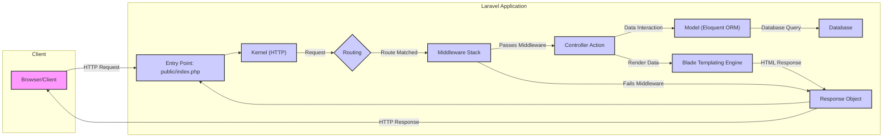

## Project Design Document: Laravel Application Framework (Improved)

**1. Introduction**

This document provides an enhanced architectural design of the Laravel PHP framework, focusing on the core components, their interactions, and security implications. This detailed design serves as the foundation for subsequent threat modeling activities, enabling a comprehensive assessment of potential security vulnerabilities within applications built using Laravel. The scope of this document is the core framework structure as represented in the `laravel/laravel` repository, which provides the basic application skeleton. This document aims to provide a more granular understanding of the framework's inner workings to facilitate more effective threat identification.

**2. System Overview**

Laravel is a sophisticated, open-source PHP web framework, architected for the rapid development of secure and scalable web applications. It adheres to the Model-View-Controller (MVC) design pattern, promoting code organization and separation of concerns. At its heart lies a powerful service container, responsible for managing class dependencies through dependency injection. This architecture facilitates modularity, testability, and maintainability. Laravel offers a rich set of built-in features, including a robust routing system, an elegant templating engine, a powerful ORM, and comprehensive security features, simplifying the development process and reducing the likelihood of common web application vulnerabilities.

**3. Key Components and Architecture**

The following list provides a more detailed breakdown of the key components of the Laravel framework and their interactions:

*   **Entry Point (`public/index.php`):**
    *   Serves as the primary entry point for all incoming HTTP requests directed to the application.
    *   Initiates the Laravel application bootstrapping process.
    *   Includes loading the Composer autoloader, which makes all project dependencies available.
    *   Creates an instance of the Laravel application.
    *   Dispatches the incoming HTTP request to the application kernel for processing.
*   **Kernel (`app/Http/Kernel.php` and `app/Console/Kernel.php`):**
    *   **HTTP Kernel:**  The central handler for incoming web requests. It defines the middleware pipeline through which each request passes.
    *   **Console Kernel:** Handles incoming commands executed via the Artisan CLI. It defines the middleware pipeline for console commands.
    *   Both kernels extend the `Illuminate\Foundation\Http\Kernel` and `Illuminate\Foundation\Console\Kernel` respectively, providing core functionality.
    *   They bootstrap the core framework components and manage the request/command lifecycle.
*   **Service Providers (`config/app.php` -> `providers` array and `app/Providers` directory):**
    *   Fundamental building blocks of the Laravel application's bootstrapping process.
    *   Responsible for registering bindings within the service container, making classes and interfaces available for dependency injection.
    *   Implement the `register()` method to bind services and the optional `boot()` method to register event listeners, routes, and other application setup tasks.
    *   Examples include providers for database services, routing, view rendering, and custom application services.
*   **Service Container (`Illuminate\Container\Container`):**
    *   A sophisticated dependency injection container.
    *   Manages the instantiation and configuration of application objects.
    *   Allows for loose coupling between components, improving modularity and testability.
    *   Resolves dependencies automatically when creating instances of classes.
    *   Supports singleton bindings for shared instances.
*   **Request Lifecycle:**
    *   **Routing (`routes/web.php`, `routes/api.php`, `routes/console.php`, `routes/channels.php`):**
        *   Defines the application's endpoints, mapping incoming HTTP requests (and console commands, broadcast events) to specific controllers or closure-based actions.
        *   Supports route parameters, regular expression constraints, and named routes.
        *   Route middleware can be applied to individual routes or groups of routes to perform actions before or after the route handler is executed (e.g., authentication, authorization, logging).
    *   **Middleware (`app/Http/Middleware`):**
        *   Provides a powerful mechanism for intercepting and filtering HTTP requests entering the application.
        *   Operates as a series of "layers" through which a request passes.
        *   Examples of built-in middleware include authentication (`Authenticate`), CSRF protection (`VerifyCsrfToken`), and request trimming (`TrimStrings`).
        *   Custom middleware can be created to implement application-specific logic.
        *   Middleware execution order is defined in the `$middlewarePriority` property of the HTTP Kernel.
    *   **Controllers (`app/Http/Controllers`):**
        *   Responsible for handling specific application logic triggered by incoming requests.
        *   Receive the `Request` object containing information about the incoming request.
        *   Interact with models to retrieve or manipulate data from the database or other data sources.
        *   Return `Response` objects, which can be views, JSON data, redirects, or other HTTP responses.
        *   Can utilize dependency injection to access services from the service container.
    *   **Request Objects (`Illuminate\Http\Request`):**
        *   Represents an incoming HTTP request, providing access to request data, headers, cookies, and uploaded files.
        *   Provides methods for retrieving input data (`input()`, `get()`, `post()`), accessing headers (`header()`), and checking request methods (`isMethod()`).
        *   Form requests (`app/Http/Requests`) extend the base `Request` class and provide a convenient way to encapsulate request validation logic.
    *   **Response Objects (`Illuminate\Http\Response`):**
        *   Represents the HTTP response that will be sent back to the client's browser or application.
        *   Allows setting the response status code (`setStatusCode()`), headers (`header()`), and content (`setContent()`).
        *   Provides helper methods for returning JSON responses (`json()`), file downloads (`download()`), and redirects (`redirect()`).
*   **Blade Templating Engine (`resources/views`):**
    *   A user-friendly and powerful templating engine for creating dynamic HTML views.
    *   Allows developers to embed PHP code within HTML templates using concise syntax.
    *   Supports template inheritance (`@extends`, `@section`), components (`@component`), and control structures (`@if`, `@foreach`).
    *   Automatically escapes output by default to prevent Cross-Site Scripting (XSS) vulnerabilities.
*   **Eloquent ORM (`app/Models`):**
    *   Laravel's expressive Object-Relational Mapper (ORM) for simplifying database interactions.
    *   Allows developers to interact with database tables using object-oriented syntax.
    *   Uses models (typically located in the `app/Models` directory) to represent database tables and their relationships.
    *   Provides features like query building, relationships (one-to-one, one-to-many, many-to-many), and model events.
    *   Protects against SQL injection by using parameterized queries.
*   **Database (`config/database.php`, `database/migrations`, `database/seeders`):**
    *   Configuration for database connections, supporting various database systems (e.g., MySQL, PostgreSQL, SQLite, SQL Server).
    *   **Migrations:** Provide a way to manage database schema changes in a version-controlled manner.
    *   **Seeders:** Allow populating the database with initial or test data.
    *   Provides a fluent query builder for performing database operations.
*   **Authentication (`config/auth.php`, `app/Models/User.php`, `app/Providers/AuthServiceProvider.php`):**
    *   Provides built-in features for user authentication (verifying user credentials) and authorization (determining user permissions).
    *   Includes middleware for protecting routes that require authentication (`auth`).
    *   Supports various authentication "guards" (e.g., `web`, `api`) and "providers" (e.g., Eloquent, database).
    *   Offers features like password hashing, password reset, and "remember me" functionality.
    *   Policies (defined in `app/Policies`) are used for fine-grained authorization control.
*   **Authorization (`app/Policies`, `app/Providers/AuthServiceProvider.php`):**
    *   Allows defining authorization logic for specific models and actions.
    *   Policies are classes that organize authorization rules related to a particular model.
    *   Gates (defined using `Gate::define()` in `AuthServiceProvider`) provide a simple, closure-based way to define authorization checks.
    *   The `@can` Blade directive and the `authorize()` method on controllers facilitate authorization checks in views and controllers.
*   **Session Management (`config/session.php`):**
    *   Provides mechanisms for managing user sessions across multiple requests.
    *   Supports various session drivers for storing session data (e.g., `file`, `database`, `cookie`, `redis`, `memcached`).
    *   Configuration options include session lifetime, cookie name, and session encryption.
    *   Middleware (`StartSession`) is responsible for starting the session for each request.
*   **Caching (`config/cache.php`):**
    *   Provides a unified API for interacting with various caching systems to improve application performance by storing frequently accessed data in memory or other fast storage.
    *   Supports drivers like `file`, `redis`, `memcached`, and `database`.
    *   Offers methods for storing, retrieving, and deleting cached data.
*   **Events and Listeners (`app/Providers/EventServiceProvider.php`, `app/Listeners`, `app/Events`):**
    *   Implements the observer pattern, allowing for decoupling of components by dispatching events when certain actions occur and listening for those events to perform other tasks.
    *   Events are classes that represent something that has happened in the application.
    *   Listeners are classes that handle specific events.
    *   EventServiceProvider maps events to their corresponding listeners.
*   **Queues (`config/queue.php`, `app/Jobs`):**
    *   Provides a mechanism for deferring the processing of time-consuming tasks, improving the responsiveness of web requests.
    *   Supports various queue drivers (e.g., `database`, `redis`, `beanstalkd`, `sqs`).
    *   Jobs are classes that encapsulate the tasks to be queued.
    *   Workers process jobs from the queue in the background.
*   **Artisan Console (`php artisan`):**
    *   Laravel's powerful command-line interface (CLI) for performing a wide range of development and administrative tasks.
    *   Includes commands for generating boilerplate code (controllers, models, migrations), running database migrations, clearing cache, and managing queues.
    *   Custom Artisan commands can be created to automate application-specific tasks.
*   **Testing (`tests` directory):**
    *   Provides a comprehensive testing framework built on PHPUnit for writing various types of tests, including unit tests, feature tests, and integration tests.
    *   Offers helper methods for simulating HTTP requests, interacting with the database, and asserting expected outcomes.
    *   Encourages Test-Driven Development (TDD) practices.
*   **Logging (`config/logging.php`):**
    *   Provides a flexible and configurable logging system for recording application events, errors, and debugging information.
    *   Supports various logging channels (e.g., `single`, `daily`, `slack`, `syslog`, `stack`).
    *   Allows customizing log formatting and severity levels.
*   **Error Handling (`app/Exceptions/Handler.php`):**
    *   Centralized location for handling exceptions and errors that occur during application execution.
    *   The `render()` method is responsible for converting exceptions into HTTP responses.
    *   The `report()` method is used for logging exceptions.
    *   Allows for custom error reporting and rendering logic.
*   **Front-end Assets (Mix/Vite, `webpack.mix.js` or `vite.config.js`, `resources/js`, `resources/css`):**
    *   Seamless integration with asset bundlers like Laravel Mix (built on Webpack) or Vite for compiling and managing front-end assets (JavaScript, CSS, images).
    *   Provides a streamlined workflow for tasks like code compilation, minification, and bundling.
*   **Packages (Composer, `composer.json`):**
    *   Laravel leverages Composer as its dependency manager.
    *   The `composer.json` file defines the project's dependencies on third-party packages.
    *   A vast ecosystem of open-source packages is available through Packagist, extending Laravel's functionality.

**4. Data Flow Diagram**

**5. Security Considerations**

The following list expands on the security aspects within the Laravel architecture, providing more specific examples:

*   **Input Validation:**
    *   Crucial for preventing injection attacks (SQL injection, XSS, command injection).
    *   Laravel's request validation features should be used to sanitize and validate all user-provided input.
    *   Example vulnerabilities: Failing to validate the length of a username field could lead to buffer overflows; not sanitizing HTML input can lead to XSS.
*   **Output Encoding:**
    *   Essential for preventing Cross-Site Scripting (XSS) attacks.
    *   Blade templates automatically escape output by default, but developers must be mindful of contexts where raw output is necessary (using `!!`) and ensure proper manual escaping.
    *   Example vulnerabilities: Displaying user-generated content without escaping could allow attackers to inject malicious JavaScript.
*   **Cross-Site Request Forgery (CSRF) Protection:**
    *   Laravel's built-in middleware (`VerifyCsrfToken`) protects against CSRF attacks by verifying a unique token in each request originating from the application's forms.
    *   Ensure the `@csrf` Blade directive is included in all forms.
    *   Example vulnerabilities: An attacker could trick a logged-in user into performing actions on the application without their knowledge.
*   **Authentication and Authorization:**
    *   Secure implementation is paramount. Misconfigurations can lead to unauthorized access.
    *   Use strong password hashing algorithms (Bcrypt is the default in Laravel).
    *   Implement proper authorization checks using policies and gates to restrict access to resources based on user roles and permissions.
    *   Example vulnerabilities: Weak password policies can lead to easy password cracking; failing to authorize actions before performing them can allow unauthorized data modification.
*   **Session Management:**
    *   Secure session configuration is vital to prevent session hijacking and fixation attacks.
    *   Use secure session drivers (e.g., `database`, `redis`) and configure secure cookie settings (e.g., `http_only`, `secure`).
    *   Regenerate session IDs after successful login to prevent session fixation.
    *   Example vulnerabilities: Predictable session IDs can be guessed by attackers; non-HTTPS connections can expose session cookies.
*   **Database Security:**
    *   While Eloquent helps prevent SQL injection through parameterized queries, proper database configuration and access control are still essential.
    *   Follow the principle of least privilege when granting database access to the application.
    *   Regularly update database server software to patch vulnerabilities.
    *   Example vulnerabilities: Using raw queries without proper sanitization can lead to SQL injection; granting excessive database privileges can allow attackers to compromise the entire database.
*   **File Uploads:**
    *   Secure handling of file uploads is necessary to prevent malicious file uploads and potential server compromise.
    *   Validate file types, sizes, and content.
    *   Store uploaded files outside the webroot and use unique, non-guessable filenames.
    *   Consider using a dedicated storage service.
    *   Example vulnerabilities: Allowing the upload of executable files could lead to remote code execution; storing files in the webroot with predictable names could allow direct access to sensitive data.
*   **Error Handling and Logging:**
    *   While detailed error messages are helpful for development, they should not expose sensitive information in production.
    *   Configure error reporting to log errors securely without displaying sensitive details to users.
    *   Implement robust logging practices for auditing and incident response.
    *   Example vulnerabilities: Displaying stack traces in production can reveal internal application details; insufficient logging can hinder the investigation of security incidents.
*   **Dependency Management:**
    *   Keeping dependencies up-to-date is crucial to patch known vulnerabilities in third-party packages.
    *   Regularly run `composer update` to update dependencies.
    *   Monitor security advisories for vulnerabilities in used packages.
    *   Example vulnerabilities: Using outdated packages with known security flaws can expose the application to exploits.
*   **Security Headers:**
    *   Laravel allows for setting security-related HTTP headers to enhance security.
    *   Implement headers like Content Security Policy (CSP), HTTP Strict Transport Security (HSTS), X-Content-Type-Options, and X-Frame-Options.
    *   Example vulnerabilities: Missing CSP can make the application vulnerable to XSS; not using HSTS can leave users vulnerable to man-in-the-middle attacks on their first visit.
*   **Rate Limiting:**
    *   Implementing rate limiting can help prevent brute-force attacks (e.g., password guessing) and denial-of-service attacks.
    *   Laravel provides middleware for rate limiting requests.
    *   Example vulnerabilities: Without rate limiting, attackers can repeatedly try to guess passwords or overload the server with requests.

**6. Deployment Considerations**

The security of a Laravel application is heavily influenced by the deployment environment. Key considerations include:

*   **Secure Server Configuration:**
    *   Properly configure the web server (e.g., Apache, Nginx) with security best practices.
    *   Disable unnecessary modules and features.
    *   Restrict access to sensitive files and directories.
*   **HTTPS:**
    *   Enforce HTTPS to encrypt all communication between the client and the server, protecting sensitive data in transit.
    *   Obtain and configure a valid SSL/TLS certificate.
    *   Enforce HTTPS redirection.
*   **Firewall:**
    *   Implement a firewall to control network traffic and block unauthorized access to the server.
    *   Restrict access to only necessary ports.
*   **Operating System Security:**
    *   Keep the operating system and all installed software up-to-date with the latest security patches.
    *   Harden the operating system by disabling unnecessary services and configuring secure user accounts.
*   **File Permissions:**
    *   Set appropriate file permissions to prevent unauthorized access to sensitive files and directories.
    *   Follow the principle of least privilege when assigning file permissions.
*   **Environment Variables:**
    *   Store sensitive information (e.g., database credentials, API keys, encryption keys) in environment variables and avoid hardcoding them in the application code.
    *   Ensure environment variables are securely managed and not exposed.
*   **Regular Security Audits and Penetration Testing:**
    *   Conduct regular security audits and penetration testing to identify potential vulnerabilities in the application and its infrastructure.

**7. Assumptions and Limitations**

This design document focuses on the core architectural components of the Laravel framework as found in the `laravel/laravel` repository. It assumes a standard installation and does not cover customizations, third-party packages in detail, or specific application logic implemented by developers. The threat modeling process will need to consider specific application logic, custom middleware, and any additional components or services used in a particular project built with Laravel. This document provides a more granular and detailed foundational understanding to facilitate that subsequent, more specific threat modeling activity.