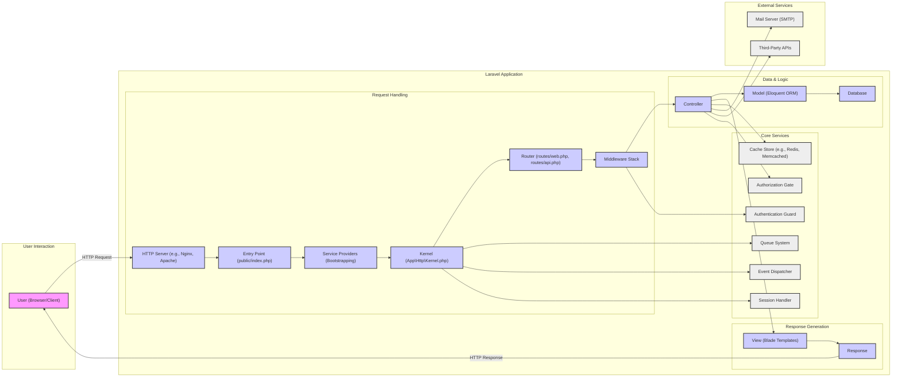
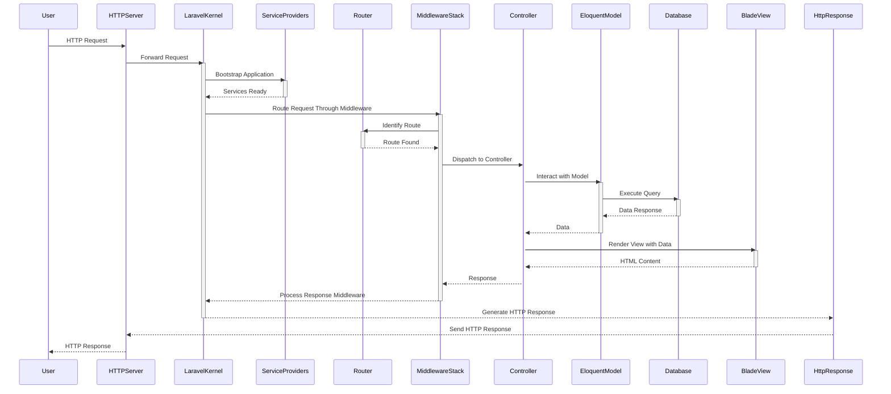

# Project Design Document: Laravel Framework

**Version:** 1.1
**Date:** October 26, 2023
**Author:** AI Software Architect

## 1. Introduction

This document provides an enhanced architectural design overview of the Laravel framework, an open-source PHP web framework. This document is specifically tailored to serve as a robust foundation for subsequent threat modeling activities. It meticulously outlines the key components, data flows, and interactions within the framework to facilitate the comprehensive identification of potential security vulnerabilities.

## 2. Goals and Objectives

The primary goal of this document is to provide a detailed and precise architectural description of the Laravel framework, optimized for security analysis. The objectives are:

*   Clearly identify the major components and their specific responsibilities within the framework.
*   Thoroughly describe the typical request lifecycle and the intricate data flow within the framework, highlighting potential interception points.
*   Emphasize key areas that are particularly relevant to security considerations and potential attack vectors.
*   Provide clear and informative visual representations of the architecture and data flow to aid understanding.
*   Define the scope for subsequent threat modeling activities based on the described architecture.

## 3. System Architecture

Laravel adheres to the Model-View-Controller (MVC) architectural pattern, promoting a clear separation of concerns within the application:

*   **Model:** Encapsulates the data structures and business logic of the application. It is responsible for interacting with the data persistence layer (e.g., database).
*   **View:**  Manages the presentation of data to the user. Laravel utilizes the Blade templating engine for creating dynamic web pages.
*   **Controller:** Acts as the intermediary between the Model and the View. It receives user requests, orchestrates data retrieval or manipulation through the Model, and selects the appropriate View to render the response.

Beyond the core MVC pattern, Laravel incorporates a range of architectural elements that contribute to its functionality and extensibility:

*   **Routing:**  Defines how incoming HTTP requests are mapped to specific controller actions based on the request URI, HTTP method, and optional parameters.
*   **Middleware:** Provides a powerful mechanism to intercept and filter HTTP requests entering the application. This allows for implementing cross-cutting concerns such as authentication, authorization, logging, and request modification.
*   **Service Providers:**  Serve as central points for bootstrapping the application and registering services within the application's service container. They are crucial for dependency injection and managing application components.
*   **Facades:** Offer a "static" interface to classes that are resolved from the application's service container, providing a convenient way to access framework features.
*   **Artisan Console:**  A built-in command-line interface that provides a suite of helpful commands for tasks such as database migrations, queue management, code generation, and application management.
*   **Event System:**  Implements an observer pattern, allowing for decoupling of components by enabling the dispatching of events and the registration of listeners that react to those events.
*   **Queue System:**  Facilitates the asynchronous processing of tasks, improving application responsiveness by deferring time-consuming operations to background workers.
*   **Cache System:**  Provides an abstraction layer for various caching backends, enabling the storage of frequently accessed data in memory or other fast storage mechanisms to reduce database load and improve performance.
*   **Session Management:**  Handles the creation, storage, and retrieval of user session data, typically using cookies or database storage to maintain user state across requests.

## 4. Key Components

This section provides a more detailed breakdown of the major components within the Laravel framework, emphasizing their functionalities and security implications:

*   **HTTP Server (e.g., Nginx, Apache):**  The entry point for all web requests. Its configuration is critical for security, including handling SSL/TLS, setting security headers, and preventing common web server vulnerabilities.
*   **Entry Point (public/index.php):** The initial PHP script executed for each web request. It bootstraps the Laravel application, loading the framework and initiating the request handling process.
*   **Service Providers:**  Responsible for registering core framework services and application-specific components. Misconfigured or malicious service providers could introduce vulnerabilities.
*   **Kernel (App\Http\Kernel.php):** The central hub for handling incoming HTTP requests. It defines the middleware pipeline that all requests pass through, making it a crucial component for security enforcement.
*   **Router (routes/web.php, routes/api.php):**  Maps incoming request URIs to specific controller actions. Improperly secured routes or overly permissive routing configurations can expose sensitive functionalities.
*   **Middleware Stack:** A series of filters that HTTP requests pass through before reaching the controller. This is a key area for implementing security measures like authentication, authorization, CSRF protection, and input sanitization. Vulnerabilities in custom middleware can be significant.
*   **Controller:**  Handles the application logic for specific requests. It interacts with models and views. Security vulnerabilities can arise from insecure controller logic, such as insufficient input validation or improper handling of sensitive data.
*   **Model (Eloquent ORM):** Represents data and business logic, providing an interface for interacting with the database. While Eloquent helps prevent SQL injection, vulnerabilities can still occur through mass assignment issues or poorly constructed queries.
*   **Database:**  The persistent storage for application data. Secure database configuration, access control, and data encryption are essential security considerations.
*   **View (Blade Templates):**  Responsible for rendering the user interface. Blade's automatic escaping helps prevent XSS, but developers must be mindful of contexts where raw output is used.
*   **Response:**  The HTTP response sent back to the user's browser. Security headers should be set in the response to mitigate various client-side attacks.
*   **Cache Store (e.g., Redis, Memcached):**  Used for caching data to improve performance. Improperly secured cache stores can lead to data leaks or manipulation.
*   **Queue System:**  Processes tasks asynchronously. Security considerations include ensuring that queued jobs are properly authorized and do not introduce vulnerabilities when executed.
*   **Event Dispatcher:**  Manages the dispatching and handling of events. Care must be taken to ensure that event listeners do not introduce security flaws.
*   **Session Handler:**  Manages user session data. Secure configuration, including using secure cookies and appropriate storage mechanisms, is crucial.
*   **Authentication Guard:**  Handles user authentication. Robust authentication mechanisms and protection against brute-force attacks are important.
*   **Authorization Gate:**  Manages user authorization, controlling access to resources and functionalities. Properly defined and enforced authorization rules are essential.
*   **Mail Server (SMTP):**  Used for sending emails. Security considerations include preventing email spoofing and ensuring secure communication with the mail server.
*   **Third-Party APIs:** External services that the application interacts with. Security risks include insecure API communication, data breaches on the third-party side, and vulnerabilities in the API integration.
*   **Artisan CLI:** Provides command-line tools. Access to Artisan commands should be restricted in production environments to prevent unauthorized actions.

## 5. Data Flow

The typical lifecycle of an HTTP request within a Laravel application involves the following detailed steps:

1. **User sends an HTTP request:** A user interacts with the application via their browser or client, initiating an HTTP request targeting a specific resource.
2. **HTTP Server receives the request:** The web server (e.g., Nginx, Apache) intercepts the incoming HTTP request.
3. **Request enters Laravel application (public/index.php):** The web server directs the request to the `public/index.php` file, which serves as the entry point for the Laravel application.
4. **Bootstrapping Service Providers:** The `index.php` script initiates the bootstrapping process, loading and registering the application's service providers. These providers configure various framework components and dependencies.
5. **Kernel handles the request:** The HTTP Kernel receives the request and begins processing it by passing it through the defined middleware stack.
6. **Middleware Pipeline Execution:** The request traverses a series of middleware components. Each middleware can inspect and modify the request, perform authentication or authorization checks, log the request, or perform other pre-processing tasks.
7. **Routing:** The Router component examines the request URI and matches it against the defined routes in `routes/web.php` or `routes/api.php`.
8. **Route Binding and Parameter Resolution:** Once a matching route is found, the Router resolves any route parameters and potentially performs model binding to retrieve relevant data based on the parameters.
9. **Controller Action Invocation:** The Router dispatches the request to the appropriate controller action associated with the matched route.
10. **Controller Logic Execution:** The controller action executes the application logic required to handle the request. This may involve:
    *   **Interaction with Models:** The controller interacts with one or more Eloquent models to retrieve, create, update, or delete data from the database.
    *   **Business Logic Execution:** The controller executes specific business rules and logic related to the request.
    *   **Interaction with External Services:** The controller may interact with external services or APIs.
11. **Model-Database Interaction:** Eloquent models use the configured database connection to execute queries against the database.
12. **View Rendering:** The controller prepares the necessary data and passes it to a View (typically a Blade template) for rendering the user interface.
13. **Response Generation:** The Blade templating engine processes the view file, combining the provided data with the template to generate the final HTML response.
14. **Response Middleware Processing:** The generated response may pass through additional middleware for post-processing, such as adding security headers or modifying the response content.
15. **HTTP Server sends the response:** The HTTP Kernel returns the processed response to the HTTP server, which then sends it back to the user's browser or client.

## 6. Security Considerations

This section expands on the security considerations within the Laravel framework, providing more specific examples and potential threats:

*   **Authentication and Authorization:**
    *   **Threats:** Brute-force attacks, credential stuffing, unauthorized access to resources.
    *   **Laravel Features:** Built-in authentication scaffolding, password hashing, rate limiting middleware, authorization gates and policies. Proper implementation and configuration are crucial.
*   **Input Validation and Sanitization:**
    *   **Threats:** SQL injection, Cross-Site Scripting (XSS), command injection, path traversal.
    *   **Laravel Features:** Request validation rules, form requests, Eloquent's query builder (parameterized queries), Blade's automatic output escaping. Developers must diligently validate and sanitize all user inputs.
*   **Cross-Site Scripting (XSS) Prevention:**
    *   **Threats:** Injection of malicious scripts into web pages, leading to session hijacking, data theft, and defacement.
    *   **Laravel Features:** Blade templating engine's automatic output escaping. However, developers need to be cautious when using raw output or integrating with third-party libraries.
*   **Cross-Site Request Forgery (CSRF) Protection:**
    *   **Threats:** Malicious websites or emails tricking authenticated users into performing unintended actions on the application.
    *   **Laravel Features:** Built-in CSRF protection using tokens. Ensure the `@csrf` directive is used in forms and AJAX requests.
*   **SQL Injection Prevention:**
    *   **Threats:** Attackers injecting malicious SQL queries to access or manipulate database data.
    *   **Laravel Features:** Eloquent ORM's query builder uses parameterized queries by default, significantly reducing the risk of SQL injection. Avoid using raw SQL queries where possible, and sanitize inputs if necessary.
*   **Mass Assignment Vulnerability:**
    *   **Threats:** Attackers manipulating request parameters to modify unintended model attributes.
    *   **Laravel Features:** `$fillable` and `$guarded` properties on Eloquent models to control which attributes can be mass-assigned.
*   **Session Security:**
    *   **Threats:** Session hijacking, session fixation.
    *   **Laravel Features:** Secure session configuration options (e.g., `secure` and `httponly` flags for cookies), session encryption, session regeneration.
*   **File Upload Security:**
    *   **Threats:** Uploading malicious files (e.g., malware, scripts) that can compromise the server or other users.
    *   **Laravel Features:** File validation rules, secure file storage configurations. Implement thorough validation of file types, sizes, and content.
*   **Dependency Management:**
    *   **Threats:** Using outdated or vulnerable third-party libraries.
    *   **Laravel Features:** Composer for dependency management. Regularly update dependencies to patch known vulnerabilities.
*   **Error Handling and Logging:**
    *   **Threats:** Information disclosure through verbose error messages, lack of audit trails.
    *   **Laravel Features:** Configurable error reporting levels, logging facilities. Configure error reporting appropriately for production environments and implement comprehensive logging.
*   **Security Headers:**
    *   **Threats:** Various client-side attacks (e.g., XSS, clickjacking).
    *   **Laravel Features:** Middleware can be used to set security headers like Content Security Policy (CSP), HTTP Strict Transport Security (HSTS), and X-Frame-Options.
*   **Rate Limiting:**
    *   **Threats:** Brute-force attacks, denial-of-service attacks.
    *   **Laravel Features:** Rate limiting middleware to restrict the number of requests from a given IP address or user.

## 7. Assumptions and Constraints

*   This document describes the general architecture of the core Laravel framework. Specific application implementations, third-party packages, and custom logic are outside the scope of this document.
*   It is assumed that the underlying infrastructure (e.g., operating system, web server, PHP installation) is configured and maintained according to security best practices.
*   The threat modeling activities based on this document will primarily focus on the architectural components and data flows within the Laravel application itself.

## 8. Threat Model Scope

The scope of the threat model, based on this design document, will encompass the following aspects of the Laravel framework:

*   The flow of HTTP requests from the user to the application and back.
*   The interaction between the core MVC components (Models, Views, Controllers).
*   The functionality and configuration of middleware.
*   The routing mechanisms and route definitions.
*   The interaction with the database through Eloquent ORM.
*   The usage of the Blade templating engine.
*   The management of user sessions.
*   The authentication and authorization processes.
*   The integration with external services and APIs.
*   The handling of file uploads.
*   The usage of the cache and queue systems.

This threat model will not explicitly cover vulnerabilities within the underlying PHP runtime environment, the web server software, or the operating system, unless they are directly related to the configuration or interaction with the Laravel framework.

## 9. Future Considerations

*   Detailed design documentation for specific Laravel features such as Broadcasting, Sanctum (API authentication), and Passport (OAuth2 implementation).
*   Inclusion of common security best practices and secure coding guidelines specific to Laravel development.
*   Diagrams illustrating various deployment architectures and their security implications.
*   Integration with security scanning tools and processes.