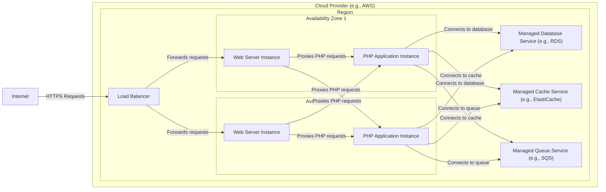
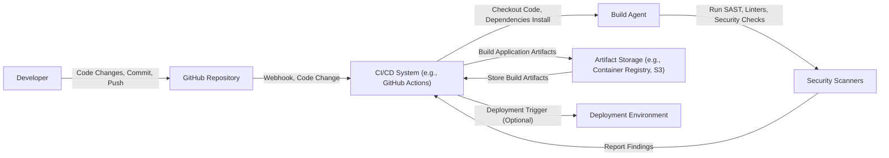

# BUSINESS POSTURE

The Laravel framework project aims to provide a robust, elegant, and developer-friendly PHP web framework. It prioritizes developer experience, rapid application development, and maintainability of web applications. The primary goal is to empower developers to build high-quality web applications efficiently.

Key business priorities and goals include:
- Enhancing developer productivity and satisfaction.
- Providing a comprehensive set of features for modern web development.
- Maintaining a vibrant and active open-source community.
- Ensuring the framework is performant and scalable.
- Supporting a wide range of application types, from small projects to large enterprise systems.

Most important business risks that need to be addressed:
- Security vulnerabilities within the framework itself could impact a vast number of applications built using Laravel.
- Dependency on community contributions for security updates and maintenance introduces a risk of delayed or inadequate responses to security issues.
- Complexity of the framework and its ecosystem could lead to misconfigurations and security weaknesses in applications built on top of it.
- Potential for supply chain attacks targeting dependencies used by Laravel or its ecosystem.

# SECURITY POSTURE

Existing security controls:
- security control: Laravel incorporates built-in protection against common web vulnerabilities such as Cross-Site Scripting (XSS), SQL Injection, and Cross-Site Request Forgery (CSRF). Implemented within the framework's core and documented in Laravel documentation.
- security control: Laravel utilizes parameterized queries and Eloquent ORM to mitigate SQL Injection vulnerabilities. Implemented within the database interaction layer of the framework.
- security control: Laravel provides mechanisms for input validation and sanitization. Documented in Laravel documentation and implemented by developers using framework's validation features.
- security control: Laravel offers tools for secure authentication and authorization, including built-in authentication scaffolding and policies. Documented in Laravel documentation and implemented by developers using framework's authentication and authorization features.
- security control: Laravel encourages the use of HTTPS for secure communication. Best practice recommended in Laravel documentation.
- security control: Regular security audits and community contributions help identify and address potential vulnerabilities. Part of the open-source development process and community engagement.

Accepted risks:
- accepted risk: As an open-source project, there is an inherent risk of undiscovered vulnerabilities in the framework.
- accepted risk: Reliance on community for vulnerability reporting and patching introduces a potential delay in security updates.
- accepted risk: Security of applications built with Laravel heavily depends on developers following security best practices and correctly utilizing framework's security features.

Recommended security controls:
- security control: Implement automated Static Application Security Testing (SAST) and Dependency Scanning in the Laravel development and release pipeline to proactively identify vulnerabilities.
- security control: Establish a formal Security Vulnerability Disclosure Policy and a dedicated security team or point of contact to manage security reports and releases.
- security control: Conduct regular penetration testing and security code reviews by external security experts to identify and remediate potential weaknesses.
- security control: Enhance security documentation and provide more comprehensive security guidelines and best practices for developers using Laravel.

Security requirements:
- Authentication: The framework itself does not handle direct user authentication, but it provides robust tools and features for developers to implement secure authentication in applications built with Laravel. The framework must ensure that its authentication components are secure and easy to use correctly.
- Authorization: Laravel provides authorization mechanisms (Policies, Gates) to control access to resources within applications. The framework must ensure these mechanisms are robust and prevent unauthorized access when correctly implemented by developers.
- Input Validation: Laravel's input validation features are crucial for preventing various attacks. The framework must provide comprehensive and easy-to-use validation rules and mechanisms that are secure by default.
- Cryptography: Laravel utilizes cryptography for various features like password hashing, encryption, and secure session management. The framework must use strong cryptographic algorithms and best practices to protect sensitive data.

# DESIGN

## C4 CONTEXT

```mermaid
flowchart LR
  subgraph "Organization"
    style "Organization" fill:transparent,stroke:#999,stroke-dasharray:5 5
    Laravel["Laravel Framework Project"]
  end
  Developer["Web Developer"]
  EndUser["End User"]
  PHP["PHP Runtime Environment"]
  WebServer["Web Server (e.g., Nginx, Apache)"]
  Database["Database System (e.g., MySQL, PostgreSQL)"]
  Composer["Composer Package Manager"]
  PackageManager["npm/Yarn Package Manager"]

  Developer -- "Uses to build web applications" --> Laravel
  EndUser -- "Interacts with applications built with" --> Laravel
  Laravel -- "Runs on" --> PHP
  Laravel -- "Deployed on" --> WebServer
  Laravel -- "Uses for data persistence" --> Database
  Laravel -- "Manages PHP dependencies" --> Composer
  Laravel -- "Manages frontend assets (optional)" --> PackageManager
```

Elements of context diagram:

- Element:
  - Name: Laravel Framework Project
  - Type: Software System
  - Description: The Laravel PHP framework, an open-source web application framework designed for building robust and elegant web applications.
  - Responsibilities: Provides a comprehensive set of tools and features for web development, including routing, templating, ORM, authentication, and more. Facilitates rapid application development and maintainability.
  - Security controls: Implements built-in security features against common web vulnerabilities (XSS, SQL Injection, CSRF). Provides tools for developers to implement secure authentication, authorization, and input validation in their applications.

- Element:
  - Name: Web Developer
  - Type: Person
  - Description: Developers who use the Laravel framework to build web applications.
  - Responsibilities: Develop, deploy, and maintain web applications using Laravel. Responsible for implementing security best practices in their applications, utilizing Laravel's security features correctly.
  - Security controls: Responsible for secure coding practices, input validation, secure configuration of applications, and utilizing Laravel's security features.

- Element:
  - Name: End User
  - Type: Person
  - Description: Users who interact with web applications built using the Laravel framework.
  - Responsibilities: Use web applications built with Laravel to perform various tasks.
  - Security controls: Relies on the security of the applications they use, which is dependent on both the Laravel framework and the developers who built the applications.

- Element:
  - Name: PHP Runtime Environment
  - Type: Software System
  - Description: The PHP runtime environment required to execute Laravel applications.
  - Responsibilities: Executes PHP code, including the Laravel framework and applications built on it. Provides core functionalities for web application execution.
  - Security controls: Security of the PHP runtime environment is crucial. Includes security updates and configurations of the PHP installation.

- Element:
  - Name: Web Server (e.g., Nginx, Apache)
  - Type: Software System
  - Description: Web servers that host and serve Laravel applications.
  - Responsibilities: Handles HTTP requests, serves static files, and proxies requests to the PHP runtime environment.
  - Security controls: Web server security configurations, including HTTPS configuration, access controls, and security updates.

- Element:
  - Name: Database System (e.g., MySQL, PostgreSQL)
  - Type: Software System
  - Description: Database systems used by Laravel applications to store and retrieve data.
  - Responsibilities: Stores application data, manages data integrity, and provides data access to Laravel applications.
  - Security controls: Database security configurations, access controls, encryption of data at rest and in transit, and regular security updates.

- Element:
  - Name: Composer Package Manager
  - Type: Software System
  - Description: A dependency manager for PHP, used to manage Laravel's dependencies and application dependencies.
  - Responsibilities: Downloads and installs PHP packages and libraries required by Laravel and applications.
  - Security controls: Ensuring the integrity and security of packages downloaded from package repositories. Dependency vulnerability scanning.

- Element:
  - Name: npm/Yarn Package Manager
  - Type: Software System
  - Description: Package managers for JavaScript, used to manage frontend assets and dependencies in Laravel applications (optional).
  - Responsibilities: Downloads and installs JavaScript packages and libraries for frontend development.
  - Security controls: Ensuring the integrity and security of packages downloaded from package repositories. Dependency vulnerability scanning for frontend dependencies.

## C4 CONTAINER

```mermaid
flowchart LR
  subgraph "Organization"
    style "Organization" fill:transparent,stroke:#999,stroke-dasharray:5 5
    LaravelFramework["Laravel Framework"]
  end
  WebServer["Web Server Container (Nginx/Apache)"]
  PHPContainer["PHP Application Container (PHP-FPM)"]
  DatabaseServer["Database Server Container (MySQL/PostgreSQL)"]
  CacheServer["Cache Server Container (Redis/Memcached)"]
  QueueServer["Queue Server Container (Redis/Beanstalkd)"]

  WebServer -- "Serves HTTP requests, proxies PHP requests" --> PHPContainer
  PHPContainer -- "Executes Laravel application logic" --> LaravelFramework
  PHPContainer -- "Connects to database" --> DatabaseServer
  PHPContainer -- "Connects to cache for session/data caching" --> CacheServer
  PHPContainer -- "Connects to queue for background jobs" --> QueueServer

  style LaravelFramework fill:#f9f,stroke:#333,stroke-width:2px
```

Elements of container diagram:

- Element:
  - Name: Laravel Framework
  - Type: Container - Application Framework
  - Description: The core Laravel framework code, libraries, and components. Provides the foundation for building web applications.
  - Responsibilities: Routing, request handling, templating, ORM, authentication, authorization, and other core web development functionalities.
  - Security controls: Built-in security features (XSS, SQL Injection, CSRF protection). Secure coding practices within the framework development. Regular security audits and community vulnerability reporting.

- Element:
  - Name: Web Server Container (Nginx/Apache)
  - Type: Container - Web Server
  - Description: A web server like Nginx or Apache, responsible for handling HTTP requests and serving static content. Proxies PHP requests to the PHP Application Container.
  - Responsibilities: Handling incoming HTTP requests, serving static files, load balancing, SSL/TLS termination, and reverse proxying to the PHP Application Container.
  - Security controls: Web server security configurations, HTTPS configuration, access controls, firewall rules, and regular security updates.

- Element:
  - Name: PHP Application Container (PHP-FPM)
  - Type: Container - Application Runtime
  - Description: A PHP runtime environment, typically using PHP-FPM, that executes the Laravel application code.
  - Responsibilities: Executing PHP code, running the Laravel framework and application logic, interacting with the database, cache, and queue servers.
  - Security controls: PHP runtime security configurations, disabling unnecessary PHP extensions, file system permissions, and regular security updates.

- Element:
  - Name: Database Server Container (MySQL/PostgreSQL)
  - Type: Container - Database
  - Description: A database server like MySQL or PostgreSQL, used for persistent data storage by Laravel applications.
  - Responsibilities: Storing application data, managing data integrity, handling database queries from the PHP Application Container.
  - Security controls: Database security configurations, access controls, authentication, authorization, encryption of data at rest and in transit, regular security updates, and database backups.

- Element:
  - Name: Cache Server Container (Redis/Memcached)
  - Type: Container - Cache
  - Description: A cache server like Redis or Memcached, used for caching session data, application data, and improving performance.
  - Responsibilities: Caching frequently accessed data, session management, reducing database load, and improving application response times.
  - Security controls: Cache server security configurations, access controls, authentication, and network segmentation.

- Element:
  - Name: Queue Server Container (Redis/Beanstalkd)
  - Type: Container - Queue
  - Description: A queue server like Redis or Beanstalkd, used for handling background jobs and asynchronous tasks in Laravel applications.
  - Responsibilities: Managing job queues, processing background tasks, decoupling long-running operations from web requests.
  - Security controls: Queue server security configurations, access controls, and message queue security.

## DEPLOYMENT

Deployment Solution: Cloud-based Deployment on a Platform as a Service (PaaS) like AWS Elastic Beanstalk or Heroku.



Elements of deployment diagram:

- Element:
  - Name: Load Balancer
  - Type: Infrastructure - Load Balancer
  - Description: Distributes incoming HTTPS traffic across multiple Web Server Instances for high availability and scalability.
  - Responsibilities: Traffic distribution, SSL/TLS termination, health checks, and routing requests to healthy instances.
  - Security controls: Load balancer security configurations, SSL/TLS certificate management, DDoS protection, and access logs.

- Element:
  - Name: Web Server Instance
  - Type: Infrastructure - Virtual Machine/Container Instance
  - Description: Virtual machines or container instances running web server software (e.g., Nginx, Apache) to handle HTTP requests and proxy PHP requests. Deployed across multiple Availability Zones for redundancy.
  - Responsibilities: Serving static content, proxying PHP requests to PHP Application Instances, and handling web server functionalities.
  - Security controls: Instance security hardening, security updates, firewall rules, intrusion detection systems, and access controls.

- Element:
  - Name: PHP Application Instance
  - Type: Infrastructure - Virtual Machine/Container Instance
  - Description: Virtual machines or container instances running the PHP runtime environment and the Laravel application code. Deployed across multiple Availability Zones for redundancy.
  - Responsibilities: Executing the Laravel application logic, handling application requests, and interacting with other backend services.
  - Security controls: Instance security hardening, security updates, application security configurations, runtime environment security, and access controls.

- Element:
  - Name: Managed Database Service (e.g., RDS)
  - Type: PaaS - Database Service
  - Description: A managed database service provided by the cloud provider, simplifying database management and ensuring high availability.
  - Responsibilities: Persistent data storage, database management, backups, and high availability.
  - Security controls: Managed database service security features, encryption at rest and in transit, access controls, database backups, and monitoring.

- Element:
  - Name: Managed Cache Service (e.g., ElastiCache)
  - Type: PaaS - Cache Service
  - Description: A managed cache service provided by the cloud provider, offering in-memory caching for improved performance.
  - Responsibilities: Caching application data and session data for faster access.
  - Security controls: Managed cache service security features, access controls, encryption in transit, and monitoring.

- Element:
  - Name: Managed Queue Service (e.g., SQS)
  - Type: PaaS - Queue Service
  - Description: A managed queue service provided by the cloud provider, facilitating asynchronous task processing.
  - Responsibilities: Managing job queues and ensuring reliable message delivery for background tasks.
  - Security controls: Managed queue service security features, access controls, message encryption, and monitoring.

## BUILD



Elements of build diagram:

- Element:
  - Name: Developer
  - Type: Person
  - Description: Software developers contributing code to the Laravel project.
  - Responsibilities: Writing code, committing changes, and pushing code to the GitHub repository.
  - Security controls: Secure development practices, code reviews, and adherence to coding standards.

- Element:
  - Name: GitHub Repository
  - Type: Software System - Version Control
  - Description: The GitHub repository hosting the Laravel framework source code.
  - Responsibilities: Version control, code collaboration, issue tracking, and triggering CI/CD pipelines.
  - Security controls: Access controls, branch protection, code review processes, and audit logs.

- Element:
  - Name: CI/CD System (e.g., GitHub Actions)
  - Type: Software System - CI/CD
  - Description: A Continuous Integration and Continuous Delivery system used to automate the build, test, and deployment processes.
  - Responsibilities: Automating build processes, running tests, performing security scans, and publishing build artifacts.
  - Security controls: Secure CI/CD pipeline configuration, access controls, secret management, and audit logs.

- Element:
  - Name: Build Agent
  - Type: Software System - Build Environment
  - Description: The environment where the build process is executed, including tools and dependencies required for building Laravel.
  - Responsibilities: Executing build steps, compiling code, running tests, and generating build artifacts.
  - Security controls: Secure build environment, hardened build agents, and access controls.

- Element:
  - Name: Security Scanners
  - Type: Software System - Security Tools
  - Description: Static Application Security Testing (SAST) tools, linters, and dependency scanners used to identify potential security vulnerabilities in the code and dependencies.
  - Responsibilities: Performing automated security checks during the build process and reporting findings.
  - Security controls: Regularly updated security scanners, configured to detect relevant vulnerabilities, and integrated into the CI/CD pipeline.

- Element:
  - Name: Artifact Storage (e.g., Container Registry, S3)
  - Type: Software System - Artifact Repository
  - Description: Storage for build artifacts, such as compiled code, packages, or container images.
  - Responsibilities: Storing and managing build artifacts, ensuring artifact integrity and availability.
  - Security controls: Access controls, artifact integrity checks (e.g., checksums), and secure storage.

- Element:
  - Name: Deployment Environment
  - Type: Environment - Target Environment
  - Description: The target environment where the built Laravel application is deployed (e.g., staging, production).
  - Responsibilities: Running the deployed application and serving end-users.
  - Security controls: Environment security configurations, access controls, and monitoring.

# RISK ASSESSMENT

Critical business process we are trying to protect:
- Secure development and distribution of the Laravel framework to ensure the security of applications built using it.
- Maintaining the integrity and availability of the Laravel framework codebase and build artifacts.
- Protecting the reputation and trust associated with the Laravel project.

Data we are trying to protect and their sensitivity:
- Source code of the Laravel framework: High sensitivity. Exposure or modification could lead to vulnerabilities in the framework and applications built with it.
- Build artifacts (packages, distributions): High sensitivity. Compromised artifacts could be distributed to developers and introduce vulnerabilities into their applications.
- Developer credentials and secrets used in the build process: High sensitivity. Compromise could lead to unauthorized access and modification of the codebase or build pipeline.
- Infrastructure configuration and access details for build and deployment environments: High sensitivity. Compromise could lead to unauthorized access and control over infrastructure.

# QUESTIONS & ASSUMPTIONS

Questions:
- What is the primary target audience for this design document? (Assuming it is for security architects and developers involved in the Laravel project and its security).
- What are the specific compliance requirements or security standards that the Laravel project needs to adhere to? (Assuming general web application security best practices and open-source security principles).
- What is the expected level of security maturity for the Laravel project? (Assuming a proactive approach to security with continuous improvement).

Assumptions:
- BUSINESS POSTURE: The Laravel project prioritizes security as a key aspect of its framework to ensure the safety and reliability of applications built using it.
- SECURITY POSTURE: The Laravel project is committed to implementing and maintaining robust security controls throughout its development lifecycle and release process. The community plays a crucial role in identifying and reporting security vulnerabilities.
- DESIGN: The design of Laravel and its deployment architecture are intended to be secure and scalable, following industry best practices for web application security and cloud deployments. The build process is designed to incorporate security checks and ensure the integrity of build artifacts.