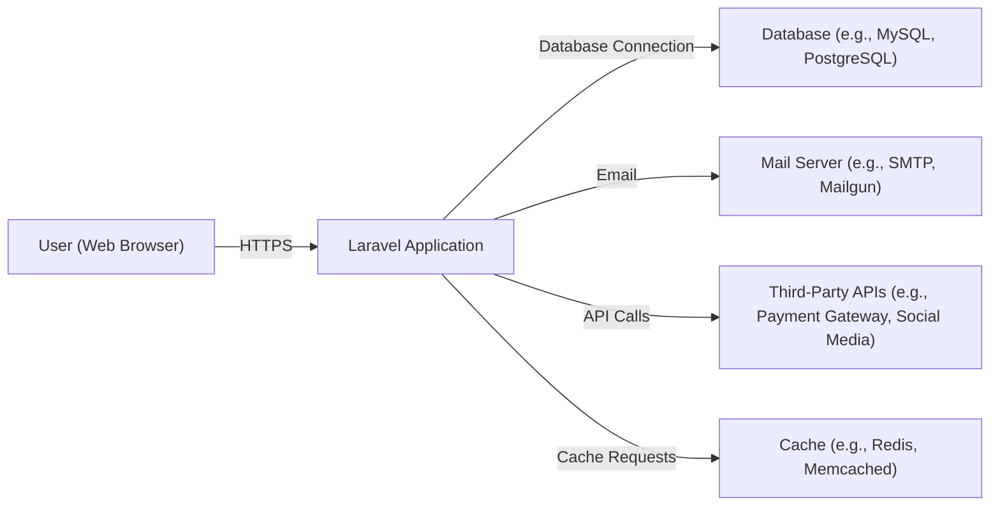
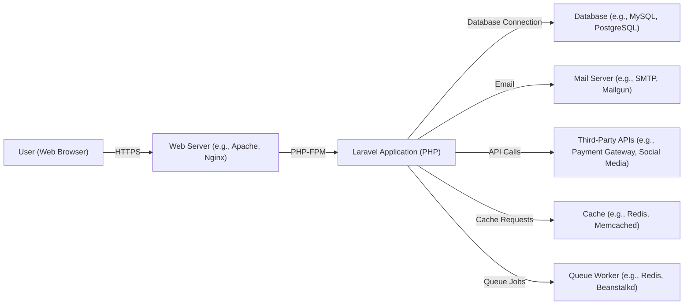
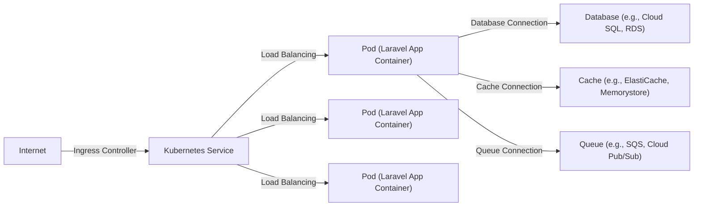
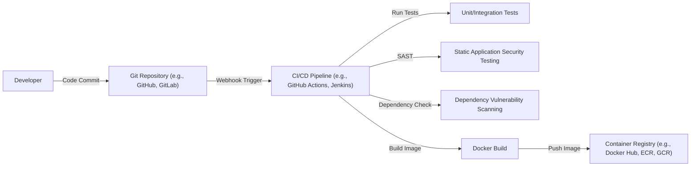

Okay, let's create a design document for the Laravel framework, keeping in mind its use as a foundation for web applications.

# BUSINESS POSTURE

Business Priorities and Goals:

*   Rapid Development: Enable developers to build web applications quickly and efficiently.
*   Maintainability: Provide a structured framework that promotes clean, maintainable code.
*   Scalability: Offer features and architecture that support scaling applications to handle increasing traffic and data.
*   Community & Ecosystem: Leverage a large, active community and a rich ecosystem of packages and extensions.
*   Security: Provide built-in features and best practices to help developers build secure applications.

Most Important Business Risks:

*   Application Vulnerabilities: Security vulnerabilities in applications built with Laravel could lead to data breaches, service disruptions, and reputational damage.
*   Development Delays: Inefficient use of the framework or lack of understanding of its features could lead to project delays.
*   Scalability Bottlenecks: Poorly designed applications built on Laravel might not scale effectively, leading to performance issues and increased infrastructure costs.
*   Dependency Management Issues: Problems with managing third-party packages (e.g., outdated or vulnerable dependencies) could introduce security risks or instability.
*   Talent Acquisition: Difficulty in finding developers with sufficient Laravel expertise could hinder project progress.

# SECURITY POSTURE

Existing Security Controls:

*   security control: Authentication: Laravel provides a built-in authentication system with features like user registration, login, password reset, and email verification. (Described in Laravel documentation: Authentication).
*   security control: Authorization: Laravel's authorization features allow developers to control access to resources based on user roles and permissions. (Described in Laravel documentation: Authorization).
*   security control: CSRF Protection: Laravel automatically generates CSRF tokens for each active user session managed by the application. These tokens are used to verify that the authenticated user is the one actually making the requests to the application. (Described in Laravel documentation: CSRF Protection).
*   security control: Encryption: Laravel provides encryption services for securing data at rest and in transit. (Described in Laravel documentation: Encryption).
*   security control: Hashing: Laravel uses secure hashing algorithms (e.g., Bcrypt, Argon2) for storing passwords. (Described in Laravel documentation: Hashing).
*   security control: Input Validation: Laravel offers a robust validation system to validate user input and prevent common vulnerabilities like injection attacks. (Described in Laravel documentation: Validation).
*   security control: Output Encoding: Laravel's Blade templating engine automatically escapes output to prevent Cross-Site Scripting (XSS) attacks. (Described in Laravel documentation: Blade Templates).
*   security control: Database Security: Laravel's Eloquent ORM and query builder help prevent SQL injection vulnerabilities by using parameterized queries. (Described in Laravel documentation: Database, Eloquent ORM).
*   security control: Session Management: Laravel provides secure session management with features like session encryption and expiration. (Described in Laravel documentation: Session).
*   security control: Middleware: Laravel's middleware allows developers to filter HTTP requests entering the application, providing a convenient mechanism for implementing security checks. (Described in Laravel documentation: Middleware).

Accepted Risks:

*   accepted risk: Third-Party Package Vulnerabilities: While Laravel itself is secure, applications built with it may rely on third-party packages that could contain vulnerabilities. Developers are responsible for keeping these packages updated and monitoring for security advisories.
*   accepted risk: Misconfiguration: Incorrect configuration of Laravel or its underlying server environment (e.g., web server, database) could introduce security vulnerabilities.
*   accepted risk: Developer Error: Security vulnerabilities can be introduced by developers who do not follow secure coding practices or who misunderstand Laravel's security features.

Recommended Security Controls:

*   security control: Regular Security Audits: Conduct regular security audits of applications built with Laravel, including penetration testing and code reviews.
*   security control: Security Training: Provide security training to developers to ensure they understand secure coding practices and Laravel's security features.
*   security control: Dependency Scanning: Implement automated dependency scanning to identify and address vulnerabilities in third-party packages.
*   security control: Web Application Firewall (WAF): Deploy a WAF to protect applications from common web attacks.
*   security control: Content Security Policy (CSP): Implement CSP to mitigate the risk of XSS attacks.
*   security control: HTTP Strict Transport Security (HSTS): Enable HSTS to enforce secure connections.

Security Requirements:

*   Authentication:
    *   All users must be authenticated before accessing protected resources.
    *   Support for multi-factor authentication should be considered.
    *   Password reset functionality must be secure and prevent account takeover.
*   Authorization:
    *   Access to resources must be controlled based on user roles and permissions.
    *   Implement the principle of least privilege.
*   Input Validation:
    *   All user input must be validated to prevent injection attacks and other vulnerabilities.
    *   Use a whitelist approach to validation whenever possible.
*   Cryptography:
    *   Sensitive data must be encrypted at rest and in transit.
    *   Use strong, industry-standard encryption algorithms.
    *   Securely manage cryptographic keys.

# DESIGN

## C4 CONTEXT

Element Descriptions:

*   User (Web Browser):
    *   Name: User (Web Browser)
    *   Type: Person
    *   Description: A user interacting with the Laravel application through a web browser.
    *   Responsibilities: Initiates requests, views responses, provides input.
    *   Security controls: Browser-based security controls (e.g., same-origin policy, cookie security).
*   Laravel Application:
    *   Name: Laravel Application
    *   Type: Software System
    *   Description: The web application built using the Laravel framework.
    *   Responsibilities: Handles user requests, processes data, interacts with other systems, renders responses.
    *   Security controls: Authentication, authorization, CSRF protection, input validation, output encoding, encryption, hashing, session management, middleware.
*   Database (e.g., MySQL, PostgreSQL):
    *   Name: Database
    *   Type: Software System
    *   Description: The database used to store application data.
    *   Responsibilities: Stores and retrieves data.
    *   Security controls: Database access controls, encryption at rest, auditing.
*   Mail Server (e.g., SMTP, Mailgun):
    *   Name: Mail Server
    *   Type: Software System
    *   Description: The server used to send emails.
    *   Responsibilities: Sends emails on behalf of the application.
    *   Security controls: Authentication, encryption, spam filtering.
*   Third-Party APIs (e.g., Payment Gateway, Social Media):
    *   Name: Third-Party APIs
    *   Type: Software System
    *   Description: External APIs used by the application.
    *   Responsibilities: Provides specific services (e.g., payment processing, social media integration).
    *   Security controls: API keys, OAuth, rate limiting.
*   Cache (e.g., Redis, Memcached):
    *   Name: Cache
    *   Type: Software System
    *   Description: A caching system used to improve performance.
    *   Responsibilities: Stores frequently accessed data.
    *   Security controls: Access controls, data validation.

## C4 CONTAINER

Element Descriptions:

*   Web Server (e.g., Apache, Nginx):
    *   Name: Web Server
    *   Type: Container
    *   Description: The web server that receives requests from users and forwards them to the Laravel application.
    *   Responsibilities: Handles HTTP requests, serves static assets, acts as a reverse proxy.
    *   Security controls: TLS/SSL configuration, access controls, request filtering.
*   Laravel Application (PHP):
    *   Name: Laravel Application
    *   Type: Container
    *   Description: The core Laravel application code, running within a PHP environment (e.g., PHP-FPM).
    *   Responsibilities: Handles application logic, interacts with other containers.
    *   Security controls: Authentication, authorization, CSRF protection, input validation, output encoding, encryption, hashing, session management, middleware.
*   Database (e.g., MySQL, PostgreSQL):
    *   Name: Database
    *   Type: Container
    *   Description: The database used to store application data.
    *   Responsibilities: Stores and retrieves data.
    *   Security controls: Database access controls, encryption at rest, auditing.
*   Mail Server (e.g., SMTP, Mailgun):
    *   Name: Mail Server
    *   Type: Container
    *   Description: The server used to send emails.
    *   Responsibilities: Sends emails on behalf of the application.
    *   Security controls: Authentication, encryption, spam filtering.
*   Third-Party APIs (e.g., Payment Gateway, Social Media):
    *   Name: Third-Party APIs
    *   Type: Container
    *   Description: External APIs used by the application.
    *   Responsibilities: Provides specific services (e.g., payment processing, social media integration).
    *   Security controls: API keys, OAuth, rate limiting.
*   Cache (e.g., Redis, Memcached):
    *   Name: Cache
    *   Type: Container
    *   Description: A caching system used to improve performance.
    *   Responsibilities: Stores frequently accessed data.
    *   Security controls: Access controls, data validation.
*   Queue Worker (e.g., Redis, Beanstalkd):
    *   Name: Queue Worker
    *   Type: Container
    *   Description: A worker process that handles asynchronous tasks (e.g., sending emails, processing images).
    *   Responsibilities: Executes background jobs.
    *   Security controls: Access controls, input validation.

## DEPLOYMENT

Possible Deployment Solutions:

1.  Traditional VPS (Virtual Private Server): Laravel application deployed on a VPS like DigitalOcean, Linode, or AWS EC2.
2.  PaaS (Platform as a Service): Using a PaaS like Heroku, AWS Elastic Beanstalk, or Google App Engine.
3.  Containerized Deployment: Using Docker and Kubernetes (or similar orchestration tools) on platforms like AWS EKS, Google GKE, or Azure AKS.
4.  Serverless: Deploying parts of the application as serverless functions (e.g., AWS Lambda, Azure Functions) triggered by events.

Chosen Solution (for detailed description): Containerized Deployment with Kubernetes

Element Descriptions:

* Internet
    * Name: Internet
    * Type: Infrastructure Node
    * Description: Public network.
    * Responsibilities: Routing traffic to the application.
    * Security controls: Network firewalls, DDoS protection.
* Ingress Controller
    * Name: Ingress Controller
    * Type: Infrastructure Node
    * Description: Manages external access to the services in a Kubernetes cluster, typically HTTP.
    * Responsibilities: Routing external traffic to the correct Kubernetes Service.
    * Security controls: TLS termination, access controls, request filtering.
* Kubernetes Service
    * Name: Kubernetes Service
    * Type: Logical Node
    * Description: An abstraction which defines a logical set of Pods and a policy by which to access them.
    * Responsibilities: Provides a stable endpoint for accessing the Laravel application Pods.
    * Security controls: Network policies.
* Pod (Laravel App Container)
    * Name: Pod (Laravel App Container)
    * Type: Container Instance
    * Description: A Kubernetes Pod running the Laravel application container. Multiple Pods can exist for scaling and redundancy.
    * Responsibilities: Runs the Laravel application code.
    * Security controls: Container security context, resource limits.
* Database (e.g., Cloud SQL, RDS)
    * Name: Database
    * Type: Infrastructure Node/Managed Service
    * Description: A managed database service (e.g., Cloud SQL on GCP, RDS on AWS).
    * Responsibilities: Provides a managed database instance.
    * Security controls: Database access controls, encryption at rest, automated backups, firewall rules.
* Cache (e.g., ElastiCache, Memorystore)
    * Name: Cache
    * Type: Infrastructure Node/Managed Service
    * Description: A managed caching service (e.g., ElastiCache on AWS, Memorystore on GCP).
    * Responsibilities: Provides a managed caching instance.
    * Security controls: Access controls, data encryption.
* Queue (e.g., SQS, Cloud Pub/Sub)
    * Name: Queue
    * Type: Infrastructure Node/Managed Service
    * Description: A managed queue service (e.g., SQS on AWS, Cloud Pub/Sub on GCP).
    * Responsibilities: Provides a managed queue for asynchronous tasks.
    * Security controls: Access controls, message encryption.

## BUILD

Build Process Description:

1.  Developer commits code to a Git repository (e.g., GitHub, GitLab).
2.  A webhook triggers the CI/CD pipeline (e.g., GitHub Actions, Jenkins).
3.  The CI/CD pipeline runs unit and integration tests.
4.  Static Application Security Testing (SAST) tools analyze the code for potential vulnerabilities.
5.  Dependency vulnerability scanning tools check for known vulnerabilities in third-party packages.
6.  A Docker image is built, containing the Laravel application and its dependencies.
7.  The Docker image is pushed to a container registry (e.g., Docker Hub, Amazon ECR, Google Container Registry).

Security Controls in Build Process:

*   security control: Code Review: Manual code review before merging changes.
*   security control: SAST: Static Application Security Testing to identify vulnerabilities in the code.
*   security control: Dependency Scanning: Scanning for known vulnerabilities in dependencies.
*   security control: Secret Management: Securely storing and managing secrets (e.g., API keys, database credentials) used during the build process.
*   security control: Build Automation: Automating the build process to ensure consistency and reduce manual errors.
*   security control: Least Privilege: Running build processes with the least necessary privileges.
*   security control: Image Signing: Signing Docker images to ensure their integrity.

# RISK ASSESSMENT

Critical Business Processes:

*   User Authentication and Authorization: Ensuring only authorized users can access sensitive data and functionality.
*   Data Processing: Handling user data securely and correctly.
*   E-commerce Transactions (if applicable): Processing payments securely and reliably.
*   Content Delivery: Serving content to users efficiently and reliably.

Data Sensitivity:

*   User Data (PII): Names, email addresses, passwords (hashed), addresses, phone numbers, etc. (High Sensitivity)
*   Financial Data (if applicable): Credit card numbers, transaction details, etc. (High Sensitivity)
*   Application Data: Data specific to the application's functionality (Medium to High Sensitivity, depending on the nature of the data)
*   Session Data: User session information (Medium Sensitivity)
*   Configuration Data: Application configuration settings (Low to Medium Sensitivity)

# QUESTIONS & ASSUMPTIONS

Questions:

*   What specific third-party integrations are planned or anticipated? This will impact the security considerations for those integrations.
*   What is the expected scale of the application (users, traffic, data volume)? This will influence the deployment architecture and scalability requirements.
*   What are the specific regulatory compliance requirements (e.g., GDPR, HIPAA, PCI DSS)? This will dictate specific security controls that must be implemented.
*   What is the organization's existing security infrastructure and tooling? This will help determine how to integrate the Laravel application into the existing environment.
*   What level of logging and monitoring is required? This will impact the design of logging and monitoring systems.

Assumptions:

*   BUSINESS POSTURE: The organization prioritizes rapid development and maintainability, but also recognizes the importance of security.
*   SECURITY POSTURE: The organization has a basic understanding of security best practices and is willing to invest in security measures.
*   DESIGN: The application will be deployed using a containerized approach with Kubernetes. This assumption is made for the detailed deployment description, but other deployment options are acknowledged. The application will use a relational database and a caching system.
*   BUILD: The organization will use a CI/CD pipeline for automated builds and deployments.