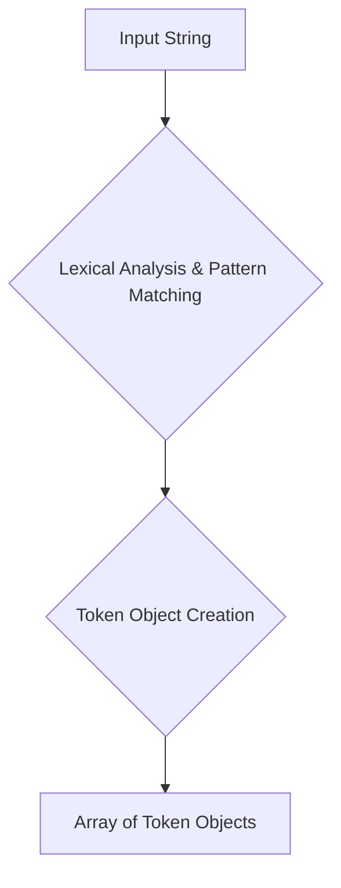

# Project Design Document: Doctrine Lexer

**Version:** 1.1
**Date:** October 26, 2023
**Author:** AI Software Architect

## 1. Introduction

This document provides an enhanced design overview of the Doctrine Lexer project, a PHP library responsible for tokenizing strings. This document serves as a robust foundation for subsequent threat modeling activities, offering a detailed understanding of the system's architecture, data flow, and key components.

## 2. Goals and Objectives

The primary goal of the Doctrine Lexer is to decompose a string of characters into a structured sequence of meaningful tokens. These tokens represent the atomic units of a language or data format, enabling further parsing and interpretation.

The objectives of this design document are to:

* Provide a comprehensive and clear description of the Doctrine Lexer's architecture and functionality.
* Precisely identify the key components, their attributes, and their interactions.
* Thoroughly outline the data flow within the system, highlighting transformation points.
* Serve as a detailed and accurate basis for identifying potential security vulnerabilities and attack vectors during threat modeling.

## 3. System Architecture

The Doctrine Lexer functions as a stateless processing unit. It accepts an input string and produces a structured array of tokens. The core mechanism involves iterating through the input string and applying a predefined set of rules, often implemented as regular expressions or conditional logic, to recognize and categorize substrings as distinct tokens.

* **Input String:** The raw string to be tokenized. This can represent various textual data, such as a query language statement, a configuration file content, or any structured text requiring parsing.
* **Lexical Analysis & Pattern Matching:** The central process of scanning the input string. This involves comparing substrings against defined token patterns (e.g., keywords, identifiers, literals, operators) using regular expressions or explicit string matching logic.
* **Token Object Creation:** Upon successful pattern matching, a token object is instantiated, encapsulating the identified token's type and value.
* **Array of Token Objects:** The final output of the lexer, a sequential collection of token objects, each representing a recognized element from the input string.

## 4. Data Flow

The data flow within the Doctrine Lexer can be broken down into the following steps:

1. **Initialization:** The `Lexer` class is instantiated, ready to receive input.
2. **Input Reception:** The `setInput(string $input)` method is called, providing the string to be tokenized.
3. **Cursor Initialization:** An internal cursor or pointer is set to the beginning of the input string.
4. **Iteration and Matching:** The lexer iterates through the input string, starting from the cursor position. At each position, it attempts to match predefined token patterns against the subsequent characters.
5. **Token Recognition:** When a pattern match is found:
    * The matching substring is identified.
    * A new token object is created.
    * The token object is populated with:
        * **Type:** A constant (e.g., `T_IDENTIFIER`, `T_INTEGER`, `T_KEYWORD`) representing the token's category.
        * **Value:** The actual matched substring from the input.
        * **Position (Optional):** The starting index of the token within the original input string.
6. **Cursor Advancement:** The internal cursor is moved past the recognized token to the beginning of the next potential token.
7. **Error Handling (If No Match):** If no token pattern matches at the current cursor position, the lexer might:
    * Throw an exception indicating an unexpected character or syntax error.
    * Skip the unrecognized character and continue processing (depending on the implementation).
8. **Token Storage:** The newly created token object is added to an internal array or list of tokens.
9. **Termination:** The process continues until the end of the input string is reached.
10. **Output:** The array of generated token objects is returned by the `getTokens()` method.

## 5. Key Components

The Doctrine Lexer is primarily composed of the following essential elements:

* **`Lexer` Class:** The central class orchestrating the tokenization process. Key aspects include:
    * **`setInput(string $input)`:**  A public method to set the input string for tokenization.
    * **`getTokens()`:** A public method that initiates the tokenization process and returns the resulting array of tokens.
    * **Token Type Constants:** Public constants defining the various token types the lexer can identify (e.g., `T_SELECT`, `T_FROM`, `T_OPEN_PARENTHESIS`). These act as symbolic names for token categories.
    * **Token Matching Rules:**  An internal set of rules, often implemented as:
        * **Regular Expressions:** Patterns used to match specific token structures (e.g., identifiers, numbers).
        * **String Literals:** Direct string comparisons for keywords or symbols.
        * **Conditional Logic:**  Code blocks that check for specific character sequences or conditions.
    * **Internal Cursor/Position Tracker:** A variable maintaining the current position within the input string being processed.
    * **Token Storage (Internal):**  An array or list used to temporarily store the generated token objects during the tokenization process.
    * **Error Handling Logic:** Mechanisms to handle situations where the input string does not conform to the expected syntax.

* **Token Objects:** Simple data transfer objects representing individual tokens. They typically contain:
    * **`type` (Property):**  A string or constant representing the token's category (e.g., `"T_IDENTIFIER"`, `"T_INTEGER"`).
    * **`value` (Property):** The actual string of characters that constitutes the token (e.g., `"user"`, `"123"`, `"SELECT"`).
    * **`position` (Optional Property):** An integer indicating the starting position (index) of the token in the original input string.

## 6. Security Considerations (For Threat Modeling)

This section details potential security vulnerabilities and attack vectors relevant to the Doctrine Lexer, providing a basis for thorough threat modeling.

* **Input Validation Vulnerabilities:**
    * **Malformed Input Causing Errors:**  Providing input strings with unexpected characters or sequences that are not handled by the defined token patterns could lead to exceptions, application crashes, or denial-of-service. *Example: An input string containing control characters or unusual Unicode sequences not anticipated by the lexer's rules.*
    * **Resource Exhaustion via Large Input:**  Submitting extremely long input strings could consume excessive memory or processing time, leading to denial-of-service. *Example: A multi-megabyte string intended to overwhelm the lexer's processing capabilities.*
    * **Injection Attacks (Indirect):** While the lexer doesn't execute code directly, maliciously crafted input could result in tokens that, when used in subsequent parsing or interpretation stages (e.g., building database queries), could lead to vulnerabilities like SQL injection. *Example: An input string designed to produce tokens that bypass security checks in a query builder.*

* **Regular Expression Denial of Service (ReDoS):**
    * If the lexer relies on regular expressions for token matching, carefully crafted input strings could exploit the backtracking behavior of regex engines, causing them to consume excessive CPU time and leading to denial-of-service. *Example: A regex like `(a+)+b` matched against a long string of 'a's.*

* **Error Handling and Information Disclosure:**
    * **Verbose Error Messages:** Error messages that reveal internal details about the lexer's implementation or the structure of the expected input could provide valuable information to attackers. *Example: An error message stating "Expected token of type T_IDENTIFIER at position 10" when a generic "Syntax error" would suffice.*
    * **Uncaught Exceptions:**  Scenarios where the lexer throws uncaught exceptions could expose sensitive information from the application's environment or lead to unpredictable application behavior.

* **Token Type Confusion:**
    * Attackers might attempt to craft input strings that trick the lexer into misinterpreting a sequence of characters as a different token type than intended. This could lead to vulnerabilities in downstream processing logic that relies on the correct token types. *Example: Crafting an input that makes the lexer interpret a string intended as data as a keyword.*

* **State Management Issues (If Applicable):**
    * In more complex lexers with internal state, vulnerabilities could arise if an attacker can manipulate the input to force the lexer into an invalid or unexpected state, leading to incorrect tokenization or security bypasses. *While the Doctrine Lexer is generally stateless, this remains a consideration for potential future enhancements.*

## 7. Trust Boundaries

Identifying trust boundaries helps in understanding where security controls are most critical. For the Doctrine Lexer, the primary trust boundary is at the point where the input string is received:

* **Boundary In:** The `setInput()` method represents the entry point where untrusted input from external sources is received by the lexer. This is a critical point for input validation and sanitization (though the lexer itself primarily focuses on tokenization, not sanitization).
* **Boundary Out:** The `getTokens()` method represents the exit point where the array of tokens is passed to other components. While the lexer itself might be considered a trusted component, the tokens it produces should be treated carefully by subsequent components to prevent vulnerabilities.

## 8. Future Considerations

Anticipating future changes can help proactively address potential security implications:

* **Introduction of New Token Types or Syntax:** Adding support for new language features or token types might require new regular expressions or parsing logic, which could introduce new vulnerabilities if not carefully designed and tested.
* **Performance Optimizations:** Changes aimed at improving performance, such as aggressive caching or the use of unsafe code, could inadvertently introduce security flaws.
* **Changes to Error Handling:** Modifications to error handling mechanisms should be carefully reviewed to avoid introducing information disclosure vulnerabilities.
* **Integration with External Libraries:** If the lexer starts relying on external libraries, the security of those dependencies becomes a concern.

## 9. Conclusion

This enhanced design document provides a comprehensive and detailed understanding of the Doctrine Lexer project. By outlining its architecture, data flow, key components, and critically, its security considerations, this document serves as a valuable and actionable resource for effective threat modeling. The identified potential vulnerabilities and trust boundaries provide specific areas of focus for security analysis and mitigation strategies.
