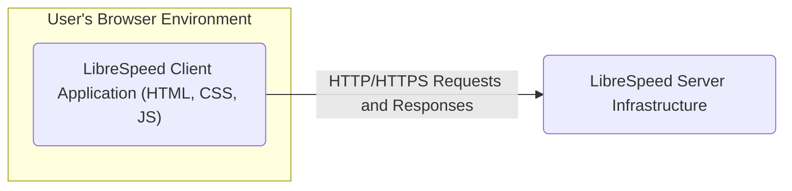
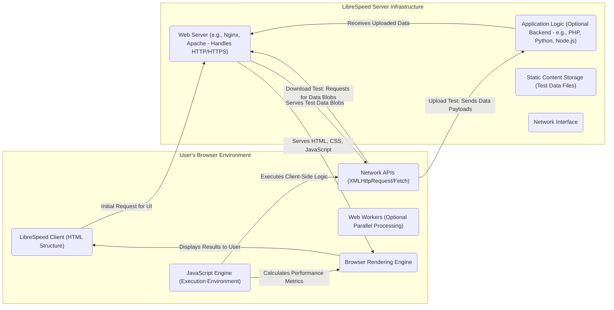
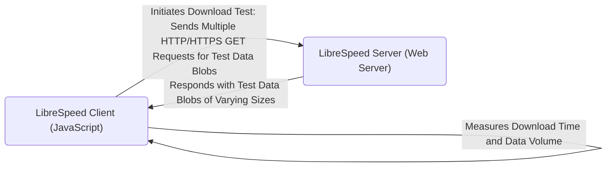
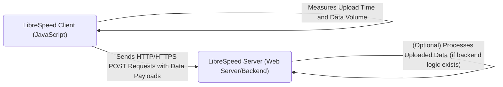
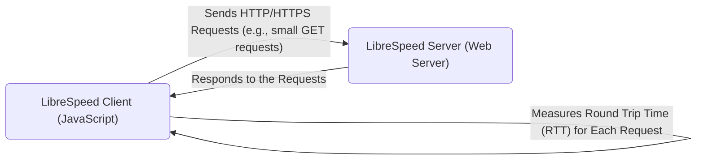

# Project Design Document: LibreSpeed Speedtest

**Version:** 1.1
**Date:** October 26, 2023
**Author:** AI Software Architect

## 1. Introduction

This document provides an enhanced and more detailed design overview of the LibreSpeed speed test application (referenced from [https://github.com/librespeed/speedtest](https://github.com/librespeed/speedtest)). This revised document aims to provide a clearer and more comprehensive understanding of the system's architecture, components, and data flow, specifically tailored for subsequent threat modeling activities. Improvements focus on providing more granular detail and highlighting potential security implications.

## 2. Goals and Objectives

*   Clearly and comprehensively define the architecture and components of the LibreSpeed speed test application, with a focus on elements relevant to security.
*   Accurately illustrate the data flow within the system during various stages of a speed test, including the nature of the data exchanged.
*   Identify key interaction points, trust boundaries, and potential attack surfaces within the system.
*   Provide a robust and detailed foundation for security analysts and threat modeling exercises.

## 3. System Overview

LibreSpeed is a lightweight, open-source, self-hosted speed test application primarily leveraging client-side technologies (HTML, CSS, JavaScript) with a potentially minimal server-side component. It enables users to measure their internet connection's performance characteristics, including upload and download speeds, latency (ping), and jitter, directly within their web browser. The design emphasizes simplicity and ease of deployment.

## 4. Architectural Design

The system adheres to a client-server architecture. The core testing logic is executed within the client's web browser, interacting with a server to facilitate the transfer of data required for the speed measurements.

### 4.1. High-Level Architecture

### 4.2. Detailed Architecture

The following diagram provides a more granular view of the key components and their interactions during a speed test, highlighting the flow of data and control:

## 5. Component Descriptions

*   **LibreSpeed Client (HTML Structure):** Defines the user interface elements for initiating the test, displaying results, and any informational content. Potential security considerations include the risk of serving malicious content if the server is compromised.
*   **JavaScript Engine (Execution Environment):** The browser's runtime environment responsible for executing the core speed test logic. Security considerations involve potential vulnerabilities in the JavaScript engine itself or in the client-side code.
*   **Network APIs (XMLHttpRequest/Fetch):**  Browser APIs used by the JavaScript code to make HTTP/HTTPS requests to the server for downloading and uploading test data. Security considerations include the potential for Cross-Origin Request issues and the security of the underlying transport layer (HTTPS).
*   **Web Workers (Optional Parallel Processing):**  Allows for running JavaScript code in background threads, potentially improving performance. Security considerations involve the same risks as the main JavaScript execution environment, with added complexity due to concurrent execution.
*   **Browser Rendering Engine:** Interprets and displays the HTML, CSS, and JavaScript, creating the user interface. Security considerations include browser vulnerabilities that could be exploited.
*   **Web Server (e.g., Nginx, Apache - Handles HTTP/HTTPS):**  Responsible for serving the static files of the LibreSpeed client and handling incoming requests. Security considerations include server misconfigurations, vulnerabilities in the server software, and DoS attack potential.
*   **Application Logic (Optional Backend - e.g., PHP, Python, Node.js):**  May handle upload requests, provide configuration, or potentially store results. Security considerations include vulnerabilities in the backend code, injection attacks, and authentication/authorization issues if implemented.
*   **Static Content Storage (Test Data Files):**  Stores files of varying sizes used for download speed testing. Security considerations involve ensuring the integrity of these files and preventing unauthorized modification.
*   **Network Interface:** The point of connection between the server and the network. Security considerations include network-level attacks and the security of the underlying infrastructure.

## 6. Data Flow

The data flow during a typical speed test can be broken down into distinct phases:

### 6.1. Initial Page Load Sequence

*   **Request:** The user's browser sends an HTTP/HTTPS GET request to the LibreSpeed server for the main page.
*   **Response:** The web server responds with the HTML, CSS, and JavaScript files that constitute the client application.
*   **Rendering:** The browser renders the UI based on the received files.

### 6.2. Download Test Data Flow

*   The client-side JavaScript initiates the download test.
*   The client sends multiple concurrent HTTP/HTTPS GET requests to the server, requesting pre-generated test data files (or dynamically generated data streams).
*   The server responds to each request with the requested data.
*   The client measures the time taken to download the data and the amount of data received to calculate the download speed.

### 6.3. Upload Test Data Flow

*   The client-side JavaScript initiates the upload test.
*   The client generates dummy data in the browser.
*   The client sends HTTP/HTTPS POST requests to the server, including the generated dummy data in the request body.
*   The server receives the uploaded data. Optionally, a backend component might process this data (though typically it's discarded).
*   The client measures the time taken to upload the data and the amount of data sent to calculate the upload speed.

### 6.4. Latency (Ping) Test Data Flow

*   The client sends a series of HTTP/HTTPS requests to the server. These are typically small GET requests to minimize data transfer time.
*   The server responds to each request.
*   The client measures the time it takes for each request to complete (Round Trip Time - RTT), which represents the latency.

### 6.5. Jitter Calculation

*   Jitter is calculated client-side by analyzing the variation in the measured latency values from the ping test. No direct data exchange is involved specifically for jitter calculation beyond the ping test data.

### 6.6. Results Display

*   The client-side JavaScript processes the collected timing and data volume information to calculate the speed test results.
*   The results are then displayed to the user through updates to the HTML elements.

## 7. Security Considerations (Detailed for Threat Modeling)

This section expands on potential security concerns, providing more context for threat modeling:

*   **Client-Side Vulnerabilities:**
    *   **Cross-Site Scripting (XSS):** If the application were to incorporate user-provided input (e.g., in a configuration interface), it could be vulnerable to XSS attacks, allowing malicious scripts to be executed in the user's browser.
    *   **Dependency Vulnerabilities:**  If the client-side code relies on external JavaScript libraries, vulnerabilities in those libraries could be exploited.
    *   **Code Injection:** Although less likely in a primarily static client, vulnerabilities in the JavaScript code could potentially allow for code injection.
*   **Server-Side Vulnerabilities:**
    *   **Denial of Service (DoS):** The server could be targeted with a large number of requests for test data or upload requests, potentially overwhelming its resources and making it unavailable.
    *   **Resource Exhaustion:**  Maliciously crafted requests or excessive concurrent connections could lead to resource exhaustion on the server.
    *   **Path Traversal:** If the server-side component handles file requests (even for static files), vulnerabilities could allow attackers to access files outside the intended directory.
    *   **Injection Attacks (if backend exists):** If a backend component is used, it could be susceptible to SQL injection, command injection, or other injection attacks depending on its implementation.
    *   **Insecure Configuration:** Misconfigurations of the web server (e.g., exposed administrative interfaces, default credentials) could be exploited.
*   **Communication Security:**
    *   **Man-in-the-Middle (MitM) Attacks:** If HTTPS is not properly implemented or enforced, attackers could intercept and potentially modify the communication between the client and server, including test data.
    *   **Insecure Transport Protocols:** Using outdated or insecure TLS/SSL versions could expose the communication to vulnerabilities.
*   **Data Integrity:**
    *   **Tampering with Test Data:** If an attacker gains access to the server's file system, they could modify the test data files, leading to inaccurate speed test results.
*   **Authentication and Authorization (if applicable):** If any backend functionality requires authentication, vulnerabilities in the authentication or authorization mechanisms could allow unauthorized access.
*   **Cross-Site Request Forgery (CSRF):** If the server-side component performs state-changing operations without proper CSRF protection, attackers could potentially induce users to perform unintended actions.
*   **Information Disclosure:** Server misconfigurations or vulnerabilities could expose sensitive information, such as server configurations or internal file paths.

## 8. Deployment Considerations

The security posture of a LibreSpeed deployment can be significantly influenced by the chosen deployment method:

*   **Directly on a Web Server (e.g., Nginx, Apache):**
    *   **Security Considerations:** Requires careful configuration of the web server, including security headers, access controls, and regular patching. The server's operating system and underlying infrastructure also need to be secured.
*   **Containerization (Docker):**
    *   **Security Considerations:**  Container images should be built from trusted base images and regularly scanned for vulnerabilities. Container orchestration platforms need to be secured, and network policies should be implemented to restrict container communication.
*   **Cloud Platforms (e.g., AWS S3, Azure Blob Storage, Google Cloud Storage for static hosting; Compute Instances for backend):**
    *   **Security Considerations:**  Leverages the security features provided by the cloud platform, such as access control policies (IAM), network security groups, and encryption. Proper configuration of these services is crucial. Security responsibilities are shared between the cloud provider and the user.

## 9. Future Considerations

*   **Enhanced Security Features:** Implementing features like Content Security Policy (CSP) headers, Subresource Integrity (SRI) for client-side dependencies, and robust input validation (if user input is ever incorporated).
*   **Standardized API for Results:** Defining a clear API for retrieving test results could open up integration possibilities but would also introduce new security considerations.
*   **Telemetry and Monitoring:** Implementing mechanisms for monitoring server performance and detecting potential attacks.

This enhanced design document provides a more detailed and security-focused overview of the LibreSpeed speed test application. The granular descriptions of components, data flow, and security considerations are intended to serve as a valuable resource for thorough threat modeling and security analysis.