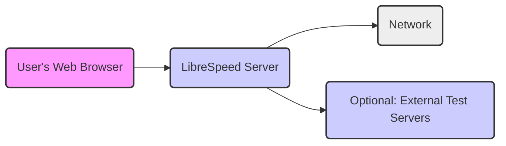
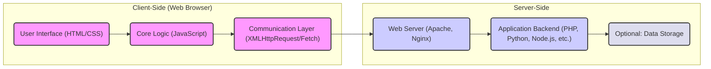

# Project Design Document: LibreSpeed Speedtest

**Version:** 1.1
**Date:** October 26, 2023
**Author:** AI Software Architect

## 1. Introduction

This document provides a detailed design overview of the LibreSpeed speed test application (as found in the provided GitHub repository: [https://github.com/librespeed/speedtest](https://github.com/librespeed/speedtest)). The purpose of this document is to clearly articulate the system's architecture, delineate its constituent components, and trace the flow of data within the application. This serves as a foundational resource for subsequent security analysis and threat modeling endeavors.

## 2. Goals

*   To provide a clear and comprehensive description of the LibreSpeed system architecture.
*   To explicitly identify the key components of the system and detail their interactions.
*   To meticulously describe the data flow within the application, from initiation to result presentation.
*   To serve as a robust and informative basis for security assessments and threat modeling activities.
*   To document the various deployment options available for LibreSpeed and their architectural implications.

## 3. Non-Goals

*   In-depth, line-by-line code analysis of the LibreSpeed codebase.
*   Specific implementation details for each of the multiple supported server-side programming languages.
*   Detailed performance benchmarking results or strategies for performance optimization.
*   Granular specifics of the user interface (UI) and user experience (UX) design.

## 4. System Architecture

LibreSpeed is fundamentally a web-based application designed to measure network speed. It operates through a client-side application executed within a user's web browser and a server-side component responsible for managing test execution and data exchange.

### 4.1. High-Level Architecture

*   **User's Web Browser:** The interface through which users interact with the application, initiating tests and viewing results.
*   **LibreSpeed Server:** The central processing unit of the application, handling test logic and data transmission. Implementations vary across languages (PHP, Python, Node.js, etc.).
*   **Network:** The communication infrastructure enabling data transfer between the client, server, and any external test points.
*   **Optional: External Test Servers:**  Configurable external endpoints used to diversify testing locations or simulate specific network conditions.

### 4.2. Detailed Architecture

*   **Client-Side (Web Browser):**
    *   **User Interface (HTML/CSS):**  Provides the visual elements for user interaction, displaying controls and results.
    *   **Core Logic (JavaScript):**  Implements the speed test algorithms, manages data transfer operations, and orchestrates communication with the server.
    *   **Communication Layer (XMLHttpRequest/Fetch):**  Handles asynchronous HTTP requests to the server for configuration, data transfer during tests, and result submission.

*   **Server-Side:**
    *   **Web Server (Apache, Nginx):**  Receives and processes incoming HTTP requests, serving static content and directing requests to the application backend.
    *   **Application Backend (PHP, Python, Node.js, etc.):**  Executes the server-side logic for handling test requests, generating test data streams, and potentially persisting results. The specific implementation varies based on the chosen language.
    *   **Optional: Data Storage:** A persistent storage mechanism (database, file system) for storing test results, configurations, or other application data.

## 5. Data Flow

The process of conducting a speed test in LibreSpeed involves the following sequence of data exchanges:

*   **Initial Access:**
    *   The user navigates to the LibreSpeed web page via their browser.
    *   The web browser downloads the HTML, CSS, and JavaScript assets.
*   **Configuration Retrieval:**
    *   The client-side JavaScript initiates a request to the server to obtain test configuration parameters (e.g., test durations, connection counts, server locations).
    *   The server-side application processes this request and responds with the necessary configuration details.
*   **Download Test Execution:**
    *   The client initiates multiple, concurrent download requests to the server (or pre-configured external servers).
    *   The server streams test data to the client in response to these requests.
    *   The client measures the download speed by calculating the amount of data received over a specific time period.
*   **Upload Test Execution:**
    *   The client sends data to the server (or external servers) using multiple parallel upload requests.
    *   The server receives and processes the uploaded data.
    *   The client measures the upload speed based on the amount of data transmitted within a given timeframe.
*   **Latency (Ping) Measurement:**
    *   The client sends ICMP echo requests (ping) to the server (or external servers).
    *   The server responds to these ping requests.
    *   The client measures the round-trip time to determine network latency.
*   **Jitter Calculation:**
    *   A series of ping requests are sent, and the variation in the measured latency between these requests is calculated to determine network jitter.
*   **Result Submission:**
    *   The client-side JavaScript aggregates the collected test results (download speed, upload speed, latency, jitter).
    *   The client transmits these results to the server.
    *   The server-side application may store these results in a database or simply acknowledge their receipt.
*   **Result Display:**
    *   The server (or the client directly, depending on the implementation) presents the test results to the user within the web browser interface.

## 6. Components

This section provides a detailed description of the key components within the LibreSpeed system:

*   **Web Browser (Client):**
    *   **Description:** The software application used by the user to access and interact with the LibreSpeed application.
    *   **Functionality:** Renders the user interface, executes the client-side JavaScript code, initiates tests, performs speed calculations, and displays results.
*   **LibreSpeed Front-End (HTML, CSS, JavaScript):**
    *   **Description:** The client-side codebase responsible for the user interface and the core speed testing logic.
    *   **Functionality:** Provides the interactive elements, handles user input, implements the speed test algorithms, manages communication with the server, and presents the test results.
*   **Web Server (e.g., Apache, Nginx):**
    *   **Description:** The server software that listens for and processes incoming HTTP requests.
    *   **Functionality:** Serves the static files of the LibreSpeed front-end and routes requests to the appropriate backend application logic.
*   **LibreSpeed Back-End (PHP, Python, Node.js, etc.):**
    *   **Description:** The server-side application logic that handles the core functionality of the speed test.
    *   **Functionality:** Provides test configurations, manages download and upload data streams, handles latency and jitter requests, and potentially stores test results.
*   **Optional Database (e.g., MySQL, PostgreSQL):**
    *   **Description:** A persistent data storage system used for storing application data.
    *   **Functionality:**  Stores test results, user preferences, server configurations, or other persistent information.
*   **Network Infrastructure:**
    *   **Description:** The underlying network components that facilitate communication between the client and server.
    *   **Functionality:** Provides the physical and logical pathways for data transmission.
*   **Optional External Test Servers:**
    *   **Description:**  Alternative server endpoints used for conducting the speed test.
    *   **Functionality:**  Serve as alternative sources and destinations for download and upload tests, potentially offering more diverse testing scenarios.

## 7. Deployment Options

LibreSpeed offers flexibility in deployment, catering to various infrastructure needs:

*   **Self-Hosted Deployment:** The entire application, both client and server components, is hosted on infrastructure directly managed by the user or organization. This provides maximum control and customization.
*   **Cloud-Based Deployment:** The server-side component is deployed on a cloud platform (e.g., AWS, Azure, GCP), leveraging the scalability and managed services offered by these providers. The client-side remains browser-based.
*   **Containerized Deployment (e.g., Docker):** The server-side application is packaged into containers, simplifying deployment, management, and scaling across different environments.
*   **Serverless Deployment (e.g., AWS Lambda, Azure Functions):** Specific backend functionalities, such as result processing or API endpoints, can potentially be implemented using serverless functions, although the core data transfer might be less suited for this model.

## 8. Security Considerations (Pre-Threat Modeling)

This section outlines potential security considerations that will be further investigated during the threat modeling process:

*   **Cross-Site Scripting (XSS) Vulnerabilities:**  Flaws in the client-side code that could allow attackers to inject malicious scripts into the user's browser.
*   **Cross-Site Request Forgery (CSRF) Vulnerabilities:**  The potential for attackers to induce authenticated users to perform unintended actions on the server.
*   **Data Injection Attacks:**  Vulnerabilities arising from unsanitized user input being used in database queries or other server-side operations.
*   **Denial of Service (DoS) Attacks:**  Attempts to overwhelm the server with requests, making the service unavailable to legitimate users.
*   **Insecure Data Storage Practices:**  Insufficient protection of stored test results or other sensitive data.
*   **Man-in-the-Middle (MitM) Attack Vectors:**  The risk of attackers intercepting and potentially manipulating communication between the client and server. Ensuring HTTPS usage is critical.
*   **Third-Party Dependency Vulnerabilities:**  Security weaknesses present in external libraries or frameworks used by the application.
*   **Information Disclosure Risks:**  Accidental exposure of sensitive information through error messages or debugging outputs.
*   **Insufficient Rate Limiting:**  Lack of mechanisms to prevent abuse of the service through excessive requests.

## 9. Future Considerations

*   **Implementation of Comprehensive Monitoring and Logging:**  Establishing robust monitoring and logging systems to facilitate the detection and investigation of security incidents and performance issues.
*   **Regular Security Audits and Penetration Testing:**  Conducting periodic security assessments to proactively identify and address potential vulnerabilities.
*   **Enforcement of Strict Input Validation and Sanitization:** Implementing rigorous input validation and sanitization measures on both the client and server-side to mitigate various attack vectors.

This document provides a detailed architectural blueprint of the LibreSpeed speed test application, intended to serve as a valuable resource for subsequent security analysis and threat modeling activities.
