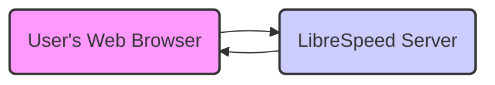
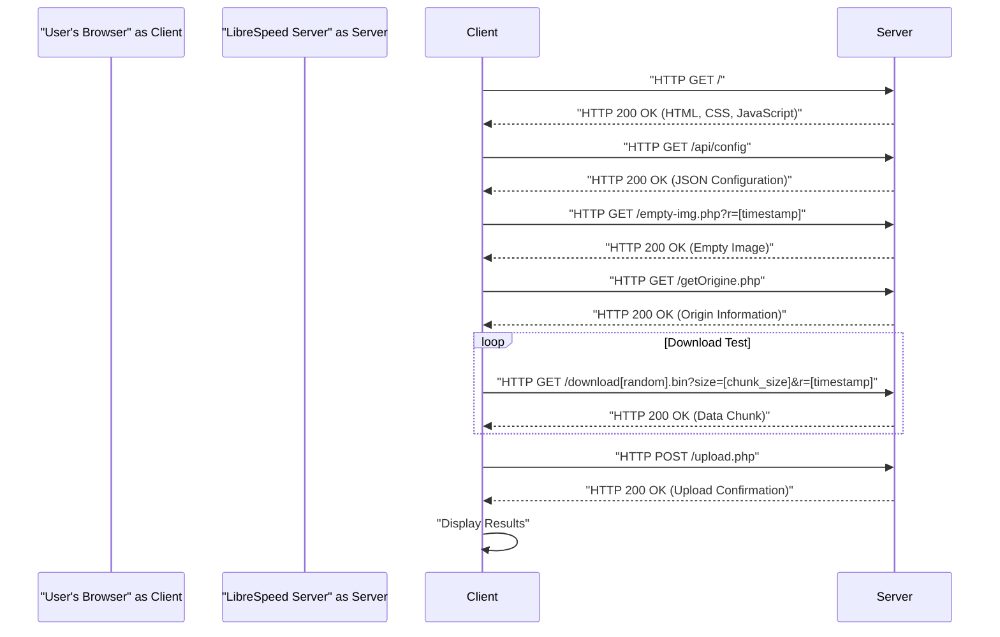

# Project Design Document: LibreSpeed Speed Test

**Version:** 1.1
**Date:** October 26, 2023
**Author:** AI Software Architect

## 1. Introduction

This document provides an enhanced design overview of the LibreSpeed speed test project, an open-source, self-hosted network performance measurement tool. This document details the system's architecture, key components, and data flow, specifically tailored to facilitate comprehensive threat modeling. The design focuses on the core functionalities of measuring internet upload and download speeds, latency (ping), and jitter.

## 2. Goals

* Deliver a clear, comprehensive, and improved description of the LibreSpeed architecture.
* Provide more detailed information about the responsibilities and interactions of key components.
* Offer a more granular description of the data flow during a typical speed test, including data types and protocols.
* Strengthen the foundation for identifying potential security vulnerabilities through detailed component and data flow analysis, supporting effective threat modeling.

## 3. Non-Goals

* In-depth implementation details of specific algorithms used for speed calculation or individual component code.
* Detailed deployment procedures or specific infrastructure setup instructions beyond general considerations.
* Performance tuning strategies or optimization techniques.
* Specific UI/UX design specifications beyond the fundamental client-server interaction model.

## 4. Architectural Overview

LibreSpeed employs a client-server architecture where a web browser acts as the client, interacting with a dedicated server to perform network measurements.

* **Client-Side ("User's Web Browser"):**  The user interface for initiating and viewing the speed test results. Implemented primarily using web technologies: HTML for structure, CSS for styling, and JavaScript for logic and communication.
* **Server-Side ("LibreSpeed Server"):**  The backend component responsible for handling test requests, generating and receiving test data, and providing configuration. Can be implemented using various server-side technologies.

## 5. Detailed Design

### 5.1. Components

* **Client-Side Components:**
    * **"HTML Interface":**
        * Responsibility: Provides the structural foundation of the speed test webpage, including elements for initiating the test, displaying progress, and presenting results.
        * Security Considerations: Potential for DOM-based XSS if dynamically generated content is not properly handled.
    * **"JavaScript Logic":**
        * Responsibility: Manages user interactions, orchestrates the different test phases (ping, download, upload), communicates with the server via API calls, processes responses, and dynamically updates the UI with test results.
        * Security Considerations: Vulnerable to XSS if external scripts are included insecurely or if user input is not sanitized before being used in DOM manipulation. Potential for logic flaws leading to incorrect results or unintended behavior.
    * **"CSS Styling":**
        * Responsibility: Controls the visual presentation and layout of the speed test interface.
        * Security Considerations:  While generally less prone to direct security vulnerabilities, malicious CSS could be used for UI redressing or data exfiltration in specific scenarios.
    * **"Worker Threads (Optional)":**
        * Responsibility:  Offloads computationally intensive tasks, such as generating large data buffers for upload tests, from the main UI thread to prevent blocking and maintain responsiveness.
        * Security Considerations:  If worker threads interact with sensitive data, proper isolation and secure communication mechanisms are necessary.

* **Server-Side Components:**
    * **"Web Server":**
        * Responsibility:  Handles incoming HTTP/HTTPS requests from clients, serves static files (HTML, CSS, JavaScript), and routes API requests to the appropriate backend logic. Examples include Nginx, Apache, or built-in server functionalities of frameworks.
        * Security Considerations:  Vulnerable to common web server vulnerabilities (e.g., misconfigurations, known exploits). Proper security hardening and regular updates are crucial.
    * **"API Endpoints":**
        * **"Configuration Endpoint (/api/config)":**
            * Responsibility: Provides server-side configuration parameters to the client, such as test durations, chunk sizes, and potentially server capabilities.
            * Security Considerations:  Sensitive configuration data should be protected. Lack of authentication or authorization could allow unauthorized access to configuration details.
        * **"Ping Endpoint (e.g., /empty-img.php)":**
            * Responsibility:  Responds to client requests to measure network latency (ping). Typically involves returning a small, quickly served resource.
            * Security Considerations:  Susceptible to DoS attacks if not properly protected against excessive requests.
        * **"Download Endpoint (e.g., /download[random].bin)":**
            * Responsibility: Streams data to the client to measure download speed. The server dynamically generates or serves pre-existing data.
            * Security Considerations:  Potential for resource exhaustion if not rate-limited. Ensure data served does not contain sensitive information if dynamically generated.
        * **"Upload Endpoint (/upload.php)":**
            * Responsibility: Receives data uploaded by the client to measure upload speed.
            * Security Considerations:  Vulnerable to resource exhaustion if not properly limited in terms of request size and frequency. Requires validation to prevent malicious uploads.
    * **"Backend Logic":**
        * Responsibility: Implements the core logic for handling test requests, generating test data for download tests, processing uploaded data, and potentially managing concurrent connections.
        * Security Considerations:  Vulnerabilities in the backend code (e.g., injection flaws, insecure data handling) could be exploited. Proper input validation and secure coding practices are essential.

### 5.2. Data Flow

The following sequence diagram illustrates the data flow during a typical speed test:

**Detailed Steps with Data Types and Protocols:**

1. **Initial Page Load:** The user's browser sends an `HTTP GET` request to the LibreSpeed server for the root path (`/`). The server responds with an `HTTP 200 OK` status code and the HTML, CSS, and JavaScript files (data type: `text/html`, `text/css`, `application/javascript`).
2. **Configuration Retrieval:** The client-side JavaScript sends an `HTTP GET` request to the `/api/config` endpoint. The server responds with an `HTTP 200 OK` status code and a JSON payload containing server configuration parameters (data type: `application/json`).
3. **Ping Test:**
    * The client sends multiple `HTTP GET` requests to the ping endpoint (e.g., `/empty-img.php`) with a cache-busting parameter (e.g., a timestamp).
    * The server responds with an `HTTP 200 OK` status code and a small, often empty, image or resource (data type: `image/gif` or similar). The key data point here is the time taken for the round trip.
4. **Optional Origin Check:** The client may send an `HTTP GET` request to `/getOrigine.php`. The server responds with `HTTP 200 OK` and information about the server's origin (data type: `text/plain` or `application/json`).
5. **Download Test:**
    * The client initiates multiple parallel `HTTP GET` requests to the download endpoint (e.g., `/download[random].bin`) with parameters specifying the desired chunk size and a cache-busting parameter.
    * The server streams data chunks to the client. The data type is typically `application/octet-stream` or a similar binary format. The size of the chunks and the transfer rate are the key data points.
6. **Upload Test:**
    * The client generates data in the browser (typically using `ArrayBuffer` or `Blob`).
    * The client sends an `HTTP POST` request to the upload endpoint (`/upload.php`). The request body contains the generated data (data type: `application/octet-stream` or `multipart/form-data`).
    * The server responds with an `HTTP 200 OK` status code to acknowledge the successful receipt of the data. The amount of data transferred and the time taken are the key data points.
7. **Result Display:** The client-side JavaScript calculates the final speed test results based on the collected data and displays them to the user.

## 6. Security Considerations (Detailed for Threat Modeling)

This section expands on potential security vulnerabilities, categorized by component and data flow, to facilitate more effective threat modeling.

* **Client-Side Vulnerabilities:**
    * **"HTML Interface":**
        * **Threat:** DOM-based XSS.
        * **Scenario:** Maliciously crafted URLs or server responses inject scripts into the DOM, potentially stealing user data or performing actions on their behalf.
    * **"JavaScript Logic":**
        * **Threat:** Cross-Site Scripting (XSS).
        * **Scenario:**  Inclusion of compromised third-party scripts or improper handling of user input or server responses allows attackers to inject malicious scripts.
        * **Threat:** Logic flaws leading to incorrect results.
        * **Scenario:**  Bugs in the JavaScript code could be exploited to manipulate test results, providing inaccurate information.
    * **"CSS Styling":**
        * **Threat:** UI Redressing/Clickjacking.
        * **Scenario:**  Malicious CSS could be used to overlay deceptive elements, tricking users into performing unintended actions.
    * **"Worker Threads":**
        * **Threat:** Data leakage or manipulation.
        * **Scenario:**  If worker threads handle sensitive data without proper security measures, it could be vulnerable to compromise.

* **Server-Side Vulnerabilities:**
    * **"Web Server":**
        * **Threat:** Exploitation of known web server vulnerabilities.
        * **Scenario:**  Outdated or misconfigured web servers can be vulnerable to attacks that allow unauthorized access or control.
        * **Threat:** Denial of Service (DoS).
        * **Scenario:**  Overwhelming the web server with requests, making it unavailable to legitimate users.
    * **"API Endpoints":**
        * **"/api/config":**
            * **Threat:** Information Disclosure.
            * **Scenario:**  Unauthorized access to configuration details could reveal sensitive information about the server setup.
        * **"Ping Endpoint":**
            * **Threat:** Denial of Service (DoS).
            * **Scenario:**  Flooding the ping endpoint with requests to exhaust server resources.
        * **"Download Endpoint":**
            * **Threat:** Resource Exhaustion.
            * **Scenario:**  Malicious clients requesting excessively large downloads to consume server bandwidth and resources.
        * **"Upload Endpoint":**
            * **Threat:** Resource Exhaustion.
            * **Scenario:**  Clients sending excessively large uploads to consume server storage or processing power.
            * **Threat:** Malicious File Upload.
            * **Scenario:**  Uploading malicious files if the endpoint is not properly secured and validated.
    * **"Backend Logic":**
        * **Threat:** Injection vulnerabilities (e.g., command injection if interacting with the OS).
        * **Scenario:**  Improper handling of input could allow attackers to execute arbitrary commands on the server.
        * **Threat:** Insecure data handling.
        * **Scenario:**  Storing or processing data insecurely could lead to data breaches or manipulation.

* **Data Flow Vulnerabilities:**
    * **"HTTP Communication":**
        * **Threat:** Man-in-the-Middle (MITM) attacks.
        * **Scenario:**  If communication occurs over unencrypted HTTP, attackers can intercept and potentially modify data exchanged between the client and server.
    * **"Download Test":**
        * **Threat:** Serving malicious content.
        * **Scenario:**  If the server is compromised, it could serve malicious data during the download test.
    * **"Upload Test":**
        * **Threat:** Data integrity issues.
        * **Scenario:**  Ensuring the integrity of uploaded data is crucial, especially if it's processed or stored.

## 7. Deployment Considerations

* LibreSpeed is designed for self-hosting, placing the responsibility for security and maintenance on the deployer.
* Deployment options include virtual machines, containers (e.g., Docker), and bare-metal servers.
* Secure configuration of the web server (e.g., enabling HTTPS, setting appropriate headers) is paramount.
* Implementing proper firewall rules and network segmentation is essential to protect the server.
* Regular security updates for the operating system, web server, and backend technologies are crucial.

## 8. Future Considerations

* Implementing robust logging and monitoring for security auditing and incident response.
* Exploring more advanced testing methodologies and metrics.
* Developing a more comprehensive API for integration with other network monitoring tools.
* Considering features like user authentication and authorization for enhanced security and control in multi-user environments.

This enhanced design document provides a more detailed and security-focused overview of the LibreSpeed project, serving as a strong foundation for conducting thorough threat modeling activities.