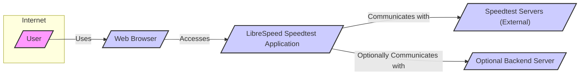
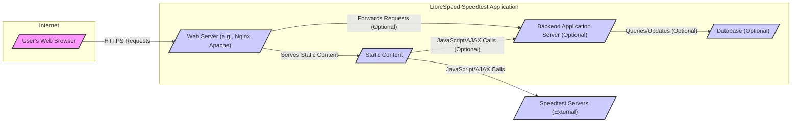
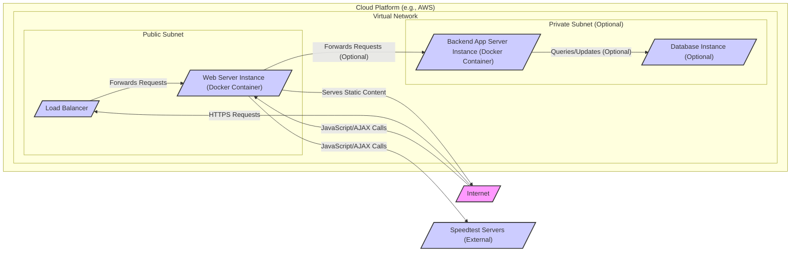

# BUSINESS POSTURE

- Business Priorities and Goals:
  - Provide a free and open-source internet speed testing tool.
  - Offer accurate and reliable speed test results to users.
  - Enable users to easily test their internet connection speed from any web browser.
  - Support various deployment options, including client-side only and with optional server-side components for advanced features or data collection.
  - Maintain a lightweight and efficient application to minimize resource usage.
- Business Risks:
  - Inaccurate speed test results could damage user trust and the reputation of the tool.
  - Service unavailability due to technical issues or attacks could disrupt users and impact the tool's usability.
  - Data privacy breaches, especially if server-side components are used to collect and store user data (e.g., IP addresses, test results), could lead to legal and reputational damage.
  - Vulnerabilities in the application could be exploited by malicious actors for various purposes, including denial of service, data manipulation, or malware distribution.
  - Lack of updates and maintenance could lead to security vulnerabilities and decreased usability over time.

# SECURITY POSTURE

- Existing Security Controls:
  - security control: Open-source code, allowing for community review and identification of potential vulnerabilities. (Implemented: GitHub repository)
  - security control: Client-side implementation (HTML5/JavaScript) reduces server-side attack surface when deployed as a purely client-side application. (Implemented: Architecture design)
- Accepted Risks:
  - accepted risk: Reliance on client-side security measures, which can be bypassed or manipulated by advanced users.
  - accepted risk: Potential vulnerabilities in third-party libraries used in client-side or server-side components.
  - accepted risk: Risk of denial-of-service attacks if server-side components are deployed and become publicly accessible.
- Recommended Security Controls:
  - security control: Implement regular security scanning of both client-side and server-side code using SAST and DAST tools.
  - security control: Establish a process for security vulnerability reporting and patching.
  - security control: If server-side components are used, implement proper input validation and output encoding to prevent injection attacks.
  - security control: If user data is stored server-side, implement encryption at rest and in transit.
  - security control: Implement rate limiting and DDoS protection for server-side components.
  - security control: Conduct regular security audits and penetration testing, especially before major releases.
- Security Requirements:
  - Authentication: Not applicable for the core speed test functionality as it is designed to be anonymous. If server-side components are extended for user accounts or administrative functions, authentication will be required.
  - Authorization: Not applicable for the core speed test functionality. If server-side components are extended for administrative functions, authorization will be required to control access to sensitive operations.
  - Input Validation: Implement input validation on both client-side and server-side (if used) to prevent injection attacks. Validate user inputs in configuration settings and any data submitted to server-side components.
  - Cryptography: Use HTTPS for all communication to protect data in transit. If server-side components store sensitive data, use encryption at rest. Consider using Content Security Policy (CSP) to mitigate cross-site scripting (XSS) attacks.

# DESIGN

## C4 CONTEXT



- Context Diagram Elements:
  - - Name: User
    - Type: Person
    - Description: End-user who wants to test their internet connection speed.
    - Responsibilities: Initiates speed test through a web browser. Views speed test results.
    - Security controls: Responsible for using a secure web browser and protecting their own device from malware.
  - - Name: Web Browser
    - Type: Software System
    - Description: Web browser used by the user to access and run the LibreSpeed Speedtest Application.
    - Responsibilities: Renders the user interface of the speed test application. Executes JavaScript code. Communicates with the LibreSpeed Speedtest Application and external Speedtest Servers.
    - Security controls: Browser security features (e.g., sandboxing, Content Security Policy), user-installed browser extensions for security.
  - - Name: LibreSpeed Speedtest Application
    - Type: Software System
    - Description: The web-based speed test application itself, consisting of HTML, CSS, and JavaScript code.
    - Responsibilities: Provides the user interface for initiating and displaying speed tests. Executes speed test logic in the browser. Communicates with external Speedtest Servers to perform actual speed measurements. Optionally communicates with a Backend Server for advanced features.
    - Security controls: Client-side security controls (e.g., input validation, CSP), HTTPS for communication.
  - - Name: Speedtest Servers (External)
    - Type: Software System
    - Description: External servers used to perform the actual speed measurements (upload and download tests). These are typically publicly available servers.
    - Responsibilities: Receives requests from the LibreSpeed Speedtest Application. Performs speed measurements. Returns results to the LibreSpeed Speedtest Application.
    - Security controls: Server-side security controls implemented by the operators of these external servers, which are outside the control of the LibreSpeed project.
  - - Name: Optional Backend Server
    - Type: Software System
    - Description: An optional server-side component (e.g., in PHP, Go, Node.js, Python) that can be deployed to provide additional features such as result storage, user accounts, or administrative functions.
    - Responsibilities: Handles optional server-side logic. May store speed test results or user data. May provide administrative interfaces.
    - Security controls: Server-side security controls (e.g., authentication, authorization, input validation, encryption, rate limiting, DDoS protection).

## C4 CONTAINER



- Container Diagram Elements:
  - - Name: Web Server (e.g., Nginx, Apache)
    - Type: Container
    - Description: Serves static content (HTML, CSS, JavaScript) of the LibreSpeed Speedtest Application. Acts as the entry point for user requests. Can also act as a reverse proxy for the Backend Application Server if deployed.
    - Responsibilities: Serving static files. Handling HTTPS connections. Optionally forwarding requests to the Backend Application Server.
    - Security controls: HTTPS configuration, web server security hardening, access control to configuration files.
  - - Name: Static Content
    - Type: Container
    - Description: Contains all the static files (HTML, CSS, JavaScript, images) that make up the client-side application. This is the core of the LibreSpeed Speedtest Application.
    - Responsibilities: Executing speed test logic in the browser. Rendering the user interface. Communicating with external Speedtest Servers and optionally with the Backend Application Server.
    - Security controls: Client-side input validation, Content Security Policy (CSP), Subresource Integrity (SRI) for external dependencies.
  - - Name: Backend Application Server (Optional)
    - Type: Container
    - Description: An optional server-side application (e.g., PHP, Go, Node.js, Python) that provides additional features.
    - Responsibilities: Handling server-side logic for optional features (e.g., result storage, user management). Interacting with the Database if used.
    - Security controls: Server-side input validation, output encoding, authentication, authorization, secure coding practices, protection against injection attacks, rate limiting.
  - - Name: Database (Optional)
    - Type: Container
    - Description: An optional database to store data, such as speed test results or user information, if the Backend Application Server is used and requires data persistence.
    - Responsibilities: Storing and retrieving data for the Backend Application Server.
    - Security controls: Database access control, encryption at rest, regular backups, database security hardening.
  - - Name: Speedtest Servers (External)
    - Type: External System
    - Description: External servers used for actual speed measurements.
    - Responsibilities: Performing speed measurements as requested by the client-side application.
    - Security controls: Security controls are managed by the operators of these external servers.

## DEPLOYMENT

Deployment Solution: Docker Container on Cloud Platform (e.g., AWS, GCP, Azure)



- Deployment Diagram Elements:
  - - Name: Load Balancer
    - Type: Infrastructure
    - Description: Distributes incoming HTTPS traffic across Web Server Instances. Provides high availability and scalability.
    - Responsibilities: Load balancing, SSL termination, traffic routing.
    - Security controls: DDoS protection, SSL/TLS configuration, access control policies.
  - - Name: Web Server Instance (Docker Container)
    - Type: Infrastructure, Container
    - Description: A virtual machine or container instance running a Web Server (e.g., Nginx) and serving the static content of the LibreSpeed Speedtest Application. Deployed as a Docker container for consistency and ease of deployment.
    - Responsibilities: Serving static content, handling web requests, optionally forwarding requests to the Backend App Server.
    - Security controls: Container security hardening, OS security hardening, web server security configuration, regular patching.
  - - Name: Backend App Server Instance (Docker Container) (Optional)
    - Type: Infrastructure, Container
    - Description: A virtual machine or container instance running the optional Backend Application Server. Deployed in a private subnet for enhanced security.
    - Responsibilities: Handling server-side logic, interacting with the Database.
    - Security controls: Container security hardening, OS security hardening, application server security configuration, network segmentation, access control policies.
  - - Name: Database Instance (Optional)
    - Type: Infrastructure
    - Description: A managed database service (e.g., AWS RDS, GCP Cloud SQL, Azure SQL Database) or a database instance running on a virtual machine. Deployed in a private subnet for enhanced security.
    - Responsibilities: Data storage and retrieval.
    - Security controls: Database access control, encryption at rest and in transit, regular backups, database security hardening, network segmentation.

## BUILD

```mermaid
flowchart LR
    A[/"Developer"/] --> B{/"Code Changes"/}
    B --> C[/"GitHub Repository"/]
    C --> D[/"GitHub Actions (CI/CD)"/]
    D --> E{/"Build Process"/}
    E -- "Static Analysis (SAST)" --> E
    E -- "Linters" --> E
    E --> F[/"Build Artifacts (Docker Image, Static Files)"/]
    F --> G[/"Container Registry (Optional)"/]
    G --> H[/"Deployment Pipeline"/]
    H --> I[/"Deployment Environment"/]

    style A fill:#f9f,stroke:#333,stroke-width:2px
    style B fill:#ccf,stroke:#333,stroke-width:2px
    style C fill:#ccf,stroke:#333,stroke-width:2px
    style D fill:#ccf,stroke:#333,stroke-width:2px
    style E fill:#ccf,stroke:#333,stroke-width:2px
    style F fill:#ccf,stroke:#333,stroke-width:2px
    style G fill:#ccf,stroke:#333,stroke-width:2px
    style H fill:#ccf,stroke:#333,stroke-width:2px
    style I fill:#ccf,stroke:#333,stroke-width:2px
```

- Build Process Elements:
  - - Name: Developer
    - Type: Person
    - Description: Software developer who writes and modifies the code for the LibreSpeed Speedtest Application.
    - Responsibilities: Writing code, committing changes to the repository, performing local testing.
    - Security controls: Secure coding practices, code review, local development environment security.
  - - Name: Code Changes
    - Type: Data
    - Description: Modifications to the source code of the application.
    - Responsibilities: Representing the changes made by developers.
    - Security controls: Version control (Git), code review process.
  - - Name: GitHub Repository
    - Type: Software System
    - Description: Central repository for storing and managing the source code.
    - Responsibilities: Version control, code storage, collaboration.
    - Security controls: Access control, branch protection, audit logs.
  - - Name: GitHub Actions (CI/CD)
    - Type: Software System
    - Description: Automated CI/CD platform used to build, test, and deploy the application.
    - Responsibilities: Build automation, testing, deployment pipeline.
    - Security controls: Secure pipeline configuration, secret management, access control, audit logs.
  - - Name: Build Process
    - Type: Process
    - Description: Automated process of compiling, testing, and packaging the application. Includes steps like static analysis (SAST), linting, and building Docker images (if applicable).
    - Responsibilities: Code compilation, static analysis, linting, unit testing, integration testing, building artifacts.
    - Security controls: SAST tools, linters, dependency scanning, secure build environment, artifact signing.
  - - Name: Build Artifacts (Docker Image, Static Files)
    - Type: Data
    - Description: Output of the build process, including Docker images (if used for server-side components) and static files (HTML, CSS, JavaScript).
    - Responsibilities: Deployable units of the application.
    - Security controls: Artifact signing, vulnerability scanning of Docker images.
  - - Name: Container Registry (Optional)
    - Type: Software System
    - Description: Registry for storing and managing Docker images. Used if Docker is used for deployment.
    - Responsibilities: Storing and distributing Docker images.
    - Security controls: Access control, vulnerability scanning, image signing.
  - - Name: Deployment Pipeline
    - Type: Process
    - Description: Automated process for deploying build artifacts to the target environment.
    - Responsibilities: Deploying application to different environments (e.g., staging, production).
    - Security controls: Secure deployment process, infrastructure as code, environment segregation, rollback mechanisms.
  - - Name: Deployment Environment
    - Type: Environment
    - Description: Target infrastructure where the application is deployed and running (e.g., cloud platform, on-premises servers).
    - Responsibilities: Hosting and running the application.
    - Security controls: Infrastructure security, network security, access control, monitoring, incident response.

# RISK ASSESSMENT

- Critical Business Processes:
  - Providing accurate internet speed test results to users.
  - Maintaining the availability and accessibility of the speed test application.
- Data to Protect and Sensitivity:
  - User IP Addresses (if logged by optional backend): Low to Medium sensitivity. IP addresses can be considered personal data in some jurisdictions.
  - Speed Test Results (if stored by optional backend): Low sensitivity. Aggregated results might be more sensitive depending on the context.
  - Application Code and Infrastructure: High sensitivity. Compromise could lead to service disruption, data breaches, or malware distribution.

# QUESTIONS & ASSUMPTIONS

- Questions:
  - Is there a plan to implement server-side components for data collection or advanced features in the future?
  - What is the expected scale and user base for the application?
  - Are there any specific regulatory compliance requirements (e.g., GDPR, CCPA) that need to be considered?
  - What is the process for handling security vulnerabilities reported by the community?
- Assumptions:
  - The primary goal is to provide a free and open-source speed test tool for general public use.
  - The application is intended to be lightweight and efficient.
  - Security is a concern, but performance and ease of use are also important priorities.
  - Deployment will likely be on standard web hosting or cloud platforms.
  - The project will be maintained by a community of developers.