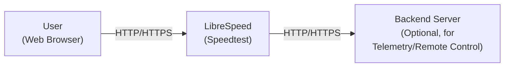
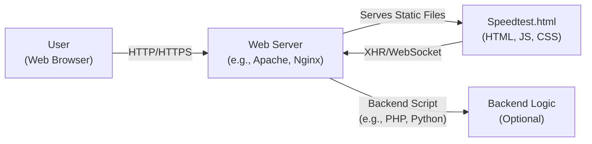
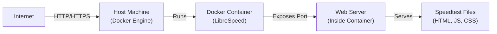
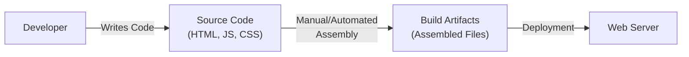

# BUSINESS POSTURE

Business Priorities and Goals:

*   Provide a lightweight, free, and open-source internet speed testing application.
*   Offer a self-hostable solution, allowing users to run their own speed tests without relying on third-party services.
*   Ensure the application is easy to use and deploy, with minimal dependencies.
*   Maintain user privacy by not collecting or storing personal data.
*   Provide accurate and reliable speed test results.
*   Support a wide range of devices and browsers.

Business Risks:

*   Reputational damage due to inaccurate or unreliable speed test results.
*   Service disruption caused by denial-of-service attacks.
*   Compromise of the application or server, leading to potential misuse (e.g., becoming part of a botnet).
*   Legal issues arising from misuse of the application by users.
*   Lack of adoption due to complexity or poor performance.

# SECURITY POSTURE

Existing Security Controls:

*   security control: The project is open-source, allowing for community review and contributions to security. (GitHub repository)
*   security control: Minimal dependencies to reduce the attack surface. (README.md, source code)
*   security control: No user accounts or personal data storage, minimizing privacy risks. (Application design)
*   security control: The application can be self-hosted, giving users control over their data and infrastructure. (README.md)
*   security control: Basic input validation is likely present, though this needs to be confirmed in the code. (Source code - to be verified)
*   security control: Use of HTTPS is recommended in the documentation, protecting data in transit. (README.md)

Accepted Risks:

*   accepted risk: Reliance on the user to properly secure their hosting environment (e.g., web server configuration, firewall).
*   accepted risk: Potential for denial-of-service attacks, as the application is designed to handle high volumes of traffic.
*   accepted risk: Vulnerabilities in underlying web server software (e.g., Apache, Nginx) are outside the project's direct control.

Recommended Security Controls:

*   Implement robust input validation and sanitization to prevent common web vulnerabilities (e.g., XSS, injection).
*   Provide guidance on secure configuration of the hosting environment, including web server settings and firewall rules.
*   Consider implementing rate limiting or other mechanisms to mitigate denial-of-service attacks.
*   Regularly update dependencies to address known vulnerabilities.
*   Perform security audits and penetration testing to identify and address potential weaknesses.
*   Implement Content Security Policy (CSP) headers to mitigate XSS and other code injection attacks.
*   Implement Subresource Integrity (SRI) for included JavaScript libraries.

Security Requirements:

*   Authentication: Not applicable, as the application does not have user accounts.
*   Authorization: Not applicable, as there are no user roles or permissions.
*   Input Validation: All user-provided input (e.g., server URL, test parameters) must be validated and sanitized to prevent injection attacks and ensure data integrity.
*   Cryptography:
    *   HTTPS should be enforced for all communication between the client and server to protect data in transit.
    *   If any sensitive data is stored (which is discouraged), it should be encrypted at rest using strong, industry-standard algorithms.
*   Output Encoding: All dynamic output should be properly encoded to prevent Cross-Site Scripting (XSS) vulnerabilities.

# DESIGN

## C4 CONTEXT

C4 Context Element List:

*   User:
    *   Name: User
    *   Type: Person
    *   Description: A person using a web browser to perform a speed test.
    *   Responsibilities: Initiates speed tests, views results.
    *   Security controls: Web browser security settings, HTTPS.

*   LibreSpeed:
    *   Name: LibreSpeed
    *   Type: Software System
    *   Description: The LibreSpeed speed testing application.
    *   Responsibilities: Performs speed tests, displays results, communicates with backend server (optional).
    *   Security controls: Input validation, HTTPS, secure coding practices.

*   Backend Server:
    *   Name: Backend Server
    *   Type: Software System
    *   Description: An optional backend server for telemetry or remote control.
    *   Responsibilities: Receives telemetry data, provides remote control functionality (if implemented).
    *   Security controls: Authentication (if implemented), authorization (if implemented), input validation, HTTPS, secure coding practices, secure configuration.

## C4 CONTAINER

C4 Container Element List:

*   User:
    *   Name: User
    *   Type: Person
    *   Description: A person using a web browser to perform a speed test.
    *   Responsibilities: Initiates speed tests, views results.
    *   Security controls: Web browser security settings, HTTPS.

*   Web Server:
    *   Name: Web Server
    *   Type: Container
    *   Description: A web server (e.g., Apache, Nginx) that hosts the application.
    *   Responsibilities: Serves static files, handles HTTP requests, executes backend scripts (if any).
    *   Security controls: Web server security configuration, HTTPS, firewall.

*   Speedtest.html:
    *   Name: Speedtest.html
    *   Type: Container
    *   Description: The main HTML file containing the user interface and JavaScript code for the speed test.
    *   Responsibilities: Renders the UI, handles user interaction, performs the speed test logic, communicates with the web server.
    *   Security controls: Input validation, output encoding, CSP, SRI.

*   Backend:
    *   Name: Backend
    *   Type: Container
    *   Description: Optional backend logic for features like telemetry or saving results.
    *   Responsibilities: Processes data from the speed test, stores data (if applicable), provides additional functionality.
    *   Security controls: Input validation, secure coding practices, secure configuration, data encryption (if storing data).

## DEPLOYMENT

Possible Deployment Solutions:

1.  Traditional Web Server (Apache, Nginx) on a VPS or dedicated server.
2.  Containerized deployment using Docker.
3.  Cloud-based deployment using platforms like AWS, Azure, or Google Cloud.

Chosen Solution (Docker):

Deployment Element List:

*   Internet:
    *   Name: Internet
    *   Type: External Entity
    *   Description: The global network.
    *   Responsibilities: Provides connectivity to the host machine.
    *   Security controls: N/A

*   Host Machine:
    *   Name: Host Machine
    *   Type: Infrastructure Node
    *   Description: The physical or virtual machine running Docker Engine.
    *   Responsibilities: Hosts the Docker container.
    *   Security controls: Operating system security, firewall, intrusion detection/prevention system.

*   Docker Container:
    *   Name: Docker Container
    *   Type: Container
    *   Description: The isolated environment running the LibreSpeed application.
    *   Responsibilities: Runs the web server and serves the speed test files.
    *   Security controls: Container isolation, minimal base image, regular updates.

*   Web Server:
    *   Name: Web Server
    *   Type: Software Component
    *   Description: The web server (e.g., Apache, Nginx) running inside the Docker container.
    *   Responsibilities: Serves the speed test files.
    *   Security controls: Web server security configuration, HTTPS.

*   Speedtest Files:
    *   Name: Speedtest Files
    *   Type: Software Component
    *   Description: The HTML, JavaScript, and CSS files that make up the speed test application.
    *   Responsibilities: Provide the user interface and speed test logic.
    *   Security controls: Input validation, output encoding, CSP, SRI.

## BUILD

The LibreSpeed project appears to have a relatively simple build process, primarily involving assembling HTML, JavaScript, and CSS files. There isn't a complex build system like a dedicated CI/CD pipeline evident from the repository root. However, best practices should still be followed.

Build Process Description:

1.  Developers write and modify the HTML, JavaScript, and CSS files.
2.  The files are assembled (potentially manually or with simple scripts).  This might involve combining files, minifying code, etc.
3.  The assembled files (build artifacts) are deployed to the web server.

Security Controls in Build Process:

*   Code Review:  All code changes should be reviewed by another developer to identify potential security vulnerabilities.
*   Static Analysis:  Linters (e.g., ESLint for JavaScript, HTMLHint for HTML) should be used to identify potential code quality and security issues.  While not explicitly shown in the repository, this is a highly recommended practice.
*   Dependency Management:  If any external libraries are used (check `package.json` or similar, though it doesn't seem to be heavily used here), their versions should be carefully managed and checked for known vulnerabilities. Tools like `npm audit` or `yarn audit` can help.
*   Manual Security Checks: Developers should be aware of common web vulnerabilities (OWASP Top 10) and check their code for potential issues.

# RISK ASSESSMENT

Critical Business Processes:

*   Providing accurate and reliable speed test results.
*   Maintaining user trust and privacy.
*   Ensuring service availability.

Data to Protect:

*   While LibreSpeed doesn't intentionally collect personal data, the following data is involved and needs protection:
    *   Client IP Address (transient):  Used during the speed test process. Sensitivity: Low (but could be considered PII in some contexts).
    *   Test Results (transient): Download speed, upload speed, ping, jitter. Sensitivity: Low.
    *   Optional Telemetry Data (if enabled):  Potentially includes test results, browser information, etc. Sensitivity: Low to Medium, depending on the specific data collected.

# QUESTIONS & ASSUMPTIONS

Questions:

*   Are there any specific compliance requirements (e.g., GDPR, CCPA) that need to be considered, even though the application aims to minimize data collection?
*   What is the expected traffic volume and peak load? This will inform the design of denial-of-service mitigation strategies.
*   Is there a specific threat model or set of attack scenarios that the project is particularly concerned about?
*   What is the process for handling security vulnerabilities reported by external researchers or users?
*   Are there plans to implement any backend functionality (e.g., telemetry, remote control) in the future?
*   What level of logging is required or desired?
*   Is there a preferred method for deploying updates and patches?

Assumptions:

*   BUSINESS POSTURE: The primary goal is to provide a free, open-source, and privacy-respecting speed test service.  Profitability is not a primary concern.
*   SECURITY POSTURE: The project has a limited security budget and relies heavily on secure coding practices and community contributions.
*   DESIGN: The application is relatively simple and does not require complex infrastructure or advanced security features. The user is responsible for securing the hosting environment. The optional backend functionality is minimal.