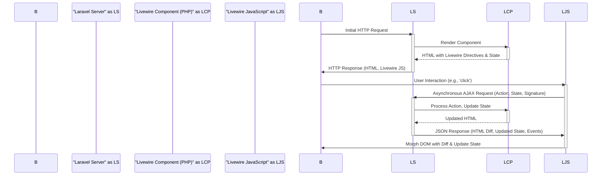

# Project Design Document: Livewire

**Version:** 1.1
**Date:** October 26, 2023
**Author:** AI Software Architect
**Audience:** Developers, Security Engineers, Architects

## 1. Introduction

This document provides an enhanced architectural design of the Livewire framework, a full-stack framework for Laravel that simplifies the creation of dynamic interfaces using PHP. This revised document aims to offer a more detailed and structured overview of Livewire's components, interactions, and data flow, specifically tailored for use in threat modeling and security analysis.

## 2. Goals and Objectives

*   Clearly define the architecture of the Livewire framework with improved detail.
*   Identify key components and their specific responsibilities and interactions.
*   Illustrate the data flow between the client and server with greater precision.
*   Provide a comprehensive and well-organized overview for security analysis and threat modeling activities.
*   Document the technologies and dependencies involved, explaining their roles within Livewire.
*   Outline deployment considerations relevant to Livewire applications.

## 3. Architectural Overview

Livewire facilitates the development of interactive front-end experiences by leveraging server-side rendered Blade components and asynchronous communication. It establishes a stateful connection between the browser and the server, enabling partial page updates without full reloads.

### 3.1. High-Level Architecture

```mermaid
graph LR
    A("Browser") -->|Initial HTTP Request| B("Laravel Application (Server)");
    B -->|Render Initial View with Livewire Component| C("Livewire Component (PHP)");
    C -->|Render HTML with Livewire Directives & Initial State| B;
    B -->|HTTP Response (HTML with Livewire Assets)| A;
    A -->|User Interaction (e.g., 'wire:click', 'wire:model')| D("Livewire JavaScript");
    D -->|Asynchronous AJAX Request with Payload| B;
    B -->|Identify Target Livewire Component| C;
    C -->|Process Action, Update Component State| C;
    C -->|Generate Updated HTML Diff| B;
    B -->|JSON Response (HTML Diff, Updated State, Browser Events)| D;
    D -->|Morph DOM using HTML Diff & Update State| A;
```

### 3.2. Key Components

*   **Livewire Component (PHP):**
    *   A fundamental building block, implemented as a standard Laravel class extending `Livewire\Component`.
    *   Manages the component's state through public properties.
    *   Defines methods that handle user interactions triggered from the front-end.
    *   Responsible for rendering a Blade template, incorporating Livewire directives.
    *   Performs server-side logic and data manipulation.
*   **Livewire JavaScript:**
    *   A client-side JavaScript library automatically included when a Livewire component is present on a page.
    *   Listens for DOM events on elements marked with Livewire directives (e.g., `wire:click`, `wire:model`).
    *   Constructs and sends asynchronous AJAX requests to the server upon user interaction.
    *   Receives JSON responses from the server containing HTML diffs and updated component state.
    *   Utilizes a DOM morphing algorithm to efficiently update the browser's Document Object Model (DOM) based on the received diff.
    *   Manages client-side component state synchronization.
*   **Blade Templates:**
    *   Standard Laravel Blade templates that are enhanced with Livewire-specific directives.
    *   These directives instruct the Livewire JavaScript on how to bind data, listen for events, and interact with the server-side component.
    *   Define the structure and presentation of the Livewire component in the browser.
*   **Laravel Application (Server):**
    *   The core Laravel application that hosts and manages the Livewire framework.
    *   Receives and routes incoming HTTP and AJAX requests.
    *   Instantiates and manages the lifecycle of Livewire components.
    *   Provides the environment for Livewire components to execute server-side logic.
    *   Handles request validation, authorization, and other middleware processes.

## 4. Detailed Design

### 4.1. Livewire Request Lifecycle

The following details the sequence of events during a typical Livewire interaction:

1. **Initial Page Load Request:**
    *   The browser sends an HTTP request to the Laravel server for a page containing a Livewire component.

2. **Server-Side Rendering:**
    *   The Laravel application processes the request and renders the Blade template associated with the route.
    *   The Livewire component within the template is instantiated.
    *   The component's initial state is serialized and embedded within the HTML as JavaScript data.
    *   The Livewire JavaScript library is included in the HTML response.

3. **Browser Receives HTML:**
    *   The browser receives the HTML, CSS, and JavaScript, including the Livewire JavaScript.
    *   The Livewire JavaScript initializes and attaches event listeners to elements with Livewire directives.

4. **User Interaction Trigger:**
    *   The user interacts with an element in the browser that has a Livewire directive (e.g., typing in an input with `wire:model`, clicking a button with `wire:click`).

5. **JavaScript Interception and Request Preparation:**
    *   The Livewire JavaScript intercepts the browser event.
    *   It gathers relevant data, including the component's name, the action to be performed (method name), and any parameters.
    *   The current state of the component is also included in the payload.
    *   A security signature (for CSRF protection) is added to the request.

6. **Asynchronous AJAX Request:**
    *   The Livewire JavaScript sends an asynchronous AJAX request (typically a POST request) to a specific Livewire endpoint on the server.

7. **Server-Side Request Handling:**
    *   The Laravel application receives the AJAX request.
    *   Livewire middleware identifies the target component based on the request payload.
    *   The request is validated, including CSRF token verification.
    *   The component's state is deserialized.

8. **Action Execution and State Update:**
    *   The specified action method on the Livewire component is executed.
    *   The component's state properties may be updated within this method.

9. **Component Re-rendering:**
    *   After the action is processed, the Livewire component re-renders its Blade template.

10. **HTML Diff Generation:**
    *   Livewire compares the newly rendered HTML with the previous version of the component's output.
    *   A diff (difference) representing the changes in the HTML structure is generated.

11. **JSON Response Construction:**
    *   The server constructs a JSON response containing:
        *   The HTML diff.
        *   The updated state of the component.
        *   Instructions for any browser events to be dispatched (e.g., JavaScript events).
        *   Potentially other directives for the client-side Livewire JavaScript.

12. **Response Transmission:**
    *   The server sends the JSON response back to the browser.

13. **DOM Update and State Synchronization:**
    *   The Livewire JavaScript receives the JSON response.
    *   It applies the HTML diff to the DOM, efficiently updating only the changed parts of the page.
    *   The component's state in the browser is updated to match the server's state.

### 4.2. Data Flow Diagram



## 5. Security Considerations (For Threat Modeling)

This section outlines potential security vulnerabilities and considerations relevant to threat modeling Livewire applications:

*   **Input Validation Vulnerabilities:**
    *   **Description:** Failure to properly validate user input received by Livewire components can lead to various attacks, including script injection and data manipulation.
    *   **Mitigation:** Implement robust server-side validation for all data received through `wire:model` and action parameters.

*   **Cross-Site Scripting (XSS):**
    *   **Description:** Improper handling of user-generated content within Blade templates or Livewire components can allow attackers to inject malicious scripts.
    *   **Mitigation:** Sanitize user input before rendering it in Blade templates. Utilize Livewire's built-in escaping mechanisms. Be cautious when using `@entangle`.

*   **Cross-Site Request Forgery (CSRF):**
    *   **Description:** Attackers might be able to trick users into making unintended requests to the server on behalf of the user.
    *   **Mitigation:** Livewire provides automatic CSRF protection. Ensure that the `@csrf` directive is present in the main layout and understand how Livewire handles CSRF tokens in AJAX requests.

*   **Mass Assignment Vulnerabilities:**
    *   **Description:**  Without proper protection, attackers could potentially modify unintended model attributes by manipulating the data sent in AJAX requests.
    *   **Mitigation:** Utilize Laravel's mass assignment protection features (`$fillable` or `$guarded`) within your Eloquent models.

*   **Insecure Deserialization:**
    *   **Description:** If the process of serializing and deserializing component state is vulnerable, attackers might be able to inject malicious code.
    *   **Mitigation:** Livewire uses Laravel's secure serialization mechanisms. Keep Laravel and Livewire dependencies updated. Avoid storing sensitive data directly in public component properties.

*   **Authorization and Authentication Issues:**
    *   **Description:** Lack of proper authorization checks within Livewire component methods can allow unauthorized users to perform actions.
    *   **Mitigation:** Implement robust authorization logic using Laravel's authentication and authorization features (e.g., policies, gates) within your Livewire component methods.

*   **State Management Security:**
    *   **Description:** Sensitive information stored directly in public component properties is transmitted to the client-side.
    *   **Mitigation:** Avoid storing highly sensitive data in public component properties. Consider using temporary properties or server-side session storage for sensitive information.

*   **Denial of Service (DoS):**
    *   **Description:** Attackers might attempt to overload the server by sending a large number of requests or manipulating data to cause excessive processing.
    *   **Mitigation:** Implement rate limiting, request validation, and resource management strategies.

*   **JavaScript Injection via Third-Party Libraries:**
    *   **Description:** If third-party JavaScript libraries are used within Livewire components, vulnerabilities in those libraries could be exploited.
    *   **Mitigation:** Carefully vet and regularly update all third-party JavaScript dependencies.

## 6. Technologies Used

*   **PHP (>= 7.3):** The primary server-side scripting language for Laravel and Livewire. It handles server-side logic, component rendering, and data processing.
*   **Laravel (>= 8.0):** The underlying PHP framework providing routing, templating (Blade), security features, and database interaction capabilities for Livewire applications.
*   **JavaScript:** Used for client-side interactivity, handling DOM events, making AJAX requests, and updating the UI based on server responses. Livewire provides its own JavaScript library for this purpose.
*   **Blade Templating Engine:** Laravel's templating engine used to define the structure and content of Livewire components. Livewire directives extend Blade's functionality.
*   **HTML:** The markup language used to structure the user interface of Livewire components.
*   **CSS:** Used for styling the user interface of Livewire components.
*   **Composer:** A dependency management tool for PHP, used to install and manage Livewire and its dependencies.

## 7. Deployment Considerations

*   **Standard Laravel Deployment:** Livewire applications are deployed using the same methods as standard Laravel applications. This includes deployment to various hosting platforms like shared hosting, VPS, or cloud providers.
*   **Server Requirements:** Ensure the server meets the minimum PHP and Laravel version requirements for Livewire.
*   **Caching:** Implement appropriate caching mechanisms (e.g., route caching, view caching, database query caching) to optimize performance.
*   **HTTPS:** Enforce HTTPS to secure communication between the browser and the server, protecting sensitive data transmitted during Livewire interactions.
*   **Web Server Configuration:** Configure the web server (e.g., Nginx, Apache) to properly handle requests and serve static assets.
*   **Queue Workers (Optional):** For long-running tasks within Livewire actions, consider using Laravel's queue system to prevent blocking the main request.

## 8. Future Considerations

*   Detailed analysis of specific Livewire features like file uploads, polling, and form validation for targeted threat modeling scenarios.
*   Security review of Livewire's JavaScript codebase for potential client-side vulnerabilities.
*   Exploration of advanced security patterns and best practices for building secure Livewire applications.
*   Consideration of integration with security scanning tools and static analysis for identifying potential vulnerabilities.

This improved design document provides a more detailed and structured understanding of the Livewire framework's architecture, making it a more effective resource for threat modeling and security analysis. By carefully considering the components, data flow, and potential security risks outlined here, developers can build more secure and robust Livewire applications.