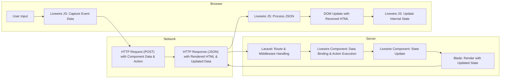

## Project Design Document: Livewire (Improved)

**1. Introduction**

This document provides a detailed architectural overview of the Livewire framework (as represented by the repository at https://github.com/livewire/livewire), specifically for threat modeling purposes. It details the key components, data flows, and interactions within the Livewire ecosystem, emphasizing areas relevant to security considerations and potential vulnerabilities.

**2. Project Overview**

Livewire is a full-stack framework for Laravel that enables the creation of dynamic, reactive user interfaces using PHP. It allows developers to build interactive components with Blade templates and corresponding PHP classes, facilitating seamless communication between the browser and the server without extensive JavaScript coding.

**3. Architecture Overview**

Livewire operates on a request-response lifecycle, heavily utilizing asynchronous communication. The following diagram illustrates the high-level architecture:

```mermaid
graph LR
    subgraph "Browser (Client-Side)"
        A["User Interaction"] --> B("Livewire JavaScript Handler");
        B --> C("HTTP Request (XHR/Fetch)");
    end

    subgraph "Server-Side (Laravel Application)"
        C --> D["Laravel Router & Middleware"];
        D --> E["Livewire Endpoint"];
        E --> F["Livewire Component Instance"];
        F --> G["Component Logic & Data Mutation"];
        G --> H["Blade Template Rendering"];
        H --> I["Livewire Response (JSON Payload)"];
    end

    subgraph "Browser (Client-Side)"
        I --> J["Livewire JavaScript Processor"];
        J --> K["DOM Update"];
    end
```

**4. Detailed Component Interaction**

A typical Livewire interaction unfolds as follows:

1. **User Initiates Action:** A user interacts with a UI element (e.g., button click, input change) within a Livewire component's rendered HTML.
2. **JavaScript Event Handling:** The Livewire JavaScript library, attached to the page, intercepts this DOM event based on `wire:` directives.
3. **Asynchronous Request:** The JavaScript sends an asynchronous HTTP request (typically a POST request via XHR or Fetch) to the Laravel application. This request includes:
    *   The target Livewire component's identifier.
    *   The name of the action (method) to be executed on the component.
    *   Any parameters associated with the action.
    *   The current state of the component's public properties (for data binding).
4. **Laravel Routing and Middleware:** The Laravel router receives the request and routes it to the designated Livewire endpoint. Laravel middleware (including CSRF protection) is applied.
5. **Livewire Endpoint Handling:** The Livewire endpoint identifies the target component instance.
6. **Component Action Execution:** The specified action method on the Livewire component is executed. This may involve:
    *   Updating the component's public properties based on the request data.
    *   Performing business logic, including database interactions.
    *   Triggering events that can be listened to by other components.
7. **Component Re-rendering:** After the action is executed, the Livewire component re-renders its associated Blade template. This rendering process uses the component's current state (including any updated properties).
8. **JSON Response Generation:** Livewire constructs a JSON response containing:
    *   The rendered HTML for the component (or parts of it).
    *   The updated values of the component's public properties.
    *   Any dispatched browser events.
    *   Potentially other metadata.
9. **Client-Side Response Processing:** The Livewire JavaScript receives the JSON response.
10. **DOM Update:** The JavaScript intelligently patches the DOM, updating only the parts of the UI that have changed based on the received HTML. It also updates its internal representation of the component's state with the new property values.

**5. Key Components**

*   **Livewire Components (PHP Classes):** These are PHP classes extending `Livewire\Component`. They encapsulate the server-side logic and data for a specific UI element or section.
    *   **Security Relevance:** Public properties are directly exposed to the client-side and can be manipulated via requests. Proper input validation and sanitization within component methods are crucial. Mass assignment vulnerabilities are a concern if not handled carefully.
*   **Blade Templates:** Standard Laravel Blade templates used to define the HTML structure of Livewire components. `wire:` directives facilitate data binding and event handling.
    *   **Security Relevance:**  Vulnerable to Cross-Site Scripting (XSS) if user-provided data is not properly escaped when rendered.
*   **Livewire JavaScript (`Livewire.js`):** The client-side JavaScript library responsible for intercepting events, sending requests, and updating the DOM.
    *   **Security Relevance:**  A potential target for manipulation or injection. Vulnerabilities in this library could have significant security implications. Responsible for handling sensitive data in transit and during DOM manipulation.
*   **Laravel Router and Middleware:** Standard Laravel mechanisms for handling HTTP requests. Middleware provides essential security features like CSRF protection.
    *   **Security Relevance:**  Properly configured middleware is essential for preventing common web attacks. Ensuring Livewire routes are protected by appropriate middleware is critical.
*   **HTTP Requests (XHR/Fetch):** The communication channel between the browser and the server.
    *   **Security Relevance:**  Susceptible to interception if not transmitted over HTTPS. The content of the requests (including component state and action parameters) needs to be treated as potentially sensitive.
*   **JSON Responses:** The format used for communication from the server back to the client.
    *   **Security Relevance:**  Should not contain sensitive information that the client is not authorized to see.

**6. Data Flow**

The flow of data within a Livewire application involves both client-initiated requests and server-driven responses:

**Detailed Data Flow Points with Security Considerations:**

*   **User Input to JavaScript:** User input is captured by the Livewire JavaScript. **Security:** Ensure client-side validation is in place, but never rely on it solely.
*   **JavaScript to Server (Request):**  The JavaScript sends an HTTP request containing component data and the intended action. **Security:** This request can be intercepted. Ensure sensitive data is not exposed unnecessarily. CSRF protection is vital here.
*   **Server-Side Processing:** Laravel routes the request, and Livewire binds the request data to the component's public properties. **Security:**  Validate and sanitize all incoming data to prevent mass assignment vulnerabilities and other injection attacks.
*   **Component Action Execution:** The specified method on the component is executed. **Security:** Implement proper authorization checks within these methods to ensure users can only perform actions they are permitted to.
*   **Blade Rendering:** The component re-renders its Blade template. **Security:** Sanitize data before displaying it in the template to prevent XSS vulnerabilities. Use Blade's escaping mechanisms.
*   **Server to JavaScript (Response):** The server sends a JSON response containing the updated HTML and component data. **Security:** Avoid including sensitive information in the response that the client doesn't need. Ensure the response is served over HTTPS.
*   **JavaScript Processing and DOM Update:** The JavaScript processes the JSON and updates the DOM. **Security:** Be cautious when manipulating the DOM based on server responses. Ensure the Livewire JavaScript library itself is secure and up-to-date.

**7. Security Considerations (Detailed)**

Based on the architecture and data flow, the following security considerations are paramount for Livewire applications:

*   **Cross-Site Scripting (XSS):**
    *   **Blade Template Escaping:**  Ensure all user-provided data rendered in Blade templates is properly escaped using `{{ }}` or `{{-- --}}` comments for unescaped output only when absolutely necessary and with extreme caution.
    *   **Client-Side DOM Manipulation:** While Livewire handles much of the DOM manipulation, be mindful of any custom JavaScript interacting with Livewire components that could introduce XSS vulnerabilities.
*   **Cross-Site Request Forgery (CSRF):**
    *   **Laravel's CSRF Protection:** Leverage Laravel's built-in CSRF protection mechanisms. Ensure the `@csrf` directive is present in forms that trigger Livewire updates via POST requests. Livewire automatically includes the CSRF token in its requests.
*   **Mass Assignment Vulnerabilities:**
    *   **Component Property Protection:** Use `$fillable` or `$guarded` properties on Livewire components to control which properties can be mass-assigned via user input.
    *   **Explicit Data Handling:**  In component methods, explicitly handle and validate user input instead of directly assigning request data to properties without scrutiny.
*   **Insecure Direct Object References (IDOR):**
    *   **Authorization Checks:** Implement robust authorization checks within Livewire component methods that operate on specific resources (e.g., database records identified by IDs). Use policies or other authorization mechanisms.
*   **Data Exposure:**
    *   **Minimize Data in Responses:** Avoid including sensitive data in the JSON responses sent to the client unless absolutely necessary.
    *   **Secure Transmission:** Ensure all communication between the client and server occurs over HTTPS to prevent eavesdropping.
*   **Denial of Service (DoS):**
    *   **Rate Limiting:** Implement rate limiting on Livewire endpoints to prevent abuse through excessive requests.
    *   **Resource Management:** Be mindful of resource-intensive operations within Livewire components that could be exploited to cause DoS.
*   **JavaScript Security:**
    *   **Library Updates:** Keep the Livewire JavaScript library updated to patch any known security vulnerabilities.
    *   **Dependency Management:**  Ensure the security of any third-party JavaScript libraries used in conjunction with Livewire.
*   **State Management Security:**
    *   **Tampering Prevention:** While Livewire manages state, be aware that client-side state can potentially be manipulated. Do not rely solely on client-side state for security decisions.
    *   **Server-Side Verification:** Always verify critical state changes on the server-side.
*   **Third-Party Dependencies:**
    *   **Vulnerability Scanning:** Regularly scan Livewire's PHP and JavaScript dependencies for known vulnerabilities.

**8. Assumptions and Constraints**

*   This design document focuses on the core architectural principles of Livewire as found in the provided repository. Specific application implementations might introduce additional complexities.
*   It is assumed that the underlying Laravel application adheres to general security best practices, including secure coding principles and proper configuration.
*   The threat modeling exercise utilizing this document will delve into specific attack vectors and mitigation strategies based on the identified components and data flows.

**9. Conclusion**

This improved design document provides a more detailed and security-focused architectural overview of the Livewire framework. It highlights key components, data flows, and potential security considerations, serving as a solid foundation for effective threat modeling. By understanding these aspects, developers and security professionals can better identify and mitigate potential risks associated with building applications using Livewire.