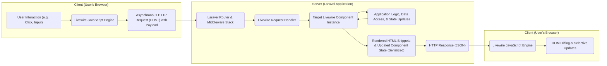

# Project Design Document: Livewire

**Version:** 1.1
**Date:** October 26, 2023
**Author:** AI Software Architect

## 1. Introduction

This document provides an enhanced and detailed architectural design for the Livewire project, a full-stack framework for Laravel that enables the creation of dynamic, reactive user interfaces using primarily PHP. This document is specifically crafted to serve as a comprehensive resource for threat modeling, outlining the system's components, their interactions, and the flow of data with a focus on potential security implications. It is intended for developers, security analysts, and anyone involved in the security assessment of applications built with Livewire.

## 2. Goals and Objectives

*   Provide a clear and comprehensive architectural blueprint of the Livewire framework.
*   Precisely identify the core components of Livewire and delineate their specific responsibilities within the system.
*   Illustrate the complete lifecycle of a user interaction, detailing the data flow between the client-side and server-side components.
*   Proactively highlight potential security vulnerabilities and attack vectors inherent in Livewire's design, facilitating effective threat modeling.
*   Serve as a definitive reference document for understanding Livewire's internal workings, aiding in development, debugging, and security analysis.

## 3. System Architecture

Livewire employs a client-server architecture, tightly integrated with the Laravel backend, to deliver reactive user interfaces. The framework leverages AJAX for asynchronous communication, enabling partial page updates without full reloads.

### 3.1. High-Level Architecture

### 3.2. Detailed Architecture

The following list provides a detailed breakdown of the key components and their interactions during a typical Livewire request cycle:

*   **User Interaction (e.g., Click, Input):** The user initiates an action within the web page, such as clicking a button, typing in an input field, or submitting a form element that is part of a Livewire component.
*   **Livewire JavaScript Engine (Frontend):**
    *   Listens for specific DOM events on elements associated with Livewire components (identified by specific attributes).
    *   Intercepts these events, preventing the browser's default behavior (e.g., full form submission).
    *   Gathers relevant data, including the event type, target element, and the current state of the Livewire component's public properties.
    *   Constructs an asynchronous HTTP POST request to a designated Livewire endpoint on the server. The request payload typically includes:
        *   The component's unique identifier.
        *   The name of the event that triggered the request.
        *   Parameters associated with the event.
        *   The current serialized state of the component's public properties.
        *   A signature or checksum for integrity verification.
*   **Asynchronous HTTP Request (POST) with Payload:** A standard AJAX request is sent to the server. The use of POST is common for sending data updates. The payload format is typically JSON.
*   **Laravel Router & Middleware Stack:** The incoming HTTP request is first processed by Laravel's routing system. Standard Laravel middleware, including CSRF protection, session handling, and potentially custom middleware, are executed.
*   **Livewire Request Handler (Server-side):**
    *   A dedicated component within Livewire that receives and processes incoming Livewire requests.
    *   Identifies the target Livewire component instance based on the component ID included in the request payload.
    *   Performs security checks, such as verifying the request signature.
    *   Deserializes the component's state from the request payload.
    *   Locates and executes the appropriate method on the Livewire component instance based on the event name.
*   **Target Livewire Component Instance (PHP):**
    *   A PHP class extending `Livewire\Component`, representing a specific UI element with its associated data and logic.
    *   Holds the component's state in its public properties.
    *   Contains methods that are invoked in response to client-side events.
    *   Interacts with the application's business logic, data models, and other backend services.
    *   Triggers re-rendering of its associated Blade template when its state changes.
*   **Application Logic, Data Access, & State Updates:** This represents the execution of the Livewire component's methods, which may involve:
    *   Updating the component's public properties.
    *   Interacting with Eloquent models to fetch or persist data in the database.
    *   Calling other services or business logic within the Laravel application.
*   **Rendered HTML Snippets & Updated Component State (Serialized):**
    *   After the component's logic is executed, Livewire re-renders the component's Blade template.
    *   Livewire efficiently identifies the changes in the rendered HTML compared to the previous version.
    *   The updated HTML snippets (representing the changes) are prepared for transmission back to the client.
    *   The current state of the component's public properties is serialized (typically to JSON).
*   **HTTP Response (JSON):** The server sends an HTTP response back to the client. The response body is typically a JSON object containing:
    *   The updated HTML for the component (or just the changed parts).
    *   The serialized state of the component's public properties.
    *   Potentially other metadata used by Livewire for internal operations.
*   **Livewire JavaScript Engine (Frontend):**
    *   Receives the HTTP response from the server.
    *   Deserializes the component's state from the JSON response.
    *   Applies the received HTML updates to the DOM using an efficient diffing algorithm, updating only the necessary parts of the page.
    *   Updates the client-side representation of the component's state.
*   **DOM Diffing & Selective Updates:** Livewire's JavaScript engine compares the newly received HTML with the existing DOM structure and applies only the necessary changes, minimizing DOM manipulations and improving performance.

## 4. Component Breakdown

This section details the key logical components within the Livewire framework and their specific roles.

*   **Livewire Core (PHP):**
    *   **Request Handling:**  Manages the processing of incoming AJAX requests from the client.
    *   **Component Lifecycle Management:**  Handles the instantiation, hydration (state restoration), and dehydration (state serialization) of Livewire components.
    *   **Rendering Engine:**  Orchestrates the rendering of Livewire component views and the efficient extraction of HTML updates.
    *   **State Management (Server-side):**  Stores and manages the state of Livewire components on the server between requests.
    *   **Security Features:** Implements security measures like request signature verification.
*   **Livewire JavaScript Engine (Frontend):**
    *   **Event Listener and Interceptor:**  Attaches event listeners to Livewire components and intercepts relevant DOM events.
    *   **Request Builder:**  Constructs and sends AJAX requests to the server with the necessary payload.
    *   **Response Processor:**  Parses the server's response, extracts updated HTML and component state.
    *   **DOM Diffing and Updater:**  Compares the new and old HTML and efficiently updates the DOM.
    *   **State Management (Client-side):**  Maintains a client-side representation of the component's state.
*   **Wire Protocol:**
    *   **Data Serialization Format:** Defines the structure and format (typically JSON) of the data exchanged between the client and server. This includes:
        *   Event names and parameters.
        *   Component property updates (including data types).
        *   Component ID and name for identification.
        *   Security tokens or signatures for request integrity.
        *   Checksums or hashes for data verification.
*   **Component Class (User-Defined PHP):**
    *   **State Definition:**  Defines the component's data through public properties. These properties are reactive and their changes trigger updates.
    *   **Event Handlers:**  Contains public methods that are invoked in response to events dispatched from the client-side.
    *   **Rendering Logic:**  Renders a Blade template to generate the component's HTML structure.
    *   **Business Logic Integration:**  Encapsulates the component's specific logic and interacts with the application's backend.
*   **Blade Templates (with Livewire Directives):**
    *   **Data Binding:**  Uses Livewire-specific directives (e.g., `wire:model`, `wire:click`) to bind data between the component's properties and the HTML, and to attach event listeners.
    *   **Dynamic Rendering:**  Allows for conditional rendering and looping based on the component's state.

## 5. Data Flow

The following outlines the detailed data flow during a typical user interaction with a Livewire component:

1. **Initial Page Load & Component Rendering:** When a page containing a Livewire component is initially requested, the server renders the component's HTML. The initial state of the component's public properties is often embedded within the HTML (e.g., as data attributes or within a `<script>` tag) to hydrate the component on the client-side.
2. **User Initiates an Action:** The user interacts with an element within the Livewire component in the browser (e.g., clicks a button, types in an input field).
3. **Event Captured by Livewire JavaScript:** The Livewire JavaScript engine detects the DOM event based on the `wire:` attributes.
4. **Request Payload Construction:** Livewire JavaScript constructs an AJAX request payload containing:
    *   `id`: The unique identifier of the Livewire component instance.
    *   `event`: The name of the event that occurred (e.g., `click`, `input`).
    *   `params`: An array of parameters associated with the event.
    *   `serverMemo`: A serialized representation of the component's current public properties and potentially other metadata.
    *   `checksum`: A checksum or signature to verify the integrity of the request.
5. **Asynchronous Request Sent to Server:** The AJAX request is sent to the Livewire endpoint on the server.
6. **Request Routing and Middleware Processing:** The Laravel router directs the request to the Livewire controller. Laravel middleware (including CSRF protection) is executed.
7. **Livewire Request Handling:** The Livewire request handler on the server:
    *   Identifies the target component instance using the `id` from the payload.
    *   Verifies the `checksum` to ensure the request hasn't been tampered with.
    *   Deserializes the component's state from `serverMemo`.
    *   Locates and executes the corresponding method on the component based on the `event` name.
8. **Component Logic Execution and State Update:** The component's method is executed. This may involve:
    *   Updating the component's public properties.
    *   Interacting with the database or other services.
9. **Component Re-rendering:** After the method execution, Livewire re-renders the component's Blade template.
10. **Response Payload Construction:** The server constructs a JSON response containing:
    *   `effects`: An object containing instructions for the client, such as DOM updates.
        *   `html`: The updated HTML for the component (or just the diff).
    *   `serverMemo`: The serialized state of the component's public properties after the update.
    *   `redirect`: A URL to redirect the browser to (if a redirect was triggered).
    *   `emit`: Events to be dispatched on the client-side.
11. **Response Sent to Client:** The HTTP response (JSON) is sent back to the browser.
12. **Response Processing by Livewire JavaScript:** The Livewire JavaScript engine receives the response and:
    *   Updates the DOM using the `html` from the `effects`.
    *   Updates the client-side representation of the component's state using the `serverMemo`.
    *   Performs any other actions specified in the `effects` (e.g., redirects, dispatches client-side events).

## 6. Security Considerations (For Threat Modeling)

This section expands on potential security concerns, providing more context specific to Livewire's architecture.

*   **Cross-Site Scripting (XSS):**
    *   **Server-Side Rendering:** If user-provided data is not properly sanitized *before* being passed to the Blade template for rendering, it can lead to XSS vulnerabilities when the HTML is sent to the client.
    *   **Client-Side DOM Updates:** While Livewire handles DOM updates, vulnerabilities could arise if the diffing process or the application of updates introduces unsanitized content.
    *   **Third-Party Libraries:**  Ensure any third-party JavaScript libraries used within Livewire components are also free from XSS vulnerabilities.
*   **Cross-Site Request Forgery (CSRF):**
    *   **Laravel's CSRF Protection:** Livewire relies on Laravel's built-in CSRF protection. Ensure that all Livewire AJAX requests correctly include the CSRF token.
    *   **Stateless Components:** Be mindful of how CSRF tokens are handled if you are implementing stateless Livewire components or custom request handling.
*   **Insecure Direct Object References (IDOR):**
    *   **Component IDs:** If component IDs are predictable or sequential, attackers might try to manipulate requests targeting other components. Livewire generates unique IDs, but ensure your application logic doesn't inadvertently expose or rely on predictable identifiers.
    *   **Data Access within Components:** Ensure that Livewire components properly authorize data access based on the authenticated user and prevent access to resources they shouldn't have.
*   **Mass Assignment Vulnerabilities:**
    *   **Public Properties:**  Livewire automatically binds data from requests to public properties. Use Laravel's `$fillable` or `$guarded` properties on your models to prevent unintended modification of database fields. Be cautious about making database model properties directly public in your Livewire components.
*   **Data Serialization/Deserialization Vulnerabilities:**
    *   **State Tampering:** Attackers might attempt to manipulate the serialized component state in transit between the client and server. Livewire uses checksums to mitigate this, but ensure these mechanisms are robust and not bypassed.
    *   **Deserialization Gadgets:** While less likely in typical Livewire usage, be aware of potential vulnerabilities if custom serialization/deserialization logic is introduced.
*   **Denial of Service (DoS):**
    *   **Resource Exhaustion:**  Malicious actors could send a large number of requests to specific Livewire endpoints to overload the server. Implement rate limiting and other DoS prevention measures.
    *   **Complex Rendering:**  Components with very complex rendering logic or large datasets could be targeted for DoS attacks by triggering frequent updates.
*   **Authentication and Authorization:**
    *   **Component-Level Authorization:**  Implement authorization checks within your Livewire component methods to ensure only authorized users can perform specific actions. Don't rely solely on frontend checks.
    *   **Middleware Integration:** Leverage Laravel's middleware to protect routes that handle Livewire requests.
*   **Information Disclosure:**
    *   **Exposed Data in HTML:** Be careful not to inadvertently include sensitive information in the HTML rendered by Livewire components.
    *   **State Leakage:** Ensure that the serialized component state does not contain sensitive data that should not be exposed to the client.
*   **Third-Party Dependencies:**
    *   **JavaScript Libraries:** Regularly audit and update any JavaScript libraries used by Livewire or within your components to address known vulnerabilities.
    *   **PHP Dependencies:** Keep Livewire and its PHP dependencies up to date.
*   **JavaScript Injection/Manipulation:**
    *   **Compromised Frontend:** If an attacker can inject malicious JavaScript into the frontend, they could potentially bypass Livewire's intended behavior and send crafted requests to the server. Implement strong Content Security Policy (CSP) rules.

## 7. Deployment Considerations

*   Livewire integrates seamlessly with standard Laravel deployments.
*   **Server Requirements:** Requires a standard PHP environment compatible with the installed Laravel version. No specific server-side daemons or services are needed beyond a typical web server (e.g., Apache, Nginx) running PHP-FPM.
*   **Frontend Requirements:**  Requires JavaScript to be enabled in the user's browser. Ensure your application gracefully handles cases where JavaScript is disabled.
*   **Security Best Practices:**
    *   **HTTPS:** Always deploy Livewire applications over HTTPS to protect data in transit.
    *   **Regular Updates:** Keep Laravel, Livewire, and all dependencies updated to patch security vulnerabilities.
    *   **Secure Headers:** Implement security-related HTTP headers (e.g., Content Security Policy, HTTP Strict Transport Security, X-Frame-Options).
    *   **Input Validation:**  Thoroughly validate all user input on the server-side within your Livewire components.
    *   **Output Encoding:**  Encode output data properly to prevent XSS vulnerabilities.
    *   **Database Security:** Follow secure database practices to protect your application's data.

## 8. Future Considerations

*   **Improved Performance Monitoring:**  Integrate more robust performance monitoring tools to identify and address potential bottlenecks in Livewire interactions.
*   **Enhanced Security Auditing Tools:** Develop or integrate tools that can automatically scan Livewire components for common security vulnerabilities.
*   **More Granular Control over State Hydration:** Provide developers with more fine-grained control over which parts of the component state are serialized and sent to the client.
*   **Standardized Security Best Practices Documentation:**  Create more comprehensive documentation and guidelines on secure development practices for Livewire applications.

This enhanced design document provides a more detailed and security-focused overview of the Livewire project. It serves as a valuable resource for understanding the framework's architecture and identifying potential areas of concern for threat modeling and security assessments.