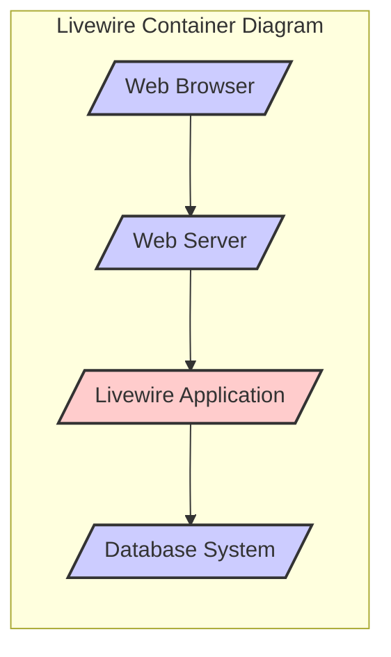
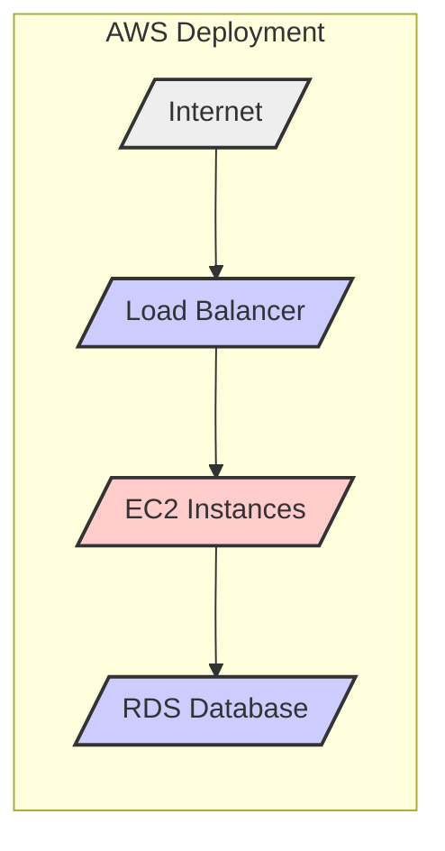

# BUSINESS POSTURE

This project, Livewire, aims to simplify the development of dynamic interfaces using Laravel and PHP. It allows developers to build modern, reactive web applications without extensive JavaScript knowledge, by writing backend code in PHP that interacts with the frontend.

Business priorities for projects using Livewire are likely focused on rapid development and ease of maintenance of web applications. The goal is to deliver interactive user experiences efficiently, leveraging the existing Laravel ecosystem and PHP skills.

The most important business risks associated with Livewire projects revolve around security vulnerabilities that could impact applications built using it. These risks include:

- Web application vulnerabilities (e.g., Cross-Site Scripting (XSS), SQL Injection) in Livewire itself or in applications built with it, potentially leading to data breaches or service disruption.
- Dependency vulnerabilities in Livewire's dependencies, which could be exploited to compromise applications.
- Availability and performance issues if Livewire introduces bottlenecks or inefficiencies in web applications.

# SECURITY POSTURE

Existing security controls for Livewire projects are primarily inherited from the underlying Laravel framework and general web application security best practices.

- security control: Laravel framework's built-in security features, including protection against common web vulnerabilities like CSRF, SQL injection, and XSS. Implemented within the Laravel framework itself.
- security control: Use of HTTPS for secure communication between the browser and the server. Typically configured at the web server or load balancer level.
- security control: Input validation and sanitization provided by Laravel's validation mechanisms and Eloquent ORM. Implemented within Laravel applications using Livewire.
- security control: Authentication and authorization mechanisms provided by Laravel's built-in features like Laravel Sanctum or Passport. Implemented within Laravel applications using Livewire.
- accepted risk: Reliance on community contributions for identifying and addressing security vulnerabilities in Livewire.
- accepted risk: Potential for vulnerabilities in third-party JavaScript dependencies used by Livewire.

Recommended security controls to enhance the security posture of Livewire projects:

- recommended security control: Implement automated Static Application Security Testing (SAST) and Dynamic Application Security Testing (DAST) in the CI/CD pipeline to identify potential vulnerabilities early in the development lifecycle.
- recommended security control: Implement Software Composition Analysis (SCA) to continuously monitor and manage dependencies for known vulnerabilities.
- recommended security control: Conduct regular security audits and penetration testing of applications built with Livewire to identify and remediate security weaknesses.
- recommended security control: Provide security training for developers on secure coding practices for Livewire and Laravel applications, focusing on common web application vulnerabilities and secure component design.

Security requirements for Livewire projects:

- Authentication:
  - Requirement: Securely authenticate users accessing applications built with Livewire.
  - Requirement: Implement multi-factor authentication (MFA) for sensitive applications or user roles.
  - Requirement: Protect authentication credentials in transit and at rest.
- Authorization:
  - Requirement: Implement role-based access control (RBAC) to restrict access to application features and data based on user roles.
  - Requirement: Enforce authorization checks at the component and data level to prevent unauthorized access.
  - Requirement: Regularly review and update authorization policies.
- Input Validation:
  - Requirement: Validate all user inputs on both the client-side and server-side to prevent injection attacks and data integrity issues.
  - Requirement: Sanitize user inputs before displaying them to prevent XSS vulnerabilities.
  - Requirement: Use Laravel's validation features and Livewire's form handling capabilities to enforce input validation rules.
- Cryptography:
  - Requirement: Use strong encryption algorithms and protocols for protecting sensitive data in transit and at rest.
  - Requirement: Securely manage cryptographic keys and secrets.
  - Requirement: Leverage Laravel's encryption features for data at rest encryption where necessary.

# DESIGN

## C4 CONTEXT

```mermaid
flowchart LR
    subgraph "Livewire Project Context"
        center "Livewire Project"
    end

    User[/"Web Developer"/] --> center
    Laravel[/"Laravel Framework"/] --> center
    Browser[/"Web Browser"/] --> center
    Database[/"Database System"/] --> center

    style center fill:#f9f,stroke:#333,stroke-width:2px
```

- Name: Web Developer
  - Type: Person
  - Description: Developers who use Livewire to build web applications.
  - Responsibilities: Develop and maintain web applications using Livewire, ensuring secure coding practices.
  - Security controls: Secure development environment, code review processes, security training.

- Name: Laravel Framework
  - Type: Software System
  - Description: The underlying PHP framework that Livewire is built upon and integrates with. Provides core functionalities like routing, ORM, and security features.
  - Responsibilities: Provide a secure and robust foundation for Livewire applications, handle request routing, database interactions, and core security mechanisms.
  - Security controls: Laravel's built-in security features (CSRF protection, input sanitization, etc.), regular security updates, community security audits.

- Name: Web Browser
  - Type: Software System
  - Description: The client-side application used by end-users to access and interact with web applications built with Livewire.
  - Responsibilities: Render the user interface, execute JavaScript code, and communicate with the server.
  - Security controls: Browser security features (Content Security Policy, Same-Origin Policy), user awareness of phishing and malicious websites.

- Name: Database System
  - Type: Software System
  - Description: Persistent storage for application data used by Livewire applications. Could be relational databases (MySQL, PostgreSQL) or NoSQL databases.
  - Responsibilities: Store and retrieve application data securely and reliably.
  - Security controls: Database access controls, encryption at rest, regular backups, vulnerability patching.

## C4 CONTAINER



- Name: Web Browser
  - Type: Container
  - Description: User's web browser, responsible for rendering the user interface and interacting with the Livewire application.
  - Responsibilities: Display the application UI, execute JavaScript for Livewire interactivity, send HTTP requests to the web server.
  - Security controls: Browser security features (CSP, SOP), user-side input validation (JavaScript).

- Name: Web Server
  - Type: Container
  - Description: Web server (e.g., Nginx, Apache) that handles incoming HTTP requests and serves the Livewire application.
  - Responsibilities: Receive HTTP requests, serve static assets, proxy requests to the PHP application server, handle SSL/TLS termination.
  - Security controls: Web server hardening, access control lists, DDoS protection, TLS configuration.

- Name: Livewire Application
  - Type: Container
  - Description: The PHP application built using the Laravel framework and Livewire package. Contains the application logic, Livewire components, and interacts with the database.
  - Responsibilities: Handle application logic, render Livewire components, process user requests, interact with the database, implement business logic and security controls.
  - Security controls: Laravel's security features, input validation, authorization logic, secure coding practices, dependency management, session management.

- Name: Database System
  - Type: Container
  - Description: Database system used by the Livewire application to store and retrieve data.
  - Responsibilities: Persist application data, provide data access to the Livewire application, ensure data integrity and availability.
  - Security controls: Database access controls, encryption at rest, regular backups, database hardening, vulnerability patching, audit logging.

## DEPLOYMENT

Deployment Solution: Cloud-based deployment using a platform like AWS Elastic Beanstalk. This provides scalability, managed infrastructure, and various security features.



- Name: Internet
  - Type: Environment
  - Description: Public internet, the external network through which users access the application.
  - Responsibilities: Provide connectivity for users to reach the application.
  - Security controls: DDoS protection at the edge, network firewalls.

- Name: Load Balancer (AWS ELB)
  - Type: Infrastructure
  - Description: AWS Elastic Load Balancer distributing traffic across multiple EC2 instances.
  - Responsibilities: Distribute incoming traffic, provide high availability, SSL/TLS termination, health checks.
  - Security controls: SSL/TLS encryption, security groups, access logs, DDoS protection.

- Name: EC2 Instances
  - Type: Infrastructure
  - Description: AWS EC2 instances running the Livewire application (web server and PHP application).
  - Responsibilities: Host the Livewire application, process requests, serve content.
  - Security controls: Security groups, instance hardening, regular patching, intrusion detection systems, access management (IAM roles).

- Name: RDS Database (AWS RDS)
  - Type: Infrastructure
  - Description: AWS Relational Database Service (RDS) hosting the application database.
  - Responsibilities: Store and manage application data, provide database services.
  - Security controls: Database access controls, encryption at rest and in transit, regular backups, database monitoring, security groups, VPC isolation.

## BUILD

```mermaid
flowchart LR
    Developer[/"Developer"/] --> CodeRepository[/"Code Repository (GitHub)"/]
    CodeRepository --> CI[/"CI System (GitHub Actions)"/]
    CI --> BuildArtifacts[/"Build Artifacts"/]

    subgraph "CI System (GitHub Actions)"
        direction TB
        Checkout[/"Checkout Code"/]
        Dependencies[/"Install Dependencies (Composer)"/]
        Linting[/"Linting & SAST"/]
        Testing[/"Unit & Integration Tests"/]
        Build[/"Build Application"/]
        Publish[/"Publish Artifacts"/]
    end
    CI --> Checkout --> Dependencies --> Linting --> Testing --> Build --> Publish --> BuildArtifacts

    style Developer fill:#ccf,stroke:#333,stroke-width:2px
    style CodeRepository fill:#ccf,stroke:#333,stroke-width:2px
    style CI fill:#fcc,stroke:#333,stroke-width:2px
    style BuildArtifacts fill:#ccf,stroke:#333,stroke-width:2px
    style Checkout fill:#eee,stroke:#333,stroke-width:2px
    style Dependencies fill:#eee,stroke:#333,stroke-width:2px
    style Linting fill:#eee,stroke:#333,stroke-width:2px
    style Testing fill:#eee,stroke:#333,stroke-width:2px
    style Build fill:#eee,stroke:#333,stroke-width:2px
    style Publish fill:#eee,stroke:#333,stroke-width:2px
```



- Name: Developer
  - Type: Person
  - Description: Software developer writing and committing code for the Livewire project.
  - Responsibilities: Write code, perform local testing, commit code to the repository.
  - Security controls: Secure development workstation, code review participation, security training.

- Name: Code Repository (GitHub)
  - Type: System
  - Description: GitHub repository hosting the source code of the Livewire project.
  - Responsibilities: Version control, code storage, collaboration platform.
  - Security controls: Access controls (branch protection, permissions), audit logs, vulnerability scanning (GitHub Dependabot), secret scanning.

- Name: CI System (GitHub Actions)
  - Type: System
  - Description: GitHub Actions used for automated build, testing, and publishing of the Livewire project.
  - Responsibilities: Automate build process, run tests, perform security checks, create build artifacts.
  - Security controls: Secure CI/CD pipeline configuration, secret management, access controls, audit logs.

- Name: Checkout Code
  - Type: Build Step
  - Description: Step in CI pipeline to checkout the code from the repository.
  - Responsibilities: Retrieve the latest code version for building.
  - Security controls: Access control to the repository.

- Name: Install Dependencies (Composer)
  - Type: Build Step
  - Description: Step in CI pipeline to install PHP dependencies using Composer.
  - Responsibilities: Manage project dependencies, ensure consistent build environment.
  - Security controls: Dependency vulnerability scanning (using `composer audit`), integrity checks of downloaded packages.

- Name: Linting & SAST
  - Type: Build Step
  - Description: Step in CI pipeline to perform code linting and Static Application Security Testing (SAST).
  - Responsibilities: Identify code quality issues and potential security vulnerabilities in the source code.
  - Security controls: SAST tools integration, configured security rules, fail build on critical findings.

- Name: Testing (Unit & Integration Tests)
  - Type: Build Step
  - Description: Step in CI pipeline to run unit and integration tests.
  - Responsibilities: Ensure code functionality and prevent regressions.
  - Security controls: Secure test environment, test coverage for security-relevant functionalities.

- Name: Build Application
  - Type: Build Step
  - Description: Step in CI pipeline to build the application artifacts (e.g., compiled assets, packaged application).
  - Responsibilities: Prepare application for deployment.
  - Security controls: Secure build process, minimize build artifacts exposure.

- Name: Publish Artifacts
  - Type: Build Step
  - Description: Step in CI pipeline to publish build artifacts (e.g., to a package registry, deployment environment).
  - Responsibilities: Make build artifacts available for deployment.
  - Security controls: Secure artifact storage, access controls to artifacts, integrity checks of published artifacts.

- Name: Build Artifacts
  - Type: System
  - Description: Output of the build process, ready for deployment.
  - Responsibilities: Represent deployable version of the application.
  - Security controls: Secure storage of artifacts, access controls, versioning.

# RISK ASSESSMENT

Critical business processes protected by Livewire projects are the functionalities of the web applications built using it. These processes vary depending on the specific application but could include e-commerce transactions, user data management, content delivery, or business-critical workflows.

Data protected by Livewire projects depends on the application. It can range from publicly accessible content to highly sensitive user data (PII, financial information, health records) or confidential business data. The sensitivity of the data directly impacts the potential business impact of a security breach. For applications handling sensitive data, the data sensitivity is high. For applications with public content, the data sensitivity is low. However, even for public content applications, availability and integrity are critical.

# QUESTIONS & ASSUMPTIONS

Questions:

- What is the risk appetite of organizations using Livewire? Is it primarily used by startups with higher risk tolerance or also by larger enterprises with stricter security requirements?
- What are the typical deployment environments for Livewire applications? Cloud, on-premise, hybrid? Are there specific compliance requirements (e.g., PCI DSS, HIPAA) that need to be considered?
- What is the expected level of security expertise of developers using Livewire? Are they expected to be security experts, or should Livewire provide more built-in security features and guidance for less security-focused developers?
- Are there specific types of applications (e.g., e-commerce, dashboards, public websites) that are more commonly built with Livewire, and do these application types have specific security considerations?

Assumptions:

- BUSINESS POSTURE: We assume that projects using Livewire prioritize rapid development and ease of maintenance, but security is still a significant concern, especially for applications handling sensitive data.
- SECURITY POSTURE: We assume that existing security controls are primarily based on Laravel's features and general web security practices. We assume a need for enhanced security controls like SAST/DAST and dependency scanning to proactively identify and mitigate vulnerabilities.
- DESIGN: We assume a cloud-based deployment scenario as a common and scalable option. We assume a standard CI/CD pipeline using GitHub Actions for build automation and security checks.