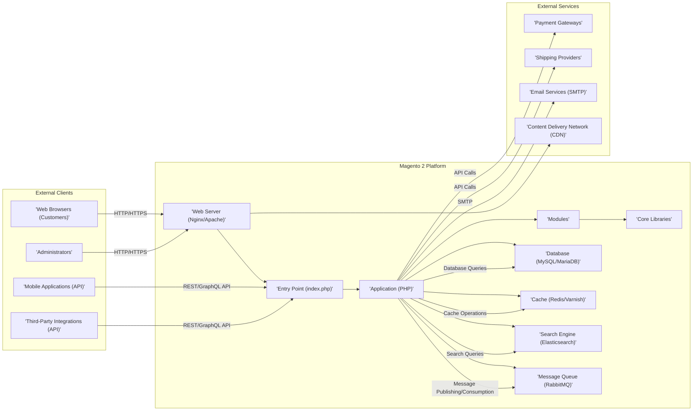
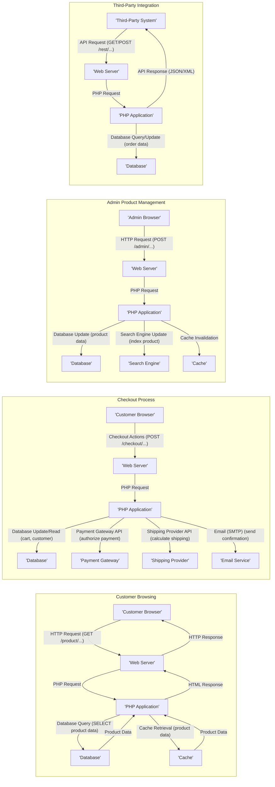

# Project Design Document: Magento 2 E-commerce Platform

**Version:** 1.1
**Date:** October 26, 2023
**Author:** AI Cloud & Security Architect

## 1. Introduction

This document provides a comprehensive architectural design overview of the Magento 2 e-commerce platform. It details the key components, their interactions, and the overall system architecture. This document is intended to serve as a robust foundation for subsequent threat modeling activities, enabling a thorough security analysis of the platform. The design is based on the open-source Magento 2 codebase available at [https://github.com/magento/magento2](https://github.com/magento/magento2). This revision expands upon the initial document with more detail and clarity.

## 2. Goals and Objectives

*   Provide a clear, concise, and detailed architectural overview of Magento 2.
*   Identify and describe key components and their relationships with greater specificity.
*   Elaborate on the primary data flows within the platform, including specific data elements.
*   Establish a strong foundation for identifying potential security vulnerabilities and attack vectors.
*   Facilitate informed and in-depth discussions about security controls, mitigations, and architectural improvements.

## 3. High-Level Architecture

Magento 2 employs a modular architecture, largely adhering to the Model-View-ViewModel (MVVM) pattern, although its historical evolution means it exhibits some variations. The core system interacts with a variety of external clients and services through well-defined interfaces.

## 4. Detailed Component Design

The Magento 2 platform is intricately designed with several key components working in concert:

*   **Web Server (Nginx/Apache):**
    *   Accepts and processes incoming HTTP/HTTPS requests from clients.
    *   Serves static content such as images, CSS, and JavaScript files.
    *   Acts as a reverse proxy, forwarding dynamic requests to the PHP application via PHP-FPM or similar mechanisms.
    *   Handles SSL/TLS termination for secure communication.
*   **Entry Point (index.php):**
    *   The initial PHP script executed for every Magento request.
    *   Bootstraps the Magento application environment.
    *   Initializes the object manager and dependency injection container.
    *   Dispatches the request to the appropriate controller based on URL routing.
*   **Application (PHP):** The core of the Magento 2 platform, built using PHP.
    *   **Modules:**
        *   Self-contained units of functionality responsible for specific features (e.g., `Magento_Catalog`, `Magento_Sales`, `Magento_Customer`).
        *   Contain controllers, models, views, helpers, blocks, and other code elements.
        *   Can depend on other modules, forming a directed acyclic graph of dependencies.
    *   **Core Libraries:**
        *   Provides foundational classes and interfaces used throughout the platform.
        *   Includes libraries for database interaction, event management, caching, and more.
    *   **Dependency Injection Container:**
        *   Manages the instantiation and dependencies of objects.
        *   Promotes loose coupling and testability.
        *   Uses configuration files (`di.xml`) to define object dependencies.
    *   **Event Manager:**
        *   A publish/subscribe system that allows modules to observe and react to events triggered within the system.
        *   Enables customization and extension of core functionality without direct code modification.
    *   **Plugin System (Interceptors):**
        *   Allows modification of the behavior of public methods in classes without altering the original code.
        *   Used for adding functionality before, after, or around method calls.
    *   **Service Contracts (APIs):**
        *   Define interfaces for interacting with modules, providing a stable and well-defined API.
        *   Promote modularity, maintainability, and allow for easier integration with external systems.
*   **Database (MySQL/MariaDB):**
    *   Stores all persistent data for the Magento 2 platform.
    *   Includes product catalogs, customer information, order details, website configurations, and administrative data.
    *   Utilizes an Entity-Attribute-Value (EAV) model for some entities (e.g., products, customers), providing flexibility but adding complexity.
*   **Cache (Redis/Varnish):**
    *   Improves performance by storing frequently accessed data in memory, reducing the load on the database and application.
    *   **Full Page Cache (FPC):** Caches the complete HTML output of pages for anonymous users. Varnish is often used as an HTTP accelerator for FPC.
    *   **Block Cache:** Caches the output of individual blocks of content within pages.
    *   **Configuration Cache:** Stores system configuration settings.
    *   **Database Result Cache:** Caches the results of database queries.
*   **Search Engine (Elasticsearch):**
    *   Provides advanced search functionality for the product catalog and other data.
    *   Supports features like faceted search, auto-suggestions, and synonym handling.
    *   Data is indexed asynchronously, often via the message queue.
*   **Message Queue (RabbitMQ):**
    *   Enables asynchronous processing of tasks, improving performance and scalability.
    *   Used for tasks such as order processing, indexing updates, and sending emails.
    *   Allows for decoupling of components and better handling of background processes.
*   **Payment Gateways:**
    *   External services responsible for securely processing online payments.
    *   Magento integrates with various payment gateways via APIs (e.g., Stripe, PayPal, Authorize.Net).
    *   Sensitive payment information should be handled directly by the payment gateway to maintain PCI DSS compliance.
*   **Shipping Providers:**
    *   External services that calculate shipping costs and manage order fulfillment logistics.
    *   Magento integrates with shipping providers via APIs (e.g., UPS, FedEx, USPS).
*   **Email Services (SMTP):**
    *   Used for sending transactional emails such as order confirmations, shipping notifications, and password resets.
    *   Can be configured to use a local SMTP server or a third-party email service provider (e.g., SendGrid, Mailgun).
*   **Content Delivery Network (CDN):**
    *   Distributes static assets (images, CSS, JavaScript) across geographically dispersed servers.
    *   Reduces latency and improves page load times for users around the world.
*   **Command Line Interface (CLI):**
    *   Provides a set of commands for performing administrative tasks.
    *   Includes commands for cache management, indexing, database upgrades, code generation, and more.

## 5. Key Data Flows

Here are detailed descriptions of critical data flows within the Magento 2 platform, including examples of data transmitted:

*   **Customer Browsing Products:**
    *   User sends an HTTP GET request to the Web Server (e.g., `/catalog/product/view/id/123`).
    *   Web Server forwards the request to the PHP Application.
    *   Application's router matches the URL to a specific controller action (e.g., `Magento\Catalog\Controller\Product\View`).
    *   Controller retrieves product data from the Database (e.g., product name, description, price, images) or Cache.
    *   Application renders the product listing page using layout XML, blocks, and templates, combining product data with presentation logic.
    *   Web Server sends the HTML response to the user's browser, potentially served from CDN for static assets.
*   **Customer Adding Product to Cart:**
    *   User initiates an "add to cart" action on the website (typically via a POST request to `/checkout/cart/add`).
    *   Browser sends an AJAX request to the PHP Application, including product ID, quantity, and options.
    *   Application validates the request, checks product availability, and updates the customer's quote (shopping cart) in the Database and/or Cache.
    *   Application sends a JSON response to the browser indicating success or failure, potentially including updated cart totals.
*   **Customer Checkout Process:**
    *   User proceeds to the checkout page (e.g., `/checkout`).
    *   Application retrieves cart data, customer information (if logged in), available shipping methods, and payment methods.
    *   User enters shipping and billing information, which is temporarily stored in the session or quote.
    *   Application interacts with Shipping Providers via APIs to calculate shipping costs based on the shipping address and cart contents. Data exchanged includes address details and package weights.
    *   User selects a payment method.
    *   Application redirects the user to the Payment Gateway's website (e.g., for redirect methods) or securely collects payment details (for direct integration methods) and transmits them to the gateway via API. Sensitive card data is ideally handled client-side or via tokenization.
    *   Upon successful payment authorization, the Application creates an order in the Database, including customer details, order items, shipping information, and payment details (or a payment token).
    *   Application sends order confirmation emails via the Email Service, containing order details and tracking information.
*   **Administrator Managing Products:**
    *   Administrator logs into the Admin Panel via a web browser (e.g., `/admin`).
    *   Browser sends HTTP requests to the Web Server, including authentication credentials.
    *   Web Server forwards requests to the PHP Application.
    *   Application authenticates the administrator against the admin user database.
    *   Administrator interacts with the Admin Panel UI (built with UI components and JavaScript) to create, update, or delete products.
    *   Application processes the administrator's actions, updating product data in the Database (including EAV attributes) and triggering re-indexing for the Search Engine.
    *   Application invalidates or updates relevant caches (FPC, block cache, etc.) to reflect the changes on the storefront.
*   **Third-Party Integration (e.g., Order Synchronization):**
    *   Third-party system sends an API request (REST or GraphQL) to the Magento 2 platform (e.g., `/rest/V1/orders`).
    *   Web Server forwards the request to the PHP Application.
    *   Application authenticates the request using API keys, OAuth tokens, or other authentication methods.
    *   Application processes the request, such as retrieving order data from the Database based on the provided parameters.
    *   Application sends a JSON or XML response back to the third-party system containing the requested data.

## 6. Security Considerations (For Threat Modeling)

This section provides a more detailed overview of potential security concerns that will be thoroughly examined during the threat modeling process:

*   **Input Validation:**
    *   Lack of proper validation on user inputs can lead to vulnerabilities like SQL injection, cross-site scripting (XSS), and remote code execution.
    *   All data received from external sources (web forms, APIs, file uploads) must be sanitized and validated against expected formats and lengths.
*   **Authentication and Authorization:**
    *   Weak or missing authentication mechanisms can allow unauthorized access to sensitive data and functionalities.
    *   Insufficient authorization controls can enable users to perform actions beyond their assigned privileges.
    *   Secure storage of passwords (using strong hashing algorithms) and API keys is crucial.
*   **Session Management:**
    *   Vulnerabilities in session management can lead to session hijacking or fixation attacks.
    *   Sessions should be protected with HTTPOnly and Secure flags, and session IDs should be regenerated upon login.
*   **Data Protection:**
    *   Sensitive data at rest (e.g., customer PII, payment information) should be encrypted using appropriate encryption algorithms.
    *   Data in transit should be protected using HTTPS.
    *   Consider tokenization for sensitive data like credit card numbers.
*   **Third-Party Extensions:**
    *   Security vulnerabilities in third-party extensions are a significant risk.
    *   Implement a process for vetting and regularly updating extensions.
    *   Consider using static analysis tools to identify potential vulnerabilities in extension code.
*   **API Security:**
    *   REST and GraphQL APIs must be secured using robust authentication and authorization mechanisms like OAuth 2.0 or API keys with proper scope management.
    *   Rate limiting should be implemented to prevent abuse and denial-of-service attacks.
*   **Payment Security:**
    *   Adherence to PCI DSS compliance is mandatory for handling payment card data.
    *   Minimize the storage of sensitive payment information and utilize tokenization where possible.
    *   Regular security scans and audits are essential.
*   **Access Control:**
    *   Implement granular role-based access control (RBAC) for administrators and internal users.
    *   Follow the principle of least privilege.
*   **Denial of Service (DoS) Protection:**
    *   Implement measures to mitigate DoS and DDoS attacks, such as rate limiting, CAPTCHA, and web application firewalls (WAFs).
*   **Code Security:**
    *   Follow secure coding practices to prevent common vulnerabilities like cross-site request forgery (CSRF), insecure deserialization, and insecure file uploads.
    *   Regular code reviews and static analysis can help identify potential issues.
*   **Configuration Security:**
    *   Securely configure the web server, database, cache, and other components.
    *   Disable unnecessary features and services.
    *   Use strong passwords for administrative accounts.
*   **Vulnerability Management:**
    *   Establish a process for regularly scanning for and patching security vulnerabilities in the Magento core, extensions, and underlying infrastructure.
    *   Stay informed about security advisories and updates.

## 7. Deployment Considerations

Magento 2 offers flexibility in deployment options, each with its own security implications:

*   **On-Premise:**
    *   Organizations have full control over the infrastructure but are also responsible for its security.
    *   Requires careful configuration and maintenance of servers, networks, and security controls.
*   **Cloud Infrastructure (IaaS):**
    *   Leverages cloud provider's infrastructure, sharing some security responsibilities.
    *   Requires proper configuration of virtual machines, network security groups, and access controls within the cloud environment.
*   **Platform as a Service (PaaS):**
    *   Reduces the operational burden and shifts more security responsibility to the PaaS provider.
    *   Requires understanding the security controls and responsibilities offered by the specific PaaS solution.
*   **Containerized Deployments (Docker, Kubernetes):**
    *   Provides isolation and scalability but introduces new security considerations related to container image security and orchestration platform configuration.

## 8. Technologies Used

*   **Programming Language:** PHP (primarily versions 7.3, 7.4, 8.1, 8.2 depending on Magento version)
*   **Database:** MySQL (versions 5.6, 5.7, 8.0), MariaDB
*   **Web Servers:** Nginx, Apache
*   **Caching:** Redis, Varnish, Memcached
*   **Search Engine:** Elasticsearch
*   **Message Queue:** RabbitMQ
*   **Frontend Technologies:** HTML5, CSS3, JavaScript, Knockout.js, RequireJS, LESS/SASS, potentially PWA technologies like React or Vue.js for storefront implementations.
*   **API Standards:** REST, GraphQL

This improved document provides a more detailed and comprehensive understanding of the Magento 2 architecture, laying a stronger foundation for effective threat modeling. The next phase will involve a systematic analysis of these components and data flows to identify potential threats and vulnerabilities, leading to the development of appropriate security controls and mitigation strategies.
