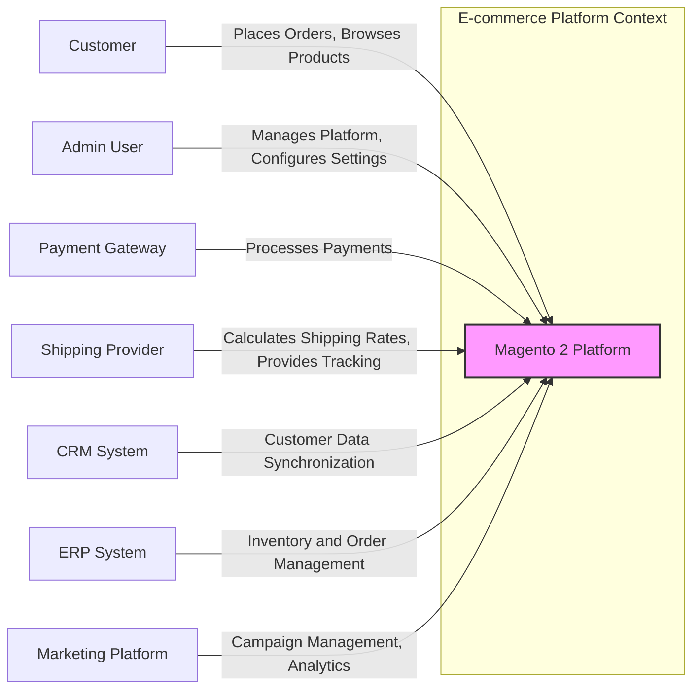
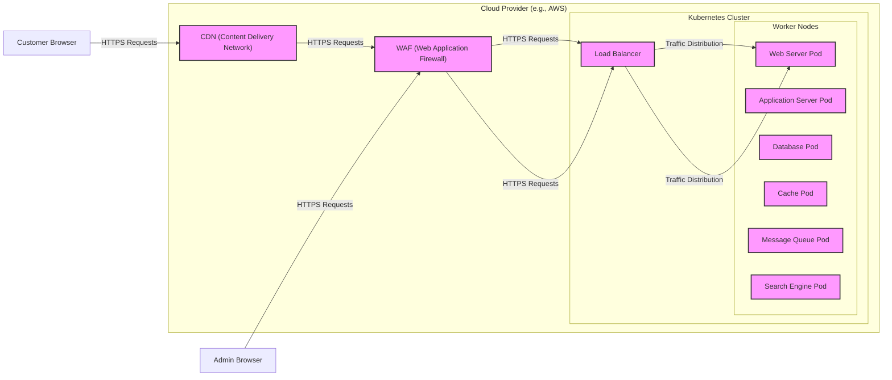

# BUSINESS POSTURE

Magento 2 is a leading open-source e-commerce platform designed to provide businesses with a flexible and scalable solution for online sales.

- Business Priorities:
  - Scalability: Handle high volumes of traffic and transactions, especially during peak seasons.
  - Reliability: Ensure continuous operation and minimize downtime to maintain sales and customer trust.
  - Feature Richness: Offer a wide range of e-commerce functionalities to meet diverse business needs (catalog management, marketing tools, promotions, etc.).
  - Performance: Provide fast page load times and a smooth user experience to maximize conversion rates.
  - Security: Protect sensitive customer and business data, maintain PCI compliance, and prevent fraud.
  - Extensibility: Allow for customization and integration with other business systems through extensions and APIs.

- Business Goals:
  - Increase online sales revenue.
  - Expand market reach and customer base.
  - Improve customer satisfaction and loyalty.
  - Streamline e-commerce operations and reduce costs.
  - Enhance brand image and online presence.

- Business Risks:
  - Data breaches and security incidents leading to financial loss, reputational damage, and legal liabilities.
  - Downtime and performance issues resulting in lost sales and customer dissatisfaction.
  - Fraudulent transactions causing financial losses and chargebacks.
  - Compliance violations (e.g., GDPR, PCI DSS) leading to fines and legal repercussions.
  - Complexity of platform management and maintenance increasing operational costs.
  - Dependence on third-party extensions introducing security vulnerabilities or compatibility issues.

# SECURITY POSTURE

- Existing Security Controls:
  - security control Input validation: Implemented throughout the Magento 2 codebase to prevent injection attacks. Described in Magento 2 security documentation and best practices.
  - security control Output encoding: Used to prevent cross-site scripting (XSS) vulnerabilities. Implemented in Magento 2 templating engine and PHP code. Described in Magento 2 security documentation.
  - security control Authentication: Implemented for admin users and customer accounts. Uses username/password and supports two-factor authentication. Described in Magento 2 security documentation and code.
  - security control Authorization: Role-based access control (RBAC) for admin users to manage permissions. Implemented in Magento 2 admin panel and backend code. Described in Magento 2 security documentation.
  - security control Password hashing: Uses strong hashing algorithms (e.g., bcrypt) to store user passwords securely. Implemented in Magento 2 authentication modules. Described in Magento 2 security documentation.
  - security control Protection against common web vulnerabilities: Includes measures against CSRF, SQL injection, and other OWASP Top 10 vulnerabilities. Implemented throughout the Magento 2 codebase. Described in Magento 2 security documentation and security patches.
  - security control Regular security patches: Magento releases regular security patches to address known vulnerabilities. Described in Magento Security Center and release notes.
  - security control PCI DSS compliance features: Magento 2 provides features to assist merchants in achieving PCI DSS compliance. Described in Magento PCI compliance documentation.
  - security control Security scanning tools: Magento offers a security scan tool to identify potential vulnerabilities in Magento installations. Available as a service.
  - accepted risk Reliance on third-party extensions: Security of Magento 2 installations can be affected by the security of third-party extensions. Merchants accept the risk associated with evaluating and managing the security of extensions.
  - accepted risk Complexity of security configuration: Magento 2 has numerous security settings, and misconfiguration can lead to vulnerabilities. Merchants accept the risk of misconfiguring security settings.

- Recommended Security Controls:
  - security control Web Application Firewall (WAF): Implement a WAF to protect against web-based attacks, including those targeting known Magento vulnerabilities.
  - security control Security Information and Event Management (SIEM): Implement SIEM for security monitoring and incident response.
  - security control Vulnerability scanning and penetration testing: Conduct regular vulnerability scans and penetration testing to proactively identify and remediate security weaknesses.
  - security control Code analysis tools (SAST/DAST): Integrate SAST and DAST tools into the development pipeline to identify security vulnerabilities early in the development lifecycle.
  - security control Content Security Policy (CSP): Implement CSP to mitigate XSS attacks.
  - security control Subresource Integrity (SRI): Implement SRI to ensure the integrity of resources loaded from CDNs.
  - security control Rate limiting: Implement rate limiting to protect against brute-force attacks and denial-of-service attacks.

- Security Requirements:
  - Authentication:
    - Requirement: Secure authentication mechanisms for admin users and customers.
    - Requirement: Multi-factor authentication (MFA) for admin users.
    - Requirement: Password complexity requirements and account lockout policies.
    - Requirement: Secure session management to prevent session hijacking.
  - Authorization:
    - Requirement: Role-based access control (RBAC) for admin users to manage permissions.
    - Requirement: Granular access control to different functionalities and data within Magento.
    - Requirement: Principle of least privilege applied to user roles and permissions.
  - Input Validation:
    - Requirement: Comprehensive input validation on all user inputs to prevent injection attacks (SQL injection, XSS, etc.).
    - Requirement: Input sanitization and encoding to neutralize malicious input.
    - Requirement: Validation of file uploads to prevent malicious file uploads.
  - Cryptography:
    - Requirement: Encryption of sensitive data at rest (e.g., customer PII, payment information).
    - Requirement: Encryption of data in transit (HTTPS for all communication).
    - Requirement: Secure key management practices for cryptographic keys.
    - Requirement: Use of strong and up-to-date cryptographic algorithms and protocols.

# DESIGN

## C4 CONTEXT



- Context Diagram Elements:
  - Element:
    - Name: Customer
    - Type: Person
    - Description: End users who browse the online store, purchase products, and interact with the frontend of the Magento 2 platform.
    - Responsibilities: Browse products, create accounts, place orders, manage their profiles, make payments.
    - Security controls: Account registration and login, password management, secure checkout process (HTTPS), data privacy measures.
  - Element:
    - Name: Admin User
    - Type: Person
    - Description: Internal users who manage the Magento 2 platform, including catalog management, order processing, marketing, configuration, and security settings.
    - Responsibilities: Configure the platform, manage products and categories, process orders, manage customer data, run marketing campaigns, configure security settings, generate reports.
    - Security controls: Strong authentication (username/password, MFA), role-based access control, audit logging of admin actions, secure access to admin panel (HTTPS), regular security training.
  - Element:
    - Name: Magento 2 Platform
    - Type: Software System
    - Description: The core e-commerce platform providing all functionalities for online store operations.
    - Responsibilities: Product catalog management, order management, customer account management, shopping cart functionality, checkout process, payment processing integration, shipping integration, marketing tools, reporting and analytics, security features, API for integrations.
    - Security controls: Input validation, output encoding, authentication, authorization, password hashing, protection against common web vulnerabilities, regular security patches, PCI DSS compliance features, security scanning tools.
  - Element:
    - Name: Payment Gateway
    - Type: External System
    - Description: Third-party service that processes online payments for customer orders. Examples include PayPal, Stripe, Authorize.net.
    - Responsibilities: Securely process payment transactions, handle payment authorizations and settlements, comply with PCI DSS standards.
    - Security controls: Secure API integration with Magento 2, encryption of payment data in transit, PCI DSS compliance, fraud detection mechanisms.
  - Element:
    - Name: Shipping Provider
    - Type: External System
    - Description: Third-party service that calculates shipping rates and provides shipping and tracking services. Examples include UPS, FedEx, USPS.
    - Responsibilities: Calculate shipping costs, provide shipping labels, provide order tracking information, integrate with Magento 2 for shipping updates.
    - Security controls: Secure API integration with Magento 2, secure data exchange for shipping information.
  - Element:
    - Name: CRM System
    - Type: External System
    - Description: Customer Relationship Management system used to manage customer data, interactions, and relationships. Examples include Salesforce, Microsoft Dynamics 365.
    - Responsibilities: Store and manage customer data, track customer interactions, personalize customer experiences, integrate with Magento 2 for customer data synchronization.
    - Security controls: Secure API integration with Magento 2, secure data exchange for customer data, access control to customer data within CRM.
  - Element:
    - Name: ERP System
    - Type: External System
    - Description: Enterprise Resource Planning system used to manage business processes such as inventory, orders, and financials. Examples include SAP, NetSuite.
    - Responsibilities: Manage inventory levels, process orders, manage financial data, integrate with Magento 2 for order and inventory synchronization.
    - Security controls: Secure API integration with Magento 2, secure data exchange for order and inventory data, access control to ERP data.
  - Element:
    - Name: Marketing Platform
    - Type: External System
    - Description: Platform used for managing marketing campaigns, email marketing, social media marketing, and marketing analytics. Examples include Mailchimp, Adobe Marketing Cloud.
    - Responsibilities: Manage marketing campaigns, send marketing emails, track marketing performance, integrate with Magento 2 for customer and order data for marketing purposes.
    - Security controls: Secure API integration with Magento 2, secure data exchange for marketing data, data privacy compliance for marketing data.

## C4 CONTAINER

```mermaid
graph LR
    subgraph "Magento 2 Platform"
        web_server["Web Server" <br> (Nginx/Apache)]
        application_server["Application Server" <br> (PHP-FPM)]
        database["Database Server" <br> (MySQL/MariaDB)]
        cache["Cache Server" <br> (Redis/Memcached)]
        message_queue["Message Queue" <br> (RabbitMQ/Redis)]
        search_engine["Search Engine" <br> (Elasticsearch)]
    end
    customer["Customer Browser"] -- "HTTPS Requests" --> web_server
    admin["Admin Browser"] -- "HTTPS Requests" --> web_server
    web_server -- "PHP Requests" --> application_server
    application_server -- "Database Queries" --> database
    application_server -- "Cache Operations" --> cache
    application_server -- "Message Queue Operations" --> message_queue
    application_server -- "Search Queries" --> search_engine
    application_server -- "API Calls" --> payment_gateway["Payment Gateway"]
    application_server -- "API Calls" --> shipping_provider["Shipping Provider"]
    application_server -- "API Calls" --> crm["CRM System"]
    application_server -- "API Calls" --> erp["ERP System"]
    application_server -- "API Calls" --> marketing_platform["Marketing Platform"]

    style web_server fill:#f9f,stroke:#333,stroke-width:2px
    style application_server fill:#f9f,stroke:#333,stroke-width:2px
    style database fill:#f9f,stroke:#333,stroke-width:2px
    style cache fill:#f9f,stroke:#333,stroke-width:2px
    style message_queue fill:#f9f,stroke:#333,stroke-width:2px
    style search_engine fill:#f9f,stroke:#333,stroke-width:2px
```

- Container Diagram Elements:
  - Element:
    - Name: Web Server
    - Type: Container
    - Description: Handles incoming HTTP/HTTPS requests from customers and admin users. Typically Nginx or Apache.
    - Responsibilities: Reverse proxy, SSL termination, static content serving, request routing to application server, basic security features (e.g., rate limiting, WAF integration).
    - Security controls: HTTPS configuration, TLS/SSL certificates, WAF rules, rate limiting, access logs, security hardening of web server configuration.
  - Element:
    - Name: Application Server
    - Type: Container
    - Description: Executes the Magento 2 PHP application code. Typically PHP-FPM running with a PHP interpreter.
    - Responsibilities: Process business logic, handle application requests, interact with database, cache, message queue, and search engine, API integrations with external systems, generate dynamic content.
    - Security controls: Input validation, output encoding, authentication and authorization logic, secure coding practices, dependency management, security scanning of application code, regular security patches for PHP and Magento application.
  - Element:
    - Name: Database Server
    - Type: Container
    - Description: Stores persistent data for the Magento 2 platform, including product catalog, customer data, order information, and configuration. Typically MySQL or MariaDB.
    - Responsibilities: Data storage, data retrieval, data integrity, data backup and recovery, database security.
    - Security controls: Database access control (user permissions), database firewall, encryption at rest for sensitive data, regular database backups, security hardening of database server configuration, database activity monitoring.
  - Element:
    - Name: Cache Server
    - Type: Container
    - Description: Caches frequently accessed data to improve performance and reduce database load. Typically Redis or Memcached.
    - Responsibilities: Caching of page output, database query results, session data, and other frequently accessed data.
    - Security controls: Access control to cache server, secure configuration of cache server, data encryption in transit if necessary, cache invalidation mechanisms.
  - Element:
    - Name: Message Queue
    - Type: Container
    - Description: Handles asynchronous tasks and background processing, such as order processing, indexing, and email sending. Typically RabbitMQ or Redis.
    - Responsibilities: Queue management, message delivery, asynchronous task processing.
    - Security controls: Access control to message queue server, secure configuration of message queue server, message encryption if necessary, message queue monitoring.
  - Element:
    - Name: Search Engine
    - Type: Container
    - Description: Provides fast and efficient search functionality for the product catalog and other data. Typically Elasticsearch.
    - Responsibilities: Indexing product data, handling search queries, providing search results.
    - Security controls: Access control to search engine server, secure configuration of search engine server, data encryption in transit if necessary, search query sanitization.

## DEPLOYMENT

Deployment Solution: Cloud-based deployment using container orchestration (Kubernetes) on a cloud provider (AWS, Azure, GCP).



- Deployment Diagram Elements:
  - Element:
    - Name: CDN (Content Delivery Network)
    - Type: Infrastructure
    - Description: Globally distributed network of servers that caches static content (images, CSS, JavaScript) to improve performance and reduce latency for customers.
    - Responsibilities: Content caching, content delivery, DDoS protection, SSL termination.
    - Security controls: DDoS mitigation, SSL/TLS encryption, secure CDN configuration, access control to CDN configuration.
  - Element:
    - Name: WAF (Web Application Firewall)
    - Type: Infrastructure
    - Description: Protects the web application from web-based attacks by filtering malicious traffic.
    - Responsibilities: Web attack detection and prevention (OWASP Top 10, Magento specific vulnerabilities), virtual patching, traffic filtering, security logging.
    - Security controls: WAF rulesets, regular rule updates, security logging and monitoring, access control to WAF configuration.
  - Element:
    - Name: Load Balancer
    - Type: Infrastructure
    - Description: Distributes incoming traffic across multiple instances of web server pods to ensure high availability and scalability.
    - Responsibilities: Traffic distribution, health checks, SSL termination (optional), session persistence.
    - Security controls: Access control to load balancer configuration, secure load balancer configuration, TLS/SSL encryption for communication to backend pods if needed.
  - Element:
    - Name: Web Server Pod
    - Type: Infrastructure (Kubernetes Pod)
    - Description: Containerized instance of the Web Server (Nginx/Apache) running within a Kubernetes pod.
    - Responsibilities: Serve web content, reverse proxy, route requests to application server pods.
    - Security controls: Container security hardening, resource limits, network policies, security updates for container image, access logging.
  - Element:
    - Name: Application Server Pod
    - Type: Infrastructure (Kubernetes Pod)
    - Description: Containerized instance of the Application Server (PHP-FPM) running within a Kubernetes pod.
    - Responsibilities: Execute Magento 2 application code, business logic processing, data access.
    - Security controls: Container security hardening, resource limits, network policies, security updates for container image, application security scanning, secure coding practices.
  - Element:
    - Name: Database Pod
    - Type: Infrastructure (Kubernetes Pod)
    - Description: Containerized instance of the Database Server (MySQL/MariaDB) running within a Kubernetes pod or managed database service.
    - Responsibilities: Data storage, data management, data persistence.
    - Security controls: Database access control, database security hardening, data encryption at rest, regular backups, network policies, security updates for container image or managed service.
  - Element:
    - Name: Cache Pod
    - Type: Infrastructure (Kubernetes Pod)
    - Description: Containerized instance of the Cache Server (Redis/Memcached) running within a Kubernetes pod or managed cache service.
    - Responsibilities: Caching data for performance optimization.
    - Security controls: Cache access control, cache security hardening, network policies, security updates for container image or managed service.
  - Element:
    - Name: Message Queue Pod
    - Type: Infrastructure (Kubernetes Pod)
    - Description: Containerized instance of the Message Queue Server (RabbitMQ/Redis) running within a Kubernetes pod or managed message queue service.
    - Responsibilities: Asynchronous task processing, message queuing.
    - Security controls: Message queue access control, message queue security hardening, network policies, security updates for container image or managed service.
  - Element:
    - Name: Search Engine Pod
    - Type: Infrastructure (Kubernetes Pod)
    - Description: Containerized instance of the Search Engine (Elasticsearch) running within a Kubernetes pod or managed search service.
    - Responsibilities: Product search functionality, indexing.
    - Security controls: Search engine access control, search engine security hardening, network policies, security updates for container image or managed service.

## BUILD

```mermaid
graph LR
    developer["Developer"] -- "Code Changes, Commit, Push" --> git_repository["Git Repository (GitHub)"]
    git_repository -- "Webhook Trigger" --> ci_server["CI Server (GitHub Actions)"]
    ci_server -- "Build, Test, Scan, Package" --> build_pipeline["Build Pipeline"]
    build_pipeline -- "Artifacts" --> artifact_repository["Artifact Repository (e.g., Docker Registry, Composer Packages)"]
    artifact_repository -- "Deployment" --> deployment_environment["Deployment Environment (Kubernetes)"]

    subgraph "Build Pipeline Steps"
        build["Build Application"]
        unit_tests["Run Unit Tests"]
        integration_tests["Run Integration Tests"]
        sast["SAST Scanning"]
        dependency_scan["Dependency Scanning"]
        container_scan["Container Image Scanning"]
        package["Package Artifacts"]
    end
    build_pipeline --> build --> unit_tests --> integration_tests --> sast --> dependency_scan --> container_scan --> package

    style git_repository fill:#f9f,stroke:#333,stroke-width:2px
    style ci_server fill:#f9f,stroke:#333,stroke-width:2px
    style build_pipeline fill:#f9f,stroke:#333,stroke-width:2px
    style artifact_repository fill:#f9f,stroke:#333,stroke-width:2px
    style deployment_environment fill:#f9f,stroke:#333,stroke-width:2px
    style sast fill:#f9f,stroke:#333,stroke-width:2px
    style dependency_scan fill:#f9f,stroke:#333,stroke-width:2px
    style container_scan fill:#f9f,stroke:#333,stroke-width:2px
```



- Build Process Description:
  - Developer commits and pushes code changes to the Git repository (GitHub).
  - A webhook in the Git repository triggers the CI server (e.g., GitHub Actions).
  - The CI server executes the Build Pipeline, which includes the following steps:
    - Build Application: Compiles code, installs dependencies (using Composer for PHP), and prepares the application for deployment.
    - Run Unit Tests: Executes automated unit tests to verify code functionality.
    - Run Integration Tests: Executes automated integration tests to verify interactions between different components.
    - SAST Scanning (Static Application Security Testing): Performs static code analysis to identify potential security vulnerabilities in the source code.
    - Dependency Scanning: Scans application dependencies (Composer packages, npm modules, etc.) for known vulnerabilities.
    - Container Image Scanning: Scans container images for known vulnerabilities in base images and installed packages.
    - Package Artifacts: Packages the built application and required artifacts into deployable units (e.g., Docker images, Composer packages).
  - The Build Pipeline publishes the build artifacts to an Artifact Repository (e.g., Docker Registry for container images, Composer package repository for Magento modules).
  - The deployment process retrieves artifacts from the Artifact Repository and deploys them to the Deployment Environment (e.g., Kubernetes cluster).

- Build Process Security Controls:
  - security control Secure code repository: Use of a secure Git repository (e.g., GitHub) with access controls and audit logging.
  - security control CI/CD pipeline security: Secure configuration of the CI/CD pipeline, including access controls, secret management, and secure build agents.
  - security control Automated build process: Automation of the build process to ensure consistency and reduce manual errors.
  - security control Static Application Security Testing (SAST): Integration of SAST tools into the build pipeline to identify security vulnerabilities in the code.
  - security control Dependency scanning: Integration of dependency scanning tools to identify vulnerabilities in third-party libraries and dependencies.
  - security control Container image scanning: Integration of container image scanning tools to identify vulnerabilities in container images.
  - security control Code signing: Signing of build artifacts to ensure integrity and authenticity.
  - security control Artifact repository security: Secure artifact repository with access controls and vulnerability scanning.
  - security control Immutable infrastructure: Use of immutable infrastructure to reduce the attack surface and improve security.
  - security control Principle of least privilege: Applying the principle of least privilege to build and deployment processes, limiting access to sensitive resources.
  - security control Audit logging: Comprehensive audit logging of build and deployment activities for security monitoring and incident response.

# RISK ASSESSMENT

- Critical Business Processes:
  - Customer checkout process: Processing customer orders and payments.
  - Product catalog management: Maintaining accurate and up-to-date product information.
  - Customer account management: Managing customer data and accounts.
  - Order management and fulfillment: Processing and shipping customer orders.
  - Payment processing: Securely handling payment transactions.
  - Admin panel access and configuration: Managing the platform and its settings.

- Data to Protect and Sensitivity:
  - Customer Personally Identifiable Information (PII):
    - Examples: Name, address, email, phone number, purchase history.
    - Sensitivity: High. Requires protection to comply with privacy regulations (GDPR, CCPA, etc.) and maintain customer trust.
  - Customer Payment Information:
    - Examples: Credit card details, payment account information.
    - Sensitivity: Critical. Requires strict protection to comply with PCI DSS standards and prevent financial fraud.
  - Order Data:
    - Examples: Order details, shipping information, order history.
    - Sensitivity: Medium. Important for business operations and customer service.
  - Product Catalog Data:
    - Examples: Product descriptions, prices, images, inventory levels.
    - Sensitivity: Medium. Important for business operations and sales.
  - Admin User Credentials:
    - Examples: Admin usernames and passwords.
    - Sensitivity: Critical. Requires strong protection to prevent unauthorized access to the platform.
  - Business Configuration Data:
    - Examples: Store settings, marketing configurations, payment gateway configurations.
    - Sensitivity: Medium. Important for business operations and platform functionality.

# QUESTIONS & ASSUMPTIONS

- Questions:
  - What specific cloud provider and region will be used for deployment?
  - What are the specific performance and scalability requirements for the platform?
  - What are the specific compliance requirements (e.g., PCI DSS level, GDPR, CCPA)?
  - What third-party extensions will be used, and what is their security posture?
  - What are the specific integrations with external systems (CRM, ERP, Marketing Platform)?
  - What are the incident response procedures and capabilities?
  - What is the budget and timeline for implementing security controls?

- Assumptions:
  - The project is a standard Magento 2 e-commerce platform implementation.
  - The platform will handle sensitive customer data, including PII and payment information.
  - Security is a high priority for the business.
  - A cloud-based deployment is preferred for scalability and manageability.
  - A modern CI/CD pipeline will be used for build and deployment automation.
  - The organization has resources and expertise to implement and manage the described security controls.
  - The design is for a generally applicable Magento 2 setup and might need adjustments based on specific requirements.