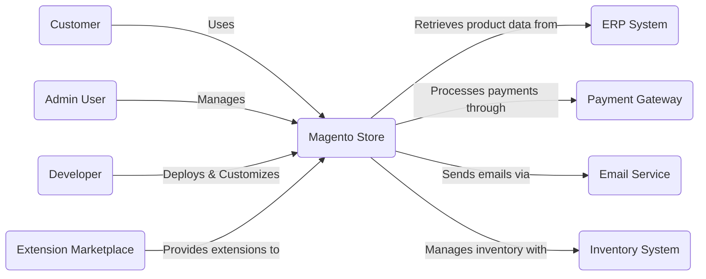
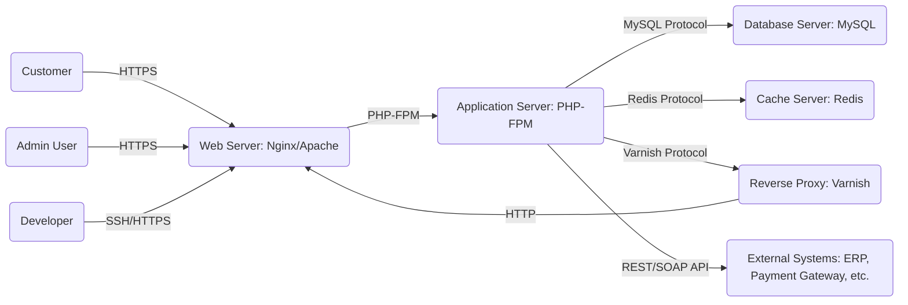
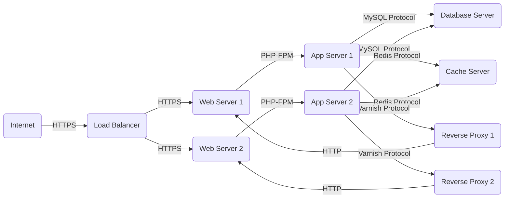
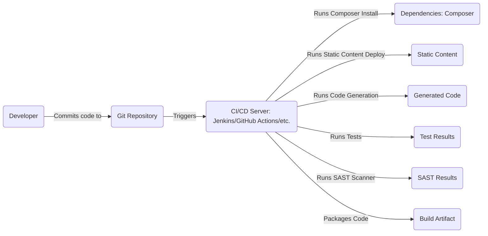

Okay, let's create a design document for the Magento 2 project, focusing on aspects relevant to threat modeling.

# BUSINESS POSTURE

Magento 2 is an open-source e-commerce platform.  The primary business goal is to provide a flexible, scalable, and secure platform for businesses to build and manage online stores.  Success is measured by adoption (number of stores running on Magento), the size and activity of the extension marketplace, and the overall satisfaction of merchants and developers.  Given its open-source nature and widespread use in e-commerce, several key business risks must be addressed:

*   _Reputational Damage_: Security breaches leading to data theft (customer data, payment information) can severely damage Magento's reputation and erode trust among users and the broader e-commerce community.
*   _Financial Loss for Merchants_: Vulnerabilities that allow attackers to manipulate orders, pricing, or inventory can directly impact the revenue and profitability of businesses using the platform.
*   _Legal and Compliance Risks_: Failure to comply with data privacy regulations (e.g., GDPR, CCPA) and payment card industry standards (PCI DSS) can result in significant fines and legal liabilities.
*   _Platform Abandonment_: If security concerns are not consistently addressed, merchants may migrate to competing platforms, leading to a decline in Magento's market share.
*   _Compromised Extension Ecosystem_: The large third-party extension marketplace is a strength, but also a risk.  Vulnerable extensions can be exploited to compromise entire stores.
*  _Supply Chain Attacks_: Compromise of the Magento core codebase or official distribution channels could lead to widespread infection of Magento instances.

# SECURITY POSTURE

Magento 2 incorporates several security controls and acknowledges certain accepted risks.  The following assessment is based on a review of the provided GitHub repository and general knowledge of the platform.

*   _security control_: Input Validation: Magento 2 employs input validation techniques to mitigate risks like Cross-Site Scripting (XSS) and SQL Injection. This is evident in the extensive use of form keys, escaping output, and parameterized queries in the codebase. Implemented in multiple layers, including frontend JavaScript validation, backend PHP validation, and database interactions.
*   _security control_: Output Encoding: Magento 2 uses output encoding to prevent XSS vulnerabilities. Output is escaped appropriately based on the context (e.g., HTML, JavaScript, URL). Implemented in templating engine and helper functions.
*   _security control_: Authentication and Authorization: Magento 2 implements a robust authentication system for both administrators and customers. It uses password hashing (with salts) and supports features like two-factor authentication (2FA) through extensions. Authorization is role-based, allowing granular control over access to different parts of the system. Implemented in core authentication modules and access control lists (ACLs).
*   _security control_: Session Management: Magento 2 uses secure session management practices, including the use of HTTPOnly and Secure cookies (when configured correctly). Session IDs are generated randomly and have a configurable timeout. Implemented in core session management modules.
*   _security control_: Cryptography: Magento 2 uses cryptographic functions for secure storage of sensitive data (e.g., passwords, encryption keys). It supports various encryption algorithms and key management practices. Implemented in core cryptography modules.
*   _security control_: File Upload Handling: Magento 2 implements restrictions on file uploads to prevent the execution of malicious code. It validates file types, sizes, and uses secure storage locations. Implemented in file upload modules.
*   _security control_: Regular Security Updates: Magento releases regular security patches and updates to address newly discovered vulnerabilities.  This is a crucial part of their security strategy. Described in release notes and security advisories.
*   _security control_: Dependency Management: Magento uses Composer for dependency management, allowing for tracking and updating of third-party libraries. This helps mitigate supply chain risks. Described in `composer.json` and `composer.lock` files.
*   _security control_: Security Headers: Magento 2 allows and recommends the configuration of security headers (e.g., X-Frame-Options, X-XSS-Protection, Content-Security-Policy) to enhance browser security. Implemented through server configuration (e.g., Apache, Nginx) and can be partially managed within Magento.
*   _accepted risk_: Third-Party Extensions: The reliance on a large ecosystem of third-party extensions introduces inherent risks. While Magento provides guidelines for secure extension development, the quality and security of these extensions can vary significantly.
*   _accepted risk_: Configuration Errors: Magento 2 is a complex platform, and misconfigurations (e.g., weak passwords, exposed admin panels, incorrect file permissions) can create significant security vulnerabilities.
*   _accepted risk_: Timely Patching: While Magento releases security patches, the responsibility for applying these patches in a timely manner rests with the individual merchants or their hosting providers. Delayed patching is a common source of compromises.
*   _accepted risk_: Zero-Day Vulnerabilities: Like all software, Magento 2 is susceptible to zero-day vulnerabilities that are unknown and unpatched.

Recommended Security Controls (High Priority):

*   _Implement Web Application Firewall (WAF)_: A WAF can provide an additional layer of defense against common web attacks, including SQL injection, XSS, and cross-site request forgery (CSRF).
*   _Implement Regular Penetration Testing_: Conduct regular penetration tests by qualified security professionals to identify vulnerabilities that may be missed by automated scans.
*   _Implement Security Information and Event Management (SIEM)_: A SIEM system can help detect and respond to security incidents by collecting and analyzing logs from various sources.
*   _Implement File Integrity Monitoring (FIM)_: FIM can detect unauthorized changes to critical system files, which can be an indicator of compromise.

Security Requirements:

*   _Authentication_:
    *   All users (administrators and customers) must be authenticated before accessing protected resources.
    *   Strong password policies must be enforced.
    *   Two-factor authentication (2FA) should be supported and encouraged.
    *   Account lockout mechanisms should be implemented to prevent brute-force attacks.
*   _Authorization_:
    *   Role-based access control (RBAC) must be used to restrict access to sensitive functionality and data.
    *   The principle of least privilege should be applied, granting users only the necessary permissions.
*   _Input Validation_:
    *   All user-supplied input must be validated against a strict whitelist of allowed characters and formats.
    *   Input validation should be performed on both the client-side (for usability) and the server-side (for security).
*   _Cryptography_:
    *   Strong, industry-standard cryptographic algorithms must be used for all sensitive data, including passwords, encryption keys, and payment information.
    *   Encryption keys must be managed securely, following best practices for key generation, storage, and rotation.
    *   Salts must be used when hashing passwords.
*   _Output Encoding_:
    *   All output to web pages must be properly encoded to prevent cross-site scripting (XSS) vulnerabilities.
    *   The encoding method should be appropriate for the context (e.g., HTML, JavaScript, URL).

# DESIGN

## C4 CONTEXT

*   _Customer_:
    *   _Name_: Customer
    *   _Type_: Person
    *   _Description_: A person who browses and purchases products from the Magento store.
    *   _Responsibilities_: Browsing products, adding items to cart, placing orders, managing account information.
    *   _Security controls_: Authentication, authorization, session management, data encryption (for payment information).
*   _Magento Store_:
    *   _Name_: Magento Store
    *   _Type_: Software System
    *   _Description_: The core Magento 2 e-commerce platform.
    *   _Responsibilities_: Handling user requests, managing product catalog, processing orders, interacting with external systems.
    *   _Security controls_: Input validation, output encoding, authentication, authorization, session management, cryptography, file upload handling, regular security updates.
*   _ERP System_:
    *   _Name_: ERP System
    *   _Type_: Software System
    *   _Description_: An Enterprise Resource Planning system used for managing business data.
    *   _Responsibilities_: Providing product data, managing inventory levels, handling order fulfillment.
    *   _Security controls_: Authentication, authorization, data encryption, access controls.
*   _Payment Gateway_:
    *   _Name_: Payment Gateway
    *   _Type_: Software System
    *   _Description_: A third-party service that processes online payments.
    *   _Responsibilities_: Securely processing credit card transactions, handling refunds, fraud prevention.
    *   _Security controls_: PCI DSS compliance, data encryption, fraud detection mechanisms.
*   _Email Service_:
    *   _Name_: Email Service
    *   _Type_: Software System
    *   _Description_: A service used for sending transactional and marketing emails.
    *   _Responsibilities_: Sending order confirmations, shipping updates, password reset emails.
    *   _Security controls_: Authentication, encryption, spam filtering.
*   _Inventory System_:
    *   _Name_: Inventory System
    *   _Type_: Software System
    *   _Description_: A system for managing inventory levels.
    *   _Responsibilities_: Tracking stock levels, updating inventory after orders are placed.
    *   _Security controls_: Authentication, authorization, access controls.
*   _Admin User_:
    *   _Name_: Admin User
    *   _Type_: Person
    *   _Description_: A user with administrative privileges who manages the Magento store.
    *   _Responsibilities_: Configuring the store, managing products, processing orders, managing users.
    *   _Security controls_: Strong authentication, two-factor authentication, role-based access control.
*   _Developer_:
    *   _Name_: Developer
    *   _Type_: Person
    *   _Description_: A software developer who customizes and extends the Magento platform.
    *   _Responsibilities_: Developing custom modules, themes, and integrations.
    *   _Security controls_: Secure coding practices, code reviews, vulnerability scanning.
*   _Extension Marketplace_:
    *   _Name_: Extension Marketplace
    *   _Type_: Software System
    *   _Description_: A marketplace where third-party developers can publish and sell Magento extensions.
    *   _Responsibilities_: Providing a platform for distributing extensions, code review (ideally).
    *   _Security controls_: Code scanning, vulnerability reporting program.

## C4 CONTAINER

*   _Web Server_:
    *   _Name_: Web Server
    *   _Type_: Container (Nginx/Apache)
    *   _Description_: Serves static content and acts as a reverse proxy for dynamic requests.
    *   _Responsibilities_: Handling HTTP requests, serving static files, SSL termination.
    *   _Security controls_: Secure configuration, HTTPS enforcement, security headers, WAF (if implemented).
*   _Application Server_:
    *   _Name_: Application Server
    *   _Type_: Container (PHP-FPM)
    *   _Description_: Executes PHP code and handles application logic.
    *   _Responsibilities_: Processing dynamic requests, interacting with the database and cache, executing business logic.
    *   _Security controls_: Input validation, output encoding, secure coding practices, regular security updates.
*   _Database Server_:
    *   _Name_: Database Server
    *   _Type_: Container (MySQL)
    *   _Description_: Stores persistent data, such as product information, customer data, and orders.
    *   _Responsibilities_: Data storage, retrieval, and management.
    *   _Security controls_: Authentication, authorization, data encryption at rest (if implemented), regular backups.
*   _Cache Server_:
    *   _Name_: Cache Server
    *   _Type_: Container (Redis)
    *   _Description_: Caches frequently accessed data to improve performance.
    *   _Responsibilities_: Storing and retrieving cached data.
    *   _Security controls_: Authentication (if configured), access controls.
*   _Reverse Proxy_:
    *   _Name_: Reverse Proxy
    *   _Type_: Container (Varnish)
    *   _Description_: Caches HTTP responses to improve performance and reduce load on the application server.
    *   _Responsibilities_: Caching HTTP responses, load balancing (if configured).
    *   _Security controls_: Secure configuration, access controls.
*   _External Systems_:
    *   _Name_: External Systems
    *   _Type_: Container (Various)
    *   _Description_: External systems that Magento interacts with, such as ERP, payment gateways, and email services.
    *   _Responsibilities_: Varies depending on the specific system.
    *   _Security controls_: Secure communication (HTTPS), authentication, authorization.

## DEPLOYMENT

Magento 2 can be deployed in various ways, including:

1.  _Single Server_: All components (web server, application server, database, cache) are installed on a single server. This is suitable for small stores or development environments.
2.  _Multiple Servers_: Components are distributed across multiple servers for improved performance and scalability. This is the most common deployment model for production environments.
3.  _Cloud-Based Deployment_: Magento can be deployed on cloud platforms like AWS, Google Cloud, or Azure, using services like EC2, RDS, and CloudFront.
4.  _Containerized Deployment_: Magento can be deployed using containerization technologies like Docker and Kubernetes.

We'll describe a *Multiple Servers* deployment in detail, as it's a common and recommended approach for production:

*   _Internet_:
    *   _Name_: Internet
    *   _Type_: Node
    *   _Description_: The public internet.
    *   _Responsibilities_: N/A
    *   _Security controls_: N/A
*   _Load Balancer_:
    *   _Name_: Load Balancer
    *   _Type_: Node
    *   _Description_: Distributes incoming traffic across multiple web servers.
    *   _Responsibilities_: Load balancing, SSL termination (optional).
    *   _Security controls_: Secure configuration, DDoS protection.
*   _Web Server 1 & 2_:
    *   _Name_: Web Server 1 & 2
    *   _Type_: Node (e.g., Nginx/Apache instance)
    *   _Description_: Serve static content and proxy dynamic requests to application servers.
    *   _Responsibilities_: Handling HTTP requests, serving static files.
    *   _Security controls_: Secure configuration, HTTPS enforcement, security headers, WAF (if implemented).
*   _App Server 1 & 2_:
    *   _Name_: App Server 1 & 2
    *   _Type_: Node (e.g., PHP-FPM instance)
    *   _Description_: Execute PHP code and handle application logic.
    *   _Responsibilities_: Processing dynamic requests, interacting with the database and cache.
    *   _Security controls_: Input validation, output encoding, secure coding practices, regular security updates.
*   _Database Server_:
    *   _Name_: Database Server
    *   _Type_: Node (e.g., MySQL instance)
    *   _Description_: Stores persistent data.
    *   _Responsibilities_: Data storage, retrieval, and management.
    *   _Security controls_: Authentication, authorization, data encryption at rest (if implemented), regular backups, firewall.
*   _Cache Server_:
    *   _Name_: Cache Server
    *   _Type_: Node (e.g., Redis instance)
    *   _Description_: Caches frequently accessed data.
    *   _Responsibilities_: Storing and retrieving cached data.
    *   _Security controls_: Authentication (if configured), access controls, firewall.
*  _Reverse Proxy 1 & 2_:
    *   _Name_: Reverse Proxy 1 & 2
    *   _Type_: Node (Varnish)
    *   _Description_: Caches HTTP responses to improve performance and reduce load on the application server.
    *   _Responsibilities_: Caching HTTP responses, load balancing (if configured).
    *   _Security controls_: Secure configuration, access controls.

## BUILD

Magento 2's build process typically involves several steps, from development to deployment.  While the specifics can vary depending on the development workflow and deployment environment, a common process includes:

1.  _Development_: Developers work on the codebase locally, using tools like Git for version control.
2.  _Dependency Management_: Composer is used to manage PHP dependencies.  `composer.json` and `composer.lock` define the required packages and their versions.
3.  _Compilation_: Magento's static content (CSS, JavaScript, images) needs to be compiled and deployed. This is often done using Magento's built-in CLI tools (`bin/magento setup:static-content:deploy`).
4.  _Code Generation_: Magento uses code generation for various components, such as dependency injection and plugins. This is also handled by CLI tools (`bin/magento setup:di:compile`).
5.  _Testing_: Automated tests (unit tests, integration tests) are run to ensure code quality and prevent regressions.
6.  _Packaging_: The codebase and compiled assets are packaged for deployment. This might involve creating a Git tag, building a Docker image, or creating a deployment archive.
7.  _Deployment_: The packaged code is deployed to the target environment (staging, production).

Security Controls in the Build Process:

*   _Version Control (Git)_: All code changes should be tracked in a version control system like Git, allowing for auditing and rollback.
*   _Dependency Management (Composer)_: Regularly update dependencies to address known vulnerabilities. Use tools like `composer audit` to check for security advisories.
*   _Static Code Analysis (SAST)_: Integrate SAST tools into the build process to identify potential security vulnerabilities in the codebase. Examples include PHPStan, Psalm, and commercial SAST solutions.
*   _Dynamic Application Security Testing (DAST)_: While typically done in a staging environment, DAST can be part of a larger CI/CD pipeline.
*   _Code Reviews_: Require code reviews before merging changes into the main branch. This helps catch security issues early in the development process.
*   _Secure Build Environment_: Ensure that the build environment itself is secure, protecting against unauthorized access and tampering.
*   _Artifact Signing_: Consider signing build artifacts to ensure their integrity and authenticity.

# RISK ASSESSMENT

*   _Critical Business Processes_:
    *   _Order Processing_: The ability for customers to place orders and for the merchant to fulfill them is the core business process.
    *   _Payment Processing_: Securely handling customer payments is critical.
    *   _Inventory Management_: Accurate tracking of inventory levels is essential for avoiding overselling and stockouts.
    *   _Customer Account Management_: Allowing customers to manage their accounts and personal information.

*   _Data to Protect and Sensitivity_:
    *   _Personally Identifiable Information (PII)_: Customer names, addresses, email addresses, phone numbers. (High Sensitivity)
    *   _Payment Card Information (PCI)_: Credit card numbers, expiration dates, CVV codes. (Highest Sensitivity - Subject to PCI DSS)
    *   _Order History_: Details of customer purchases. (Medium Sensitivity)
    *   _Account Credentials_: Usernames and passwords. (High Sensitivity)
    *   _Product Data_: Product descriptions, pricing, images. (Low to Medium Sensitivity)
    *   _Inventory Data_: Stock levels. (Medium Sensitivity)
    *   _Session Data_: Information about active user sessions. (Medium Sensitivity)

# QUESTIONS & ASSUMPTIONS

*   _Questions_:
    *   What specific third-party extensions are being used? (Each extension introduces its own security risks.)
    *   What is the current patching policy and process? (How quickly are security patches applied?)
    *   Is there a formal incident response plan in place?
    *   What type of hosting environment is being used (shared, dedicated, cloud)?
    *   Are there any existing security audits or penetration test reports?
    *   What is the specific deployment process (e.g., manual deployment, automated deployment with CI/CD)?
    *   Is there a Web Application Firewall (WAF) in place?
    *   Is data encryption at rest implemented for the database?
    *   What are the specific backup and recovery procedures?

*   _Assumptions_:
    *   _BUSINESS POSTURE_: The organization prioritizes security and understands the potential impact of security breaches.
    *   _SECURITY POSTURE_: Basic security controls are in place, but there is room for improvement.
    *   _DESIGN_: A standard Magento 2 deployment architecture is being used, with common components like a web server, application server, database, and cache. The deployment is assumed to be on multiple servers. The build process is assumed to be at least partially automated.