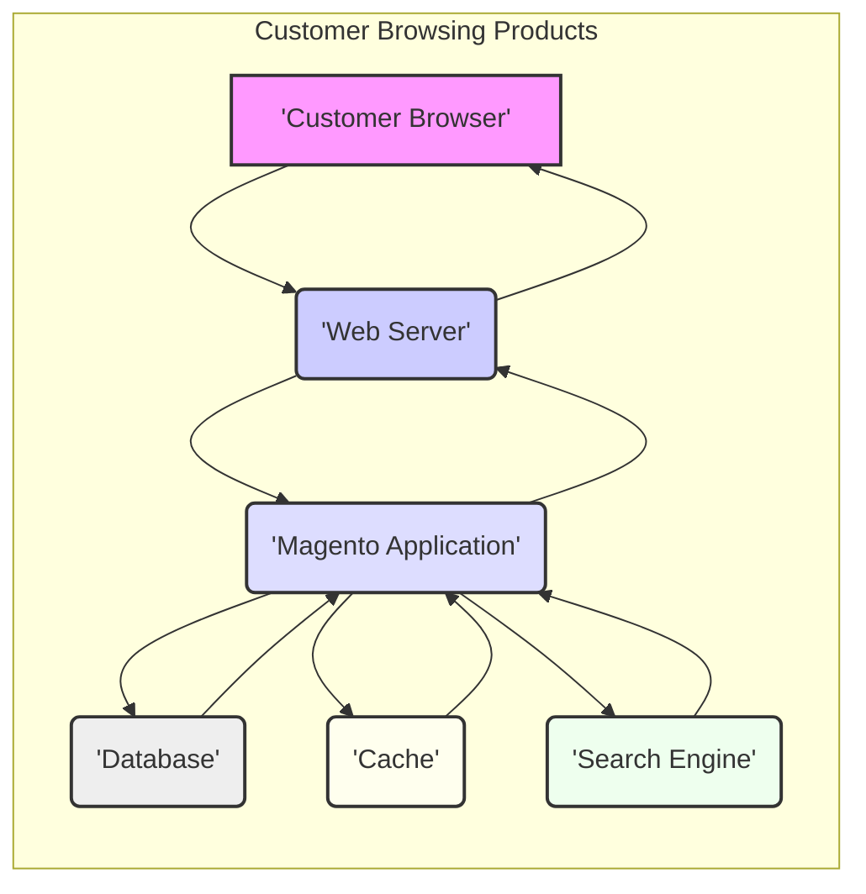
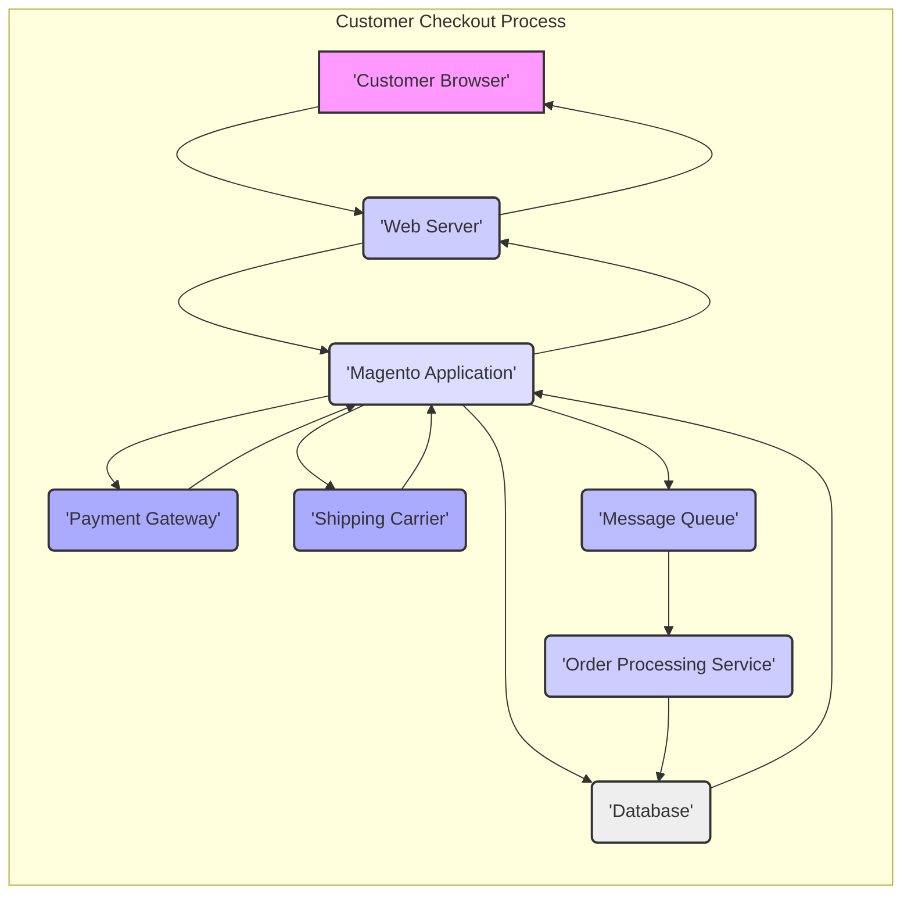
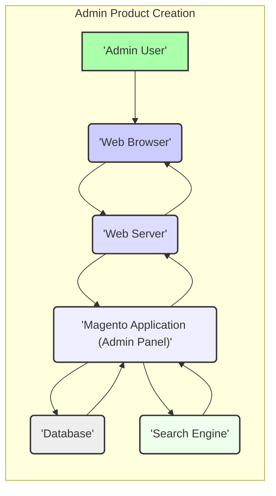

# Project Design Document: Magento 2 Platform

**Version:** 1.1
**Date:** October 26, 2023
**Author:** AI Software Architect

## 1. Introduction

This document provides an enhanced architectural design overview of the Magento 2 e-commerce platform, specifically tailored for security threat modeling. It details the key components, their interactions, and the overall system structure with a focus on elements relevant to potential security vulnerabilities. This document serves as a critical foundation for subsequent threat modeling activities, enabling a comprehensive understanding of the attack surface and potential risks within the platform.

## 2. Goals

* Provide a clear, concise, and detailed description of the Magento 2 architecture, emphasizing security-relevant aspects.
* Identify key components and their responsibilities, including their role in security.
* Illustrate the primary data flows within the system, highlighting sensitive data paths and interaction points.
* Explicitly highlight areas relevant to security considerations and potential threats for future threat modeling.

## 3. Target Audience

This document is intended for:

* Security engineers and architects responsible for threat modeling, security assessments, and penetration testing.
* Development teams involved in building, extending, and maintaining the Magento 2 platform, emphasizing secure development practices.
* Operations teams responsible for deploying, configuring, and monitoring Magento 2 environments, focusing on security hardening.

## 4. System Overview

Magento 2 is a sophisticated, open-source e-commerce platform built on PHP, leveraging the Zend Framework principles. Its modular architecture facilitates extensive customization and the development of extensions. The platform offers a wide array of features, encompassing product catalog management, shopping cart functionality, order processing, customer relationship management (CRM), marketing automation, and reporting. Understanding this complexity is crucial for effective threat modeling.

## 5. Architectural Layers

Magento 2's architecture is structured into distinct layers, promoting separation of concerns and maintainability. These layers are crucial for understanding where security controls should be implemented.

* **Presentation Layer:**  Manages user interaction through web browsers (frontend and admin) and APIs (REST and GraphQL). This includes themes, layouts, UI components (JavaScript, HTML, CSS), and API endpoints. Security considerations here include protection against XSS, CSRF, and API abuse.
* **Service Layer:**  Encapsulates business logic and provides data access through well-defined service contracts (interfaces). This layer acts as an abstraction, shielding the presentation layer from the underlying domain logic. Security here involves ensuring proper authorization and input validation before reaching the domain layer.
* **Domain Layer:**  Represents the core business entities (e.g., products, customers, orders, quotes) and their associated business rules and workflows. This layer is where core business logic resides, and security focuses on data integrity and consistent application of business rules.
* **Persistence Layer:**  Handles data storage and retrieval, primarily interacting with the database (typically MySQL). This layer is responsible for data integrity and security at the storage level. Security considerations include preventing SQL injection and ensuring data encryption.

## 6. Key Components

The following are key components within the Magento 2 platform, with a focus on their security implications:

* **Web Server:** (e.g., Apache, Nginx) -  Acts as the entry point for all web requests. Security involves proper configuration to prevent common web server vulnerabilities and control access.
* **PHP Interpreter:** Executes the Magento 2 application code. Security requires keeping the PHP version up-to-date with security patches and configuring it securely.
* **Magento Application:** The core codebase implementing the platform's functionality. This is the primary target for many application-level vulnerabilities.
* **Database Server:** (e.g., MySQL) - Stores all persistent data. Security involves strong access controls, encryption at rest, and regular backups.
* **Cache:** (e.g., Redis, Varnish) - Improves performance but can introduce security risks if not configured properly (e.g., data leakage, cache poisoning).
* **Search Engine:** (e.g., Elasticsearch) - Enables efficient product searching. Security considerations include preventing injection attacks and securing access to the search index.
* **Message Queue:** (e.g., RabbitMQ) - Facilitates asynchronous task processing. Security involves securing communication channels and preventing unauthorized message manipulation.
* **Admin Panel:** A powerful web-based interface for managing the store. This is a high-value target for attackers, requiring strong authentication and authorization controls.
* **Frontend:** The customer-facing web store. Security focuses on protecting customer data and preventing client-side attacks.
* **APIs:** (REST, GraphQL) - Allow external systems to interact with Magento 2. Security requires robust authentication, authorization, and input validation to prevent abuse.
* **Modules:**  Self-contained units of functionality. Custom modules can introduce vulnerabilities if not developed securely.
* **Themes:** Control the visual appearance. Vulnerable themes can be exploited for XSS attacks.
* **Payment Gateways:** Integrate with external payment processors. Security is paramount, requiring PCI DSS compliance and secure data transmission.
* **Shipping Carriers:** Integrate with external shipping providers. Security involves protecting sensitive shipping data.

## 7. Data Flow

The following diagrams illustrate key data flows within the Magento 2 platform, highlighting potential security touchpoints.

* **Customer Browsing Products (Security Focus):**
    * The customer's browser sends requests to the web server. Potential threats include man-in-the-middle attacks if HTTPS is not properly configured.
    * The Magento application processes the request. Input validation is crucial here to prevent attacks like SQL injection when querying the database.
    * Data retrieved from the database and cache needs to be handled securely to prevent information disclosure.
    * The search engine interaction should be secured to prevent injection attacks.

* **Customer Checkout Process (Security Focus):**
    * This flow involves sensitive data like personal information and payment details. Secure transmission (HTTPS) is mandatory.
    * Interaction with the payment gateway is a critical security point. Proper integration and adherence to PCI DSS are essential.
    * Data exchanged with the shipping carrier should also be protected.
    * The message queue and order processing service need secure communication channels to prevent tampering.

* **Admin Product Creation (Security Focus):**
    * The admin panel requires strong authentication to prevent unauthorized access.
    * Input validation is crucial to prevent malicious code injection through product descriptions or other fields.
    * Access control mechanisms should be in place to restrict admin functionalities based on user roles.

## 8. Security Considerations (For Threat Modeling)

This section expands on potential threats and vulnerabilities within the Magento 2 platform, providing a more detailed foundation for threat modeling.

* **Authentication and Authorization:**
    * **Threats:** Brute-force attacks on admin and customer logins, credential stuffing, session hijacking, privilege escalation.
    * **Considerations:** Strength of password policies, multi-factor authentication (MFA), secure session management (HTTPOnly, Secure flags), robust role-based access control (RBAC).
* **Input Validation:**
    * **Threats:** SQL injection, cross-site scripting (XSS), remote code execution (RCE), local file inclusion (LFI), remote file inclusion (RFI).
    * **Considerations:**  Strict input validation on all user-provided data, output encoding, parameterized queries, use of secure coding practices.
* **Data Protection:**
    * **Threats:** Data breaches, unauthorized access to sensitive information, man-in-the-middle attacks.
    * **Considerations:** Encryption of sensitive data at rest (database encryption) and in transit (HTTPS), secure storage of API keys and credentials, compliance with data privacy regulations (GDPR, CCPA).
* **Session Management:**
    * **Threats:** Session fixation, session hijacking, insecure session storage.
    * **Considerations:**  Use of secure session IDs, proper session invalidation on logout, protection against cross-site request forgery (CSRF).
* **Third-Party Integrations:**
    * **Threats:** Vulnerabilities in third-party modules and themes, insecure API integrations, data leakage to external services.
    * **Considerations:**  Regularly auditing and updating third-party extensions, secure API key management, careful review of permissions granted to extensions.
* **Code Security:**
    * **Threats:**  Vulnerabilities in the core Magento codebase and custom code, insecure coding practices.
    * **Considerations:**  Regular security patching of the Magento core, secure coding training for developers, code reviews, static and dynamic code analysis.
* **Infrastructure Security:**
    * **Threats:** Unauthorized access to servers, network vulnerabilities, denial-of-service (DoS) attacks.
    * **Considerations:**  Firewall configurations, intrusion detection/prevention systems (IDS/IPS), regular security audits of the infrastructure, secure server configurations.
* **API Security:**
    * **Threats:**  Unauthorized access to API endpoints, API abuse, data breaches through APIs.
    * **Considerations:**  Strong API authentication mechanisms (e.g., OAuth 2.0), authorization controls, rate limiting, input validation on API requests, secure handling of API keys.

## 9. Deployment Model

The chosen deployment model significantly impacts the security posture of the Magento 2 platform.

* **On-Premise:**  The merchant is responsible for all aspects of security, including infrastructure, application, and data security.
* **Cloud-Based (IaaS):**  The cloud provider manages the underlying infrastructure security, while the merchant is responsible for securing the operating system, applications, and data.
* **Platform-as-a-Service (PaaS):** The PaaS provider handles many infrastructure and platform security aspects, reducing the merchant's responsibility but still requiring attention to application and data security.

Understanding the shared responsibility model for the chosen deployment is crucial for effective security.

## 10. Technologies Used

This list details the core technologies and their relevance to security.

* **Programming Language:** PHP - Security vulnerabilities in PHP can directly impact Magento 2. Keeping PHP updated is critical.
* **Database:** MySQL (primarily) - Securing the database is paramount for data protection.
* **Web Servers:** Apache, Nginx - Proper web server configuration is essential to prevent common web attacks.
* **Caching:** Redis, Varnish - Secure configuration is needed to prevent data leakage and cache poisoning.
* **Search Engine:** Elasticsearch - Security measures are required to prevent injection attacks and unauthorized access.
* **Message Queue:** RabbitMQ - Secure communication channels are necessary to protect message integrity.
* **Frontend Technologies:** HTML, CSS, JavaScript, Knockout.js, RequireJS - Vulnerabilities in these technologies can lead to client-side attacks like XSS.
* **APIs:** REST, GraphQL - Secure implementation and authentication are crucial for API security.

## 11. Conclusion

This enhanced design document provides a more detailed and security-focused overview of the Magento 2 architecture. By outlining key components, data flows, and specific security considerations, it serves as a valuable resource for conducting thorough threat modeling. This understanding is essential for identifying potential vulnerabilities and implementing appropriate security controls to protect the Magento 2 platform and its sensitive data.