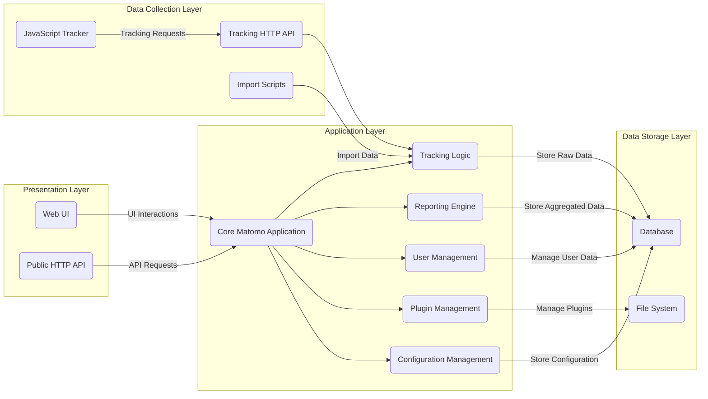
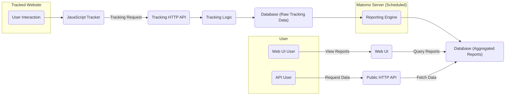

# Project Design Document: Matomo Analytics Platform

**Version:** 1.1
**Date:** October 26, 2023
**Author:** AI Software Architect

## 1. Introduction

This document provides an enhanced design overview of the Matomo Analytics platform (formerly Piwik), focusing on aspects relevant to security threat modeling. It details the system's architecture, key components, and data flow to facilitate the identification of potential vulnerabilities.

### 1.1. Purpose

The primary goal of this document is to offer a clear and detailed understanding of the Matomo platform's design. This understanding is essential for security engineers and analysts to effectively perform threat modeling and identify potential security weaknesses.

### 1.2. Scope

This document focuses on the core components and functionalities of the self-hosted Matomo platform, as represented by the codebase in the provided GitHub repository. It emphasizes architectural elements pertinent to security, including data collection, processing, storage, and presentation. Specific plugins are not detailed unless they are fundamental to the core operation.

### 1.3. Target Audience

This document is intended for:

* Security engineers and analysts responsible for threat modeling and security assessments of the Matomo platform.
* Software developers working on the Matomo platform or integrating with it.
* Operations teams involved in the deployment and maintenance of Matomo instances.

## 2. System Overview

Matomo is an open-source web analytics platform designed for collecting, processing, and visualizing data about website visitors and their behavior. It serves as a privacy-focused alternative to commercial analytics solutions, giving users greater control over their data.

### 2.1. Core Functionalities

* **Web Traffic Analysis:** Tracks page views, unique visitors, session duration, bounce rate, and other key website metrics.
* **Event Tracking:** Allows tracking of specific user interactions beyond page loads, such as button clicks, form submissions, and video plays.
* **Content Tracking:** Enables analysis of how users interact with specific content elements on a website.
* **Download and Outlink Tracking:** Monitors user clicks on downloads and external links.
* **Goal Conversion Tracking:**  Facilitates the tracking of specific user actions that represent desired outcomes.
* **Campaign Tracking:**  Allows attribution of website traffic and conversions to specific marketing campaigns.
* **User Segmentation:** Enables the creation of user segments based on various criteria for more granular analysis.
* **Real-time Data Processing:** Provides near real-time insights into website activity.

### 2.2. Deployment Characteristics

Matomo is typically deployed as a self-hosted PHP web application on infrastructure managed by the user. This self-hosting model provides greater control over data and infrastructure compared to SaaS offerings.

## 3. System Architecture

The Matomo platform is structured into distinct layers and components that interact to provide its core functionalities.

* **Presentation Layer:**  Handles user interaction and data presentation.
    * "Web User Interface (UI)":  A browser-based interface built with PHP, HTML, CSS, and JavaScript, allowing users to view reports, configure settings, and manage the platform.
    * "Public HTTP API":  A RESTful API enabling external applications and scripts to programmatically access analytics data and manage Matomo configurations.

* **Application Layer:** Contains the core business logic and processing capabilities.
    * "Core Matomo Application": The central PHP codebase responsible for request handling, data processing orchestration, security enforcement, and overall system management.
    * "Tracking Logic":  Processes incoming tracking requests, validates data, and prepares it for storage.
    * "Reporting Engine":  Aggregates raw tracking data, calculates metrics, and generates reports based on user queries or scheduled tasks.
    * "User Management":  Handles user authentication, authorization, role management, and permission control.
    * "Plugin Management":  Manages the installation, activation, deactivation, and execution of plugins, extending the core functionality.
    * "Configuration Management":  Stores and manages system-wide settings, website configurations, user preferences, and plugin configurations.

* **Data Storage Layer:**  Responsible for persistent data storage.
    * "Database":  A relational database (typically MySQL or MariaDB) storing raw tracking data (visits, page views, events), aggregated report data, user accounts, website configurations, and plugin settings.
    * "File System":  Used for storing uploaded files (e.g., GeoIP databases), temporary files, plugin files, and potentially cached data.

* **Data Collection Layer:**  Handles the intake of tracking data.
    * "JavaScript Tracker":  A JavaScript snippet embedded in websites to collect client-side data (e.g., page views, screen size, browser information) and send it to the Matomo server.
    * "Tracking HTTP API":  An HTTP endpoint (`/matomo.php`) that receives tracking requests from the JavaScript tracker, server-side tracking libraries, and other sources.
    * "Import Scripts":  Command-line scripts (often PHP-based) for importing historical data from other analytics platforms, server logs, or other data sources.

## 4. Data Flow

The process of data collection, processing, and presentation in Matomo follows these steps:

1. **Tracking Event:** A user interacts with a tracked website (e.g., loads a page, clicks a button), or a server-side tracking call is initiated.
2. **Data Transmission:** The "JavaScript Tracker" on the website or a server-side tracking library sends an HTTP request containing tracking parameters to the "Tracking HTTP API" endpoint on the Matomo server. This request typically includes information like the page URL, user agent, and custom event data.
3. **Request Reception:** The "Tracking HTTP API" receives the incoming request.
4. **Data Processing and Validation:** The "Tracking Logic" component processes the request, validating the data format and parameters. This step may involve sanitizing input to prevent injection attacks.
5. **Raw Data Storage:** The validated raw tracking data is stored in the "Database". This includes individual visit and action records.
6. **Scheduled Processing:**  The "Reporting Engine" is periodically triggered (e.g., by cron jobs) to process the raw data.
7. **Data Aggregation:** The "Reporting Engine" aggregates the raw data based on various dimensions (e.g., date, country, page URL) to calculate key metrics.
8. **Report Data Storage:** The aggregated report data is stored in the "Database", often in separate tables optimized for querying.
9. **User Request:** A user accesses the "Web UI" or an external application makes a request to the "Public HTTP API" for analytics data.
10. **Data Retrieval:** The "Core Matomo Application" receives the request and queries the "Database" for the relevant report data.
11. **Data Presentation:** The "Web UI" renders the retrieved data into charts, tables, and dashboards for the user. The "Public HTTP API" returns the data in a structured format (e.g., JSON).

## 5. Key Components in Detail

* **"JavaScript Tracker"**: This client-side script is responsible for collecting data directly from the user's browser.
    * **Security Considerations:**  Vulnerable to Cross-Site Scripting (XSS) attacks if the tracked website is compromised. Care must be taken to ensure the tracker script itself is served securely and that any data it collects and transmits is handled securely by the Matomo server. Improper configuration on the tracked website could also lead to data leakage.

* **"Tracking HTTP API"**: The primary entry point for receiving tracking data.
    * **Security Considerations:**  A critical component that needs to be highly secure to prevent unauthorized data injection, Denial-of-Service (DoS) attacks, and other forms of abuse. Proper input validation and rate limiting are essential. Vulnerabilities here could lead to data corruption or the ability to track arbitrary data.

* **"Core Matomo Application"**: The central hub of the platform, managing authentication, authorization, and core functionalities.
    * **Security Considerations:**  Susceptible to common web application vulnerabilities such as SQL Injection, Cross-Site Scripting (XSS), Cross-Site Request Forgery (CSRF), and authentication/authorization bypasses. Secure coding practices and regular security audits are crucial.

* **"Database"**: Stores all critical data, including raw tracking data, aggregated reports, and user credentials.
    * **Security Considerations:**  Requires robust security measures to protect sensitive data. This includes strong access controls, encryption of sensitive data at rest and in transit, and protection against SQL Injection attacks originating from the "Core Matomo Application" or plugins.

* **"Web UI"**: The user interface for accessing and managing Matomo.
    * **Security Considerations:**  A potential target for XSS attacks, CSRF attacks, and session hijacking. Proper output encoding, anti-CSRF tokens, and secure session management are necessary.

* **"Plugin Management"**:  While providing extensibility, plugins can introduce security risks.
    * **Security Considerations:**  Plugins, being third-party code, can contain vulnerabilities or malicious code. A robust plugin security model, including input validation within plugins and potentially sandboxing, is important. Regular security reviews of popular plugins are also beneficial.

## 6. Security Considerations

This section outlines key security considerations for the Matomo platform, forming the basis for threat modeling activities.

* **Authentication and Authorization:**
    * **Threats:** Brute-force attacks on login forms, weak password policies, privilege escalation, unauthorized access to sensitive data or functionalities.
    * **Mitigations:** Strong password policies, multi-factor authentication, role-based access control, regular security audits of authentication and authorization mechanisms.

* **Input Validation and Sanitization:**
    * **Threats:** SQL Injection, Cross-Site Scripting (XSS), Command Injection, arbitrary file uploads.
    * **Mitigations:**  Strict input validation on all user-provided data, parameterized queries for database interactions, proper output encoding for data displayed in the UI, secure file upload handling.

* **Session Management:**
    * **Threats:** Session hijacking, session fixation.
    * **Mitigations:**  Using secure session IDs, HTTP-only and secure flags for cookies, regular session regeneration, timeouts for inactive sessions.

* **Cross-Site Request Forgery (CSRF):**
    * **Threats:**  Unauthorized actions performed on behalf of an authenticated user.
    * **Mitigations:**  Implementation of anti-CSRF tokens for all state-changing requests.

* **Data Privacy:**
    * **Threats:**  Unauthorized access to personal data, non-compliance with data privacy regulations (e.g., GDPR, CCPA).
    * **Mitigations:**  Data anonymization and pseudonymization techniques, providing users with control over their data, implementing features to comply with privacy regulations.

* **Communication Security:**
    * **Threats:**  Man-in-the-middle attacks, eavesdropping on sensitive data.
    * **Mitigations:**  Enforcing HTTPS for all communication, using secure protocols for data transfer.

* **Plugin Security:**
    * **Threats:**  Vulnerabilities or malicious code in plugins compromising the entire platform.
    * **Mitigations:**  Code reviews for popular plugins, potentially sandboxing plugin execution, providing clear guidelines for plugin developers.

* **Dependency Management:**
    * **Threats:**  Vulnerabilities in third-party libraries and dependencies.
    * **Mitigations:**  Regularly updating dependencies to their latest secure versions, using dependency scanning tools.

## 7. Diagrams

The diagrams illustrating the system architecture and data flow are provided in sections 3 and 4.

## 8. Future Considerations

Potential future developments and areas for further investigation include:

* **Enhanced Scalability and Performance:**  Architectural improvements to handle increasing data volumes and user traffic.
* **Advanced Analytics Features:**  Integration of machine learning or AI-powered analytics capabilities.
* **Improved Data Visualization Options:**  Expanding the range of available charts and dashboards.
* **Strengthened Plugin Security Framework:**  Implementing more robust mechanisms for ensuring plugin security.

This document provides a comprehensive design overview of the Matomo Analytics platform, serving as a valuable resource for security threat modeling and further development efforts.