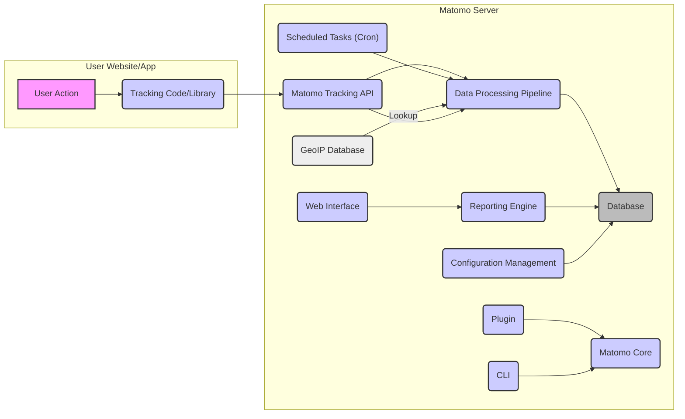
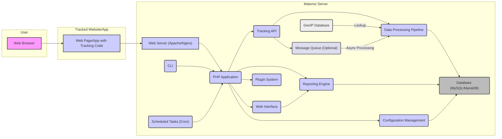

# Project Design Document: Matomo Analytics Platform

**Project Name:** Matomo Analytics Platform

**Project Repository:** https://github.com/matomo-org/matomo

**Document Version:** 1.1

**Date:** October 26, 2023

**Author:** AI Software Architect

## 1. Introduction

This document provides an enhanced and more detailed architectural design of the Matomo Analytics Platform. Building upon the previous version, it further elaborates on the key components, their interactions, data flow, and technologies used. This refined document aims to provide a stronger foundation for subsequent threat modeling activities, enabling a more granular and comprehensive security analysis of the platform.

## 2. System Overview

Matomo is a self-hosted, open-source web analytics platform focused on providing detailed insights into website and application usage while prioritizing user privacy. Its core functionality encompasses tracking user interactions, processing and aggregating this data, and presenting it through a customizable and user-friendly interface. Key features include website traffic analysis, user behavior tracking, conversion tracking, and data privacy controls.

## 3. Architectural Design

The Matomo architecture is composed of several interconnected components, each with specific responsibilities:

*   **Web Interface:** The primary user interface for accessing reports, configuring settings, and managing the Matomo instance.
*   **Tracking API:**  The entry point for collecting tracking data from websites and applications.
*   **Data Processing Pipeline:**  Responsible for transforming raw tracking data into actionable insights.
*   **Database:** The persistent storage for all data, including raw events, aggregated metrics, and configuration.
*   **Reporting Engine:**  Generates reports and visualizations based on the processed data.
*   **Configuration Management:**  Handles the management of system-wide and website-specific settings.
*   **Plugin System:**  Provides a modular framework for extending Matomo's functionality.
*   **Command-Line Interface (CLI):**  Offers administrative access for maintenance and advanced tasks.
*   **Scheduled Tasks (Cron Jobs):**  Automates background processes and periodic tasks.
*   **GeoIP Database:** Used for resolving visitor locations based on IP addresses.

### 3.1 Component Details

*   **Web Interface:**
    *   Technology Stack: Primarily PHP, Twig templating engine, HTML, CSS, and JavaScript.
    *   Functionality: User authentication, authorization, dashboard rendering, report visualization, settings management, plugin management.
    *   Communication: Interacts with the Reporting Engine, Configuration Management, and Plugin System via internal APIs and direct database queries.
*   **Tracking API:**
    *   Protocols: HTTP(S) GET and POST requests.
    *   Data Formats: Accepts tracking data in various formats, including query parameters, JSON payloads, and image requests (pixel tracking).
    *   Key Functions: Data validation, session identification, queuing of tracking requests, and interaction with the Data Processing Pipeline.
    *   Security Considerations: Vulnerable to injection attacks if input validation is insufficient. Requires protection against abuse and spam tracking.
*   **Data Processing Pipeline:**
    *   Stages:
        *   **Ingestion:** Receiving and initially validating tracking data from the Tracking API.
        *   **Enrichment:** Adding contextual information, such as geolocation (using the GeoIP Database), device type, and browser details.
        *   **Sessionization:** Grouping individual tracking events into user sessions.
        *   **Aggregation:** Calculating metrics and statistics based on the processed data.
        *   **Data Anonymization:** Applying configured privacy settings, such as IP address anonymization.
    *   Implementation: Can involve direct processing or utilize message queues for asynchronous processing of large volumes of data.
*   **Database:**
    *   Supported Databases: Primarily MySQL or MariaDB, with PostgreSQL as a supported alternative.
    *   Data Storage: Stores raw tracking events, aggregated reports, website configurations, user accounts, and plugin data.
    *   Schema: A well-defined schema is critical for performance and data integrity.
    *   Security Considerations: Requires secure configuration, access controls, and regular backups.
*   **Reporting Engine:**
    *   Functionality: Executes queries against the database to retrieve aggregated data, performs calculations, and formats data for presentation in reports.
    *   Customization: Allows for the creation of custom reports and dashboards.
    *   Integration: Provides APIs for external systems to access report data.
*   **Configuration Management:**
    *   Scope: Manages global settings, website-specific configurations, user roles and permissions, and data retention policies.
    *   Storage: Configuration data is typically stored in the database.
    *   Access Control: Restricts access to configuration settings based on user roles.
*   **Plugin System:**
    *   Architecture: Allows developers to create and install plugins that extend Matomo's core functionality.
    *   Plugin Types: Plugins can introduce new features, tracking methods, integrations, reports, and user interface elements.
    *   Security Considerations: Plugins represent a potential attack surface if not developed securely. Matomo provides APIs and hooks for plugin development, but security relies on plugin developers following best practices.
*   **Command-Line Interface (CLI):**
    *   Purpose: Provides administrative commands for tasks such as database management, cache clearing, plugin management, and user administration.
    *   Access: Typically accessed via a terminal or SSH. Requires appropriate authentication.
*   **Scheduled Tasks (Cron Jobs):**
    *   Examples: Processing queued tracking data, generating reports, archiving old data, sending email reports, and performing system maintenance tasks.
    *   Configuration: Scheduled tasks are configured within the operating system's cron scheduler.
*   **GeoIP Database:**
    *   Functionality: Maps IP addresses to geographical locations, enabling features like visitor location tracking and reporting.
    *   Updates: Requires regular updates to maintain accuracy.

## 4. Data Flow

The journey of website analytics data through the Matomo platform can be described as follows:

1. **User Interaction & Tracking Request:** A user interacts with a website or application that has Matomo tracking code implemented. This triggers a request sent to the Matomo Tracking API. The request includes details about the user's action, the page they visited, their browser information, and other relevant data.
2. **Tracking API Reception & Validation:** The Matomo Tracking API receives the request. It performs initial validation checks to ensure the data is in the expected format and contains necessary information.
3. **Data Queuing (Optional):** For high-traffic websites, tracking requests might be queued to prevent overload on the processing pipeline. Message queues like RabbitMQ or Kafka can be used for this purpose.
4. **Data Processing & Enrichment:** The Data Processing Pipeline retrieves the tracking data. It enriches the data by adding information like the visitor's geographical location (using the GeoIP Database), device type, and operating system.
5. **Sessionization:** The pipeline identifies and groups individual tracking events into user sessions based on timestamps and user identifiers.
6. **Data Aggregation:**  Processed data is aggregated to calculate key metrics and statistics, such as page views, unique visitors, bounce rate, and conversion rates.
7. **Data Storage:** Both raw tracking events and aggregated data are stored in the database. The retention period for raw data is configurable.
8. **Report Request:** A user logs into the Matomo Web Interface and requests a specific report or navigates through the dashboards.
9. **Report Generation:** The Reporting Engine receives the request from the Web Interface. It queries the database for the necessary aggregated data based on the report parameters.
10. **Report Presentation:** The Reporting Engine formats the retrieved data, and the Web Interface displays the report to the user, often using charts and visualizations.

## 5. Key Technologies

*   **Primary Programming Language:** PHP
*   **Frontend Technologies:** HTML, CSS, JavaScript, Twig templating engine
*   **Database Management Systems:** MySQL/MariaDB (primary), PostgreSQL (supported)
*   **Web Servers:** Apache or Nginx (typically used for deployment)
*   **Operating Systems:** Linux (most common), Windows
*   **Caching Mechanisms:**  Support for various caching solutions like Redis, Memcached, and file-based caching.
*   **Message Queues (Optional):** RabbitMQ, Kafka (for asynchronous processing).
*   **GeoIP Library:**  Utilizes libraries for GeoIP lookups.

## 6. Deployment Model

Matomo's self-hosted nature allows for flexible deployment options:

*   **On-Premise Infrastructure:** Installation directly on physical or virtual servers managed by the user.
*   **Cloud-Based Deployment:** Deployment on cloud platforms like AWS, Azure, Google Cloud, using services like EC2, virtual machines, or managed Kubernetes.
*   **Containerization:** Deployment using Docker containers, often orchestrated with Kubernetes or Docker Compose. This allows for scalable and reproducible deployments.
*   **Platform as a Service (PaaS):** Some PaaS providers offer simplified deployment options for PHP applications, which can be used for Matomo.

## 7. Security Considerations (Detailed)

This section expands on the security considerations, providing more specific examples of potential threats and areas of concern:

*   **Authentication and Authorization:**
    *   Threats: Brute-force attacks on login forms, weak password policies, privilege escalation by malicious users.
    *   Considerations: Strong password policies, multi-factor authentication, role-based access control, regular security audits of user permissions.
*   **Input Validation and Output Encoding:**
    *   Threats: SQL injection, cross-site scripting (XSS), command injection vulnerabilities in the Tracking API, Web Interface, and plugin interactions.
    *   Considerations: Strict input validation on all user-supplied data, proper output encoding to prevent script injection, use of parameterized queries for database interactions.
*   **Data Privacy and Compliance:**
    *   Threats: Unauthorized access to personal data, insufficient anonymization, non-compliance with regulations like GDPR.
    *   Considerations: Implementing data anonymization techniques, providing users with control over their data, adhering to data retention policies, secure storage of personal data.
*   **Secure Communication (HTTPS):**
    *   Threats: Man-in-the-middle attacks if communication is not encrypted.
    *   Considerations: Enforcing HTTPS for all communication, proper SSL/TLS certificate management.
*   **Database Security:**
    *   Threats: Unauthorized access to the database, data breaches, SQL injection vulnerabilities.
    *   Considerations: Strong database passwords, restricted database access, regular security patching of the database server, secure database configuration.
*   **Plugin Security:**
    *   Threats: Malicious plugins introducing vulnerabilities, insecure plugin code leading to exploits.
    *   Considerations: Code reviews for plugins, a secure plugin marketplace with vetting processes, clear guidelines for plugin development, sandboxing of plugin execution.
*   **Cross-Site Request Forgery (CSRF):**
    *   Threats: Unauthorized actions performed on behalf of authenticated users.
    *   Considerations: Implementation of CSRF tokens for all state-changing requests.
*   **Clickjacking:**
    *   Threats: Tricking users into performing unintended actions by embedding Matomo pages in malicious iframes.
    *   Considerations: Use of the `X-Frame-Options` HTTP header to prevent embedding.
*   **Denial of Service (DoS) Attacks:**
    *   Threats: Overwhelming the Matomo server with requests, making it unavailable.
    *   Considerations: Implementing rate limiting, using a web application firewall (WAF), and potentially utilizing a content delivery network (CDN).
*   **File Upload Vulnerabilities:**
    *   Threats: Uploading malicious files that could be executed on the server.
    *   Considerations: Strict validation of uploaded files, storing uploaded files outside the webroot, and potentially using virus scanning.
*   **Session Management:**
    *   Threats: Session hijacking, session fixation attacks.
    *   Considerations: Secure session cookie handling, using HTTPOnly and Secure flags, regular session regeneration.

## 8. Diagrams

### 8.1 Enhanced Architecture Diagram

## 9. Conclusion

This improved design document provides a more detailed and comprehensive understanding of the Matomo Analytics Platform's architecture. The enhanced descriptions of components, data flow, and security considerations offer a stronger foundation for effective threat modeling. By leveraging this document, security analysts can more accurately identify potential vulnerabilities and develop appropriate mitigation strategies to ensure the security and integrity of the Matomo platform and the data it processes. The next step is to conduct a thorough threat modeling exercise based on this detailed design.