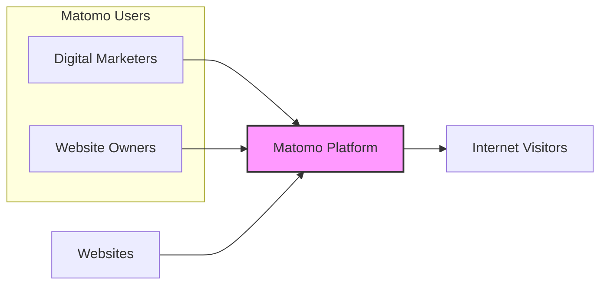

# BUSINESS POSTURE

This project, Matomo, is an open-source web analytics platform. The primary business goal is to provide website owners and digital marketers with a comprehensive and privacy-focused analytics solution. Matomo aims to be a viable alternative to proprietary analytics platforms, emphasizing data ownership and user privacy.

Business priorities include:
- Providing accurate and reliable web analytics data.
- Ensuring user privacy and data protection, complying with relevant regulations like GDPR and CCPA.
- Offering a feature-rich platform comparable to or exceeding competitors.
- Maintaining a stable, performant, and scalable platform.
- Fostering a strong open-source community and ecosystem.
- Offering both self-hosted and cloud-hosted solutions to cater to different user needs.

Key business risks to address:
- Data breaches and privacy violations leading to reputational damage and legal liabilities.
- Inaccurate or unreliable analytics data leading to poor business decisions by users.
- Performance and scalability issues affecting user experience and platform adoption.
- Security vulnerabilities in the platform being exploited by malicious actors.
- Competition from established analytics platforms and emerging privacy-focused alternatives.
- Dependence on community contributions and maintenance for the open-source version.

# SECURITY POSTURE

Existing security controls:
- security control: Secure Software Development Lifecycle (SSDLC) - assumed to be in place, given the project's maturity and open-source nature, although specific details are not provided in the input.
- security control: Code reviews - likely practiced within the open-source contribution process, although the extent and rigor are not specified.
- security control: Input validation - expected to be implemented throughout the application to prevent common web vulnerabilities.
- security control: Authentication and Authorization - necessary for user access to analytics data and platform administration.
- security control: Encryption in transit (HTTPS) - standard practice for web applications, assumed to be enforced for both self-hosted and cloud versions.
- security control: Database security - assumed to be in place, including access controls and potentially encryption at rest.
- security control: Regular security updates - expected for an open-source project with a focus on security.

Accepted risks:
- accepted risk: Potential vulnerabilities in third-party libraries - inherent risk in using external dependencies, mitigated by dependency scanning and updates.
- accepted risk: Security misconfigurations by self-hosted users - users self-hosting Matomo are responsible for their own server security.
- accepted risk: Social engineering attacks targeting Matomo users - users are responsible for their own account security practices.

Recommended security controls:
- security control: Implement automated security testing (SAST/DAST) in the CI/CD pipeline.
- security control: Conduct regular penetration testing by external security experts.
- security control: Implement a vulnerability disclosure program to encourage responsible reporting of security issues.
- security control: Enhance security logging and monitoring for proactive threat detection and incident response.
- security control: Implement rate limiting and защита от DDoS attacks to ensure availability.
- security control: Provide security hardening guides for self-hosted deployments.

Security requirements:
- Authentication:
    - requirement: Secure authentication mechanisms for user logins (e.g., password-based with strong password policies, multi-factor authentication).
    - requirement: Protection against brute-force attacks and account enumeration.
    - requirement: Session management to prevent session hijacking.
- Authorization:
    - requirement: Role-based access control (RBAC) to manage user permissions and access to different features and data.
    - requirement: Granular permissions to control access to specific websites and analytics data.
    - requirement: Principle of least privilege applied to user roles and system components.
- Input validation:
    - requirement: Comprehensive input validation on all user inputs to prevent injection attacks (SQL injection, XSS, etc.).
    - requirement: Input sanitization and encoding to neutralize potentially malicious input.
    - requirement: Use of parameterized queries or ORM to prevent SQL injection.
- Cryptography:
    - requirement: Encryption of sensitive data at rest (e.g., personal data, API keys).
    - requirement: Secure key management practices for encryption keys.
    - requirement: Use of strong cryptographic algorithms and protocols.
    - requirement: HTTPS enforced for all communication to protect data in transit.

# DESIGN

## C4 CONTEXT



Context Diagram Elements:

- Element:
    - Name: Digital Marketers
    - Type: Person
    - Description: Professionals who use analytics data to optimize marketing campaigns and strategies.
    - Responsibilities: Analyze website traffic and user behavior data provided by Matomo to improve marketing effectiveness.
    - Security controls: Account security (strong passwords, MFA), access control to Matomo platform.
- Element:
    - Name: Website Owners
    - Type: Person
    - Description: Individuals or organizations who own and manage websites and need to understand website performance and user engagement.
    - Responsibilities: Use Matomo to track website performance, understand user behavior, and make data-driven decisions to improve their websites.
    - Security controls: Account security (strong passwords, MFA), access control to Matomo platform.
- Element:
    - Name: Websites
    - Type: External System
    - Description: Websites that are being tracked by Matomo. Website owners embed Matomo tracking code into their websites.
    - Responsibilities: Host the Matomo tracking code, send visitor data to the Matomo platform.
    - Security controls: HTTPS to ensure secure data transmission to Matomo, Content Security Policy (CSP) to control the execution of scripts.
- Element:
    - Name: Matomo Platform
    - Type: Software System
    - Description: The web analytics platform itself, responsible for collecting, processing, and reporting website visitor data.
    - Responsibilities: Collect website visitor data, store and process data, provide reporting and analytics dashboards, manage user accounts and permissions.
    - Security controls: Authentication, authorization, input validation, encryption, security logging, regular security updates, infrastructure security.
- Element:
    - Name: Internet Visitors
    - Type: Person
    - Description: Users who visit websites tracked by Matomo. Their browsing activity is tracked by Matomo.
    - Responsibilities: Browse websites. Their data is collected by Matomo for analytics purposes.
    - Security controls: Privacy controls (e.g., Do Not Track, browser privacy settings), Matomo's privacy features (e.g., anonymization, data deletion).

## C4 CONTAINER

```mermaid
graph LR
    subgraph "Matomo Platform"
        subgraph "Web Application Container"
            A[Web Server]
            B[PHP Application]
        end
        C[Database Server]
        D[Message Queue (Optional)]
        E[Cache Server (Optional)]
        F[File Storage (Optional)]
    end

    A --> B
    B --> C
    B --> D
    B --> E
    B --> F
    style A fill:#f9f9f9,stroke:#333,stroke-width:1px
    style B fill:#f9f9f9,stroke:#333,stroke-width:1px
    style C fill:#f9f9f9,stroke:#333,stroke-width:1px
    style D fill:#f9f9f9,stroke:#333,stroke-width:1px
    style E fill:#f9f9f9,stroke:#333,stroke-width:1px
    style F fill:#f9f9f9,stroke:#333,stroke-width:1px
    style "Matomo Platform" fill:#f9f,stroke:#333,stroke-width:2px
```

Container Diagram Elements:

- Element:
    - Name: Web Server
    - Type: Container
    - Description: Handles HTTP requests from users and serves the PHP application. Examples: Apache, Nginx.
    - Responsibilities: Reverse proxy, SSL termination, static content serving, request routing to the PHP application.
    - Security controls: HTTPS configuration, web server hardening, access controls, DDoS protection.
- Element:
    - Name: PHP Application
    - Type: Container
    - Description: The core Matomo application logic written in PHP. Processes user requests, interacts with the database, and generates reports.
    - Responsibilities: Application logic, data processing, user authentication and authorization, API endpoints, report generation.
    - Security controls: Input validation, output encoding, secure coding practices, vulnerability scanning, framework security features, session management, authentication and authorization mechanisms.
- Element:
    - Name: Database Server
    - Type: Container
    - Description: Stores Matomo data, including website visitor data, user accounts, and configuration. Examples: MySQL, MariaDB, PostgreSQL.
    - Responsibilities: Data persistence, data retrieval, data integrity, database security.
    - Security controls: Database access controls, encryption at rest, regular backups, database hardening, SQL injection prevention (via parameterized queries in PHP application).
- Element:
    - Name: Message Queue (Optional)
    - Type: Container
    - Description: Used for asynchronous task processing, such as processing large volumes of tracking data or sending email reports. Examples: RabbitMQ, Redis.
    - Responsibilities: Asynchronous task processing, message queuing.
    - Security controls: Message queue access controls, message encryption (if sensitive data is queued).
- Element:
    - Name: Cache Server (Optional)
    - Type: Container
    - Description: Caching frequently accessed data to improve performance. Examples: Redis, Memcached.
    - Responsibilities: Caching data, improving application performance.
    - Security controls: Cache access controls, securing cached data (if sensitive).
- Element:
    - Name: File Storage (Optional)
    - Type: Container
    - Description: Stores uploaded files, reports, or other static assets. Could be local file system or cloud storage.
    - Responsibilities: File storage, file retrieval.
    - Security controls: Access controls to file storage, malware scanning for uploaded files, secure file storage configuration.

## DEPLOYMENT

Deployment Solution: On-Premises Deployment

```mermaid
graph LR
    subgraph "On-Premises Data Center"
        subgraph "Web Tier"
            A[Web Server Instance 1]
            B[Web Server Instance 2]
            C[Load Balancer]
        end
        subgraph "Application Tier"
            D[Application Server Instance 1]
            E[Application Server Instance 2]
        end
        F[Database Server]
    end

    C --> A
    C --> B
    A --> D
    B --> E
    D --> F
    E --> F
    style "On-Premises Data Center" fill:#f9f,stroke:#333,stroke-width:2px
    style "Web Tier" fill:#f9f9f9,stroke:#333,stroke-width:1px
    style "Application Tier" fill:#f9f9f9,stroke:#333,stroke-width:1px
    style A fill:#f9f9f9,stroke:#333,stroke-width:1px
    style B fill:#f9f9f9,stroke:#333,stroke-width:1px
    style C fill:#f9f9f9,stroke:#333,stroke-width:1px
    style D fill:#f9f9f9,stroke:#333,stroke-width:1px
    style E fill:#f9f9f9,stroke:#333,stroke-width:1px
    style F fill:#f9f9f9,stroke:#333,stroke-width:1px
```

Deployment Diagram Elements:

- Element:
    - Name: Load Balancer
    - Type: Infrastructure
    - Description: Distributes incoming traffic across multiple web server instances for high availability and scalability.
    - Responsibilities: Traffic distribution, health checks, SSL termination.
    - Security controls: DDoS protection, rate limiting, access control lists (ACLs).
- Element:
    - Name: Web Server Instance 1 & 2
    - Type: Infrastructure (Virtual Machine/Container)
    - Description: Instances of the web server container (e.g., Nginx) running the PHP application.
    - Responsibilities: Serve web application, handle HTTP requests.
    - Security controls: Operating system hardening, web server hardening, security updates, intrusion detection system (IDS).
- Element:
    - Name: Application Server Instance 1 & 2
    - Type: Infrastructure (Virtual Machine/Container)
    - Description: Instances of the application server running the PHP application logic. In some deployments, web server and application server might be combined in the same instance.
    - Responsibilities: Run application logic, process data, interact with database.
    - Security controls: Operating system hardening, application server hardening, security updates, intrusion detection system (IDS).
- Element:
    - Name: Database Server
    - Type: Infrastructure (Physical Server/Virtual Machine/Container)
    - Description: Database server hosting the Matomo database (e.g., MySQL).
    - Responsibilities: Data storage, data management, database operations.
    - Security controls: Database server hardening, database access controls, encryption at rest, regular backups, database monitoring, intrusion detection system (IDS).

## BUILD

```mermaid
graph LR
    A[Developer] --> B{Code Changes};
    B --> C[Version Control System (e.g., GitHub)];
    C --> D[CI/CD Pipeline (e.g., GitHub Actions)];
    D --> E{Build Process};
    E --> F{Security Scans (SAST, DAST, Dependency)};
    F --> G{Unit & Integration Tests};
    G --> H{Build Artifacts (e.g., Packages, Containers)};
    H --> I[Artifact Repository];
    style D fill:#f9f,stroke:#333,stroke-width:2px
```

Build Process Diagram Elements:

- Element:
    - Name: Developer
    - Type: Person
    - Description: Software developer writing and modifying the Matomo codebase.
    - Responsibilities: Code development, bug fixing, feature implementation, code reviews.
    - Security controls: Secure coding practices, code review participation, access control to development environment.
- Element:
    - Name: Version Control System (e.g., GitHub)
    - Type: Tool
    - Description: System for managing and tracking changes to the source code.
    - Responsibilities: Source code management, version control, collaboration, code review workflows.
    - Security controls: Access control to repository, branch protection, audit logging.
- Element:
    - Name: CI/CD Pipeline (e.g., GitHub Actions)
    - Type: Tool
    - Description: Automated pipeline for building, testing, and deploying the software.
    - Responsibilities: Build automation, testing automation, deployment automation, security checks integration.
    - Security controls: Pipeline security configuration, access control to pipeline, secure secrets management, audit logging.
- Element:
    - Name: Build Process
    - Type: Process
    - Description: Steps involved in compiling, packaging, and preparing the software for deployment.
    - Responsibilities: Code compilation, dependency management, artifact creation.
    - Security controls: Secure build environment, dependency vulnerability scanning, build reproducibility.
- Element:
    - Name: Security Scans (SAST, DAST, Dependency)
    - Type: Process
    - Description: Automated security scans performed during the build process to identify vulnerabilities.
    - Responsibilities: Static Application Security Testing (SAST), Dynamic Application Security Testing (DAST), Dependency vulnerability scanning.
    - Security controls: Configuration of security scanning tools, vulnerability reporting and remediation workflows.
- Element:
    - Name: Unit & Integration Tests
    - Type: Process
    - Description: Automated tests to ensure code quality and functionality.
    - Responsibilities: Code quality assurance, functionality verification, regression testing.
    - Security controls: Test coverage for security-relevant functionalities, security testing integrated into test suites.
- Element:
    - Name: Build Artifacts (e.g., Packages, Containers)
    - Type: Artifact
    - Description: Output of the build process, ready for deployment.
    - Responsibilities: Deployable software packages, container images.
    - Security controls: Artifact signing, artifact integrity checks, vulnerability scanning of artifacts.
- Element:
    - Name: Artifact Repository
    - Type: Tool
    - Description: Repository for storing and managing build artifacts.
    - Responsibilities: Artifact storage, artifact versioning, artifact distribution.
    - Security controls: Access control to repository, artifact integrity verification, vulnerability scanning of stored artifacts.

# RISK ASSESSMENT

Critical business processes to protect:
- Collection of website visitor data: Essential for providing analytics services. Disruption or compromise can lead to inaccurate data and loss of trust.
- Processing and storage of analytics data: Core function of Matomo. Data loss or corruption can severely impact service delivery.
- Access to analytics dashboards and reports: How users interact with Matomo. Unauthorized access can lead to data breaches and privacy violations.
- User authentication and authorization: Controls access to the platform. Compromise can lead to unauthorized access and data manipulation.

Data to protect and sensitivity:
- Website visitor data: Potentially sensitive personal data depending on configuration and tracking settings (IP addresses, browsing behavior, etc.). High sensitivity due to privacy regulations (GDPR, CCPA).
- User account credentials: Usernames and passwords for Matomo users. High sensitivity as compromise can lead to unauthorized access.
- API keys and access tokens: Used for API access. High sensitivity as compromise can lead to unauthorized data access and manipulation.
- Configuration data: Settings for Matomo platform and websites being tracked. Medium sensitivity as misconfiguration can lead to security vulnerabilities or data breaches.

# QUESTIONS & ASSUMPTIONS

Questions:
- What specific SSDLC practices are currently in place for Matomo development?
- Are there existing automated security testing tools integrated into the CI/CD pipeline? If so, which ones?
- Is there a formal vulnerability disclosure program?
- What type of database is primarily used for Matomo deployments (MySQL, PostgreSQL, etc.)?
- Are there specific security hardening guides available for self-hosted Matomo deployments?
- What are the typical data retention policies for website visitor data in Matomo?

Assumptions:
- Matomo aims to comply with relevant privacy regulations like GDPR and CCPA.
- Security is a significant concern for the Matomo project, given its nature as an analytics platform handling potentially sensitive data.
- Standard web application security best practices are generally followed in the development of Matomo.
- The deployment model described (on-premises) is a common scenario for self-hosted Matomo instances.
- The build process includes basic security checks, but there is room for improvement with more comprehensive automated security testing.