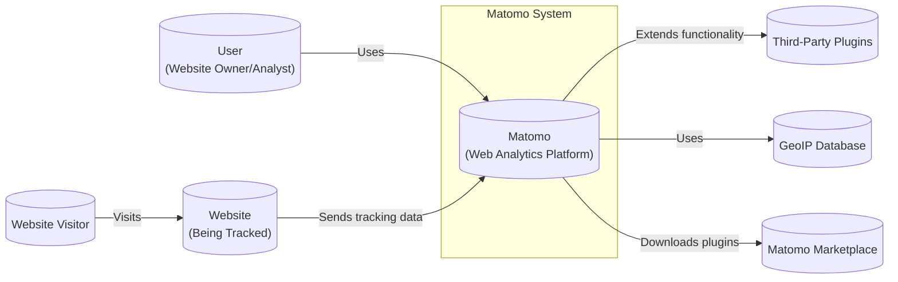
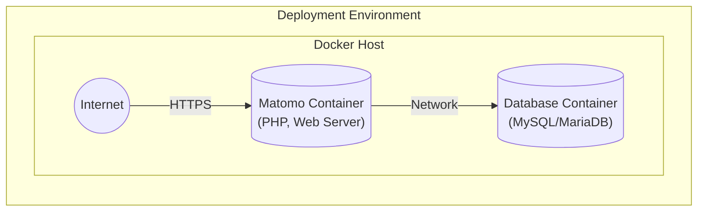
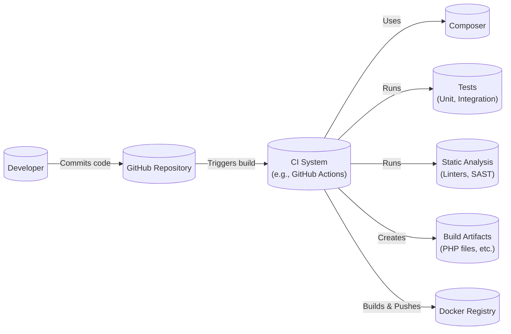

Okay, let's create a design document for the Matomo project, focusing on aspects relevant for threat modeling.

# BUSINESS POSTURE

Matomo is an open-source web analytics platform, a competitor to Google Analytics.  Its primary business goals revolve around providing users with a privacy-focused alternative for tracking website traffic and user behavior.  Success is measured by user adoption, active installations, and contributions to the open-source project.  The business model likely includes a combination of:

*   Free, self-hosted version (driving adoption and brand awareness).
*   Paid cloud-hosted version (generating revenue).
*   Paid premium plugins/features (generating revenue).
*   Enterprise support and services (generating revenue for larger clients).

Given this, the business priorities are:

1.  Maintaining User Trust:  Privacy is a core selling point. Any security breach or perception of compromised privacy would be extremely damaging.
2.  Data Accuracy and Reliability:  The analytics data must be accurate and reliable for users to make informed decisions.
3.  Platform Availability and Performance:  The platform (both self-hosted and cloud-hosted) needs to be available and performant to handle potentially large volumes of tracking data.
4.  Open Source Community Health:  A vibrant and active community is crucial for contributions, bug fixes, and overall project sustainability.
5.  Scalability: Ability to handle growing number of users and web sites.

Most important business risks that need to be addressed:

1.  Data Breach:  Unauthorized access to user tracking data, potentially exposing sensitive information about website visitors.
2.  Data Manipulation:  Malicious actors altering tracking data, leading to incorrect analytics and potentially flawed business decisions.
3.  Denial of Service:  Attacks that make the platform unavailable, disrupting tracking and access to analytics dashboards.
4.  Reputation Damage:  Any security incident, even a minor one, could significantly damage Matomo's reputation as a privacy-focused platform.
5.  Compromise of Cloud Infrastructure:  For the cloud-hosted version, a compromise of the underlying infrastructure could expose all hosted data.
6.  Supply Chain Attacks:  Vulnerabilities introduced through third-party libraries or dependencies could be exploited.
7.  Plugin Vulnerabilities:  Security flaws in third-party plugins could compromise individual Matomo installations.

# SECURITY POSTURE

Based on the GitHub repository and general knowledge of web applications and open-source projects, here's a likely security posture:

Existing Security Controls:

*   security control: Input Validation: Matomo likely implements input validation to prevent common web vulnerabilities like Cross-Site Scripting (XSS) and SQL Injection. Implemented in application code.
*   security control: Output Encoding: To prevent XSS, output encoding is likely used when displaying data in the user interface. Implemented in application code.
*   security control: Authentication: User authentication is required to access the Matomo dashboard and configure settings. Implemented in application code, described in Matomo documentation.
*   security control: Authorization: Role-based access control (RBAC) likely restricts user access to specific features and data based on their assigned roles. Implemented in application code, described in Matomo documentation.
*   security control: Session Management: Secure session management practices are likely in place to prevent session hijacking. Implemented in application code.
*   security control: CSRF Protection: Measures to prevent Cross-Site Request Forgery (CSRF) attacks are likely implemented. Implemented in application code.
*   security control: Regular Updates: The Matomo project releases regular updates to address security vulnerabilities and bug fixes. Described in Matomo documentation and release notes.
*   security control: Security Advisories: Matomo publishes security advisories to inform users about known vulnerabilities and their remediation. Described in Matomo documentation.
*   security control: Dependency Management: The project uses dependency management tools (like Composer for PHP) to manage third-party libraries. Described in `composer.json` file.
*   security control: Code Reviews: Code reviews are likely part of the development process to identify potential security issues before they are merged. Described in contribution guidelines.
*   security control: Two-Factor Authentication (2FA): Matomo supports 2FA for enhanced account security. Implemented in application code, described in Matomo documentation.
*   security control: Content Security Policy (CSP): Matomo can be configured with CSP to mitigate XSS and other code injection attacks. Described in Matomo documentation.
*   security control: HTTP Security Headers: Matomo recommends configuring various HTTP security headers (e.g., HSTS, X-Frame-Options) to enhance browser security. Described in Matomo documentation.

Accepted Risks:

*   accepted risk: Third-Party Plugin Vulnerabilities: While Matomo itself may be secure, third-party plugins can introduce vulnerabilities. Users are responsible for vetting and updating plugins.
*   accepted risk: Self-Hosting Security: Users who self-host Matomo are responsible for securing their own server infrastructure.
*   accepted risk: Configuration Errors: Misconfiguration of Matomo or its environment can lead to security vulnerabilities.

Recommended Security Controls (High Priority):

*   security control: Static Application Security Testing (SAST): Integrate SAST tools into the CI/CD pipeline to automatically scan code for vulnerabilities.
*   security control: Dynamic Application Security Testing (DAST): Regularly perform DAST scans on running instances of Matomo to identify vulnerabilities in the live application.
*   security control: Software Composition Analysis (SCA): Use SCA tools to identify known vulnerabilities in third-party dependencies and ensure they are up-to-date.
*   security control: Penetration Testing: Conduct regular penetration tests by security experts to identify and exploit potential vulnerabilities.
*   security control: Bug Bounty Program: Consider establishing a bug bounty program to incentivize security researchers to find and report vulnerabilities.
*   security control: Secrets Management: Implement a robust secrets management solution to securely store and manage API keys, database credentials, and other sensitive information.

Security Requirements:

*   Authentication:
    *   Strong password policies (length, complexity, expiration).
    *   Protection against brute-force attacks (account lockout, rate limiting).
    *   Secure storage of password hashes (using strong, salted hashing algorithms).
    *   Support for multi-factor authentication (MFA/2FA).
*   Authorization:
    *   Fine-grained access control to different features and data.
    *   Principle of least privilege (users should only have access to what they need).
    *   Regular review of user permissions.
*   Input Validation:
    *   Validate all user-supplied input on the server-side.
    *   Use a whitelist approach (allow only known-good characters and patterns).
    *   Sanitize input to prevent code injection (e.g., XSS, SQL injection).
*   Cryptography:
    *   Use strong, industry-standard cryptographic algorithms and libraries.
    *   Securely manage cryptographic keys.
    *   Encrypt sensitive data at rest and in transit (e.g., using HTTPS).
    *   Use HTTPS for all communication.
    *   Properly validate SSL/TLS certificates.

# DESIGN

## C4 CONTEXT



Element Descriptions:

*   Element:
    *   Name: User
    *   Type: Person
    *   Description: A person who uses Matomo to analyze website traffic.
    *   Responsibilities: Configures Matomo, views reports, manages settings.
    *   Security controls: Authentication, Authorization, 2FA.

*   Element:
    *   Name: Website
    *   Type: Web Application
    *   Description: The website being tracked by Matomo.
    *   Responsibilities: Includes Matomo tracking code, sends data to Matomo.
    *   Security controls: Implements security best practices for web applications (e.g., input validation, output encoding).

*   Element:
    *   Name: Website Visitor
    *   Type: Person
    *   Description: A person who visits the website being tracked.
    *   Responsibilities: Interacts with the website.
    *   Security controls: None directly controlled by Matomo; relies on website's security.

*   Element:
    *   Name: Matomo
    *   Type: Web Application
    *   Description: The core Matomo web analytics platform.
    *   Responsibilities: Receives tracking data, processes data, provides reporting interface.
    *   Security controls: Input validation, output encoding, authentication, authorization, session management, CSRF protection, etc.

*   Element:
    *   Name: Third-Party Plugins
    *   Type: Software System
    *   Description: Plugins that extend Matomo's functionality.
    *   Responsibilities: Provide additional features (e.g., custom reports, integrations).
    *   Security controls: Vary depending on the plugin; users should vet plugins carefully.

*   Element:
    *   Name: GeoIP Database
    *   Type: Database
    *   Description: Database used for geolocation of IP addresses.
    *   Responsibilities: Provides location information based on IP addresses.
    *   Security controls: Access control, regular updates.

*   Element:
    *   Name: Matomo Marketplace
    *   Type: Web Application
    *   Description: Marketplace for downloading Matomo plugins.
    *   Responsibilities: Hosts and distributes plugins.
    *   Security controls: Code signing (potentially), vulnerability scanning of plugins.

## C4 CONTAINER

```mermaid
graph LR
    subgraph Matomo System
        User[("User\n(Website Owner/Analyst)")]
        Website[("Website\n(Being Tracked)")]

        subgraph Matomo Application
            TrackingAPI[("Tracking API\n(PHP)")]
            ReportingAPI[("Reporting API\n(PHP)")]
            UI[("User Interface\n(PHP, JavaScript)")]
            Plugins[("Plugins\n(PHP)")]
            Database[(("Database\n(MySQL/MariaDB)"))]
        end

        User -- "Uses HTTPS" --> UI
        Website -- "Sends tracking data via HTTPS" --> TrackingAPI
        UI -- "Makes API requests" --> ReportingAPI
        TrackingAPI -- "Reads/Writes" --> Database
        ReportingAPI -- "Reads" --> Database
        Plugins -- "Interacts with" --> TrackingAPI
        Plugins -- "Interacts with" --> ReportingAPI
        Plugins -- "Reads/Writes" --> Database
    end
```

Element Descriptions:

*   Element:
    *   Name: User
    *   Type: Person
    *   Description: A person who uses Matomo to analyze website traffic.
    *   Responsibilities: Configures Matomo, views reports, manages settings.
    *   Security controls: Authentication, Authorization, 2FA.

*   Element:
    *   Name: Website
    *   Type: Web Application
    *   Description: The website being tracked by Matomo.
    *   Responsibilities: Includes Matomo tracking code, sends data to Matomo.
    *   Security controls: Implements security best practices for web applications.

*   Element:
    *   Name: Tracking API
    *   Type: Web Application
    *   Description: Receives tracking data from websites.
    *   Responsibilities: Processes and stores tracking data.
    *   Security controls: Input validation, rate limiting, protection against DoS attacks.

*   Element:
    *   Name: Reporting API
    *   Type: Web Application
    *   Description: Provides data for the user interface and other reporting tools.
    *   Responsibilities: Retrieves and aggregates data from the database.
    *   Security controls: Authentication, authorization, input validation.

*   Element:
    *   Name: User Interface
    *   Type: Web Application
    *   Description: The web-based interface for users to interact with Matomo.
    *   Responsibilities: Displays reports, allows configuration, provides user management.
    *   Security controls: Output encoding, XSS prevention, CSRF protection, session management.

*   Element:
    *   Name: Plugins
    *   Type: Software Component
    *   Description: Extend Matomo's functionality.
    *   Responsibilities: Provide additional features.
    *   Security controls: Vary; rely on plugin developers to implement security best practices.

*   Element:
    *   Name: Database
    *   Type: Database
    *   Description: Stores tracking data, configuration, and user information.
    *   Responsibilities: Data persistence.
    *   Security controls: Access control, encryption at rest (potentially), regular backups, database hardening.

## DEPLOYMENT

Possible Deployment Solutions:

1.  Self-Hosted (Traditional):  Matomo is downloaded and installed on a user-managed server (e.g., using Apache/Nginx, PHP, and MySQL/MariaDB).
2.  Self-Hosted (Docker):  Matomo is deployed using Docker containers, simplifying installation and management.
3.  Cloud-Hosted (Matomo Cloud):  Matomo is hosted on Matomo's own cloud infrastructure.
4.  Cloud-Hosted (Third-Party): Matomo is deployed on a cloud provider like AWS, Google Cloud, or Azure, often using managed services (e.g., RDS for the database, load balancers).

Chosen Solution for Detailed Description: Self-Hosted (Docker)

This is a popular option that balances ease of deployment with control over the environment.



Element Descriptions:

*   Element:
    *   Name: Docker Host
    *   Type: Server
    *   Description: The physical or virtual server running Docker.
    *   Responsibilities: Hosts the Docker containers.
    *   Security controls: Operating system hardening, firewall, regular security updates.

*   Element:
    *   Name: Matomo Container
    *   Type: Container
    *   Description: The container running the Matomo application (PHP and web server).
    *   Responsibilities: Serves the Matomo application.
    *   Security controls: Container hardening, minimal base image, regular image updates.

*   Element:
    *   Name: Database Container
    *   Type: Container
    *   Description: The container running the database (MySQL/MariaDB).
    *   Responsibilities: Stores Matomo data.
    *   Security controls: Database hardening, access control, data encryption (potentially), regular backups.
* Element:
    *   Name: Internet
    *   Type: Network
    *   Description: External network.
    *   Responsibilities: Provides access to application.
    *   Security controls: Firewall.

## BUILD

Matomo's build process likely involves the following:

1.  Developer: Writes code and commits changes to the Git repository (GitHub).
2.  Continuous Integration (CI):  A CI system (e.g., GitHub Actions, Travis CI) automatically triggers builds on each commit.
3.  Dependency Management: Composer (PHP) is used to manage dependencies.
4.  Build Steps:
    *   Checkout Code: The CI system checks out the latest code from the repository.
    *   Install Dependencies: Composer installs the required PHP dependencies.
    *   Run Tests: Unit tests, integration tests, and potentially other tests are executed.
    *   Static Analysis: Linters (e.g., PHPStan) and static analysis tools check for code quality and potential security issues.
    *   Build Artifacts: The build process creates the necessary files for deployment (e.g., PHP files, JavaScript files, CSS files).
    *   Create Docker Image (for Docker deployments): A Dockerfile is used to build a Docker image containing the Matomo application.
    *   Push Docker Image (for Docker deployments): The Docker image is pushed to a container registry (e.g., Docker Hub).
5.  Release:  A new release is tagged in the Git repository, and the build artifacts are made available for download.



Security Controls in Build Process:

*   security control: Dependency Scanning: SCA tools are (or should be) used to identify known vulnerabilities in dependencies.
*   security control: Static Analysis: SAST tools are (or should be) used to identify potential security vulnerabilities in the code.
*   security control: Code Signing: Release artifacts could be digitally signed to ensure their integrity.
*   security control: Least Privilege: CI/CD pipelines should run with minimal necessary permissions.
*   security control: Secrets Management: API keys and other secrets used in the build process should be securely managed.

# RISK ASSESSMENT

Critical Business Processes to Protect:

1.  Website Traffic Tracking: The core functionality of collecting and processing website traffic data.
2.  Data Reporting and Analysis: Providing users with access to their analytics data and reports.
3.  User Account Management: Managing user accounts, authentication, and authorization.
4.  Plugin Management (for the Matomo Marketplace): Ensuring the integrity and security of plugins.
5.  Cloud Hosting Infrastructure (for Matomo Cloud): Maintaining the security and availability of the cloud platform.

Data to Protect and Sensitivity:

1.  Website Traffic Data:
    *   URLs visited
    *   Visitor IP addresses (can be anonymized)
    *   Browser and device information
    *   Referrer information
    *   Custom dimensions and metrics
    *   Sensitivity: Potentially Personally Identifiable Information (PII), especially if IP addresses are not anonymized.  Can reveal sensitive information about website visitors and their behavior.
2.  User Account Data:
    *   Usernames
    *   Email addresses
    *   Password hashes
    *   API keys
    *   Sensitivity: PII.  Compromise could lead to unauthorized access to Matomo accounts and data.
3.  Configuration Data:
    *   Website settings
    *   Tracking configurations
    *   Sensitivity: Could reveal information about how Matomo is configured and potentially expose vulnerabilities.
4.  Plugin Data (for the Matomo Marketplace):
    *   Plugin code
    *   Plugin metadata
    *   Sensitivity: Compromise could allow attackers to distribute malicious plugins.

# QUESTIONS & ASSUMPTIONS

Questions:

1.  What specific SAST, DAST, and SCA tools are currently used in the Matomo development process?
2.  What is the exact CI/CD pipeline configuration (e.g., which CI system is used, what are the build steps)?
3.  What are the specific database hardening measures implemented for self-hosted and cloud-hosted deployments?
4.  What is the process for handling security vulnerabilities reported by external researchers?
5.  What are the specific security measures in place for the Matomo Cloud infrastructure?
6.  Are there any regular external security audits or penetration tests performed?
7.  What is the process for reviewing and approving third-party plugins for the Matomo Marketplace?
8.  Is there a formal incident response plan in place?
9.  How are cryptographic keys managed (e.g., for database encryption, API keys)?
10. What kind of monitoring and logging is in place to detect and respond to security incidents?

Assumptions:

*   BUSINESS POSTURE: Assumes Matomo prioritizes user privacy and data security as core business values.
*   SECURITY POSTURE: Assumes basic security controls (input validation, output encoding, authentication, etc.) are implemented, but may not be comprehensive. Assumes users are responsible for securing their self-hosted environments.
*   DESIGN: Assumes a standard PHP/MySQL web application architecture. Assumes Docker is a common deployment method. Assumes a CI/CD pipeline is used for builds and releases.