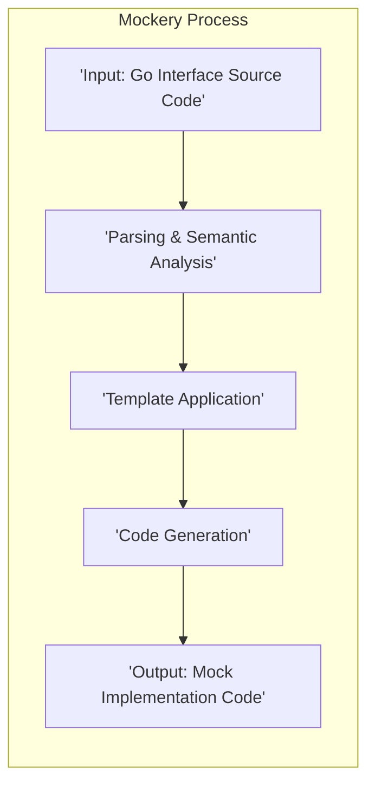
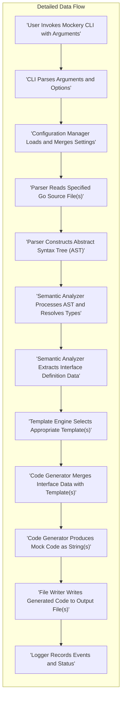

# Project Design Document: Mockery

**Version:** 1.1
**Date:** October 26, 2023
**Author:** AI Software Architect

## 1. Introduction

This document provides an enhanced design overview of the Mockery project, a widely used Go tool for generating mock implementations of Go interfaces. The purpose of this document is to offer a clear and comprehensive understanding of Mockery's architecture, its constituent parts, and the flow of data within it. This detailed design serves as a crucial foundation for conducting thorough threat modeling activities.

## 2. Goals

*   To present a refined and more detailed description of Mockery's architecture and operational mechanisms.
*   To clearly delineate the individual components of Mockery and elucidate their interactions and responsibilities.
*   To provide a precise depiction of the data flow during the mock generation process.
*   To act as a robust and informative resource for subsequent threat modeling exercises.
*   To ensure the design is articulated in a manner that is easily comprehensible for both technical experts and non-technical stakeholders.

## 3. Non-Goals

*   This document will not delve into the intricate implementation specifics of particular functions or algorithms within the Mockery codebase.
*   It is not intended to be a comprehensive security analysis report or a fully realized threat model.
*   The document will not cover the testing methodologies or quality assurance procedures employed in the development of Mockery.
*   It will not explore the historical evolution of the project or the specific justifications behind past design choices.

## 4. Architectural Overview

Mockery functions as a command-line utility designed to automate the creation of Go source code for mock objects. These mocks are based on existing Go interface definitions. The tool analyzes Go source files containing these interfaces and generates corresponding mock files, which are essential for effective unit testing. The fundamental architecture involves stages of input processing, code generation driven by templates, and the final output of the generated code to files.

## 5. Components

This section provides a more detailed breakdown of the key components within the Mockery system and their specific roles.

*   **Command-Line Interface (CLI):**
    *   Serves as the primary interaction point for users executing Mockery.
    *   Handles the interpretation of command-line arguments and specified options.
    *   Manages and orchestrates the entire mock generation workflow.
*   **Parser:**
    *   Responsible for reading and interpreting Go source code files.
    *   Specifically focuses on extracting interface definitions, including method signatures, parameter types, and return types.
    *   Leverages the standard Go libraries `go/parser` and `go/ast` for abstract syntax tree manipulation.
*   **Semantic Analyzer:**
    *   Performs in-depth analysis of the parsed interface definitions.
    *   Resolves type information, including fully qualified names and dependencies on other packages.
    *   Constructs the necessary data structures that will be used by the code generation phase.
*   **Template Engine:**
    *   Utilizes Go's built-in `text/template` package for code generation.
    *   Contains a set of predefined templates that define the structure and logic of the generated mock code.
    *   Offers mechanisms for users to potentially customize the structure and content of the generated code.
*   **Code Generator:**
    *   Takes the semantically analyzed interface data and applies it to the selected templates.
    *   Generates the concrete Go source code representing the mock implementation.
    *   Ensures proper formatting, indentation, and adherence to Go coding conventions in the generated code.
*   **File Writer:**
    *   Handles the process of writing the generated mock code to the designated output files.
    *   Manages file creation, overwriting existing files based on user configuration, and directory creation if necessary.
*   **Configuration Manager:**
    *   Manages all configuration parameters for Mockery.
    *   Loads and prioritizes configuration from command-line flags, configuration files (if provided), and default settings.
    *   Controls aspects like output paths, package names for generated mocks, and whether to generate all mocks or specific ones.
*   **Logger:**
    *   Provides a standardized mechanism for logging events during Mockery's execution.
    *   Outputs informational messages about the progress of the generation, warnings about potential issues, and error messages when failures occur.
    *   Aids in debugging and understanding the execution flow of the tool.

## 6. Data Flow

The following describes the detailed flow of data through the Mockery system during a typical mock generation operation.

**Detailed Data Flow Steps:**

1. **User Invokes Mockery CLI with Arguments:** The user initiates the `mockery` command in their terminal, providing arguments such as the interface name, source file paths, and any desired options.
2. **CLI Parses Arguments and Options:** The Command-Line Interface component receives the command and parses the provided arguments and options to understand the user's intent.
3. **Configuration Manager Loads and Merges Settings:** The Configuration Manager loads settings from various sources, including command-line flags, configuration files (if present), and default values, merging them to create the final configuration.
4. **Parser Reads Specified Go Source File(s):** Based on the configuration, the Parser component reads the Go source file(s) containing the interface definitions that need to be mocked.
5. **Parser Constructs Abstract Syntax Tree (AST):** The Parser utilizes Go's parsing capabilities to build an Abstract Syntax Tree (AST), which represents the syntactic structure of the Go code.
6. **Semantic Analyzer Processes AST and Resolves Types:** The Semantic Analyzer traverses the AST, performing semantic analysis to understand the meaning of the code, including resolving type information and dependencies between different parts of the code.
7. **Semantic Analyzer Extracts Interface Definition Data:** The Semantic Analyzer specifically extracts the relevant information about the target interface, such as its name, methods, parameters, return types, and associated comments.
8. **Template Engine Selects Appropriate Template(s):** Based on the extracted interface data and the loaded configuration, the Template Engine selects the appropriate template(s) that will be used to generate the mock code. Different templates might be used for different types of interfaces or based on specific configuration options.
9. **Code Generator Merges Interface Data with Template(s):** The Code Generator takes the extracted interface data and dynamically merges it with the selected template(s). This involves populating placeholders within the templates with the specific details of the interface being mocked.
10. **Code Generator Produces Mock Code as String(s):** The Code Generator generates the final mock implementation code as one or more strings, ready to be written to a file.
11. **File Writer Writes Generated Code to Output File(s):** The File Writer component takes the generated mock code strings and writes them to the specified output file(s), creating directories if necessary.
12. **Logger Records Events and Status:** Throughout the process, the Logger component records informational messages, warnings, and errors, providing feedback on the execution of Mockery.

## 7. Security Considerations

While Mockery's primary function is code generation, and it doesn't directly handle runtime execution of user code, several security considerations are relevant:

*   **Input Validation and Sanitization:** Mockery must robustly handle potentially malicious or syntactically incorrect Go source code. The parser should be resilient to unexpected input structures to prevent crashes or denial-of-service. Specifically, it should avoid vulnerabilities related to parsing deeply nested structures or excessively long identifiers.
*   **Template Injection Risks:** If users are permitted to supply custom templates, there's a potential risk of template injection vulnerabilities. Maliciously crafted templates could execute arbitrary code during the generation process, potentially compromising the system running Mockery. Strict controls and sandboxing mechanisms (if feasible) would be necessary for user-provided templates.
*   **Output Integrity and Tampering:** Ensuring the generated mock code is accurate and hasn't been tampered with is crucial. While Mockery generates code, vulnerabilities in the generation logic or dependencies could lead to the creation of incorrect or insecure mock implementations. Mechanisms to verify the integrity of the generated output could be considered.
*   **Dependency Vulnerabilities:** Mockery relies on Go's standard libraries and potentially other third-party dependencies. Vulnerabilities in these dependencies could indirectly impact Mockery's security. Regular dependency updates and security audits are essential.
*   **File System Security:** Mockery requires write access to the file system to output the generated mock files. Ensuring appropriate file permissions and preventing unintended file overwrites or creation in arbitrary locations is important to prevent potential data loss or unauthorized access.
*   **Configuration Security:** If configuration files are used, they might contain sensitive information (though less likely in this specific tool). These files should be stored with appropriate permissions to prevent unauthorized modification of generation settings that could lead to unexpected or insecure mock generation.
*   **Path Traversal:**  Care must be taken when handling user-provided paths for input and output files to prevent path traversal vulnerabilities, where a user could specify paths outside the intended directories.

## 8. Deployment

Mockery is typically deployed as a command-line tool that developers install on their local development machines or within Continuous Integration/Continuous Deployment (CI/CD) pipelines. It is distributed as a compiled Go binary.

*   **Local Development Environment:** Developers typically install Mockery using the `go install` command or by downloading a pre-compiled binary from the project's releases. This makes the `mockery` command available in their terminal.
*   **CI/CD Pipelines:** Mockery is frequently integrated into CI/CD pipelines as a build step. This allows for automated generation of mocks whenever code changes are made, ensuring that tests are always up-to-date with interface changes. This usually involves adding a command to execute `mockery` within the pipeline's configuration.

## 9. Future Considerations

*   **Enhanced Support for Advanced Go Language Features:** As the Go language evolves, Mockery should be updated to seamlessly support new language features, such as generics, and more complex type definitions.
*   **Improved Error Handling and Granular Reporting:** Providing more specific and actionable error messages can significantly improve the user experience and facilitate easier debugging of issues during mock generation.
*   **Extensible Customization Options:** Offering more flexible ways for users to customize the generated mock code, potentially through plugins or more advanced configuration options, could cater to a wider range of use cases.
*   **Integration with Integrated Development Environments (IDEs):** Developing integrations with popular Go IDEs could streamline the mock generation process, making it more convenient for developers to generate mocks directly from their editor.
*   **Support for Generating Mocks for Multiple Interfaces in a Single Command:**  Currently, Mockery often requires separate commands for each interface. Adding support for batch generation could improve efficiency.